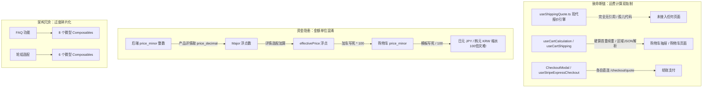

# Nuxt 端前台架构风险审计报告（冗余与数据链路深度分析）

> **审计范围**：`nuxt-i18n` 目录（前台商城 Nuxt 3 / Vue 3 应用）  
> **核心维度**：数据链路契约一致性、状态与代码冗余、资金计算安全性、Fail Loudly 规范对齐度、SSR/Hydration 稳定性  
> **性质**：纯风险分析与架构审计（不引入业务代码改动）

---

## 1. 核心发现总览 (Executive Summary)

经过对 `nuxt-i18n` 前台全量 Composable、组件及数据流的深度走查与代码调用图谱分析，前台目前在整体视觉呈现和响应式封装上较为成熟，但在**核心业务数据链路**和**代码组织架构**上存在多项重大结构性隐患与冗余技术债：



---

## 2. 深度风险剖析

### 风险一：运费计算“三轨割裂”与孤儿代码（最严重的数据断链）

#### 现象与代码证据
1. **孤儿代码：`useShippingQuote.ts` (224 行)**
   - **现状**：该文件完整封装了对接 Go 后端现代化跨境物流引擎的契约，包含 `quote_plan_id`、多包装箱规则、多物流方案分段（`legs`）、多币种汇率快照（`display_prices`）、费率锁定版本（`rate_version`）及过期时间（`expires_at`）。
   - **排查结果**：全量代码库中搜索 `useShippingQuote`，**除了该文件自身导出定义外，引用次数为 0**！属于彻头彻尾的沉睡孤儿代码。
2. **硬算管道：`useCartShipping.ts` & `useCartCalculation.ts`**
   - **现状**：`useCart.ts`（前台核心购物车状态）的 `shipping` 计算属性直接绑定至 `useCartShipping.ts`。
   - **致命缺陷**：该模块拉取老旧的 `CartShippingTemplate`，在客户端用纯 JavaScript 模拟首重续重、件数、金额门槛，甚至执行 `JSON.parse(trimmed)` 拆分国家代码。
   - **业务后果**：现代跨境物流由后端动态计算体积重、包装箱耗材、燕文/4PX 燃油附加费及偏远附加费。客户端手写硬算必然与后端真实结算金额**100% 存在误差**，导致用户在购物车看到一个运费，点击结账时运费突变，极大增加弃购率并引发客诉。
3. **重复建设：结账处分散直连 `/checkout/quote`**
   - `CheckoutModal.vue`（第 845 行）、`CartDrawer.vue`（第 383 行）、`useStripeExpressCheckoutOrder.ts`（第 149 行）均各自通过 `auth.request('/checkout/quote')` 重复编写了请求与响应解包逻辑，各自维护局部的类型定义，完全未复用统一的数据链路。

---

### 风险二：货币与金额单位割裂（跨境资金与精度风险）

系统在 `app/utils/money.ts` 中已经定义了标准的 `majorToMinor`, `minorToMajor`, `currencyMinorUnits` 工具链（覆盖了 JPY/KRW 等 0 位小数货币，及 KWD/BHD 等 3 位小数货币）。然而在业务层却充斥着大量野蛮的 `/ 100` 和 `* 100`。

#### 致命证据清单
1. **加车环节写死 `* 100` (导致非 2 位小数货币金额严重失真)**：
   - `useProductDetailPurchase.ts` 第 225 行：
     ```ts
     priceMinor: Math.round(effectivePrice.value * 100)
     ```
   - `useProductDetailPurchase.ts` 第 313 行：
     ```ts
     priceMinor: Math.round(effectivePrice.value * 100)
     ```
   - **灾难分析**：当商城切换至**日元（JPY）**或**韩元（KRW）**时，`effectivePrice` 本身为整数（例如 10,000 日元无小数），在此处乘以 100 后变为 1,000,000 minor，用户被超额扣款 100 倍！若为 3 位小数货币（如科威特第纳尔 KWD），则被少扣 10 倍！
2. **渲染环节写死 `/ 100`**：
   - `CartDrawer.vue` 第 72 行：`{{ formatPrice(item.price_minor / 100, item.currency) }}`
   - `CheckoutModal.vue` 第 319 行：`{{ formatPrice(item.price_minor * item.quantity / 100, item.currency) }}`
   - `AccountCartTab.vue` 第 35 行：`{{ formatPrice(item.price_minor / 100, item.currency) }}`
   - **灾难分析**：日元商品的 `price_minor` 在展示时被除以 100，导致 10,000 日元的车圈在页面上显示为 100 日元！
3. **数据重复定义与浮点多次转换**：
   - `useProductDetailVariants.ts`（第 363-368 行）自行硬编码了一份货币小数位列表（未引用 `money.ts`）。
   - 在计算 `effectivePrice` 时，从 `price_decimal` 取出浮点数，与选配计算的 Major 浮点数相加，加车时再转回 Minor，违背了“全链路 Minor 整数流转、仅在最终展示边界转为 Major”的黄金架构法则。

---

### 风险三：违反全局规范的大面积“空对象/数组遮蔽”与“静默 Catch”

依据全局铁律，系统对隐式兜底**零容忍**，必须 **Fail Loudly**。然而 Nuxt 前端存在大量违规模式：

#### 1. 空对象/数组遮蔽（Empty Object/Array Masking）
- **`useCart.ts`（第 128-129 行）**：
  ```ts
  const product = item.product || {}
  const variant = item.variant || {}
  ```
  如果后端返回的购物车项关联的商品或变体已下架或为空，此处静默赋予空对象，导致后续读取 `product.id`、`price` 等产生 `undefined` 并静默转为 0，掩盖了脏数据问题。
- **`useProductReviews.ts`（第 140 行）**：
  ```ts
  const rawPagination = data?.pagination || {}
  ```
- **`ChatTab.vue` / `WhatsAppProductSearchResultDrawer.vue` / `useWheelsetSelectionAssistant.ts`**：
  存在多达 20+ 处 `|| {}` 和 `?? []`。

#### 2. 静默 Catch（Silent Catch）
排查中发现 60+ 处 `catch { }` 语句，部分关键业务直接丢弃了错误上下文：
- `useMembership.ts` 第 227 行：`try { ... } catch { }`（完全静默，无日志无告警）。
- `useCart.ts` 第 54 行、第 531 行。
- `useProductCategories.ts` 第 191 行。
- `useProductDetailVariants.ts` 第 446 行。

---

### 风险四：代码与状态架构过度碎片化（Composable 贫血反模式）

#### 1. FAQ 模块：1 个业务拆成 8 个 Composables
- `useFaqCatalog.ts`
- `useFaqSearch.ts`
- `useFaqGroupedResults.ts`
- `useFaqDeepLink.ts`
- `useFaqAccordionState.ts`
- `useFaqSearchOverlayState.ts`
- `useGlobalAllFaqsSearchAndGroupedResults.ts`
- `usePageFaq.ts`
- **问题**：每个文件平均仅 30-50 行，逻辑极度零碎。主 Composable `useGlobalAllFaqsSearchAndGroupedResults` 必须把这 7 个微型 Composable 的入参和返回值逐一解构、拼装、中转，形成“胶水代码冗余”，严重增加了代码认知与排查成本。

#### 2. 轮组选配模块：6 个微型 Composables
- `useWheelsetSelectionAssistant.ts`、`...Answers.ts`、`...Filters.ts`、`...Navigation.ts`、`...Products.ts`、`...State.ts`
- **问题**：过度模块化，响应式状态被拆得四分五裂，在多层函数调用中被作为参数频繁透传，增加了内存开销与响应式跟踪开销。

#### 3. 登录同步时的暴力原生阻塞与死循环风险
- `useCart.ts` 第 319-327 行：
  ```ts
  if (typeof window !== 'undefined') {
    const retry = window.confirm(
      `Cart sync failed for ${result.itemsCount} item(s). Local data is kept.\n\nRefresh and retry?`,
    )
    if (retry) {
      window.location.reload()
    }
  }
  ```
  在现代化电商应用中调用浏览器原生阻塞式 `window.confirm`，在移动端或 WebView 中体验恶劣。如果后端同步持续失败，用户点击“确定”将陷入 `window.location.reload()` 的无限死循环。

---

### 风险五：SSR 与 Hydration 水合不一致隐患

1. **`localStorage` 裸调缺少 SSR 客户端守卫**：
   - `useCart.ts` 第 192 行：
     ```ts
     const saved = localStorage.getItem('commerce_platform_cart')
     ```
     在 `loadCartForInteraction` 函数中直接调用了 `localStorage`，而未像其他函数一样包裹 `if (!import.meta.client) return`。若该函数在路由中间件或服务端首屏被意外触发，将引发 Node 端 `ReferenceError: localStorage is not defined`。
2. **`window.location.origin` 裸调**：
   - `useProductDetailPurchase.ts` 第 444 行：构建 Stripe 回调地址时直接使用 `window.location.origin`，未做统一的 SSR 安全 URL 封装。

---

## 3. 架构整改与优化路线建议（供后续执行决策参考）

| 优先级 | 整改领域 | 目标措施 | 预期收益 |
| :--- | :--- | :--- | :--- |
| **P0 (极高)** | **货币单位归一化** | 统一收敛至 `money.ts` 的 `majorToMinor` 与 `formatMinorMoney`，全面清除业务层写死的 `* 100` 与 `/ 100`。 | 彻底杜绝日元 (JPY)、韩元 (KRW)、科威特第纳尔 (KWD) 等币种的 100 倍金额计算灾难。 |
| **P0 (极高)** | **运费链路收敛** | 激活并对接 `useShippingQuote.ts`，废弃 `useCartShipping.ts` 的客户端手算模板逻辑，将购物车与结账抽屉的运费统一对接后端 `/shipping/quote`。 | 消除孤儿代码，确保购物车预估运费与结账扣款金额 100% 一致。 |
| **P1 (高)** | **违规兜底清理** | 清理 `useCart.ts`、`useProductReviews.ts` 等处空对象遮蔽（`|| {}`），将静默 catch 改为 `console.error` + 用户友好提示（Fail Loudly）。 | 符合系统全局安全铁律，暴露出真实隐藏的脏数据。 |
| **P1 (高)** | **登录同步与 SSR 守卫** | 废弃 `window.confirm` 和 `window.location.reload()`，改用优雅的 Toast 提示重试；补全 `loadCartForInteraction` 的 `import.meta.client` 守卫。 | 消除死循环与移动端原生弹窗干扰，杜绝 SSR 500 风险。 |
| **P2 (中)** | **微型 Composable 合并** | 将 FAQ 的 8 个微型 composables 合并归一为单一模块；将选配器 6 个 composables 收敛整合。 | 降低认知负担，减少胶水代码，提升代码维护性。 |

---
*报告生成完毕。本报告旨在识别系统隐患，严格遵循“只分析”原则，未实施任何业务代码变动。*
