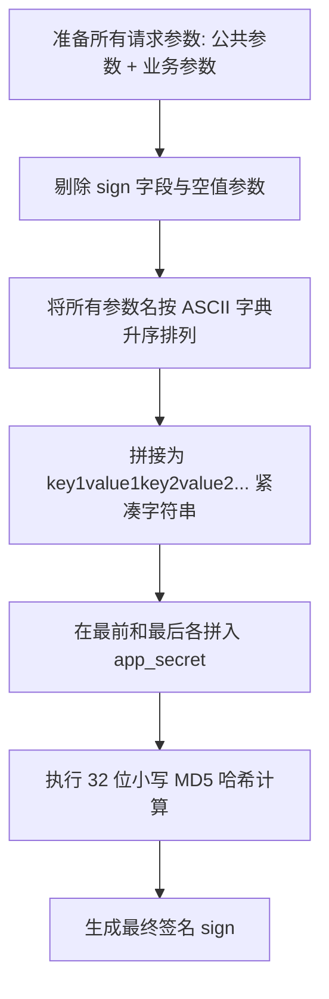
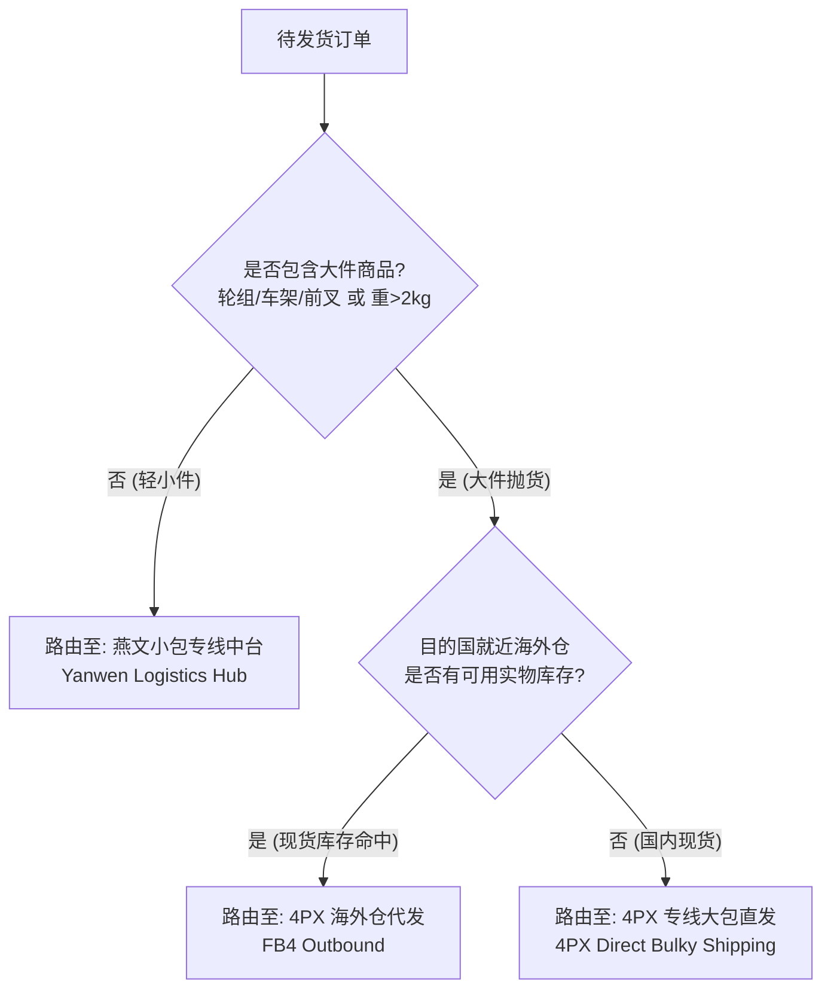
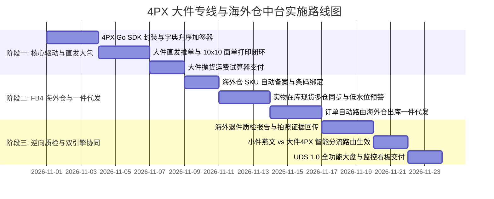

# 递四方 (4PX) 大件跨境物流与海外仓中台系统集成架构设计规范 (TAB 2 实施专著)

> **文档标识**: `DOC-DESIGN-4PX-LOGISTICS-HUB`  
> **所属领域**: 仓储物流与大件履约中台 (Fulfillment & Overseas Warehousing Domain)  
> **体系归属**: 属于 [《跨境电商多承运商三层短链路架构规范》](./cross-border-logistics-three-tier-architecture.md) 之 **第三层：独立物流对接域 TAB 2 承运商实施专著**  
> **协同专著**:
> - [多承运商三层短链路总领架构 (顶层中枢)](./cross-border-logistics-three-tier-architecture.md)
> - [燕文轻小件专线实施专著 (TAB 1)](./yanwen-logistics-hub-integration-architecture.md)
> - [系统既有运费报价与锁价架构 (第二层核心)](./shipping-quote-plan-architecture.md)
> **设计对齐**: 《ERP UDS 视觉系统规范 (v1.0)》、系统零容忍隐式兜底原则 (Fail Loudly)

---

## 1. 业务背景与双物流引擎战略定位 (Dual-Carrier Strategy)

在跨境电商与高端自行车零部件（如碳纤维一体式轮组、车架、前叉、修补配件）的全球销售业务中，包裹形态呈现出**“两极分化”**的显著特征：
1. **轻小件与标准配件**：如辐条（Spokes）、条帽（Nipples）、修补胶带、内胎、碳纤维垫圈、骑行服等。此类商品毛重低（大多 $< 1.5\text{kg}$）、体积小、SKU 离散，非常适合通过[【燕文专线小包中台 (TAB 1)】](./yanwen-logistics-hub-integration-architecture.md)进行直邮集货，享受首重便宜、邮政挂号通达全球的优势。
2. **中大件、抛货与高价值核心总成**：如碳纤维公路/山地轮组（Wheelsets）、全碳纤维公路车架（Frames）、避震前叉（Forks）等。此类商品包装箱体大（如标准 700c 轮组外箱达 $83\text{cm} \times 18\text{cm} \times 68\text{cm}$，实重约 $2.5\text{kg} \sim 3.5\text{kg}$，但材积重高达 $16\text{kg} \sim 20\text{kg}$），且单价昂贵（$\$800 \sim \$3,000$）。
   * 若走普通小包专线，不仅超限被拒收，且计泡规则极其不利，末端破损与丢件索赔成本不可控。
   * 因此必须引入深耕大件专线、海外仓配一体化与逆向质检的专业物流商——**递四方（4PX Express & GFN Network）**。

### 1.1 与系统主运费域的解耦关系 (消除架构冲突)
* **海量大件与海外仓渠道独立治理**：4PX 包含专线大包、联邮通、全球特快以及美西/美东/德国等海外仓的一件代发渠道，所有复杂配置集中在 4PX TAB 内部治理。
* **向第二层主运费域输出标准代码**：4PX TAB 仅向系统第二层（物流运费域 `CarrierService`）输出已启用的通道代码（如 `4PX:GDS_A1` 直发专线、`4PX:WMS_USLAXA` 美西海外仓出库），供主运费模板按需挂载。
* **短链路容灾保障**：4PX 接口的异常与海关查验完全被隔离在 4PX TAB 内部，若出现美西仓缺货或干线爆仓，主运费域一键切回直发专线或备用承运商，第一层商品端零感知。

### 1.1 燕文 vs 4PX 双引擎业务矩阵对比

| 维度 | 燕文物流 (Yanwen Hub) | 递四方物流 (4PX Hub) |
| :--- | :--- | :--- |
| **主要定位** | 轻小件、标品配件、小包专线直发 | 中大件抛货专线、海外仓本地履约 (FB4)、大件逆向退件 |
| **典型承载商品** | 辐条、条帽、修补配件、把带、工具包 | 碳纤维一体式轮组、自行车车架、前叉、大件配件箱 |
| **包裹重量与尺寸** | 重量 $\le 2\text{kg}$，单边长 $\le 60\text{cm}$，$L+W+H \le 90\text{cm}$ | 重量可达 $30\text{kg}+$，单边长可达 $120\text{cm}+$，支持大件大箱托盘 |
| **履约核心链路** | 国内集运 -> 专线航空小包 -> 目的国邮政/小包派送 | 1. 专线大包/空派直发<br>2. FB4 海外仓海运头程备货 -> 本土 2-3 日达 |
| **逆向与售后支持** | 仅支持简单退运，通常丢件/本地销毁 | 支持海外仓本地退件质检、拍照验货、二次贴标上架、集运转关 |
| **计费与材积规则** | 适合实重为主的小包，材积限制极严 | 专线大包材积除数友好（/6000 或 /8000），海外仓本土派送实重计费优势 |

---

## 2. 4PX 开放平台 (FOP) 接口契约与通讯协议深度解析

### 2.1 通信架构与环境端点
递四方开放平台（4PX Open Platform，简称 FOP）提供高可用性的 RESTful JSON API 服务：

| 环境分类 | HTTP API 基础端点 | 凭据与鉴权要素 |
| :--- | :--- | :--- |
| **沙箱测试 (Sandbox)** | `http://open.sandbox.4px.com/router/api/service` | 测试应用 `app_key` + `app_secret` |
| **正式生产 (Production)** | `http://open.4px.com/router/api/service` | 生产正式 `app_key` + `app_secret` + 商户授权 |

* **通信方式**：统一采用 `HTTP POST`，请求头声明 `Content-Type: application/json;charset=utf-8`。
* **时间戳窗口**：`timestamp` 必须为当前系统毫秒数，误差超过 10 分钟会被网关拒绝。

### 2.2 4PX 动态 MD5 签名机制 (Sign Specification)
递四方采用标准企业级 API 签名规范，对所有请求键值对进行全量哈希加签：



1. **参数提取与排序**：
   提取所有公共参数（`app_key`, `format`, `method`, `timestamp`, `v`）与业务报文参数，剔除 `sign` 自身以及值为 `null` 或空字符串的字段，按参数名 ASCII 码升序排序。
2. **键值拼接**：
   将排序后的参数名和参数值紧密拼接：
   $$\text{ParamString} = k_1v_1k_2v_2\dots k_nv_n$$
3. **前后加盐**：
   在拼接字符串的首部与尾部拼入当前应用的 `app_secret`：
   $$\text{SignPayload} = \text{app\_secret} + \text{ParamString} + \text{app\_secret}$$
4. **MD5 哈希计算**：
   对 `SignPayload` 进行 32 位小写 MD5 加密：
   $$\text{sign} = \text{md5\_hex}(\text{SignPayload})\text{.toLowerCase()}$$

### 2.3 零容忍隐式兜底 (Fail Loudly) 与错误断言
递四方接口返回规范：
```json
{
  "result": "1",
  "msg": "success",
  "data": { ... },
  "errors": []
}
```
* **阻断规则**：
  1. `result != "1"` 或 `errors` 数组非空时，属于业务失败或系统异常。后端 SDK 必须立刻中断当前逻辑并抛出 `[CRITICAL] FPXGatewayException`，包含具体错误代码与详细错误信息。
  2. 严禁使用诸如 `return []` 或 `return null` 的隐式兜底模式覆盖接口错误。
  3. 前端接收到错误后，必须在表单或状态栏以醒目红色徽章/Toast 阻断呈现，并保留错误发生现场以便追溯。

---

## 3. 系统集成拓扑与 Go 后端架构

### 3.1 分层架构与核心领域模型
后端代码组织收敛在 `go-backend` 模块中，维持清晰的分层职责：

```text
go-backend/
|-- internal/
|   |-- domain/shipping/
|   |   |-- fpx_entities.go            # 4PX 专线运单、海外仓库存、入库单、出库单、退件等领域实体
|   |   `-- logistics_routing.go       # 燕文(小件) vs 4PX(大件) 智能分流决策器
|   |-- pkg/fpx/
|   |   |-- client.go                  # 4PX 底层 HTTP Client、环境切换、重试退避机制
|   |   |-- signer.go                  # 4PX MD5 键值升序加签器
|   |   `-- types.go                   # 4PX OpenAPI 原生请求与响应契约结构体 (直发/海外仓/退件)
|   |-- repository/
|   |   `-- fpx_repository.go          # 4PX 运单、海外仓在库记录、入库委托数据仓库
|   |-- service/
|   |   |-- fpx_service.go             # 4PX 业务编排服务：大件直发、海外仓一件代发、逆向质检
|   |   |-- fpx_inventory_sync.go      # 海外仓实物库存定时对账 Worker
|   |   `-- fpx_tracking_worker.go     # 大件单号与海外仓出库包裹在途轨迹轮询作业
|   `-- api/
|       `-- admin_fpx_handlers.go      # 4PX 调度中台管理后台 RESTful 路由与处理器
```

### 3.2 智能分流路由引擎 (Smart Logistics Routing Engine)
系统在用户下单或发货时，通过智能分流引擎自动判定包裹走燕文小包还是 4PX 大件/海外仓：



### 3.3 全局三大设计原则的严格遵从
1. **数据拉取与权限彻底解耦原则**：
   4PX 物流产品（`ds.xms.product.getlist`）、海外仓字典、实物库存（`fu.wms.inventory.get`）属于底层基础服务。后端提供定时拉取与无感本地缓存。**前端严禁注入任何基于操作者角色的阻断逻辑干扰底层数据同步**。
2. **角色权限矩阵统一管控入口**：
   4PX 物流中台的各页面入口受角色权限矩阵唯一管理（如 `logistics:fpx:view`、`logistics:fpx:ship` 等）。用户能否访问某个 TAB 仅取决于矩阵勾选项，禁止通过其他任何硬编码逻辑干扰。
3. **系统登录零干扰原则**：
   登录链路仅校验 Token 与 User ID，严禁将 4PX 海外仓同步或网络探测挂载到登录生命周期中。

---

## 4. 4PX 专线与海外仓中台 (4PX Logistics Hub) 多 TAB 工业级设计

> **严格对齐《ERP UDS 视觉系统规范 (v1.0)》**：工业感无边框大圆角、`border-dashed` 虚线边框、大胶囊按钮、绝对严禁静默吞错。

### 模块整体 Tab 结构体系 (4PX Domain Console)
```
4PX Logistics Hub (递四方独立物流域控制台)
├── TAB 1: 运营大盘与仓网拓扑 (Overview & Global Fulfillment Network)
├── TAB 2: 大件专线直发与面单 (Bulky Direct Shipping & Labels)
├── TAB 3: FB4 海外仓配与一键出库 (FB4 Overseas Warehousing & Outbound)
├── TAB 4: 大件与海外仓发布集合管理 (Service Collection Registry) <-- ★ 核心对外短链路集合
├── TAB 5: 大件运费试算与材积选优 (Bulky Rate Calculator & Dimension Optimizer)
├── TAB 6: 全球在途追踪与签收存证 (Milestones Tracking & POD Evidence)
├── TAB 7: 逆向退件与海外质检中心 (Reverse Logistics & RMA Inspection)
└── TAB 8: 接口凭据与主数据同步 (API Credentials & Master Config)
```

> **端到端短数据链路核心契约**：TAB 4 集中管理 4PX 大件专线产品与欧美各海外仓（美西/美东/德国/英国）的一件代发渠道，将其打包发布为 **【4PX 大件与海外仓标准化服务集合 (4PX Service Collection)】**。系统主运费域直接读取此集合挂载线路，实现大件/海外仓业务自治与秒级故障排查。

---

### TAB 1: 运营大盘与仓网拓扑 (Overview & Global Fulfillment Network)

用于物流总监与供应链主管掌控全球大件直发走势、各海外仓在库现货水位与 API 通讯健康度。

#### 1. 布局结构原型
```text
┌────────────────────────────────────────────────────────────────────────────────────────┐
│ [模块页眉]  rounded-[32px]  border-dashed  bg-muted/5                                   │
│   4PX GLOBAL BULKY FULFILLMENT & OVERSEAS WAREHOUSE CONTROL                             │
│   递四方大件专线与全球海外仓调度大盘                                                   │
│   实时监控碳纤维轮组/车架大包出境直发、欧美本地仓一件代发履约及逆向质检状态           │
└────────────────────────────────────────────────────────────────────────────────────────┘

┌─────────────────┬─────────────────┬─────────────────┬─────────────────┬────────────────┐
│ 今日直发大包    │ 海外仓待出库    │ 全球在库现货    │ 逆向待质检      │ 本月 4PX 支出  │
│ 38 单           │ 14 单           │ 420 组轮组/车架 │ 2 件            │ ¥62,180.00     │
│ 轮组大件占比 84%│ 平均出库 4.2h   │ 涉及 5 大海外仓 │ [ALERT 待验货]  │ 平均单运费 ¥480│
└─────────────────┴─────────────────┴─────────────────┴─────────────────┴────────────────┘

┌──[全球海外仓履约监控卡片流] ───────────────────────────────────────────────────────────┐
│ ┌──[美西洛杉矶仓 (US-LAX)] ───┐ ┌──[德国法兰克福仓 (DE-FRA)] ─┐ ┌──[英国伯明翰仓 (UK-BHX)] ───┐ │
│ │ 轮组现货: 142 组 (充足)     │ │ 轮组现货: 96 组 (充足)      │ │ 轮组现货: 32 组 (ALERT:偏低)│ │
│ │ 车架现货: 28 台             │ │ 车架现货: 14 台             │ │ 车架现货: 6 台              │ │
│ │ 24小时出库率: 99.4%         │ │ 24小时出库率: 98.8%         │ │ 24小时出库率: 100%          │ │
│ │ 本地派送: FedEx / UPS Ground│ │ 本地派送: DHL Paket         │ │ 本地派送: Royal Mail / DPD  │ │
│ └─────────────────────────────┘ └─────────────────────────────┘ └─────────────────────────────┘ │
└────────────────────────────────────────────────────────────────────────────────────────┘
```

#### 2. UDS 视觉规范参数
*   **页眉样式**：`rounded-[32px] border-dashed border-border/60 bg-muted/5 p-6 backdrop-blur-sm`。
*   **一级标题**：`text-lg font-black tracking-tighter italic uppercase`。
*   **辅助描述**：`text-[9px] font-black uppercase tracking-widest opacity-60`。
*   **5 联数据概览卡**：
    *   卡片容器：`rounded-[24px] border-dashed border-border/60 bg-card p-4 relative overflow-hidden`。
    *   顶部光晕：`absolute inset-0 bg-gradient-to-br from-primary/5 via-transparent pointer-events-none`。
    *   标签与数值：`text-[10px] font-black uppercase text-muted-foreground/60` 与 `text-2xl font-black font-mono`。

---

### TAB 2: 大件专线直发与面单 (Bulky Direct Shipping & Labels)

专门处理未在海外仓备货、必须从国内工厂直发出口的整套轮组、车架大件，支持专线大包交运、材积自动核验与 10x10 热敏面单打印。

#### 1. 对应 4PX 核心 API 映射
*   `ds.xms.order.create`：创建大件直发委托单（传递包装箱实测尺寸长宽高、毛重、报关申报项）。
*   `ds.xms.label.get`：调取直发电子面单。
*   `ds.xms.order.cancel`：仓库交运前取消直发订单。
*   `ds.xms.order.get`：查询订单揽收、入库实测尺寸与计费重量。

#### 2. 交互与布局原型
```text
┌──[操作与筛选工具栏]  rounded-[24px]  border-dashed ────────────────────────────────────┐
│ [搜索: 商城单号 / 4PX单号 / 客户 / 轮组规格]  [渠道: 4PX全球特快 / 大包专线 / 优先派送] │
│ [交货仓: 深圳福永仓 / 东莞仓 / 香港仓]  [状态: 待推单 / 已建单 / 已打面单 / 交运在途]   │
│                                                [批量直发推单]  [批量获取面单 (PDF)]    │
└────────────────────────────────────────────────────────────────────────────────────────┘

┌──[大件直发台账 Table] ─────────────────────────────────────────────────────────────────┐
│ 订单编号 / 下单时间 │ 4PX单号 / 跟踪号    │ 货品属性 / 尺寸(cm) │ 目的国 / 收件人 │ 计费重 / 预估 │ 状态     │ 操作列         │
├─────────────────────┼─────────────────────┼─────────────────────┼─────────────────┼───────────────┼──────────┼────────────────┤
│ TZ-20260922-1002    │ 4PX300192847101     │ 700c 公路碳轮组     │ 美国 (US)       │ 16.5kg (材积) │ [HEALTHY]│ [补打电子面单] │
│ 2026-09-22 10:14    │ 9205590184710291    │ 83 x 18 x 68 (箱)   │ Michael Davis   │ ¥680.00 (大包)│ 已打面单 │ [查看详情/轨迹]│
├─────────────────────┼─────────────────────┼─────────────────────┼─────────────────┼───────────────┼──────────┼────────────────┤
│ TZ-20260922-1045    │ (待推单)            │ 碳纤维全地形车架    │ 英国 (GB)       │ 14.0kg (材积) │ [ALERT]  │ [一键推单交运] │
│ 2026-09-22 11:20    │ --                  │ 102 x 22 x 58 (箱)  │ Oliver Smith    │ 待测算        │ 地址通过 │ [修改包装尺寸] │
└─────────────────────┴─────────────────────┴─────────────────────┴─────────────────┴───────────────┴──────────┴────────────────┘
```

---

### TAB 3: FB4 海外仓储与一键代发 (FB4 Overseas Warehousing & Outbound)

针对轮组、车架等高频销售主力款，通过海运/空派大货集装箱提前备货至 4PX 欧美海外仓，客户下单后直接在本地仓出库，2-3 日送达买家手中。

#### 1. 对应 4PX 核心 API 映射
*   `fu.wms.inventory.get`：查询海外仓实时可用库存、在途库存与锁定库存。
*   `ds.wms.outbound.create`：创建海外仓一件代发（Outbound）委托单，触发本地仓拣货派送。
*   `ds.wms.outbound.cancel`：在海外仓分拣前紧急拦截出库。
*   `fu.wms.inbound.create`：创建国内向海外仓备货的头程海运/空派入库委托单（Inbound）。
*   `fu.wms.sku.create` / `fu.wms.sku.getlist`：向 4PX WMS 备案高精度商品条码、物理尺寸与海关 HS 编码。

#### 2. 双子面板设计
*   **子面板 1：海外仓现货一件代发流水台账**：
    *   展示所有命中海外仓现货的订单，一键向 4PX WMS 发送出库指令，回传本地物流单号（如 FedEx Home Delivery / UPS Ground / DHL Paket）。
*   **子面板 2：全球在库 SKU 水位与头程补货跟踪**：
    *   分仓监控各轮组规格的在库安全天数（结合近 30 天销量，低于 15 天自动触发琥珀色补货预警 `ALERT`）。
    *   展示在途头程海运集装箱提单号、预估到港日（ETA）与预约入仓进度。

---

### TAB 4: 精选大件与海外仓渠道白名单 (Curated Bulky & Overseas Channels)

> **★ 4PX 独立域对外唯一公开数据出口 (Single Outbound Port)**  
> **核心边界隔离契约**：系统其他外部模块（如主运费域、商品域、订单调度）**绝对禁止读取或调用除本 TAB 之外的 4PX 任何内部数据**。4PX 大盘、大件直发台账、海外仓 WMS 出库、轨迹存证、RMA 质检等 TAB 纯粹属于 4PX 域内私有闭环通信。主运费模板（`ShippingTemplate`）严格且仅读取本 TAB 发布的精选渠道集合。

#### 1. 业务模式：人工比价选优录入与日常维护
*   **拒绝海量渠道混杂**：4PX 底层拥有海运大包、空派直发专线、优先大包以及全球数十个海外仓的不同尾程派送代码。如果全量混杂拉入系统，主运费模板配置人员根本无法分清直发与海外仓渠道。
*   **人工算费选优（当前阶段）**：运营根据 4PX 官方大件报价单与海外仓仓租/出库费率表，针对重点市场（如美国碳纤维轮组、欧洲一体车架）**人工精算挑选出 3-5 条最具性价比的大件直发与海外仓优势渠道**，算好后进入本 TAB 手动添加。
*   **直发大包与海外仓双模式受控管理**：
    *   **大件专线直发渠道**：录入如 `GDS_A1`（全球轮组大包专线），赋予业务别名“4PX-全球轮组空派大包”。
    *   **海外仓本土代发渠道**：绑定指定仓库与尾程服务代码（如 `WMS_USLAXA_FDX`），赋予业务别名“4PX-美西洛杉矶海外仓代发 (FedEx Home Delivery)”。
*   **随时增删与启停**：
    *   **添加渠道**：录入官方代码，定义清晰的业务别名与箱体尺寸建议。
    *   **停用/启用**：某海外仓爆仓排队或尾程涨价时，一键点击 `[停用]`，主运费模板立即对该渠道不可选。
    *   **删除/移除**：不再合作的旧渠道点击 `[删除/移除]`，彻底清空，杜绝残留冗余。
*   **平滑演进通道（未来升级，防一刀切死）**：
    *   后期若上线“自动材积估算与海外仓智能路由推荐引擎”，升级动作**纯属于 4PX 域内政**（由 TAB 5 材积试算器计算后向本 TAB 提供“系统推荐优势渠道”，运营一键审核采纳）。
    *   本 TAB 对外输出的 `FPXCuratedCollection` 数据结构与契约永远保持稳定，外部主运费模板无需任何代码改造。

#### 2. UDS 1.0 工业级交互原型
```text
┌──[模块页眉]  rounded-[32px]  border-dashed  bg-muted/5 ────────────────────────────────┐
│   4PX CURATED BULKY & OVERSEAS CHANNELS ROSTER (精选大件与海外仓渠道白名单)            │
│   人工算费选优后录入的精选白名单大件与海外仓渠道，供商城主运费模板只读调用            │
└────────────────────────────────────────────────────────────────────────────────────────┘

┌──[操作与筛选工具栏]  rounded-[24px]  border-dashed ────────────────────────────────────┐
│ [搜索渠道别名/官方代码]  [类型: 全部 / 直发专线 / 海外仓]  [状态: 已启用 / 已停用]      │
│                                                        [+ 手动添加精选渠道]    │
└────────────────────────────────────────────────────────────────────────────────────────┘

┌──[已添加的精选渠道清单 Table] ─────────────────────────────────────────────────────────┐
│ 业务别名 (自定义)        │ 官方代码 │ 模式分类 │ 适用箱体/参考时效  │ 状态       │ 操作列     │
├──────────────────────────┼──────────┼──────────┼────────────────────┼────────────┼────────────┤
│ 4PX-全球碳轮专线直发     │ GDS_A1   │ 国内直发 │ 83*18*68 轮组单箱  │ [HEALTHY]  │ [编辑]     │
│ (人工测算: 空派7-10天最优│ 4PX Bulk │ 大包专线 │ 均单运费 ¥680      │ [已启用]   │ [停用]     │
│                          │          │          │                    │ (只读暴露) │ [删除/移除]│
├──────────────────────────┼──────────┼──────────┼────────────────────┼────────────┼────────────┤
│ 4PX-美西洛杉矶仓本土代发 │ WMS_US-  │ 海外仓配 │ 美西现货 2-3 日送达│ [HEALTHY]  │ [编辑]     │
│ (人工测算: 尾程FedEx省50%│ LAX_FDX  │ 本地出库 │ 尾程派送 $18.50    │ [已启用]   │ [停用]     │
│                          │          │          │                    │ (只读暴露) │ [删除/移除]│
├──────────────────────────┼──────────┼──────────┼────────────────────┼────────────┼────────────┤
│ 4PX-欧洲公路车架专线     │ GDS_EU2  │ 国内直发 │ 102*22*58 车架大箱 │ [ALERT]    │ [编辑]     │
│ (人工测算: 临时排期变长) │ EU Frame │ 大包专线 │ 均单运费 ¥850      │ [临时停用] │ [启用]     │
│                          │          │          │                    │ (运费模板隐)│ [删除/移除]│
└──────────────────────────┴──────────┴──────────┴────────────────────┴────────────┴────────────┘
```

#### 3. `[+ 手动添加精选渠道]` 弹窗表单规范
*   **渠道履约类型**：单选切换 `【国内大包直发专线】` 或 `【FB4 海外仓本地代发】`。
*   **官方服务代码**：输入或选取官方代码（如 `GDS_A1` 或选择仓库代码 `USLAXA` + 尾程代码）。
*   **业务别名 (Display Name)**：运营自定义可读标识（如“4PX-美西仓轮组代发”）。
*   **箱体与重量建议**：最大长宽高限制、材积除数（如 6000）、最大毛重（如 30kg）。
*   **测算说明与备注**：记录人工测算时的对比依据，方便后续交接与复核。

---

### TAB 5: 大件运费试算与材积选优 (Bulky Rate Calculator & Dimension Optimizer)

大件跨境物流中最怕“计泡杀”（运费远超预期导致利润归零）。本试算器专门针对大体积箱体，对比 4PX 多种大包渠道与海外仓出库的费用与时效。本 TAB 纯属域内试算工具，未来可作为向 TAB 4 供给自动估算建议的底层算法依托。

#### 1. 对应 4PX 核心 API 映射
*   `ds.xms.fee.calculate`：直发专线大包多产品实时运费与计费重试算。

#### 2. 交互与功能特色
1. **箱型智能预设（Preset Box Sizes）**：
   * 提供行业标准预设按钮：`[标准 700c 轮组单箱 (83*18*68)]`、`[双轮组并包箱 (83*32*68)]`、`[一体把车架大箱 (105*22*60)]`。点击一键填入长宽高。
2. **多方案对比矩阵**：
   * **直发大件专线（Direct Bulky）**：展示实重、材积重（长宽高/6000）、预估空派直发运费（RMB）及预计 7-10 天时效。
   * **海外仓本土出库（FB4 Local）**：若该国海外仓有备货，对比展示从本地仓出库的尾程派送费（USD/EUR），清晰呈现海外仓相比国内直发节省的每单运费金额。

---

### TAB 6: 全球在途追踪与签收存证 (Milestones Tracking & POD Evidence)

大件高货值商品（客单价超 $\$1,000$）极易遭遇买家“未收到货（Item Not Received, INR）”信用卡拒付申诉。本面板强化了尾程签收存证（POD）证据链回传。本 TAB 仅在 4PX 域内运行，严禁外部模块旁路依赖。

#### 1. 对应 4PX 核心 API 映射
*   `ds.xms.tracking.get`：直发包裹与大包全节点轨迹跟踪。

#### 2. POD 签收凭证链机制
*   对于高价值轮组/车架，4PX 自动采集末端派送员拍照存证（买家门口照片、签名原图签收单 Base64）。
*   系统将 POD 签收原图自动关联至订单凭证包（`OrderEvidence.vue`），当发生 PayPal 申诉或信用卡 Chargeback 时，一键生成免责举证包。

---

### TAB 7: 逆向退件与海外质检中心 (Reverse Logistics & RMA Inspection)

解决大件商品跨境退货难题：买家因规格不兼容、质保问题退货时，高昂的退运回国运费往往超过商品本身。通过 4PX 全球逆向网络就近退回当地海外仓质检。

#### 1. 对应 4PX 核心 API 映射
*   `ds.rms.return.create`：创建买家逆向退货退仓委托。
*   `ds.rms.return.get`：查询海外仓退件入库实物状态、质检报告与照片。

#### 2. 工业级退件质检判定闭环
```text
┌──[海外仓 RMA 质检台账 Table] ──────────────────────────────────────────────────────────┐
│ 退货单号 / 原订单号 │ 退件买家 / 退运仓库 │ 质检结果 / 判定等级 │ 海外仓实物拍照 │ 处置决策     │ 操作列         │
├─────────────────────┼─────────────────────┼─────────────────────┼────────────────┼──────────────┼────────────────┤
│ RMA-20260918-004    │ John Peterson       │ [HEALTHY: 完好无损] │ [4张高清大图]  │ 重新贴标入库 │ [执行二次上架] │
│ TZ-20260830-7719    │ 美西洛杉矶海外仓    │ 外包装微瑕, 轮圈完好│ 气泡袋+原箱清晰│ (恢复为可售) │ [打印新SKU标]  │
├─────────────────────┼─────────────────────┼─────────────────────┼────────────────┼──────────────┼────────────────┤
│ RMA-20260920-009    │ Marco Rossi         │ [CRITICAL: 碳纤维裂]│ [6张裂纹特写]  │ 海外本地销毁 │ [同意客户退款] │
│ TZ-20260905-8120    │ 德国法兰克福海外仓  │ 撞击裂痕, 无法修复  │ 辐条孔断裂证据 │ 申报出险索赔 │ [下载证据包]   │
└─────────────────────┴─────────────────────┴─────────────────────┴────────────────┴──────────────┴────────────────┘
```

---

### TAB 8: 接口凭据与主数据同步 (API Credentials & Master Config)

管理 4PX 开放平台开发者凭证、运行环境及仓库渠道字典。

#### 1. 核心功能规范
1. **应用凭据配置**：安全加密存储 `app_key` 与 `app_secret`，支持一键切换沙箱（`open.sandbox.4px.com`）与生产（`open.4px.com`）。
2. **连通性自检 (Ping)**：轻量调用 `ds.xms.product.getlist`，自动验证签名算法与网络连通性。
3. **全球仓库字典同步**：拉取 4PX 全球 WMS 仓库代码（如 `USLAXA` 美西仓、`DEFRAA` 德国仓、`UKBHXA` 英国仓），建立本地海外仓映射。

---

## 5. 路由规划与角色权限矩阵规范

### 5.1 路由层级配置 (`router/index.ts`)
```typescript
// 4PX 递四方大件专线与海外仓中台
{
  path: 'logistics/4px',
  redirect: domainRedirect('FPXOverview', {
    overview: 'FPXOverview',
    direct: 'FPXDirectShipping',
    warehouse: 'FPXOverseasWarehouse',
    collection: 'FPXCollection',
    calculator: 'FPXCalculator',
    tracking: 'FPXTracking',
    rma: 'FPXReverseLogistics',
    config: 'FPXConfig',
  }),
  meta: { permission: 'logistics:fpx:view' }
},
{
  path: 'logistics/4px/overview',
  name: 'FPXOverview',
  component: () => import('@/views/logistics/FPXLogisticsHub.vue'),
  meta: { title: '4PX大盘', permission: 'logistics:fpx:view' }
},
{
  path: 'logistics/4px/direct',
  name: 'FPXDirectShipping',
  component: () => import('@/views/logistics/FPXLogisticsHub.vue'),
  meta: { title: '大件直发', permission: 'logistics:fpx:view' }
},
{
  path: 'logistics/4px/warehouse',
  name: 'FPXOverseasWarehouse',
  component: () => import('@/views/logistics/FPXLogisticsHub.vue'),
  meta: { title: '海外仓配', permission: 'logistics:fpx:view' }
},
{
  path: 'logistics/4px/collection',
  name: 'FPXCollection',
  component: () => import('@/views/logistics/FPXLogisticsHub.vue'),
  meta: { title: '精选渠道', permission: 'logistics:fpx:view' }
},
{
  path: 'logistics/4px/calculator',
  name: 'FPXCalculator',
  component: () => import('@/views/logistics/FPXLogisticsHub.vue'),
  meta: { title: '大件测算', permission: 'logistics:fpx:view' }
},
{
  path: 'logistics/4px/tracking',
  name: 'FPXTracking',
  component: () => import('@/views/logistics/FPXLogisticsHub.vue'),
  meta: { title: '轨迹存证', permission: 'logistics:fpx:view' }
},
{
  path: 'logistics/4px/rma',
  name: 'FPXReverseLogistics',
  component: () => import('@/views/logistics/FPXLogisticsHub.vue'),
  meta: { title: '逆向质检', permission: 'logistics:fpx:view' }
},
{
  path: 'logistics/4px/config',
  name: 'FPXConfig',
  component: () => import('@/views/logistics/FPXLogisticsHub.vue'),
  meta: { title: '4PX配置', permission: 'logistics:fpx:manage' }
}
```

### 5.2 角色权限矩阵单一授权规则
按照平台准则，入口权限由后台角色权限矩阵单一勾选决定，杜绝多处硬编码或隐式阻塞：
*   `logistics:fpx:view`：允许查看 4PX 调度中台各 TAB 界面、大件直发台账及海外仓库存。
*   `logistics:fpx:ship`：允许执行大件直发推单、创建海外仓出库委托与打印电子面单。
*   `logistics:fpx:cancel`：允许拦截取消直发委托单与海外仓出库单。
*   `logistics:fpx:manage`：允许配置 4PX AppKey/AppSecret、切换正式/测试环境及执行 RMA 退换货处置。

---

## 6. 实施路线演进与里程碑计划



### 6.1 阶段一：核心驱动与大件专线直发
*   编写 `internal/pkg/fpx`，实现参数 ASCII 升序全字段加签、HTTP Client 及沙箱环境互通。
*   交付 TAB 2（大件直发与面单中心）、TAB 4（精选大件与海外仓白名单）与 TAB 5（大件运费试算），解决轮组/车架直发履约与向主运费模板输出精选集合的技术瓶颈。

### 6.2 阶段二：FB4 海外仓一件代发与库存同步
*   实现系统与 4PX WMS 的 SKU 基础信息绑定。
*   上线海外仓实时库存监控与低水位预警，接入订单自动路由机制（命中海外仓现货自动出库代发）。

### 6.3 阶段三：逆向退货质检与双引擎智能分流
*   交付 TAB 7（逆向退件与海外质检中心），支持高价值轮组海外本地判定与翻新上架。
*   全面启用“小件燕文 + 大件/海外仓 4PX”智能路由分流，达成全站物流全品类的高效履约闭环。
