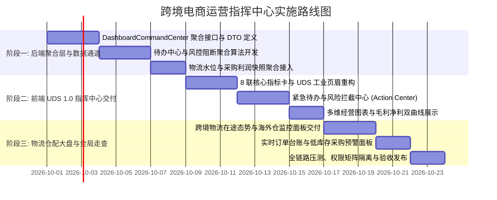

# 跨境电商 ERP 智能运营指挥中心与仪表盘重构架构规范

> **文档标识**: `DOC-DESIGN-ADMIN-DASHBOARD-COMMAND-CENTER`  
> **所属领域**: 后台管理系统总控与智能运营指挥中枢 (Enterprise Operations & Command Center)  
> **设计版本**: `v1.0.0`  
> **设计对齐**: 《ERP UDS 视觉系统规范 (v1.0)》、系统零容忍隐式兜底原则 (Fail Loudly)  
> **关联专著**:
> - [跨境电商独立物流域架构与端到端履约集合短链路规范](./cross-border-logistics-three-tier-architecture.md)
> - [商品供应商采购成本与利润率隔离设计](./product-supplier-cost-profitability-isolation-architecture.md)
> - [多渠道支付网关接入与多币种结算指南](./payment-gateway-onboarding-and-settlement-guide.md)
> - [履约证据包与防欺诈举证架构规范](./order-evidence-package-architecture.md)
> - [客服会话生命周期与 Inbox 工作台架构](./customer-service-conversation-lifecycle-and-inbox-architecture.md)
> - [分布式锁、任务状态机与幂等架构规范](./distributed-lock-task-state-machine-idempotency-architecture.md)

---

## 1. 架构愿景与现状痛点深度诊断

### 1.1 现状痛点诊断
目前后台管理系统的首页仪表盘（[`Dashboard.vue`](file:///c:/Users/P16V/Desktop/Github/tanzanite-theme/go-backend/web/admin/src/views/Dashboard.vue)）依然停留在初期脚手架模板阶段：
1. **信息利用率极度低下（不足 5%）**：
   整个代码库已经经过 345 项数据库迁移演进，覆盖了商品成本、多渠道风控、跨境物流（燕文/4PX）、客服工单、推荐裂变等 18 个核心业务域。然而当前的仪表盘仅显示 3 张极其简陋的数字卡片（总订单、总用户、总销售额）和一张单一折线图，对全站海量高价值经营资产视而不见。
2. **缺乏“行动导向待办中心 (Actionable Operations Center)”**：
   管理者或运营人员登录后台后，**无法第一时间感知系统中有哪些阻塞事件或紧急任务需要处理**（例如：是否有已付款超 24 小时未发货的订单？是否有即将逾期的 PayPal 拒付争议？是否有清关停滞异常的包裹？是否有 Outbox 事务发布失败？）。运营人员不得不逐个菜单点击排查，违背了现代 ERP 的核心作业逻辑。
3. **真实毛利与财务感知完全缺失**：
   系统已支持多币种结算并已实装供应商采购成本（`product_supplier_cost`）。但现有仪表盘销售额仅为字符拼接的毛收入流水，无法体现扣除采购成本、物流运费、渠道手续费后的**综合毛利率 (Gross Margin %)** 与**净利润快照**。
4. **物流履约与仓配动向形成信息孤岛**：
   虽然底层已构建独立物流域短链路，但在总指挥中心没有任何在途物流时效、目的国海关查验阻断或海外仓在库现货水位的可视化汇总。
5. **系统可靠性与稳定性处于盲区**：
   缺乏对系统底层 Transactional Outbox 失败队列、邮件投递退信率预警等系统健康态势的监控，无法贯彻“Fail Loudly（故障显式暴露出）”的治理原则。

### 1.2 升级目标：从“普通仪表盘”跃迁为“全链路智能运营指挥中心”
新架构将仪表盘定位为**企业的航母舰桥与指挥中枢 (Operations Command Center)**：
*   **全局态势一屏掌握**：3 秒内看清今日销售走势、综合毛利率、在途物流健康度；
*   **待办与风险强力驱动**：将拒付争议、履约卡单、关务校验失败、系统技术异常等汇总为一等公民的“紧急待办与风险拦截中心”，一键穿透直达处理；
*   **严格遵循工业级标准**：深度对齐《ERP UDS 视觉系统规范 (v1.0)》，采用虚线边框、大圆角、语义色彩与乐观更新。

---

## 2. 全站业务资产与数据源全景梳理

经过对当前系统的全面盘点，指挥中心必须聚合与呈现的现有核心数据资产划分为以下六大核心版块：

```mermaid
mindmap
  root((指挥中心数据全景))
    财务与经营核算
      本位币折算 GMV
      真实毛利率 Gross Margin
      支付渠道占比与成功率
      外汇汇率波动预警
    待办与风险拦截
      待响应拒付争议 (倒计时)
      风控 3DS 拦截单 / 退款建议
      待发货单 (>24h)
      关务校验阻断 (PCCC/地址)
      售后 RMA / 客服待回复
      Outbox 事务失败队列
    跨境物流与全球仓网
      在途包裹时效 (小件燕文 vs 大件4PX)
      清关停滞超时告警 (>48h)
      FB4 欧美海外仓库存水位
    主力商品与供应链
      热销主力款榜单 Top 5
      低库存与缺货预警 (≤5件)
      选配转化率 (QUICK / 适配问卷)
    增长裂变与私域
      推荐裂变 (Referral Hub) 转化
      防刷单可疑邀请预警
      会员积分总负债
    运维与技术韧性
      Outbox 失败事件待重试
      邮件发送退信率预警
      爬虫防护与防护日志
```

### 2.1 财务与经营核算 (Financial & Commercial Health)
*   **统一本位币 GMV 与销售额**：将买家使用 USD、EUR、GBP、CAD、AUD、CNY 结算的订单统一折算为基准本位币（USD），展示今日/本周/本月总额及环比增幅。
*   **综合毛利率与真实利润 (Profitability Snapshots)**：读取 `product_supplier_cost`（采购成本表）与实付运费，实时核算：
    $$\text{综合毛利率} = \frac{\text{营业收入} - \text{采购成本} - \text{实付物流运费} - \text{支付网关手续费}}{\text{营业收入}} \times 100\%$$
*   **多支付渠道份额与成功率**：Stripe 信用卡、PayPal、微信支付、支付宝的交易分布与成功率。

### 2.2 紧急待办与风险拦截中心 (Action Center / Fail Loudly)
这是指挥中心最重要的业务驱动引擎，按紧急度划分色彩：
*   🔴 **高危拒付争议 (Chargeback Disputes)**：待举证订单数、倒计时小于 48 小时的紧急争议单（关联订单履约证据包一键应诉）；
*   🔴 **风控拦截与退款建议 (Fraud & Refund Recommendations)**：命中黑产规则、欺诈评分过高、系统建议主动退款以避免巨额罚金的订单；
*   🟠 **发货阻塞待办 (Fulfillment Pending & Holds)**：已付款超 24 小时未推单交运的订单、买家地址修改锁定单（`Fulfillment Hold`）；
*   🟠 **关务前置校验阻断 (Customs Validation Blockers)**：韩国买家个人通关码（PCCC）校验不通过、美国 USPS 地址格式歧义被拦截推单的运单；
*   🟡 **售后与工单堆积 (After-Sales & Support)**：待审核退换货工单（After-Sales Cases）、客服实时等待回复超过 15 分钟的买家会话；
*   🔴 **系统技术异常 (Ops Outbox Failures)**：Transactional Outbox 失败待人工重试事件（`ops/outbox-failures`）。

### 2.3 跨境物流中枢与全球仓配视窗 (Cross-Border Logistics Hub)
*   **全网在途包裹概览**：统计当前在途运行包裹总数（轻小件燕文专线 vs 大件轮组/车架 4PX 直发）；
*   **在途异常停滞报警**：目的国海关清关停滞超过 48 小时的包裹数量（琥珀色 `ALERT`）、航空离港超时未扫描失联包裹（红色 `CRITICAL` 告警）；
*   **FB4 欧美海外仓库存安全水位**：美西仓、德国仓、英国仓核心轮组/车架现货数量，标注安全备货天数不足 15 天的规格。

### 2.4 主力商品与库存水位预警 (Catalog & Inventory Monitoring)
*   **高客单价主力款销量榜**：700c 碟刹公路轮组、全地形一体把车架出货量贡献排行；
*   **低库存与缺货预警 (Low Stock)**：物理库存 $\le 5$ 组的主规格 SKU 列表，支持一键发起采购补货流程；
*   **选配工具转化率**：QUICK 选配流程、轮组适配问卷的每日提交量与订单转化率。

### 2.5 营销裂变与私域会员台账 (Marketing & Loyalty Pulse)
*   **推荐裂变动向 ([Referral Hub](./referral-reward-system-longterm-architecture.md))**：今日新增邀请绑定数、返利积分发放规模、待审计防作弊可疑邀请数；
*   **会员积分总负债**：全站未消耗积分对应的理论折现兑付成本。

---

## 3. UDS 1.0 工业级布局结构设计与原型规范

严格对齐《ERP UDS 视觉系统规范 (v1.0)》，指挥中心划分为**四大工业级功能层**：

### 3.1 四层结构全景布局图

```text
┌────────────────────────────────────────────────────────────────────────────────────────┐
│ [模块页眉]  rounded-[32px]  border-dashed  bg-muted/5                                   │
│   ENTERPRISE FULFILLMENT & COMMERCIAL COMMAND CENTER                                   │
│   跨境电商全链路运营指挥中心                                                           │
│   系统总控状态: [HEALTHY: 核心链路畅通]   数据同步延迟: < 1.2s   当前汇率环境: 实时对齐 │
└────────────────────────────────────────────────────────────────────────────────────────┘

┌──[第一层: 8 联工业经营核心指标卡]  rounded-[24px]  border-dashed ───────────────────────┐
│ ┌──[1. 今日净销售额] ──┐ ┌──[2. 综合毛利率] ───┐ ┌──[3. 待发货订单] ───┐ ┌──[4. 待处理争议] ───┐ │
│ │ $18,420.50          │ │ 42.8% (健康)        │ │ 38 单 (需交运)       │ │ 1 单 (ALERT 48h)    │ │
│ │ 较昨日 +12.4%       │ │ 扣除采购/运费/费率  │ │ 超24h未发: 6单       │ │ 涉及金额: $1,280    │ │
│ └─────────────────────┘ └─────────────────────┘ └─────────────────────┘ └─────────────────────┘ │
│ ┌──[5. 在途跨境包裹] ──┐ ┌──[6. 海外仓在库现货]┐ ┌──[7. 客服待回复] ───┐ ┌──[8. Outbox 失败] ──┐ │
│ │ 685 件 (燕文+4PX)   │ │ 420 组 (5大仓)      │ │ 3 会话 (排队中)      │ │ 0 件 (HEALTHY)      │ │
│ │ 平均妥投 6.8 天     │ │ 补货预警: 2款SKU    │ │ 最长等待: 8分钟      │ │ 事务韧性正常        │ │
│ └─────────────────────┘ └─────────────────────┘ └─────────────────────┘ └─────────────────────┘ │
└────────────────────────────────────────────────────────────────────────────────────────┘

┌──[第二层: 双列核心决策区 (2:1 黄金分割)] ──────────────────────────────────────────────┐
│ ┌──[左列 2/3: 多维经营趋势与支付分布] ─────────┐ ┌──[右列 1/3: 紧急待办与风险拦截中心] ──┐ │
│ │ [时间切换: 7天 / 30天 / 90天]                │ │ ⚠️ 需立即处理的业务阻塞 (按优先级排序) │ │
│ │                                              │ │                                      │ │
│ │ [销售额 GMV 与净毛利 双曲线平滑对比图]       │ │ 🔴 [拒付争议] #TZ-8801 PayPal 待举证  │ │
│ │ (清晰呈现流水虚高还是真实盈利)               │ │    买家声明未收到货 · 剩余响应时间: 36h│ │
│ │                                              │ │ 🟠 [关务阻断] #TZ-9014 韩国PCCC校验失败│ │
│ │ [底部三列微缩仪表]                           │ │    通关码与姓名不匹配，已被燕文接口拦截│ │
│ │ · 币种分布: USD 65% / EUR 24% / GBP 11%      │ │ 🟡 [售后退换] #TZ-8742 碳圈微瑕申请退货│ │
│ │ · 支付方式: Stripe 58% / PayPal 32% / 其 10% │ │    待审核 RMA 工单 · 客服已初审通过    │ │
│ │ · 客单价: $485.00 / 复购率: 22.4%            │ │ 🔵 [客服排队] 来自英国的高意向客户咨询 │ │
│ └──────────────────────────────────────────────┘ └──────────────────────────────────────┘ │
└────────────────────────────────────────────────────────────────────────────────────────┘

┌──[第三层: 跨境物流态势与全球仓网监控]  rounded-[24px]  border-dashed ──────────────────┐
│ ┌──[燕文专线小包追踪流] ───────┐ ┌──[4PX 大件直发与海外仓] ────┐ ┌──[海关清关与异常拦截监控]─┐ │
│ │ 今日创建运单: 142 单         │ │ 今日大件直发: 38 单         │ │ 目的国口岸滞留 (>48h): 2 件 │ │
│ │ 航空干线在途: 284 件         │ │ 欧美海外仓出库: 14 单 (本地)│ │ 异常拦截退件: 0 件          │ │
│ │ 尾程派送中: 120 件           │ │ 美西洛杉矶仓水位: 充足      │ │ USPS 邮编格式歧义待纠正: 1件│ │
│ └──────────────────────────────┘ └─────────────────────────────┘ └─────────────────────────────┘ │
└────────────────────────────────────────────────────────────────────────────────────────┘

┌──[第四层: 实时台账与动态流水]  rounded-[24px]  border-dashed ──────────────────────────┐
│ ┌──[待履行高优先级订单流水 (按金额倒序)] ──────┐ ┌──[低库存与供应链采购建议 (≤5)] ─────┐ │
│ │ #TZ-9201 · $2,450 · 美国 · 碳纤维全地形整车  │ │ 700c 50mm 碟刹碳圈: 仅剩 2 组 (CRITICAL)│ │
│ │ #TZ-9195 · $1,180 · 德国 · 700c 公路碳轮组   │ │ DT350 前后花鼓组: 仅剩 4 套 (ALERT)  │ │
│ │ #TZ-9188 · $890   · 英国 · 碳纤维一体车把    │ │ 钛合金轻量快拆杆: 仅剩 3 套          │ │
│ └──────────────────────────────────────────────┘ └──────────────────────────────────────┘ │
└────────────────────────────────────────────────────────────────────────────────────────┘
```

### 3.2 UDS 1.0 视觉规范关键参数遵从
1. **排版标准**：
   * 模块主页眉：`text-lg font-black tracking-tighter italic uppercase`；
   * 卡片二级标题：`text-sm font-black tracking-tighter italic`；
   * 表头与微缩标签：`text-[10px] font-black uppercase tracking-widest text-muted-foreground/60`；
   * 状态语义徽章：严格使用标准胶囊 `rounded-full text-[8px] font-mono`。
2. **色彩规范**：
   * 正常运转：`bg-emerald-500/10 text-emerald-600`（HEALTHY）；
   * 注意事项/倒计时：`bg-amber-500/10 text-amber-600`（ALERT）；
   * 阻断/紧急异常：`bg-rose-500/10 text-rose-600 animate-pulse`（CRITICAL）。

---

## 4. 后端高聚合数据聚合器 (Dashboard Aggregator) 接口契约

为了彻底杜绝前端页面打开时并发发起 10 几个 HTTP 零散请求导致的“网络瀑布流与性能崩溃”，后端在 `DashboardService` 中提供高聚合、高吞吐的指挥中心聚合 DTO：

### 4.1 接口路由与权限
*   `GET /api/admin/dashboard/command-center`（核心高聚合总接口）
*   权限代码：`dashboard:view`（任意具备后台访问权角色均可按其细分权限裁剪展示）

### 4.2 统一响应数据结构设计 (`DashboardCommandCenterResponse`)
```go
type DashboardCommandCenterResponse struct {
    Timestamp time.Time                `json:"timestamp"`
    Summary   CommandCenterSummary     `json:"summary"`
    ActionCenter CommandCenterActionItems `json:"action_center"`
    Logistics CommandCenterLogistics   `json:"logistics"`
    Profitability CommandCenterProfitability `json:"profitability"`
    InventoryAlerts []LowStockAlertItem `json:"inventory_alerts"`
}

// 核心指标卡数据
type CommandCenterSummary struct {
    TodayNetSalesMinor  int64             `json:"today_net_sales_minor"`
    BaseCurrency        string            `json:"base_currency"` // "USD"
    SalesGrowthRate     float64           `json:"sales_growth_rate"` // +12.4%
    GrossMarginPercent  float64           `json:"gross_margin_percent"` // 42.8%
    PendingFulfillmentOrders int          `json:"pending_fulfillment_orders"` // 待发货
    PendingDisputesCount    int           `json:"pending_disputes_count"` // 待响应争议
    InTransitShipmentsCount  int           `json:"in_transit_shipments_count"` // 在途包裹
    OverseasWarehouseStock  int           `json:"overseas_warehouse_stock"` // 海外仓在库件数
    PendingSupportTickets   int           `json:"pending_support_tickets"` // 待回复客服
    OutboxFailureCount      int           `json:"outbox_failure_count"` // Outbox 事务失败数
}

// 紧急待办与风险拦截中心项
type CommandCenterActionItems struct {
    HighPriorityDisputes []DisputeActionItem `json:"high_priority_disputes"`
    CustomsBlockers      []CustomsBlockerItem `json:"customs_blockers"`
    PendingRefundReviews []RefundReviewItem   `json:"pending_refund_reviews"`
    OutboxFailures       []OutboxFailureItem  `json:"outbox_failures"`
}

// 跨境物流全局态势
type CommandCenterLogistics struct {
    YanwenSmallPacketInTransit int            `json:"yanwen_in_transit"`
    FPXBulkyDirectInTransit    int            `json:"fpx_direct_in_transit"`
    OverseasWarehouseOutboundToday int        `json:"overseas_outbound_today"`
    CustomsStagnationCount     int            `json:"customs_stagnation_count"` // 停滞超过48h
    AverageDeliveryDays        float64        `json:"average_delivery_days"` // 6.8天
}
```

### 4.3 核心性能保障与 Fail Loudly 实施
1. **轻量只读快照缓存**：
   聚合服务采用 Redis 缓存（缓存生命周期 30 秒，使用独立 Lease 锁异步刷新），在保证数据秒级新鲜度的同时，避免每次刷新页面引发几十次全表扫描。
2. **Fail Loudly 原则贯彻**：
   如果某个关键子系统（例如汇率计算或物流状态）查询失败，**严禁静默吞错返回 0**，必须在响应的 `system_degraded_nodes` 数组中明确报出异常节点标识，前端仪表盘以琥珀色 `[ALERT: 汇率计算器降级]` 醒目提示管理员。

---

## 5. 分期演进实施路线图 (Implementation Roadmap)



---

## 6. 文档闭环体系与交叉索引

本专著与系统内各核心领域规范构成严密的闭环支撑体系：

*   **跨境物流数据源**：
    *   [`cross-border-logistics-three-tier-architecture.md`](./cross-border-logistics-three-tier-architecture.md)：指挥中心第三层物流视窗的数据支撑。
*   **毛利与成本核算**：
    *   [`product-supplier-cost-profitability-isolation-architecture.md`](./product-supplier-cost-profitability-isolation-architecture.md)：综合毛利率计算的采购成本底座。
*   **拒付与风控数据源**：
    *   [`order-evidence-package-architecture.md`](./order-evidence-package-architecture.md)：待办中心争议一键应诉举证包跳转联动。
*   **技术韧性与 Fail Loudly 规范**：
    *   [`distributed-lock-task-state-machine-idempotency-architecture.md`](./distributed-lock-task-state-machine-idempotency-architecture.md)：Outbox 事务失败监控的底层保障。
