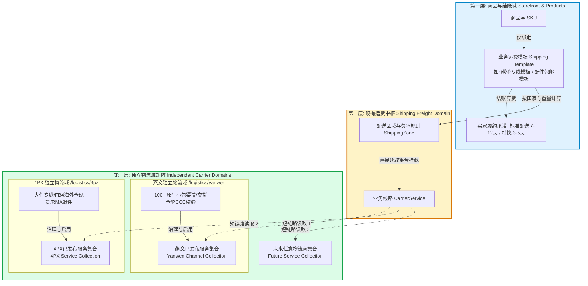

# 跨境电商独立物流域架构与端到端履约集合短链路规范

> **文档标识**: `DOC-DESIGN-INDEPENDENT-LOGISTICS-DOMAIN-ARCHITECTURE`  
> **所属领域**: 核心供应链与智能物流调度中台 (Supply Chain & Fulfillment Architecture)  
> **设计版本**: `v1.1.0`  
> **关联专著**: 
> - [燕文专线轻小件独立物流域实施专著 (Yanwen Domain)](./yanwen-logistics-hub-integration-architecture.md)
> - [4PX 大件专线与海外仓独立物流域实施专著 (4PX Domain)](./4px-logistics-hub-integration-architecture.md)
> - [系统既有运费报价与锁价架构 (Shipping Domain)](./shipping-quote-plan-architecture.md)
> **设计对齐**: 《ERP UDS 视觉系统规范 (v1.0)》、系统零容忍隐式兜底原则 (Fail Loudly)

---

## 1. 架构愿景与业务痛点诊断

在跨境电商业务中，随着包裹类型（小件辐条配件 vs 大件碳纤维一体轮组/车架）的分化与全球目的国的拓展，系统需要接入多家第三方物流服务商（如**燕文、递四方 4PX、云途、万邦、DHL** 等）。

现实中，各家物流商的原生设置项极其繁多且业务模型差异巨大：
* **燕文专线**：拥有 100+ 种小包细分产品、全国交货仓（深圳、义乌等）、独特的韩国个人通关码（PCCC）实名校验、美国 USPS 地址标准化校验。
* **递四方 4PX**：拥有大件大箱抛货专线、FB4 全球海外仓（美西、德国等）WMS 实物库存同步、国内大货海运入库预报、海外本地退件质检（RMA）。

### 1.1 为什么必须建立“每个物流商独立域 (Independent Carrier Domain)”？
若将所有承运商强行塞进同一个大控制台或简单表格中，会导致灾难性的**“超级大杂烩（Mega-Hub）”**：
1. **界面极度混乱与认知负荷**：操作人员在同一个页面里既要处理小包打单，又要管理海外仓 WMS 库存与大件退件质检，配置项相互干扰。
2. **职责不清晰导致排障困难**：当某一单发货失败时，操作人员无法第一时间明确是运费模板算错、还是燕文秘钥失效、亦或是 4PX 尺寸超限。

### 1.2 核心解法：独立物流域 + 服务集合 (Service Collection) 短链路模型
为了在应对海量业务复杂度的同时保持系统清爽，架构确立为：
> **“每个物流商拥有独立后台域（独立多 TAB 控制台），各独立域内部治理后对外发布一个【标准化服务集合 (Service Collection)】；系统已有的运费模板直接读取该集合挂载渠道，形成端到端短数据链路。”**

---

## 2. 端到端短数据链路拓扑模型 (End-to-End Short-Link Topology)



---

## 3. 三大节点的核心职责与数据契约

### 3.1 独立物流域（第三层）：各家自治、深度治理与集合输出
每一个第三方物流商在后台拥有**独立的一级业务域与独立的多 TAB 控制台**：
* **路由规范**：
  * 燕文独立域：`/logistics/yanwen/*`
  * 递四方 4PX 独立域：`/logistics/4px/*`
  * 未来新物流域：`/logistics/yunexpress/*`、`/logistics/dhl/*`
* **各域内部的多 TAB 职责**：
  1. **API 网关与凭据**：独立管理各自的 AppKey、Token、环境切换与 Ping 自检。
  2. **★ 核心枢纽——精选开通渠道白名单 TAB (Curated Channels)**：
     * **拒绝全量暴力灌入**：严禁将官方上百个原生渠道一股脑全部拉入系统。
     * **人工比价选优工作流**：运营先线下/在测算器中人工测算出哪种渠道最优，算好后进入该 TAB 手动 `[添加渠道]`（录入官方产品代码与业务别名），建立我们专属的精选渠道白名单。
     * **随时增删启停**：支持管理员对渠道随时执行 `[编辑]`、`[删除/移除]` 与 `[停用]`，不划算的渠道随时踢出。
  3. **输出标准化服务集合 (Published Service Collection)**：
     * 该 TAB 维护的精选渠道清单，自动打包为该物流域对外的标准化服务集合，**主运费域严格且仅读取此 TAB 的白名单数据**。
  4. **打单与履约底层闭环**：解析各自专属的 10x10 面单 Base64 流、处理各自的轨迹节点与关务校验。

---

### 3.2 现有物流运费域（第二层）：轻量挂载、按国家计价与智能路由
系统现有的运费模板（`ShippingTemplate`）与承运商线路（`CarrierService`）彻底摆脱与各家复杂 API 的直接纠缠：
* **只做“精选集合的只读消费 (Read-Only Consumer)”**：
  * 在运费管理后台新增或编辑业务线路时，系统直接读取第三层各独立域已添加的精选渠道白名单。
  * **下拉框永远只有经过人工验证的几条优质选项**，绝不出现上百个原生垃圾代码：
    * `【燕文独立域】 欧美配件普货专线 (官方代码: 1001)`
    * `【4PX 独立域】 全球轮组大包直发 (官方代码: GDS_A1)`
    * `【4PX 独立域】 美西洛杉矶仓代发 (官方代码: WMS_USLAXA)`
* **只管“国家与计价规则”**：
  * 运费域只负责配置：到达美国首重 500g 多少钱、续重多少钱、满 $150 包邮。
  * 发货推单时，直接顺着挂载的精选通道代码派发至对应的独立物流域执行。

---

### 3.3 商品与订单域（第一层）：完全解耦、业务承诺驱动
* **商品配置零负担**：
  * 商品（Product）与变体（Variant）仅绑定业务层面的运费模板（如 `Wheelset Bulky Template` 或 `Small Accessory Free Shipping`）。
  * 商品系统根本不需要知道底层走的是燕文接口还是 4PX 接口，彻底消除业务代码与物流 API 的耦合。
* **买家体验纯粹**：
  * 结账端展示由第二层运费模板计算出的履约方案（如 `Standard Express (7-12 Days) - $15.00`），保证买家体验清晰稳定。

---

## 4. 独立物流域核心设计：精选开通渠道白名单 TAB 与单一出口规范

为了彻底避免“一次性拉入几百个渠道导致根本无法选”的问题，每个独立物流域必须配备**精选开通渠道白名单 TAB（Curated Channels & Service Roster）**，作为对接主运费域的唯一官方出口。

### 4.1 独立物流域边界隔离与单一向外出口准则 (Single Outbound Port Principle)

在架构层面，必须确立严密的数据流向物理边界：

```mermaid
flowchart TD
    subgraph ExternalModules [外部业务模块 - 严格只读消费]
        ShippingDomain[第二层: 主运费物流域<br/>ShippingTemplate / CarrierService]
        OrderDomain[订单履约中枢 / 发货调度]
    end

    subgraph IndependentLogisticsDomain [独立物流域: 如 /logistics/yanwen 或 /logistics/4px]
        subgraph OutboundPort [★ 域内唯一公开对外出口 (Single Outbound Port)]
            CuratedCollectionTAB[【精选开通渠道白名单 TAB】<br/>Curated Carrier Channels Collection]
        end

        subgraph PrivateDomainInternals [域内私有闭环 (外部严禁穿透调用)]
            OverviewTAB[TAB: 运营大盘与链路健康]
            WaybillTAB[TAB: 运单履行与面单打印]
            TrackingTAB[TAB: 轨迹看板与节点对齐]
            CustomsTAB[TAB: 关务合规与前置校验]
            ConfigTAB[TAB: 接口凭据与主数据同步]
            CalculatorTAB[TAB: 运费试算器与材积计算]
        end

        subgraph FutureEvolution [未来平滑演进通道 (预留接口)]
            AutoRoutingEngine[(未来升级: 自动渠道估算与比价推荐引擎)] -.->|域内推荐/同步| CuratedCollectionTAB
        end

        %% 域内通信闭环
        PrivateDomainInternals <==>|双向数据通信| CarrierAPI[第三方承运商官方开放 API<br/>(燕文 / 4PX 开放平台)]
        ManualInput[运营线下/工具比价<br/>人工测算选优] -->|当前阶段: 手动点击添加/删除| CuratedCollectionTAB
    end

    %% 对外单一短链路
    CuratedCollectionTAB ==>|只读轻量集合传递: CuratedCarrierChannelDTO[]| ShippingDomain
    OrderDomain -.->|按挂载渠道派发推单| WaybillTAB

    %% 严禁访问红线
    ShippingDomain -.->|❌ 绝对禁止穿透调用| PrivateDomainInternals
    ExternalModules -.->|❌ 绝对禁止直接通信| CarrierAPI

    classDef pub fill:#dcfce7,stroke:#16a34a,stroke-width:2px;
    classDef priv fill:#f1f5f9,stroke:#64748b,stroke-width:1px,stroke-dasharray: 5 5;
    classDef ext fill:#fef3c7,stroke:#d97706,stroke-width:2px;
    class CuratedCollectionTAB pub;
    class PrivateDomainInternals priv;
    class ExternalModules,ShippingDomain ext;
```

#### 核心边界隔离禁令：
1. **禁止外部模块读取私有 TAB 数据**：
   主运费域、商品域、营销域等外部模块，**绝对禁止直接读取或依赖除【精选渠道白名单 TAB】之外的任何物流域内部数据**（如严禁主运费域读取运单台账、打印流水、轨迹状态或凭据信息）。
2. **内部其他 TAB 纯闭环通信**：
   物流域内部的运营大盘、运单/面单中心、轨迹监控、关务校验等 TAB，其数据流严格在“物流域前端 $\leftrightarrow$ 物流域专属后端 Adapter $\leftrightarrow$ 第三方承运商开放 API”之间流转，禁止未清洗的原生数据向外溢出。
3. **对外暴露标准化单一 DTO**：
   精选渠道集合向外暴露的接口定义必须极简、高聚合，杜绝暴露承运商原生报文细节：
   ```typescript
   export interface CuratedCarrierChannelDTO {
     carrierId: 'yanwen' | '4px';       // 归属物流域标识
     channelCode: string;               // 官方渠道代码 (如 "1001", "GDS_A1")
     displayName: string;               // 运营自定义别名 (如 "燕文-欧美配件专线")
     status: 'ENABLED' | 'DISABLED';    // 启停状态
     restrictions: {
       maxWeightGrams?: number;         // 最大毛重限制
       allowedParcelTypes?: string[];   // 适用类型 (轻小件 / 大件轮组 / 海外仓现货)
     };
     notes?: string;                    // 运营测算说明 (如 "2026年9月人工比价优选")
   }
   ```

---

### 4.2 渐进式演进通道：当前人工选优录入 vs 未来自动化估算（防一刀切死）

架构设计既要满足当前极简务实的上线要求，又要保证未来业务规模扩大时能够平滑升级，**绝不能“一刀切死”**：

* **当前第一阶段（Phase 1: 人工选优，受控可靠）**：
  * **业务逻辑**：初期各物流商官方计费规则（首续重、计泡比率、燃油费、附加费）极其复杂。运营在线下通过官方报价单、测算小工具**人工算好最具性价比的 3-5 条优势渠道**。
  * **维护动作**：运营直接进入该 TAB 点击 `[+ 手动添加渠道]` 录入官方代码，赋予自定义业务别名。日常发现时效不佳或涨价时，手动 `[停用]` 或 `[删除]`。
  * **主系统消费**：主运费域只读这几条人工精选线路，下拉框纯净，无误选风险。
* **未来第二阶段（Phase 2: 域内智能估算平滑升级，外部无感）**：
  * **演进边界清晰**：后续若要开发“全自动渠道估算与智能比价推荐”，**所有算法与联动仅升级在物流域内部**（由域内试算引擎对接实时报价后，在集合 TAB 界面呈现“系统智能推荐渠道”供一键审核采纳）。
  * **契约零破坏**：无论内部算法如何升级，**集合 TAB 对外暴露的 `CuratedCarrierChannelDTO[]` 结构与只读机制永远保持一致**，外部主运费模板与履约模块无需修改任何代码，实现零破坏性演进！

---

### 4.3 业务作业模型：人工算费选优 -> 精选白名单录入


### 4.4 工业级交互规范原型 (UDS 1.0)
```text
┌──[精选渠道白名单控制台]  rounded-[24px]  border-dashed ────────────────────────┐
│ [搜索渠道名称/代码]  [状态: 全部 / 已启用 / 已停用]          [+ 手动添加精选渠道] │
└────────────────────────────────────────────────────────────────────────────────┘

┌──[已添加的精选渠道 Table] ────────────────────────────────────────────────────┐
│ 业务别名 (自定义)      │ 官方产品代码 │ 适用类型 │ 测算参考时效 │ 状态     │ 操作列      │
├────────────────────────┼──────────────┼──────────┼──────────────┼──────────┼─────────────┤
│ 欧美小件配件专线 (主力) │ 1001 (普货)  │ 轻小件   │ 7-10 工作日  │ [ENABLED]│ [编辑][停用]│
│                        │ YW Express   │ (≤2kg)   │ 均客单运费¥38│ (已发布) │ [移除/删除] │
├────────────────────────┼──────────────┼──────────┼──────────────┼──────────┼─────────────┤
│ 韩国特快专线 (带电备用) │ 1008 (特货)  │ 轻小件   │ 3-5 工作日   │ [ENABLED]│ [编辑][停用]│
│                        │ YW KR Spec   │ (内置锂电│ 需校验通关码 │ (已发布) │ [移除/删除] │
└────────────────────────┴──────────────┴──────────┴──────────────┴──────────┴─────────────┘
```

### 4.5 核心操作能力保障
1. **`[+ 手动添加精选渠道]` 弹窗**：
   * **来源选择**：支持直接输入官方代码（如 `1001`）或从已同步的官方产品字典中快速搜索勾选；
   * **业务别名定义**：允许运营命名（如“北美轮组专线-空派特快”），使主运费域配置人员一眼看懂；
   * **约束与测算备注**：可配置该渠道的建议最大毛重、尺寸限制和人工测算说明，防止错用；
2. **`[编辑 / 停用 / 删除]` 实时生效**：
   * 渠道临时调整运价或时效不佳时，管理员一键点击 `[停用]`，第二层主运费域的下拉框立即对该渠道不可见或置灰；
   * 彻底不再合作的渠道直接点击 `[删除/移除]`，干干净净从系统注销。

---

## 5. 故障秒级定位与排障短链路机制 (Instant Diagnostics)

用户指出的核心价值：**“哪里有问题一下就知道”**。

三层短链路将原本纵横交错的网状调用，彻底规整为**端到端单向短数据链**：

```text
[排障诊断指南: 30 秒精准定位故障源头]

场景 A: 买家在结账页面算不出运费或报错
├── 检查节点: 第二层【物流运费域 / 运费模板】
└── 排查动作: 检查该国家是否配置了运费区间 (ShippingZone)，或商品实重/体积重是否超出模板范围。
    (无需怀疑燕文或 4PX 接口，因为运费计算完全在第二层本地规则中运行)

场景 B: 打包发货时，某个小件包裹推单失败、面单打不出
├── 检查节点: 第三层【燕文独立物流域 / 专线运单中心】
└── 排查动作: 直奔 /logistics/yanwen/waybills，查看该运单的推单报错原因。
    (错误信息一目了然: 例如 "韩国通关码 PCCC 与姓名不匹配" 或 "邮编格式不合规"，30 秒排查完毕)

场景 C: 轮组大件出境直发被拦截、体积重异常
├── 检查节点: 第三层【4PX 独立物流域 / 大件直发中心】
└── 排查动作: 直奔 /logistics/4px/direct，查看外箱实测尺寸长宽高与计费重试算记录。

场景 D: 某物流商遭遇官方接口维护或口岸爆仓
├── 检查节点: 第二层【物流运费域 / 业务线路配置】
└── 排查动作: 一键将该线路的底层映射切换为备用承运商的集合项，全站上千商品发货秒级自愈！
```

---

## 6. 后台路由规划与角色权限矩阵

每个物流商设立独立域后，后台路由与权限矩阵保持清晰的模块化隔离：

### 6.1 独立路由配置 (`router/index.ts`)
```typescript
// 1. 系统主运费域 (第二层: 运费模板、配送区域、业务线路)
{
  path: 'shipping',
  name: 'ShippingAdmin',
  component: () => import('@/views/Shipping.vue'),
  meta: { title: '物流运费', permission: 'shipping:view' }
},

// 2. 燕文专线独立域 (第三层: 轻小件多 TAB 调度控制台)
{
  path: 'logistics/yanwen',
  redirect: domainRedirect('YanwenOverview', {
    overview: 'YanwenOverview',
    waybills: 'YanwenWaybills',
    collection: 'YanwenCollection',
    calculator: 'YanwenCalculator',
    tracking: 'YanwenTracking',
    customs: 'YanwenCustoms',
    config: 'YanwenConfig',
  }),
  meta: { permission: 'logistics:yanwen:view' }
},

// 3. 递四方 4PX 独立域 (第三层: 大件及海外仓多 TAB 调度控制台)
{
  path: 'logistics/4px',
  redirect: domainRedirect('FPXOverview', {
    overview: 'FPXOverview',
    direct: 'FPXDirectShipping',
    warehouse: 'FPXOverseasWarehouse',
    collection: 'FPXCollection',
    calculator: 'FPXCalculator',
    tracking: 'FPXTracking',
    rma: 'FPXReverseLogistics',
    config: 'FPXConfig',
  }),
  meta: { permission: 'logistics:fpx:view' }
}
```

### 6.2 角色权限矩阵单一授权规则
按照平台准则，入口权限由后台角色权限矩阵单一勾选决定，杜绝多处硬编码或隐式阻塞：
* `shipping:view` / `shipping:edit`：管理第二层主运费模板、配送区域与线路挂载。
* `logistics:yanwen:view` / `logistics:yanwen:ship`：查看燕文独立域，执行小包打单与关务核验。
* `logistics:fpx:view` / `logistics:fpx:ship`：查看 4PX 独立域，执行大件推单与海外仓出库。

---

## 7. 全局设计原则遵从验证

1. **底层数据拉取与用户权限彻底解耦**：
   各独立域内部拉取原生产品与海外仓库存属于系统基石服务，常态化由后台 Worker 异步更新并本地缓存。**前端严禁注入任何基于当前操作者角色的阻断逻辑干扰底层数据同步**。
2. **系统登录零干扰原则**：
   系统登录仅核验 Token 与 User ID，严禁挂载任何第三方物流渠道同步或网络探测。
3. **Fail Loudly 原则**：
   无论在哪个独立域，外部 API 签名失败、报文异常或关务拦截，强类型错误必须显式穿透至该域的前端界面展示，严禁返回空对象或假成功。

---

## 8. 文档闭环体系与交叉索引

本总领规范与两大独立域实施专著构成严格的**“总-分双向闭环”**：

* **总领顶层规范**（本文档）：
  * [`docs/design/cross-border-logistics-three-tier-architecture.md`](./cross-border-logistics-three-tier-architecture.md)
* **燕文独立物流域实施专著（Yanwen Domain 细则）**：
  * [`docs/design/yanwen-logistics-hub-integration-architecture.md`](./yanwen-logistics-hub-integration-architecture.md)：详述燕文独立域多 TAB 设计、100+ 小包渠道治理、服务集合生成与输出规范。
* **4PX 独立物流域实施专著（4PX Domain 细则）**：
  * [`docs/design/4px-logistics-hub-integration-architecture.md`](./4px-logistics-hub-integration-architecture.md)：详述 4PX 独立域多 TAB 设计、大件专线大包、FB4 海外仓代发与大件服务集合输出规范。
* **系统既有运费中枢与锁价架构（第二层细则）**：
  * [`docs/design/shipping-quote-plan-architecture.md`](./shipping-quote-plan-architecture.md)：详述运费模板如何端到端消费底层各独立域的服务集合。
