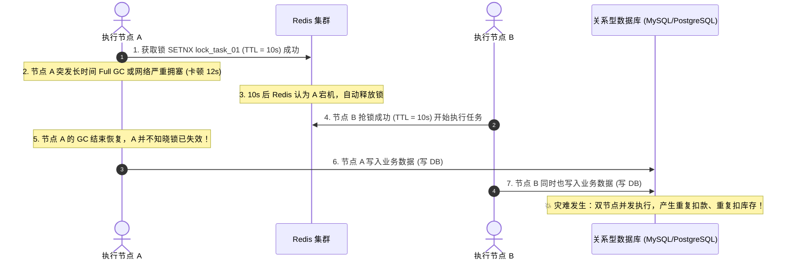

# 工业级分布式定时任务、分布式锁与全链路幂等状态机设计规范

> **规范版本**: v1.0  
> **适用领域**: 跨境电商分布式调度、支付清算、库存履约、订单生命周期状态机  
> **核心原则**: **“Redis 是加速的跑鞋，不是保命的安全带。终极生杀大权必须交还给具有 ACID 事务与行锁的数据库。”**

---

## 目录
1. [背景与核心认知纠偏](#1-背景与核心认知纠偏)
2. [第一道门：Redis 锁的正确边界与致命陷阱](#2-第一道门redis-锁的正确边界与致命陷阱)
3. [终极审判：全链路任务状态机与数据库行锁 (CAS)](#3-终极审判全链路任务状态机与数据库行锁-cas)
4. [第二道门：分片断点水位线与防僵尸节点机制](#4-第二道门分片断点水位线与防僵尸节点机制)
5. [第三道门：双层幂等架构（修复“纯Redis去重”陷阱）](#5-第三道门双层幂等架构修复纯redis去重陷阱)
6. [在 Tanzanite 电商交易系统中的标准落地示例](#6-在-tanzanite-电商交易系统中的标准落地示例)

---

## 1. 背景与核心认知纠偏

在互联网架构演进中，对于“分布式定时任务与防重执行”往往存在一种普遍的**初级误区**：
> *❌ 错误认知：“只要加一个 Redis `SETNX` 锁，设置个过期时间（TTL），系统就能 100% 保证分布式任务不重复执行。”*

在真实的复杂分布式网络中，**单靠 Redis 锁是绝对不可能保证数据强一致性的**。

### 为什么单靠 Redis 锁必定会发生并发穿透（脑裂）？
根据分布式系统经典理论（Martin Kleppmann 论断），任何依赖物理时钟和 TTL（租期超时）的缓存锁，都无法抵御以下三种工程物理现实：



**正确的工业架构定位**：
- **Redis 锁**：只是挡在最前沿的**“排队保安”**，负责以纳秒级速度过滤掉 99% 的重试流量，降低底层数据库压力。
- **数据库状态机与唯一索引**：才是坐在金库里的**“终审法官”**。即便 Redis 锁因为网络中断、GC 卡顿、主从切换丢失，底层的原子状态机也必须能够物理拦截第二次写入。

---

## 2. 第一道门：Redis 锁的正确边界与致命陷阱

### 2.1 规范用法：快速筛选与主动防抖
Redis 锁作为廉价、低延迟的前置防线，应严格遵循以下范式：

1. **唯一随机持有者标记（Owner Token）**：防止节点 A 释放了节点 B 的锁。
   ```bash
   SET resource_key <random_uuid> NX PX 30000
   ```
2. **Lua 脚本原子释放**：
   ```lua
   if redis.call("get", KEYS[1]) == ARGV[1] then
       return redis.call("del", KEYS[1])
   else
       return 0
   end
   ```
3. **看门狗（Watchdog）续期**：如果业务执行时间不可控，必须后台开协程按周期检查并主动续期锁，而非随意把 TTL 设得过大。

### 2.2 绝对禁止的假定
- ❌ **严禁**假定“获取了 Redis 锁就可以直接裸写数据库，不需要加数据库事务或版本号”。
- ❌ **严禁**假定“Redis 主从切换时锁一定不会丢”（主从异步复制会导致新主节点缺失旧锁）。

---

## 3. 终极审判：全链路任务状态机与数据库行锁 (CAS)

任何核心业务操作（支付扣款、批量库存同步、海关清报关、结算打款），都必须有持久化在数据库中的**全生命周期任务状态机**。

### 3.1 状态转移矩阵

```
[CREATED] (创建)
   │
   ▼
[DISPATCHED] (已分发)
   │
   ▼
[RUNNING] (执行中) ── (执行成功) ──► [SUCCEED] (成功)
   │
   ├────── (执行失败且超重试) ──► [FAILED] (失败)
   │
   └────── (心跳超时/失联) ──► [ORPHANED] (孤儿任务待接盘)
```

### 3.2 乐观锁 CAS 原子状态翻转（防脑裂核心）
当节点（不论是通过 Redis 抢到的，还是轮询领取的）准备开始执行任务时，必须通过带版本号（Version）或原状态的原子 SQL 竞争执行权：

```sql
-- 节点尝试将任务标记为 RUNNING
UPDATE task_execution
SET status = 'RUNNING',
    version = version + 1,
    owner_node = 'node-ip-01:pid',
    updated_at = NOW()
WHERE id = 10086 
  AND version = 3 
  AND status = 'DISPATCHED';
```

**裁决逻辑**：
- 如果 `RowsAffected == 1`：当前节点正式合法拿到执行权。
- 如果 `RowsAffected == 0`：说明已经被其他节点抢先更新，当前节点**立刻停止一切后续业务逻辑，主动退出**。
- **即使节点 A 因为 GC 导致 Redis 锁丢失，节点 B 更新了数据库后版本号变成 4；当节点 A 复活时，其执行任何后续基于 version=3 的更新都必定失败（`RowsAffected == 0`），彻底在物理层根绝双节点并发写！**

---

## 4. 第二道门：分片断点水位线与防僵尸节点机制

对于大数据量定时扫描、大批量订单状态同步等分片任务，必须具备宕机断点自愈能力。

### 4.1 水位线（Offset）必须按“独立分片”推进，而非全局最小
- **纠偏**：短视频提到“从全局最小水位补偿”存在严重弊端。若任务分为 10 个独立分片（如 10 个哈希桶），每个分片处理速度不同；当分片 3 节点宕机，接盘节点只需从 **分片 3 自身的 `processed_offset`** 接着跑，绝不能回滚所有分片，避免 90% 的无意义重复计算。
- **上报频率**：批处理每消费一批数据（如 100 条）或定时（如每 3~5 秒）向任务分片表原子更新进度。

### 4.2 孤儿分片认领必须引入“代数（Epoch / Fencing Token）”防僵尸节点
当原节点只是因为短暂的网络抖动导致心跳丢失，调度系统将其标记为 `ORPHANED` 并被新节点接盘时，必须防止原节点突然“诈尸”继续写数据库。

```sql
-- 认领孤儿分片：必须强制累加 epoch（代数）
UPDATE task_shards
SET owner_node = 'new-node-02',
    epoch = epoch + 1,
    status = 'RUNNING',
    last_heartbeat = NOW()
WHERE shard_id = 3
  AND epoch = 12
  AND last_heartbeat < NOW() - INTERVAL '30 SECONDS';
```

**防僵尸原则**：
后续所有数据写入操作，都必须带上当前节点的 `epoch`。原节点网络恢复后，因手持旧代数 `epoch=12`，所有写操作均被拒绝。

---

## 5. 第三道门：双层幂等架构（修复“纯Redis去重”陷阱）

> ⚠️ **关键警示**：短视频提出 *“将幂等键存入 Redis 去重集合，存在则跳过”*。
> **如果只把幂等寄托在 Redis，在金融级交易与履约系统中存在致命漏洞！**
> 1. Redis 内存不足时会触发 LRU/LFU 内存淘汰（Eviction），静默逐出旧 key；
> 2. Redis 主从异步切换会导致新主节点缺失未同步的幂等 key；
> 一旦 Redis 丢 key，重复请求穿透，就会引发灾难性的重复扣划与重复发货。

### 5.1 正确的“双层幂等过滤模型”

```
                   客户端 / Webhook / 触发调度
                               │
                               ▼
        ┌─────────────────────────────────────────────┐
        │ 【第一层：Redis 内存缓存拦截 (Fast Path)】   │
        │  Key: idempotency:scope:key                 │
        │  - 存在: 说明任务已处理或正在处理，直接返回 │
        │  - 不存在: SET key val NX EX 3600 (占位)    │
        └──────────────────────┬──────────────────────┘
                               │ (未命中缓存，穿透到底层)
                               ▼
        ┌─────────────────────────────────────────────┐
        │ 【第二层：数据库物理唯一约束 (Ultimate)】    │
        │  表: idempotency_records                    │
        │  唯一索引: UNIQUE (scope, idempotency_key)  │
        │  - INSERT 命中唯一键冲突 -> 说明已处理过     │
        │  - INSERT 成功 -> 正式开启事务执行业务逻辑  │
        └──────────────────────┬──────────────────────┘
                               │
                               ▼
                   【核心业务写库 / 状态更新】
                               │
                               ▼
        ┌─────────────────────────────────────────────┐
        │ 【写入结果摘要与回查 (Result Snapshot)】     │
        │  - 将执行响应结果快照存入持久化表           │
        │  - 重复请求抵达时，直接回放该结果快照       │
        └─────────────────────────────────────────────┘
```

---

## 6. 在 Tanzanite 电商交易系统中的标准落地示例

在本项目（`go-backend`）中，以下两处已严格对齐上述工业级标准：

### 示例 A：订单创建幂等防重（双层拦截标准范式）
参考 [`internal/service/order_create_service.go`](../../go-backend/internal/service/order_create_service.go)：
1. 前台传递 `IdempotencyKey` 与 `RequestHash`。
2. 事务内部首先执行 `repos.OrderIdempotency.TryCreate(...)`：
   底层依赖 PostgreSQL/MySQL 上的唯一约束 `UNIQUE KEY (user_id, scope, idempotency_key)`。
3. 若并发重复进入，底层唯一键直接拦截（`claimed == false`），阻断重跑。
4. 若已有生成订单，读取已存 `OrderID` 幂等回放，确保重复点击无害。

### 示例 B：支付 Webhook 与前台确认并发（数据库排他行锁终审）
参考 [`internal/service/payment_transaction_service.go`](../../go-backend/internal/service/payment_transaction_service.go)：
1. 无论前台 `ConfirmAlipayOrder` 还是官方异步 Webhook 同时到达；
2. 进入事务后，强制执行：
   ```go
   o, err := repos.Order.FindByOrderNumberForVerificationForUpdate(input.OrderNumber)
   ```
3. 数据库对该订单加上物理排他行锁（`FOR UPDATE`），串行化两笔操作。
4. 第一笔将订单标记为 `paid` 并生成 `completed` 交易流水；
5. 第二笔获取锁后，锁内立即发现 `o.PaymentStatus == "paid"`，直接退出返回成功，彻底杜绝双发重复清算。

---

## 总结：架构设计速查口诀

> **前置用 Redis 挡洪峰，状态靠版本 CAS 抢权限；**  
> **断点凭分片独立记水位，孤儿接盘加代数避僵尸；**  
> **防重不可全托付缓存，唯一索引定江山，结果回查保无害。**
