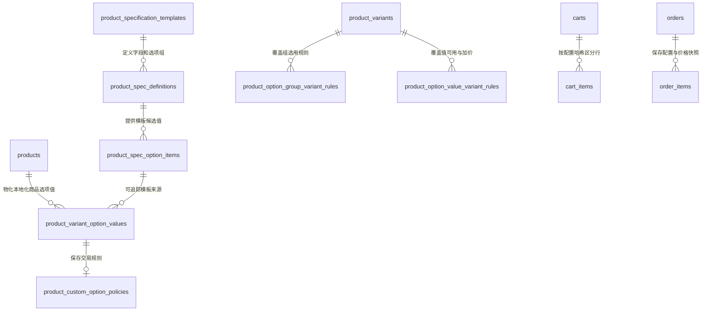

# 商品规格模板与用户端选配（单选/多选）系统架构设计与实施规范

> **文档路径**: `docs/design/product-template-and-options-architecture.md`  
> **面向场景**: 轮组 (Wheelset)、花鼓 (Hub)、轮圈 (Rim) 等专业自行车零部件与定制商品的模板化上架与前端动态选配  
> **文档状态**: Accepted ADR，阶段一、阶段二已完成，阶段三进行中，阶段四核心闭环已完成  
> **最后校正**: 2026-09-15，已按当前实现补充模板候选值、商品物化和后台配置状态  
> **核心目标**: 确立面向未来 3~5 年的长期“黄金三角”产品模型，解决“传统变体笛卡尔积爆炸、多选配件无法表达、后台录入繁琐、前台选配僵硬”等问题，同时保持服务端计价、库存归属和订单证据链只有一个事实来源。

---

## 目录

0. [拟定的架构决策](#0-拟定的架构决策)
1. [背景与核心痛点分析](#1-背景与核心痛点分析)
2. [现有产品架构审计](#2-现有产品架构审计)
3. [面向长期的稳态模型：黄金三角架构](#3-面向长期的稳态模型黄金三角架构)
4. [模板字段三分类体系](#4-模板字段三分类体系)
5. [轮组与花鼓真实业务落地样板](#5-轮组与花鼓真实业务落地样板)
6. [后台运营操作流与商品上传设计](#6-后台运营操作流与商品上传设计)
7. [前台买家端 (PDP) 交互与渲染规范](#7-前台买家端-pdp-交互与渲染规范)
8. [购物车、计价与订单快照数据流](#8-购物车计价与订单快照数据流)
9. [数据库与领域模型扩展设计](#9-数据库与领域模型扩展设计)
10. [渐进式工程实施路线图](#10-渐进式工程实施路线图)
11. [验收标准与明确不做的事项](#11-验收标准与明确不做的事项)

---

## 0. 拟定的架构决策

以下约束是后续实现的边界，不应在前端、管理后台或单个接口中另行发明规则：

1. **商品、核心变体、选配项职责分离**：商品是目录容器；核心变体是可购买 SKU 和主库存实体；选配项表达不会自然形成独立 SKU 的客户选择。
2. **复用现有模板元数据**：`product_spec_definitions` 是字段和选项组的唯一事实来源，通过新增 `role` 扩展为 `attribute / variant / custom_option`，不再平行创建 `product_template_option_groups`。
3. **模板只提供蓝图**：选项在商品创建或显式同步时物化为商品级配置。修改模板不得静默改变已发布商品的价格、可售范围或既有购物车。
4. **所有交易规则由服务端裁决**：客户端只提交稳定的组 Slug 和值 Key，不提交可信价格、标签、默认状态或库存结论。
5. **金额使用精确 Money 语义**：商品级选配加价以最小货币单位保存，币种继承商品/变体的目录币种；禁止无币种的裸 `decimal` 在模板间传播。
6. **配置具有稳定身份**：服务端规范化选择并计算 `configuration_hash`。同一 SKU 的不同配置必须是不同购物车行。
7. **订单保存版本化不可变快照**：选配快照负责履约证据，现有 `pricing_snapshot` 负责金额证据，两者必须在下单事务中交叉校验并保持不可变。
8. **物理选配不等于无库存选配**：塔基、轴承、备用辐条等可以作为配置交互，但若需要独立库存或影响重量/交期，必须声明相应履约策略，不能只保存价格差。

---

## 1. 背景与核心痛点分析

在自行车独立站运营中，轮圈、轮组、花鼓等零配件具有高度的专业性与装配定制属性：
- **买轮组时**：买家必须选择**塔基规格**（Shimano HG / SRAM XDR / MicroSpline / Campy）、选择**开档规格**（100x12 / 142x12 还是快拆）、选择**车圈/花鼓颜色**（黑/银/电镀），还可以勾选**随箱赠品/配件**（是否预装真空胎垫、附赠法嘴）。
- **买花鼓时**：买家需要选择**孔数**（24H/28H/32H）、**刹车结构**（中锁 Centerlock / 6孔 6-Bolt）、**塔基规格**与**颜色**。

### 传统电商“纯变体模式 (SKU Matrix)”的死穴：
1. **笛卡尔积组合爆炸**：
   - 框高(3种) × 塔基(4种) × 刹车(2种) × 颜色(3种) = **72 个 SKU**！
   - 后台每上一款轮组，运营要面对 72 行表格，逐一填条码、填价格、填库存。
2. **库存严重碎裂与虚假断货**：
   - 仓库里核心物理件是“50mm 轮圈（有 20 对）”，塔基是现成的配件包，发货时装哪个塔基都可以。
   - 如果做成 72 个死变体，20 对库存被拆成每个变体只有 1 件。买家选 XDR 显示“缺货”，选 HG 却有货，导致白白丢单。
3. **天生无法支持“多选 (Multi-select)”**：
   - 传统变体从底层数据结构上只能“单选组合”，买家想同时多选勾选“随箱送真空胎垫 [✓]”和“送 60mm 法嘴 [✓]”，传统变体根本做不到。

---

## 2. 现有产品架构审计

针对当前代码库（`internal/domain/product/` 下的 `Product`, `ProductVariant`, `ProductSpecificationTemplate`, `SpecDefinition` 等），我们对其合理性与生命力进行客观审计：

### 2.1 现有架构中【完全合理、属于长期资产】的设计（坚决保留）

1. **模板驱动的规格定义体系（`product_specification_templates` + `product_spec_definitions`）**：
   - **机制**：没有把轮组内宽、花鼓开档、车架头管这些专业属性硬编码成 `products` 表的列，而是通过模板化的元数据结构定义不同品类的参数骨架。
   - **长期价值**：符合现代 PIM（商品信息管理）思想。后续无论上架整车、车把、座管、维修工具，只需在后台建新模板，数据库表结构无需做任何破坏性迁移。
2. **多语言主库存继承机制（`master_variant_id`）**：
   - **机制**：跨国独立站（英语 en、德语 de、法语 fr）各语种商品拥有独立的标题与 Slug，但通过 `master_variant_id` 共享同一份物理仓库库存。
   - **长期价值**：彻底避免了多语言分店库存各自为政、超卖穿底的顽疾，底层逻辑极度扎实。
3. **展示元数据与业务逻辑分离（`ProductVariantOptionValue`）**：
   - **机制**：变体底层仅存储标准的枚举标识（如 `stealth_black`），而前端所需的 Hex 颜色代码（`#000000`）、材质缩略图（`swatch_url`）存放在单独的展示元数据表。
   - **长期价值**：前台样式无论如何升级变动，不污染交易和库存底座。

---

### 2.2 现有架构中需要继续纠正的 3 个问题

#### 问题 1：商品表仍保留遗留 SKU 汇总字段
- **现状**：`products` 仍包含 `sku`, `price`, `sale_price`, `stock`，同时关联 `variants []ProductVariant`。不过当前购物车与结算已经重新加载可购买变体，并以变体价格和库存作为交易依据，因此这不是一次需要推倒重来的 SPU/SKU 重构。
- **仍需纠正**：
  - `products.price` 当前同步的是默认变体价格，并非本文要求的最低有效变体价（Starting From Price）。
  - `products.stock` 是兼容旧读取路径的汇总字段，不应继续在下单、取消和退款事务中同步维护。
  - 当前扣减/返还变体库存后仍会聚合并更新 `products.stock`，会产生不必要的热点行竞争和事务延长。它是明确的性能与一致性风险，但在没有锁等待证据前不应直接表述为已发生的“死锁”。
  - 后台低库存/缺货统计仍读取 `products.stock`，必须先迁移到变体聚合查询，才能停止同步写入。

#### 问题 2：把所有用户选择强行塞给变体（“单轨制”）
- **现状**：目前只要买家在前台需要选规格，系统唯一的途径就是生成一个 `ProductVariant`（记录在 `product_variants.option_values` JSONB 字段中）。
- **危害**：
  - **变体（SKU）的本质是物理库存实体**（货架上唯一贴码的盒子）。
  - 把“装配选项（塔基型号）”、“外观选项（贴纸颜色）”、“买家多选（随箱赠品胎垫/气嘴）”全部当成变体，相当于**逼着仓库给 72 种排列组合各准备一个条形码**。
  - 这是导致多选无法实现、后台上架表格繁琐的真正元凶。

#### 问题 3：规格属性与用户交互选配缺乏清晰边界
- **现状**：模板定义（`product_spec_definitions`）中只有一个粗暴的布尔值 `is_variant_option`。
- **危害**：
  - 一个字段要么只能看（静态参数），要么必须参与变体笛卡尔积乘法。
  - 缺乏“第三种形态：用户在前台可选、但不需要在后台生成死 SKU 的挂载选项（Custom Option）”。

### 2.3 当前实现中必须直接复用的交易基础设施

1. **可购买变体解析**：购物车和结算均通过 `FindPurchasableVariant` 解析实际变体，不接受客户端价格作为最终价格。
2. **精确金额模型**：`internal/domain/money` 已提供按币种最小单位计算的 `Money`，新增选配价格不得恢复为业务层 `float64` 运算。
3. **定价快照**：`order_items.pricing_snapshot` 已保存版本化行级价格快照，并由数据库触发器阻止写后修改。
4. **订单属性证据**：`order_items.attributes` 已被订单证据和争议材料读取。当前仍由服务端从结构化配置快照生成兼容内容；在本项目正式运营前，所有消费者迁移完成后删除该旧写入路径。
5. **多语言主库存**：翻译变体通过 `master_variant_id` 共享物理库存。选配配置按本地化商品物化并共享稳定 Key，库存仍只扣主变体或明确绑定的组件库存。

---

## 3. 面向长期的稳态模型：黄金三角架构

为了让系统具备支撑未来 3~5 年全品类复杂定制的能力，底座必须进化为**“黄金三角模型”**：

```
                    ┌──────────────────────────────────────────────┐
                    │               商品主体 (Product/SPU)         │
                    │   (纯容器：负责品类、标题、媒体、描述、SEO)   │
                    └──────────────────────────────────────────────┘
                                           │
                   ┌───────────────────────┴───────────────────────┐
                   ▼                                               ▼
       【第 1 层：核心物理变体 (SKU 矩阵)】                【第 2 层：配置选项 (Custom Options)】
        (负责主库存、基础计价与核心履约)                     (负责买家单选、多选与可选服务/组件)
   ─────────────────────────────                       ─────────────────────────────────
   • 只存不可随意拆装的核心物理规格                     • 挂载在模板或商品上的选项集
   • 比如：轮组框高 (38/50/60mm)                       • 比如：
   • 比如：花鼓孔数 (24H/28H)                            - 单选：塔基规格 (HG/XDR/MS)
   • 拥有唯一的 Barcode/条形码                           - 单选：刹车形式 (中锁/六孔)
   • 严格扣减物理库存                                    - 多选：随箱赠品 (真空胎垫/法嘴)
                                                         - 加价单选：陶瓷轴承 (+ $80)
```

### 3.1 变体与选配项的分类门槛

不能仅根据“前台希望用单选还是多选”决定字段角色。一个选择满足下列任一条件时，默认应建模为核心变体，或绑定独立库存组件/履约规则，而不是作为纯价格修饰项：

- 拥有独立 SKU、Barcode、GTIN 或仓库拣货身份；
- 独立扣减库存，缺货时需要禁止购买；
- 改变重量、包装、运费、税务、海关申报或质保规则；
- 改变生产周期、是否定制、是否允许取消退货；
- 改变与其他选项或核心变体的兼容性。

因此“塔基”和“备用辐条包”可以使用 Custom Option 的前台交互，但若仓库需要分别管库存，后端必须将其绑定到组件库存，而不能把它们当成永远有货的布尔值。

---

## 4. 模板字段三分类体系

在现有的 `product_specification_templates` 与 `product_spec_definitions` 体系中，将字段升级为三种清晰的业务角色：

| 字段角色 (`role`) | 业务作用 | 前台展示 | 后台录入 | 示例 |
| :--- | :--- | :--- | :--- | :--- |
| **静态规格 (`attribute`)** | 商品的固定技术参数 | 规格参数表 | 模板带出默认值，商品填写或覆盖 | 轮圈内宽、碳布等级、质保期 |
| **核心变体 (`variant`)** | 决定基础售价、主库存和核心履约 | 核心规格切换 | 生成少量 SKU，填写价格、库存、重量 | 框高、车架尺码、不可拆分的孔数 |
| **选配项 (`custom_option`)** | 买家选择装配、外观、服务或可选组件 | 单选、色块、图片或复选框 | 从模板显式物化，商品级启停和定价 | 塔基、贴纸颜色、安装服务、配件 |

### 选配项的选择语义与展示语义

选择基数与视觉表现必须拆开，避免把业务规则编码成 UI 控件名：

- **`selection_mode = single`**：最多选择一个值；配合 `min_selections = 1` 表示必选单选。
- **`selection_mode = multiple`**：允许多个值；通过 `min_selections` / `max_selections` 明确基数，不能只依赖 `is_required`。
- **`presentation = text | color | image`**：只决定胶囊、色块或缩略图等表现，不改变单选/多选规则。

已有 `field_type`、`presentation` 与 `is_required` 继续描述字段基础语义；运行时规则以 `role`、`selection_mode` 和选择基数为准。`is_variant_option` 与 `options` 只作为一次性迁移来源，调用方迁移后删除，不建立长期双读双写层。

---

## 5. 轮组与花鼓真实业务落地样板

### 样板 A：【轮组模板 (Wheelset Template)】

#### 1. 核心变体 (SKU 仅 3 行)：
- SKU 1: 38mm 碳纤维轮组（基础价: $1,199，库存: 15）
- SKU 2: 50mm 碳纤维轮组（基础价: $1,249，库存: 20）
- SKU 3: 60mm 碳纤维轮组（基础价: $1,299，库存: 8）

#### 2. 模板选配项（买家端看到去选）：
- **塔基规格 (单选必选)**：
  - `Shimano HG 11/12s` (+$0)
  - `SRAM XDR 12s` (+$0)
  - `Shimano MicroSpline 12s` (+$0)
  - `Campagnolo N3W 13s` (+$15)
- **刹车接口 (单选必选)**：
  - `中锁 (Centerlock)`
  - `六孔 (6-Bolt)`
- **轮组贴纸/涂装 (单选必选)**：
  - `隐形黑标 (Stealth Black)`
  - `高光银标 (Gloss Silver)`
- **随箱配件与赠品 (多选勾选)**：
  - `[✓] 预装真空胎垫 (Tubeless Tape Pre-installed)` —— 免费
  - `[✓] 附赠 60mm 黑色真空法嘴一对 (Tubeless Valves Pair)` —— 免费
  - `[ ] 备用辐条与铝条帽应急包 (Spare Spokes Kit)` —— 选配 +$15

> 首个实现切片只启用不独立扣库存、不改变重量和履约方式的选项。塔基、法嘴和辐条包是否需要组件库存，必须由业务确认后再发布。

---

### 样板 B：【花鼓模板 (Hub Template)】

#### 1. 核心变体 (SKU 仅 3 行)：
- SKU 1: 前花鼓 (Front Hub)（基础价: $90，库存: 50）
- SKU 2: 后花鼓 (Rear Hub)（基础价: $160，库存: 50）
- SKU 3: 整对花鼓 (Pair Front + Rear)（基础价: $240，库存: 30）

#### 2. 模板选配项：
- **孔数选择 (单选必选)**：`24 孔 (24H)` / `28 孔 (28H)`
- **开档规格 (单选必选)**：
  - 前轮：`100x12mm 桶轴` / `100mm 快速快拆 QR`
  - 后轮：`142x12mm 桶轴` / `135mm 快速快拆 QR`
- **塔基规格 (后花鼓必选)**：`Shimano HG` / `SRAM XDR` / `MicroSpline`
- **花鼓颜色 (色块单选)**：`阳极黑 (Anodized Black)` / `高光银 (Polished Silver)` / `紫变色 (Purple)`

#### 3. 变体适用规则：

- 选择前花鼓时，“塔基规格”组不适用，且只能选择前轮开档。
- 选择后花鼓时，“塔基规格”必选，且只能选择后轮开档。
- 选择整对花鼓时，需要分别完成前轮和后轮开档，不能用一个无上下文的“开档规格”组表达。
- 某颜色、孔数或塔基只支持部分 SKU 时，由服务端返回变体级适用矩阵；前端不能通过隐藏按钮自行定义兼容关系。

---

## 6. 后台运营操作流与商品上传设计

运营人员上传商品体验必须维持在 **2 分钟以内**：

```
[后台新增商品]
      │
      ▼
 1. 选择模板: "轮组模板 (Wheelset)"
      │
      ├─> 自动填充通用静态参数 (内宽 21mm、碳纤维材质等)
      │
 2. 生成核心物理 SKU (仅填框高):
      │  ┌────────────────────────┬────────────┬──────────┐
      │  │ 规格名称               │ 售价 (USD) │ 物理库存 │
      │  ├────────────────────────┼────────────┼──────────┤
      │  │ 38mm 碟刹碳纤维轮组    │ $1,199.00  │ 15       │
      │  │ 50mm 碟刹碳纤维轮组    │ $1,249.00  │ 20       │
      │  │ 60mm 碟刹碳纤维轮组    │ $1,299.00  │ 8        │
      │  └────────────────────────┴────────────┴──────────┘
      │
 3. 选配项从模板物化为商品配置 (开关式管理):
      │  [✓] 塔基规格: [✓] HG  [✓] XDR  [✓] MS  [ ] N3W (点一下即可禁用不适用的规格)
      │  [✓] 刹车接口: [✓] 中锁  [✓] 六孔
      │  [✓] 颜色选配: [✓] 黑标  [✓] 银标
      │  [✓] 随箱赠品: [✓] 真空胎垫  [✓] 真空气嘴
      │
      ▼
 [点击保存发布] ➔ 全流程不到 2 分钟完成！
```

### 模板同步规则

1. 新建商品时，将模板当前版本复制为商品级选项值和默认规则，并记录来源模板项与同步版本。
2. 修改模板只影响之后创建的商品；已发布商品不会自动变化。
3. 对已有商品执行“同步模板”时，后台必须先展示新增、禁用、重命名和价格影响，再由运营确认提交。
4. 商品翻译复制稳定的组 Slug 与值 Key，但标签、媒体和商品级价格分别物化；不能依赖不同语言记录之间恰好拥有相同数据库 ID。
5. 删除或禁用已被购物车引用的选项后，结算必须重新校验并要求买家确认，不能静默替换默认值。

---

## 7. 前台买家端 (PDP) 交互与渲染规范

在 Nuxt 前端商品详情页中，买家看到的是结构分明、极度符合自行车选购直觉的交互布局：

```
┌────────────────────────────────────────────────────────────────────────┐
│  商品标题: HyperDrive 50 碟刹碳纤维公路车轮组                          │
│  当前价格: $1,249.00 (根据所选框高与选配即时联动)                      │
├────────────────────────────────────────────────────────────────────────┤
│  1. 框高规格 (核心变体):                                               │
│     ( 38mm )   【 50mm 】   ( 60mm )                                   │
│                                                                        │
│  2. 塔基规格 (单选必选):                                               │
│     ( Shimano HG 11/12s )   【 SRAM XDR 12s 】   ( MicroSpline )       │
│                                                                        │
│  3. 刹车安装规格 (单选必选):                                           │
│     【 中锁 Centerlock 】   ( 六孔 6-Bolt )                            │
│                                                                        │
│  4. 轮组贴纸外观 (颜色单选):                                           │
│     【 ■ 哑光黑标 】   ( □ 高光银标 )                                  │
│                                                                        │
│  5. 随箱配件与服务 (多选复选框):                                       │
│     [✓] 免费预装高压真空胎垫 (Tubeless Tape)                            │
│     [✓] 免费附赠 60mm 铝合金黑色气嘴一对                                │
│     [ ] 选配备用碳条与条帽应急包 (+$15.00)                             │
├────────────────────────────────────────────────────────────────────────┤
│  [ 加入购物车 - $1,249.00 ]   [ 立即购买 ]                             │
└────────────────────────────────────────────────────────────────────────┘
```

### 前端状态管理原则：
1. **联动即时性**：买家切换 38mm ➔ 50mm 时，基础价格实时刷新；如果勾选了加价选配（如备用辐条包 +$15），总价自动变为 `$1,264.00`。
2. **互斥守卫**：若某选项在当前变体不可用（例如某轮组不支持 6孔刹车），对应按钮置灰不可选并展示服务端提供的原因。
3. **完整性守卫**：所有必选组满足最小选择数后才允许加入购物车；切换变体时清除已不适用的选择，不得偷偷选择新的默认值。
4. **价格边界**：公共 API 同时返回选项的目录币种加价和请求展示币种快照。前端可在本地即时求和改善交互，但加入购物车与结算时仍以服务端按目录币种重新计算和统一换汇的结果为准。
5. **可访问性**：单选使用 Radio 语义，多选使用 Checkbox 语义，色块/图片同时提供可读标签、选中态和不可用原因。

---

## 8. 购物车、计价与订单快照数据流

选配闭环必须区分三类数据：客户端命令、购物车当前配置、订单不可变快照。三者不能共用一段未经验证的 JSON。

### 8.1 客户端只提交选择命令

```json
{
  "product_id": 105,
  "variant_id": 312,
  "quantity": 1,
  "selected_options": [
    { "group_slug": "freehub_body", "value_keys": ["sram_xdr"] },
    { "group_slug": "brake_interface", "value_keys": ["centerlock"] },
    { "group_slug": "finish", "value_keys": ["stealth_black"] },
    { "group_slug": "accessories", "value_keys": ["tape", "valves", "spare_spokes"] }
  ]
}
```

请求中禁止接受 `group_name`、`value_label`、`price_delta`、最终价格、是否默认或库存状态等可伪造字段。服务端必须完成：

1. 校验商品、变体、模板角色和商品级选项均处于可售状态；
2. 校验组与值 Key 的归属关系、变体适用性、单选/多选基数和必选组；
3. 去重并按 `group_slug + value_key` 排序，得到规范化选择；
4. 从商品级配置读取价格增量，并使用 `Money` 计算最终单价；
5. 将 `schema_version` 与规范化选择编码为确定性 JSON，并计算 SHA-256 `configuration_hash`。

`configuration_hash` 只表达选择身份，不包含标签和价格。目录价格变化时，同一选择仍是同一购物车行，但下次读取/结算必须重算价格并提示总价变化。

默认值只用于初始化前端状态。加入购物车时客户端仍需明确提交实际选择，服务端不会为缺失的必选组偷偷补默认值。

### 8.2 购物车配置与唯一身份

`cart_items.configuration` 保存服务端规范化后的当前配置，`configuration_hash` 参与行唯一性：

```text
cart_id + product_id + variant_id + configuration_hash
```

因此同一 50mm 变体选择 HG 与 XDR 时必须形成两条购物车行；只有四项身份都相同时才累加数量。游客购物车合并、批量同步、订单取消后恢复购物车，也必须使用相同身份规则。

购物车不是交易证据。每次获取购物车和进入结算时，服务端都应重新解析配置；已禁用、不兼容、缺货或改价的配置返回明确冲突，不能静默删除、替换或采用客户端旧价格。

### 8.3 订单配置快照

订单创建事务在最终报价完成后写入版本化 `order_items.configuration_snapshot`。金额使用最小货币单位，标签固化为下单时所见文本：

```json
{
  "schema_version": 1,
  "product_id": 105,
  "variant_id": 312,
  "product_name": "HyperDrive 碳纤维公路轮组",
  "variant_name": "50mm 轮组规格",
  "currency": "USD",
  "selections": [
    {
      "group_slug": "freehub_body",
      "group_name": "塔基规格",
      "selection_mode": "single",
      "values": [
        {
          "value_key": "sram_xdr",
          "value_label": "SRAM XDR 12s",
          "price_delta_minor": 0,
          "inventory_policy": "none"
        }
      ]
    },
    {
      "group_slug": "accessories",
      "group_name": "随箱配件",
      "selection_mode": "multiple",
      "values": [
        { "value_key": "tape", "value_label": "预装真空胎垫", "price_delta_minor": 0, "inventory_policy": "none" },
        { "value_key": "valves", "value_label": "附赠60mm真空气嘴一对", "price_delta_minor": 0, "inventory_policy": "none" },
        { "value_key": "spare_spokes", "value_label": "备用辐条包", "price_delta_minor": 1500, "inventory_policy": "none" }
      ]
    }
  ],
  "price_breakdown": {
    "base_unit_price_minor": 124900,
    "options_unit_price_minor": 1500,
    "final_unit_price_minor": 126400
  }
}
```

`configuration_snapshot.price_breakdown.final_unit_price_minor` 必须等于现有行级 `pricing_snapshot.unit_price_minor`。优惠、积分、税费和整单金额仍由现有 Pricing Pipeline 与订单价格快照负责，不在配置快照中重复计算。

首个版本将选配加价视为订单行商品价格的一部分，与基础变体使用相同的优惠、税务和退款分摊规则。未来若出现“不可优惠服务费”等需求，应作为新的显式定价组成部分进入 Pricing Pipeline，不得在配置器内部暗中绕过现有折扣规则。

当前阶段 `order_items.attributes` 仍由服务端根据配置快照生成兼容 JSON，供尚未迁移的订单证据、客服和争议材料读取；由于项目尚未正式运营，所有消费者迁移完成后直接删除该旧写入路径。`configuration_snapshot` 与 `pricing_snapshot` 都必须受数据库不可变约束保护。

### 8.4 商家与客服视图

> **商品名称**：HyperDrive 50mm 碟刹碳纤维轮组  
> **实付单价**：$1,264.00 × 1  
> **客户选配明细**：  
> - 塔基规格：**SRAM XDR 12s**  
> - 刹车接口：**中锁 (Centerlock)**  
> - 涂装颜色：**哑光黑标**  
> - 随箱配件：**预装真空胎垫、附赠60mm法嘴一对、备用辐条包 (+$15)**  

后台订单、出库单、邮件、退款、售后、订单证据包和支付争议材料必须从订单快照读取，不得回查当前商品配置来还原历史选择。

---

## 9. 数据库与领域模型扩展设计

这是一组可增量上线的扩展，但不是“只建三张表”即可完成的轻量功能。数据库、服务端校验、购物车身份、定价与订单证据必须一起设计。

### 9.1 扩展现有规格定义，不创建平行选项组

`product_spec_definitions` 的运行时契约为：

| 字段 | 约束与语义 |
| :--- | :--- |
| `role` | `attribute / variant / custom_option`；已由旧字段一次性回填 |
| `selection_mode` | `single / multiple`；仅 `custom_option` 使用 |
| `min_selections` | 非负整数；必选单选为 1 |
| `max_selections` | 可空；单选固定为 1，非空时不得小于最小值 |

`presentation` 继续只描述 `text / color / image` 等视觉形态。运行时只读取 `role`、`selection_mode`、选择基数和 `option_items`；模板保存不再派生或写入旧字段。所有模板、商品、公共 API、Quick Buy 与 Nuxt 调用方已经迁移，迁移 `292_remove_legacy_product_spec_definition_fields` 已删除 `is_variant_option` 与 `options` 列。

同时在 `product_specification_templates` 增加单调递增的 `revision`。任一字段、候选值或默认规则变化时都递增，用于商品同步差异检测；不能依靠 `updated_at` 判断两个模板版本是否等价。

### 9.2 模板候选值与商品级物化值

新增 `product_spec_option_items`，作为模板蓝图中的候选值：

```text
id
spec_definition_id
value_key
default_label
color_hex / swatch_media_asset_id / swatch_url
is_enabled_by_default / is_default
default_price_delta_minor NULL
default_price_currency NULL
sort_order / revision / created_at / updated_at
UNIQUE(spec_definition_id, value_key)
```

模板默认价格必须以 `amount_minor + currency` 成对出现。同步到不同币种商品时，后台需要显式换算并让运营确认，不能在请求时实时继承或隐式换汇。

继续使用现有 `product_variant_option_values` 作为商品级稳定值和本地化展示元数据。在现有字段上只增加模板来源信息：

```text
template_option_item_id NULL
source_template_revision INT NOT NULL DEFAULT 0
```

新增一对一的 `product_custom_option_policies` 保存 Custom Option 专属交易规则，避免把价格与库存策略混入现有展示元数据：

```text
id
product_variant_option_value_id UNIQUE
price_delta_minor BIGINT NOT NULL DEFAULT 0
is_default BOOLEAN NOT NULL DEFAULT FALSE
inventory_policy VARCHAR(24) NOT NULL DEFAULT 'none'
component_variant_id NULL
component_quantity INT NOT NULL DEFAULT 0
created_at / updated_at
```

`price_delta_minor` 必须非负，币种继承选项值所属商品的价格币种；降价与促销仍进入现有 Pricing Pipeline，不通过负选项价格实现。只有 `role = custom_option` 的商品选项值允许存在 Policy。`inventory_policy = component` 时必须提供组件变体与正数量，并在订单事务内与主变体一起预占/扣减。首个切片只开放 `inventory_policy = none`。

Go 领域类型后续可从 `ProductVariantOptionValue` 泛化为 `ProductOptionValue`，但首批迁移不重命名物理表，降低兼容风险。

### 9.3 变体级适用与覆盖规则

新增两张稀疏覆盖表；没有覆盖记录时继承商品级配置：

```text
product_option_group_variant_rules
  variant_id + spec_definition_id
  is_applicable
  min_selections_override NULL
  max_selections_override NULL
  UNIQUE(variant_id, spec_definition_id)

product_option_value_variant_rules
  variant_id + product_variant_option_value_id
  is_enabled
  price_delta_minor_override NULL
  unavailable_reason
  UNIQUE(variant_id, product_variant_option_value_id)
```

服务层必须验证变体和选项值属于同一商品、规格定义属于该商品模板。`is_applicable = false` 的组不得出现在客户端提交或订单快照中。

### 9.4 购物车和订单扩展

`cart_items` 增加：

```text
configuration JSONB NOT NULL DEFAULT '{"schema_version":1,"selections":[]}'
configuration_hash CHAR(64) NOT NULL
```

迁移时为空配置生成统一哈希，合并历史重复行，并建立数据库唯一索引：

```text
UNIQUE(cart_id, product_id, variant_id, configuration_hash)
```

当前仅按 `(cart_id, product_id, variant_id)` 查找和合并的所有路径都要同步修改，包括游客购物车合并、批量 Upsert、订单取消/支付过期后的购物车恢复。

`order_items` 增加：

```text
configuration_snapshot JSONB NOT NULL DEFAULT '{}'
```

新增与 `pricing_snapshot` 同等级别的写后不可变触发器。快照没有到活动目录表的外键，确保商品或选项后续修改不会破坏历史订单。

### 9.5 关系概览



### 9.6 发布与删除约束

- 同一规格定义下 `value_key` 唯一；同一商品下稳定 Key 不得因翻译而变化。
- 单选默认值最多一个；默认选择必须启用并满足对应变体的适用规则。
- 发布时必须验证每个可售变体都至少存在一套满足全部必选组的配置。
- 已物化或已下单的模板项优先禁用，不做硬删除；订单快照永远不依赖目录外键。
- 所有商品配置写入与缓存/渠道失效事件在同一事务中提交。

---

## 10. 渐进式工程实施路线图

### 阶段零：冻结交易契约与迁移边界

1. 评审并确认本文第 0、8、9、11 节。
2. 确认首个轮组选项是否确实不独立扣库存、不改变重量、运费和生产周期。
3. 为角色回填、配置规范化、哈希、价格交叉校验和数据库约束先写契约测试。

阶段零已完成：第 0、8、9、11 节的交易边界已经固定；首个纵向切片仍以“不独立扣库存、不改变重量、运费和生产周期”的轮组塔基单选为前提。若真实业务不满足该前提，必须先切换到第 9.4 节定义的组件库存与履约扩展模型，不得把这些影响压缩为普通加价项。

### 阶段一：先消除库存与商品汇总耦合

1. 改造 `DecrementVariantStocks` / `IncrementVariantStock`，只原子更新主库存变体，不再在订单事务中聚合和回写 `products.stock`。
2. 保留“受影响商品 ID”解析，用于主商品和多语言商品的缓存、页面与渠道失效；该查询不得写商品行。
3. 将后台低库存、缺货统计和其他遗留读取迁移到主变体库存聚合。
4. 将 `products.price` 纠正为最低有效变体展示价；交易路径继续只信任具体变体价。
5. 暂不删除 `products.sku/price/stock`，先将其降级为兼容读模型并标注非交易事实来源。

**实施状态（2026-09-14）：已完成。**

- 订单扣减、取消、支付过期和退款返库只原子更新库存所属变体；多语言变体统一解析到 `master_variant_id`，不再在交易内写 `products.stock`。
- 库存变化仍返回主商品及所有引用同一主变体的多语言商品 ID，供缓存与渠道失效使用；该解析过程只读商品数据。
- 后台低库存与缺货统计按活动变体聚合，并排除 `made_to_order`；多语言商品使用主变体库存。
- 商品起售价、币种和展示价格快照统一来自最低有效成交价的活动变体；同价时稳定优先默认变体，商品 SKU 仍锚定默认变体。
- `products.stock` 仅在后台创建或显式替换变体时刷新为兼容汇总，不再作为下单、取消或退款的交易事实来源。本阶段无数据库结构迁移。
- 已覆盖领域价格选择、商品汇总、库存统计、主/多语言库存写入、公共商品响应及订单全生命周期测试；`go test ./...` 全量通过。

### 阶段二：完成一个后端纵向切片

以“轮组塔基单选”为首个切片，其中至少包含一个加价值，以同时验证选择与计价：

1. 增量迁移 `role`、模板候选值、商品物化值、适用规则、购物车配置和订单快照字段。
2. 商品公共 API 返回服务端解析后的配置器契约和当前变体适用矩阵。
3. 加购接口接收 `selected_options` 命令，服务端完成校验、规范化、哈希和精确金额计算。
4. 购物车按配置哈希区分行，并覆盖同步、登录合并、取消与支付过期恢复路径。
5. Checkout 在事务内重新读取目录配置并报价；目录发生变化时返回明确冲突。
6. OrderCreate 同时固化 `configuration_snapshot` 与现有 `pricing_snapshot`，并验证最终单价一致。
7. 后台订单详情、出库单和订单证据优先读取新快照。

**实施状态（2026-09-15，首个后端切片已完成）：**

- 已增加规格定义角色、single/multiple 选择规则、模板 revision、商品物化值来源字段和 `product_custom_option_policies`；首批只接受 `custom_option + inventory_policy=none`。
- 已增加 `cart_items.configuration/configuration_hash` 与 `order_items.configuration_snapshot`，历史空配置使用固定规范化 JSON 和 SHA-256 哈希；购物车唯一身份升级为商品、变体和配置哈希。
- 已实现服务端配置解析、必选组/单选多选/重复值/启用状态/库存策略校验，选项加价使用 `domain/money` minor unit 计算，客户端标签和价格不会进入定价事实。
- 加购、更新、同步、游客登录合并、Checkout、订单创建、取消/支付过期恢复均携带配置；Checkout 会重新读取目录并在变更时返回配置冲突，订单保存包含标签、选择模式、服务端加价和最终单价的配置快照。
- 公共商品、购物车和订单响应已暴露经过服务端处理的配置数据；迁移 contract test、解析器测试和相关服务/仓储/API 测试已通过。
- 组件库存、重量/运费/生产周期变化和通用依赖表达式仍未实现，按路线图留在后续阶段；变体级覆盖矩阵与前台配置器已在阶段三、阶段四完成。

### 阶段三：后台模板物化与商品配置

1. 规格模板编辑器增加角色、选择基数、展示方式和候选值管理。
2. 商品编辑器增加模板物化、差异预览、显式同步、商品级价格和启停控制。
3. 增加变体级适用矩阵，保证花鼓前/后/整对等条件能够配置。
4. 商品翻译流程复制稳定 Key 和本地化标签，并继续共享 `master_variant_id` 主库存。

**实施状态（2026-09-15，进行中）：**

- 已完成模板角色、单选/多选基数、展示方式和候选值管理；候选值独立存储在 `product_spec_option_items`，模板 revision 自动递增。
- 已完成新商品绑定模板时的候选值物化；商品级值记录 `template_option_item_id`、来源 revision、启停状态、展示元数据和 custom option 价格策略。
- 已完成后台商品编辑器的变体/选配角色分区、商品级价格增量和默认/启用控制；翻译商品复制稳定 Key、本地化标签和 custom option policy。
- 已建立变体级组选用和值覆盖表及服务端解析规则；无覆盖记录时继承商品级配置，覆盖记录可禁用组/值或覆盖选择数与加价。
- 已完成后台变体矩阵编辑器：支持组选用、最小/最大选择数覆盖、值启停、不可用原因和价格增量覆盖；服务端校验规则归属并保证 `false` 覆盖值不会被数据库默认值吞掉。
- 显式“同步模板”差异预览仍未完成，后续需展示新增/禁用候选值、标签或价格变化及 revision 差异，经运营确认后再物化。

### 阶段四：前台配置器与所有购买入口

1. 在 `useProductDetailVariants` 之上组合或演进出 `useProductConfigurator`，不要一次性删除稳定的变体选择逻辑。
2. PDP 渲染单选、多选、颜色/图片、必选校验、不可用原因和即时价格。
3. 同步升级快速购买、底部商品详情、普通购物车、立即购买和 Stripe Express Checkout，避免绕过选配校验。
4. 增加桌面端、移动端、键盘与屏幕阅读器测试。

**实施状态（2026-09-15，核心闭环已完成）：**

- `useProductDetailVariants` 已统一解析商品级选配和变体级矩阵，支持单选、多选、必选校验、默认值、禁用原因、按币种显示加价和即时价格。
- PDP 的加购、立即购买和 Express Checkout 均复用同一选配校验；普通购物车和 Checkout 继续提交服务端可验证的 `selected_options`，不会信任客户端标签或价格。
- 公共商品/Quick Buy 契约已改为使用 `role` 和物化候选值；Nuxt 不再读取旧的 `is_variant_option` 或 `options` 字段。
- 桌面端、移动端、键盘与屏幕阅读器的专项端到端测试仍需补齐；组件库存、重量与履约变化继续留在阶段五。

### 阶段五：扩展履约能力

在基础闭环稳定后，再逐项引入组件库存、重量/包装增量、定制生产周期、取消退货限制和复杂选项依赖。每项能力都必须进入订单快照与履约证据，不得只改 PDP 展示。

---

## 11. 验收标准与明确不做的事项

### 11.1 必须通过的验收场景

| 场景 | 预期结果 |
| :--- | :--- |
| 同一变体分别选择 HG 与 XDR | 形成两条购物车行，不互相累加 |
| 客户端提交伪造标签或价格 | 请求字段不被接受，金额完全由服务端计算 |
| 缺少必选组、单选多值、重复值、跨组值 | 服务端拒绝并返回稳定错误码 |
| 当前变体不支持所选值 | 服务端拒绝，前端展示不可用原因 |
| 商品价格或选项价格在加购后变化 | 购物车/结算重算并要求确认，不静默沿用旧价 |
| 商品或模板在下单后变化 | 订单、出库单、邮件和证据包仍显示下单时配置与金额 |
| 取消订单或支付过期后恢复购物车 | 原配置哈希和选择完整保留 |
| 多语言商品购买同一主变体 | 只扣一次 `master_variant_id` 库存，并失效所有相关商品缓存 |
| 两个变体并发下单 | 不写 `products.stock` 热点行，库存不为负 |
| 组件库存选项未完成实现 | 后台禁止以 `inventory_policy = component` 发布 |

### 11.2 本轮明确不做

- 不自动猜测并迁移现有变体中的塔基、颜色等字段；先产出审计报告，再由运营确认哪些字段降级为选配项。
- 不信任客户端价格、标签、默认值、兼容性或配置哈希。
- 不让模板修改自动级联到已发布商品。
- `products.sku/price/stock` 仍作为短期兼容读模型，但项目尚未正式运营；完成低库存、渠道和后台统计调用方迁移后，直接删除这些遗留汇总字段，不为其建立长期交易写入契约。
- `product_spec_definitions.is_variant_option/options` 已完成一次性回填和调用方迁移，并由 `292_remove_legacy_product_spec_definition_fields` 直接删除；不建立兼容双读双写层。
- 不在首个切片中实现通用规则表达式引擎；先用明确的变体级关系表覆盖真实业务。
- 不把组件库存、重量变化或生产周期伪装成纯展示选项。

---

> **结语**：本方案在保留现有模板、变体、主库存和价格快照基础设施的前提下，引入由服务端裁决的商品配置层。实施时以库存解耦和一个可验证的端到端切片为先，不以一次性大改数据库或前端为目标。
