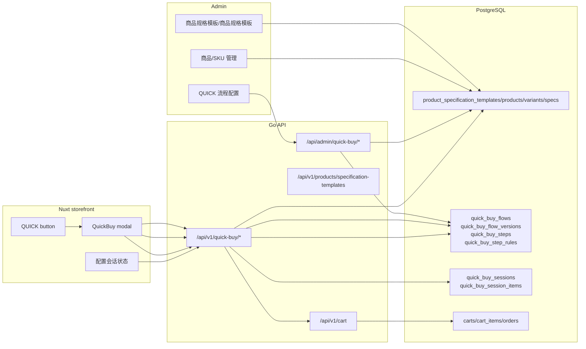

# QUICK 选配流程长期架构

Last updated: 2026-08-10

## 设计结论

QUICK 不是普通的“快速购买按钮”，长期应定位为一个可配置的选配/组装流程。它需要后台专门板块维护流程、步骤、可选类目、筛选规则、兼容规则、发布版本和后续装配结果。普通 settings 只能继续保存入口开关和按钮文案，不能承载步骤和业务规则。

核心边界：

- 商品、商品规格模板、规格字段、SKU、价格和库存仍归商品目录所有。
- QUICK 流程只引用商品目录事实，不重新定义一套商品分类。
- 选配兼容、步骤顺序、可选范围和成品装配规则属于 QUICK 域。
- 前台只展示流程和收集选择，不在 Nuxt 中判断关键兼容性、价格事实或库存事实。
- 用户完成选配后，应保存一个版本化配置快照，再转成购物车/订单事实。

当前实现直接复用现有商品目录和 QUICK candidates 查询，flow 不复制商品分类、市场范围或语言范围。

## 当前代码状态

当前 QUICK 入口链路：

```text
GradientDockMenu
  -> QuickBuy.vue
  -> useQuickBuyFlow()
  -> GET /api/v1/quick-buy/flows/current
  -> useQuickBuySession()
  -> GET /api/v1/quick-buy/sessions/:token/steps/:step_key/candidates
```

关键文件：

| 文件 | 当前职责 | 当前缺口 |
| --- | --- | --- |
| `nuxt-i18n/app/components/GradientDockMenu.vue` | Dock 上的 QUICK 按钮和弹窗开关 | 读取 published flow，不保存流程配置 |
| `nuxt-i18n/app/components/QuickBuy.vue` | 按 published flow 渲染步骤、商品候选和选择后加入购物车 | 购物车仍是临时本地加购，还缺 assembly group |
| `nuxt-i18n/app/composables/useQuickBuyFlow.ts` | 读取 published QUICK flow | 后续可补 flow/step 文案翻译协议 |
| `nuxt-i18n/app/composables/useQuickBuySession.ts` | 创建 session、保存选择、读取 step candidates | 还缺 token 持久化和 reopen 恢复 |
| `nuxt-i18n/app/utils/quickBuy/types.ts` | QUICK flow/session 类型 | 还未表达跨步骤规则结果和装配组 |
| `go-backend/internal/domain/quickbuy/` | flow、version、step、session 领域模型 | 后续可补兼容规则和 assembly group |
| `go-backend/internal/service/quick_buy_service.go` | 读取 flow、解析全局 locale、生成候选和保存 session | 还缺 add-to-cart assembly group |
| `go-backend/internal/api/v1/quickbuy/handler.go` | 公开 QUICK flow/session/candidates API | 还缺 add-to-cart assembly group |
| `go-backend/internal/repository/product_query_repository.go` | 商品公开查询与 QUICK 候选查询 | QUICK candidates 已按 step 绑定的 product specification template IDs、active variant 和库存过滤 |
| `go-backend/web/admin/src/views/ProductSpecificationTemplates.vue` | 商品规格模板/商品规格模板管理 | 可作为 QUICK 步骤可选类目的事实来源 |

当前弹窗不再根据旧默认步骤或 settings 自行推断商品。它只读取 published QUICK flow 的步骤，再创建或复用 QUICK session，通过 `GET /api/v1/quick-buy/sessions/:token/steps/:step_key/candidates` 获取该步骤候选商品；没有 published flow 时不展示任何内置步骤，Admin 新建 flow 也不会预生成业务步骤。

实现进展：

- 后端已新增 `quick_buy_flows / quick_buy_flow_versions / quick_buy_steps / quick_buy_step_product_specification_templates / quick_buy_step_filters / quick_buy_compatibility_rules / quick_buy_sessions / quick_buy_session_items`。
- 已新增公开读取接口 `GET /api/v1/quick-buy/flows/current`，以及后台管理接口 `/api/admin/quick-buy/*`。
- 已移除 `settings.quick-buy` 作为 QUICK 的第二套配置来源；入口是否展示由 published flow 是否存在且启用决定。
- 后台已新增 `QUICK 选配流程` 板块，第一阶段可维护 flow 草稿、步骤顺序和每一步绑定的商品规格模板。
- 后端已提供 `POST /api/admin/quick-buy/flow-versions/:version_id/validate`，发布前会以结构化校验结果检查步骤、选择边界、商品规格模板引用和已停用商品规格模板。
- 后端已提供后台候选预览 `POST /api/admin/quick-buy/flow-versions/:version_id/preview`，用于发布前查看某个 step 的真实候选商品。
- 后端已提供 public session 和候选接口：`POST /api/v1/quick-buy/sessions`、`GET /api/v1/quick-buy/sessions/:token`、`GET /api/v1/quick-buy/sessions/:token/steps/:step_key/candidates`、`PATCH /api/v1/quick-buy/sessions/:token/selections`、`POST /api/v1/quick-buy/sessions/:token/validate`。
- 前台 QUICK 弹窗按 flow 的步骤创建/复用 QUICK session 并读取后端候选；用户选择商品后更新 session。没有 published flow 时不会退回旧的本地商品搜索。

## 概念边界

### 商品目录事实源

商品目录回答“有哪些商品可以卖，以及商品有什么规格”：

- `product_specification_templates`
- `product_specification_template_translations`
- `product_spec_definitions`
- `products`
- `product_variants`
- `product_spec_values`
- `product_variant_option_values`
- media、价格、状态、基础库存字段

QUICK 不应复制这些事实。QUICK 只保存对 `product_specification_template_id`、`spec_definition_id`、`product_id`、`variant_id` 的引用，以及流程层面的规则。

### QUICK 流程事实源

QUICK 回答“用户按什么路径完成一次装配”：

- 有哪些流程，比如 `wheelset-build`、`upgrade-kit`、`maintenance-kit`
- 每个流程有哪些版本
- 每个版本有哪些步骤
- 每一步可选哪些商品规格模板
- 每一步允许单选、多选、数量选择还是自动推荐
- 不同步骤之间有哪些兼容规则
- 完成后如何生成购物车组、套装或询价单

### 配置会话事实源

配置会话回答“某个用户这一次选了什么”：

- 选择发生在哪个流程版本
- 每一步选择了哪个商品/variant/数量
- 当时的价格、重量、规格快照
- 兼容性校验结果
- 是否已加购、下单、废弃或过期

配置会话不能只存在浏览器本地状态。只要后续要做询价、客服承接、恢复配置、订单追踪或售后，就必须有后端会话和快照。

## 目标架构



## 数据链路

### 后台发布链路

```text
管理员编辑 QUICK 流程草稿
  -> 选择步骤和可选商品规格模板
  -> 选择每一步筛选条件和兼容规则
  -> 后端校验引用的商品规格模板、规格字段、商品状态
  -> 保存 draft version
  -> 后台预览候选商品和兼容结果
  -> 发布为 published version
  -> 失效 QUICK 流程缓存
  -> 前台下一次读取新版本
```

发布必须是版本化的。用户已经开始的选配会话继续绑定旧版本，不能因为后台改了步骤导致用户购物车或订单解释不了。

### 前台运行链路

```text
用户点击 Dock QUICK
  -> Nuxt 请求当前入口和发布时间窗内的 published QUICK flow
  -> 渲染步骤导航、提示、选择模式
  -> 进入某一步
  -> 创建或复用绑定 flow_version_id 的 QUICK session
  -> 请求 /quick-buy/sessions/:token/steps/:step_key/candidates
  -> Go 根据 step.product_specification_template_ids、step.filters、库存和全局 storefront context 裁决候选商品
  -> 用户选择 product/variant/quantity
  -> Nuxt 提交选择到 QUICK session
  -> Go 后端保存选择快照并运行兼容校验
  -> 返回下一步状态、冲突提示、价格/重量汇总
  -> 用户完成全部必选步骤
  -> Go 后端生成配置快照
  -> 加入购物车为一个 assembly group
```

### 加购与下单链路

长期推荐使用“购物车装配组”，不要把整套配置压成一个不可解释的单行商品：

```text
quick_buy_session
  -> validate latest stock/price/compatibility
  -> create cart assembly group
  -> create child cart items for selected variants
  -> store quick_buy_session_id / flow_version_id on cart group
  -> checkout
  -> order assembly group + order item snapshots
```

原因：

- 客户可以看到每个部件和数量。
- 库存、发货、售后、退换货仍能落到具体 SKU。
- 后台可以知道这笔订单来自哪个 QUICK 流程版本。
- 后续若要做“成品套装价”，也能在 group 层记录折扣，而不破坏 SKU 明细。

## 建议数据模型

第一版可以从较少表开始，但字段命名和关系要为长期留空间。

### `quick_buy_flows`

流程主表。

```text
id
slug
name
description
entry_surface
is_enabled
sort_order
created_at
updated_at
```

示例：

- `wheelset-build`
- `component-upgrade`
- `maintenance-kit`

### `quick_buy_flow_versions`

流程版本表。

```text
id
flow_id
version_number
status            -- draft / published / archived
published_at
published_by
starts_at
ends_at
created_at
updated_at
```

规则：

- 同一 flow 同一时间只能有一个有效 published version。
- session、cart、order 必须记录 `flow_version_id`。
- 发布后原则上不可原地修改，只能创建新 draft version。

### `quick_buy_steps`

版本下的步骤表。

```text
id
flow_version_id
step_key
name
description
help_text
sort_order
selection_mode      -- single / multiple / quantity / auto
is_required
min_select
max_select
default_quantity
allow_skip
created_at
updated_at
```

`step_key` 是业务稳定标识，例如：

- `rim`
- `hub`
- `spoke`
- `nipple`
- `accessory`
- `review`

不要用数字步骤当长期业务 key。排序可以变，key 要稳定。

### `quick_buy_step_product_specification_templates`

步骤允许的商品规格模板。

```text
id
step_id
product_specification_template_id
is_primary
sort_order
```

它只引用 `product_specification_templates.id`。商品规格模板名称、图片、翻译继续来自商品目录。

### `quick_buy_step_filters`

步骤默认筛选条件。

```text
id
step_id
filter_type       -- spec / price / stock / featured / tag / manual_product
spec_definition_id
operator          -- eq / in / range / exists
value_json
sort_order
```

第一阶段可以只支持 `product_specification_template_id` 和简单 `spec in`，但表结构不要把未来的规格、价格、市场条件堵死。

### `quick_buy_compatibility_rules`

跨步骤兼容规则。

```text
id
flow_version_id
rule_key
rule_type         -- exact_match / allowed_matrix / required_with / incompatible_with / computed
source_step_key
source_spec_key
target_step_key
target_spec_key
rule_json
severity          -- error / warning / info
message_key
is_enabled
sort_order
```

示例：

- hub 的 brake type 必须匹配 rim 的 brake type。
- freehub 规格决定 cassette/driver 可选项。
- spoke length 可能来自计算器结果，不应靠标题匹配。
- 某些 accessory 只能随 tubeless 方案推荐。

兼容规则必须由后端执行。Nuxt 可以做即时提示，但不能成为唯一校验点。

### `quick_buy_sessions`

用户一次选配会话。

```text
id
session_token
flow_id
flow_version_id
locale
market_country
currency
anonymous_id
user_id
status            -- active / completed / added_to_cart / ordered / abandoned / expired
validation_status -- valid / warning / invalid
subtotal_snapshot
weight_snapshot_g
metadata_json
expires_at
created_at
updated_at
```

### `quick_buy_session_items`

会话里的每一步选择。

```text
id
session_id
step_id
step_key
product_id
variant_id
quantity
unit_price_snapshot
currency_snapshot
weight_snapshot_g
product_snapshot_json
variant_snapshot_json
sort_order
created_at
updated_at
```

快照是为了让后续客服、订单和售后能解释“当时用户选的是什么”。下单时仍要做实时价格和库存确认。

## API 边界

### 公开接口

QUICK 使用专用公开接口；不再复用 `/settings/quick-buy` 承载入口、步骤或商品展示配置。

```http
GET /api/v1/quick-buy/flows/current?surface=dock&locale=zh_cn
POST /api/v1/quick-buy/sessions
GET /api/v1/quick-buy/sessions/:token
GET /api/v1/quick-buy/sessions/:token/steps/:step_key/candidates
PATCH /api/v1/quick-buy/sessions/:token/selections
POST /api/v1/quick-buy/sessions/:token/validate
POST /api/v1/quick-buy/sessions/:token/add-to-cart
```

当前已实现到 `validate` 和 `candidates`。`add-to-cart` 需要等待 cart/order 层支持 assembly group 后再接入，避免把一次成品选配拆散成不可追溯的普通购物车明细。

候选商品必须走专用 candidates 接口。客服搜索接口不属于 QUICK flow 的候选事实链路，前端也不应自行按旧分类推断步骤商品。

### 后台接口

```http
GET /api/admin/quick-buy/flows
POST /api/admin/quick-buy/flows
GET /api/admin/quick-buy/flows/:id
POST /api/admin/quick-buy/flows/:id/draft
PUT /api/admin/quick-buy/flow-versions/:version_id
POST /api/admin/quick-buy/flow-versions/:version_id/validate
POST /api/admin/quick-buy/flow-versions/:version_id/publish
POST /api/admin/quick-buy/flow-versions/:version_id/preview
```

后台保存时必须校验：

- 引用的 product specification template 是否存在且启用。
- 引用的 spec definition 是否属于对应 product specification template。
- 步骤 key 是否重复。
- 必选步骤是否至少有一个可售候选。
- 兼容规则引用的步骤和规格是否存在。
- published version 是否会覆盖同一 flow 的已有 published version。

## 后台板块设计

建议后台新增一级或二级入口：“QUICK 选配流程”。

页面分层：

- `QuickBuyFlows.vue`：页面编排、列表、打开编辑器。
- `useQuickBuyAdmin.ts`：数据加载、保存、发布、校验、预览流程。
- `api/quickBuy.ts`：后台 HTTP 协议。
- `QuickBuyFlowEditorDialog.vue`：流程基础信息、版本状态。
- `QuickBuyStepListEditor.vue`：步骤排序、启用、必选、选择模式。
- `QuickBuyStepProductSpecificationTemplatePicker.vue`：从商品规格模板事实源中选择可选类目。
- `QuickBuyStepFilterEditor.vue`：规格/价格筛选。
- `QuickBuyCompatibilityRulesPanel.vue`：跨步骤兼容规则。
- `QuickBuyPreviewPanel.vue`：按当前草稿预览前台候选和校验结果。

不要把 QUICK 配置塞进现有 `SettingsTabsPanel.vue`。settings 页面已经承担站点、支付、API、客服等配置；QUICK 是业务流程管理，复杂度会超过普通键值设置。

## Go 后端职责拆分

建议新增独立 domain/service/repository，而不是继续扩展 `SettingService`。

```text
internal/domain/quickbuy/
  flow.go
  version.go
  step.go
  rule.go
  session.go

internal/repository/
  quick_buy_flow_repository.go
  quick_buy_session_repository.go

internal/service/
  quick_buy_flow_service.go
  quick_buy_publish_service.go
  quick_buy_candidate_service.go
  quick_buy_compatibility_service.go
  quick_buy_session_service.go
  quick_buy_cart_service.go

internal/api/admin/
  quick_buy_handler.go

internal/api/v1/quickbuy/
  handler.go
```

职责边界：

- Flow service：读取、保存、复制 draft、发布版本。
- Candidate service：根据步骤和已选项生成候选商品。
- Compatibility service：执行兼容规则，返回 error/warning/info。
- Session service：保存用户选择和快照。
- Cart service：把 completed session 转成 cart assembly group。

## Nuxt 前台职责

Nuxt 可以做：

- 打开 QUICK 弹窗。
- 读取当前 flow。
- 渲染步骤、候选商品、选择状态、提示。
- 提交选择到 session。
- 展示后端返回的兼容错误和汇总。
- 完成后触发 add-to-cart。

Nuxt 不应做：

- 自行决定商品兼容性。
- 自行重新计算最终价格和库存。
- 自行把多件商品拼成订单结构。
- 用前端本地 steps 作为生产事实源。
- 从商品标题猜测规格或兼容关系。

当前 `QuickBuy.vue` 应逐步拆成：

- `QuickBuyModal.vue`：弹窗框架和步骤导航。
- `QuickBuyStepProducts.vue`：候选商品列表。
- `QuickBuyStepSummary.vue`：当前步骤选择。
- `QuickBuyBuildSummary.vue`：整套配置汇总。
- `useQuickBuyFlow.ts`：读取 flow。
- `useQuickBuySession.ts`：创建/更新/恢复 session。

## 多语言、市场和货币

QUICK 不重复保存默认语言或市场/语言范围。当前 published version 只由 flow、入口和发布时间窗口决定；请求语言、市场和货币来自 storefront context，并在 session 中保存当时的事实。

规则：

- 商品规格模板名称、图片、规格定义翻译来自商品目录。
- QUICK step 的标题、提示、错误文案可以有自己的翻译。
- 价格和货币以 storefront market context 和商品/variant 价格服务为准。
- session 记录当时的 `locale`、`market_country` 和 `currency`。
- 如果某个 locale 没有商品类型翻译，由商品目录自己的 locale fallback 处理；QUICK 不再通过 flow 默认语言覆盖请求事实。
- `market_country`、`locale` 和 `currency` 只属于全局 storefront/session 运行时事实，不参与 flow 或 published version 选择。

## 缓存与失效

建议缓存：

- published flow by surface/time window
- step candidate query by flow_version/step/filters/storefront context
- product specification template list
- compatibility rule compiled form

失效规则：

- 发布 flow version 后清理 QUICK flow cache。
- 商品规格模板启停、规格字段变化后清理相关 candidate cache。
- 商品上下架、variant 库存和价格变化后清理 candidate cache 或使用短 TTL。
- session 不应依赖长缓存，保存后立即读写数据库或短 TTL session cache。

缓存 key 必须包含：

```text
flow_id / flow_version_id / locale / market_country / currency / step_key
```

不要只按 `quick-buy` 一个 key 缓存整套配置，否则多语言、多市场和版本发布会互相污染。

## 行为事件与数据分析

QUICK 应新增明确事件，不要混进普通推荐点击。

建议事件：

- `quick_buy_open`
- `quick_buy_step_view`
- `quick_buy_candidate_impression`
- `quick_buy_candidate_click`
- `quick_buy_selection_add`
- `quick_buy_selection_remove`
- `quick_buy_validation_error`
- `quick_buy_complete`
- `quick_buy_add_to_cart`
- `quick_buy_abandon`

事件 metadata 至少包含：

```text
flow_id
flow_version_id
session_token/hash
step_key
product_id
variant_id
validation_status
```

转化分析链路：

```text
quick_buy_open
  -> step_view
  -> selection_add
  -> complete
  -> add_to_cart
  -> checkout
  -> order
```

订单完成事实仍以后端订单服务为准，不能由 Nuxt 发送 `purchase` 来宣布成交。

## ERP、库存和成品装配

第一阶段可以使用当前商品目录里的 active variant 和 stock 字段做可售过滤。但长期如果 QUICK 代表“选配成品”，必须接入更可靠的库存和装配事实：

- ERP/MES 提供真实库存、预占、交期和可生产状态。
- PLM 或商品规格配置提供可装配规则。
- 下单前必须再次校验库存、价格、交期和兼容性。
- 成品装配单应保留部件明细、工艺/规格快照和版本号。

不要让 QUICK 只生成一堆普通 cart item 后就失去组装关系。至少要在 cart/order 层保存：

```text
assembly_group_id
quick_buy_session_id
flow_version_id
component_role / step_key
compatibility_snapshot
```

## 分阶段落地

### Phase 0：设计收口

- 固定本文档边界。
- 确认 QUICK 是业务流程域，不是 settings JSON。
- 确认商品规格模板是步骤可选分类的事实源。
- 确认首批流程是 wheelset/component/maintenance 中哪一个。

### Phase 1：可配置步骤与商品规格模板筛选

- 新增 QUICK 后台流程和步骤配置。
- 步骤绑定 `product_specification_template_id`。
- 公开接口返回 published flow。
- Nuxt 进入 step 后通过 QUICK candidates 接口获取后端裁决的候选商品。
- 保留当前简单选择和加入购物车能力。

这一阶段解决“后台可定义每一步选什么类目”，但不宣称已经完成成品装配。

当前已超出最初 Phase 1：新 flow 的候选商品已经切到 QUICK 专用 candidates 接口，Nuxt 不再直接按 `product_specification_template` 请求客服商品搜索，也不再保留旧 settings fallback。

### Phase 2：配置会话和兼容校验

- 新增 quick buy session。已完成基础 session、selection item 和快照保存。
- 用户选择保存到后端。已完成按 step 提交选择，并校验商品/variant 可售、商品规格模板是否属于该步骤。
- 候选商品由后端根据 session 的 flow version 和 step product specification templates 生成。已完成 `GET /sessions/:token/steps/:step_key/candidates` 和后台 preview。
- 后端执行基础兼容规则。当前已执行必选步骤、选择数量、库存和商品规格模板边界；跨步骤兼容矩阵仍待实现。
- 弹窗展示冲突、警告和汇总。
- 支持恢复未完成配置。

### Phase 3：装配组和订单快照

- session 转 cart assembly group。
- cart/order 保存 flow version 和组件关系。
- 加入价格、重量、规格快照。
- 订单后台能查看 QUICK 配置明细。

### Phase 4：高级规则、ERP 和推荐候选

- 接入 ERP 库存/交期。
- 接入更细的规格兼容矩阵。
- 支持自动推荐或补齐某些步骤。
- 建立 QUICK 漏斗分析和 A/B 测试。

## 不能做的捷径

- 不要只在 `settings.quick-buy.steps` 里塞 JSON 作为长期方案。
- 不要把 step slug 同时当业务步骤、商品类型和 i18n key。
- 不要复制产品分类，应该引用 `product_specification_templates`。
- 不要在 Nuxt 中写死 Rims/Hubs/Spokes 的长期规则。
- 不要用商品标题或描述推断技术兼容。
- 不要让发布中的流程被原地修改，必须版本化。
- 不要把成品装配丢成几条无关系的购物车商品。
- 不要把前端 `add_to_cart` 事件当成订单转化事实。

## 待确认决策

1. 第一条 QUICK flow 是“轮组装配”还是泛用“快速购买”。
2. 第一版固定几步，是否仍是 5 步。
3. 每一步是否允许多选和数量选择。
4. “成品”在购物车里展示为一个组，还是一个套装父项加组件明细。
5. 首批兼容规则由谁维护，规则颗粒度到 product specification template、spec 还是 variant。
6. 是否允许缺货/预售商品进入候选。
7. 是否需要客服后台读取未完成 QUICK session。
8. 是否需要把 QUICK 配置结果生成询价单而不直接加购物车。
9. 哪些市场/语言首批启用。
10. 发布流程是否需要审核权限。

## 更新规则

后续涉及以下任何变化，都应同步更新本文档：

- QUICK 后台入口或数据表结构。
- QUICK 公开 API 或 session API。
- `QuickBuy.vue` 拆分或数据流改变。
- 商品规格模板、规格定义和 QUICK 步骤之间的绑定方式。
- 购物车/订单中的装配组保存方式。
- ERP 库存、交期或装配单接入。
- 行为事件和漏斗统计口径。
