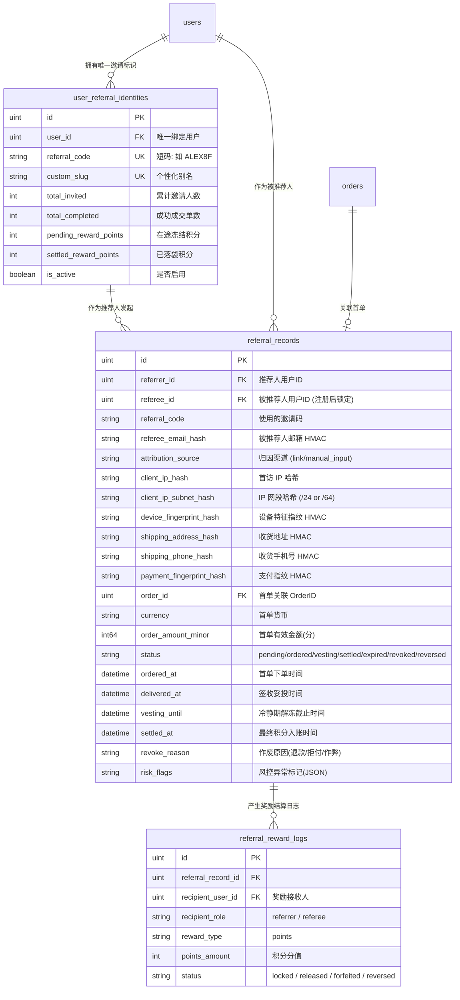
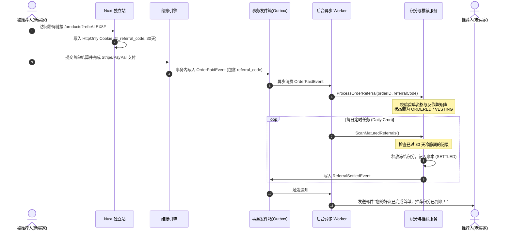
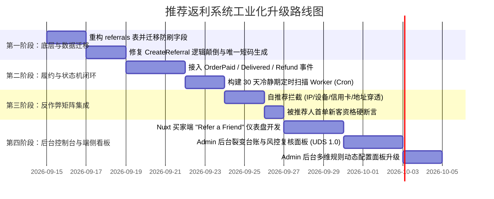

# DTC 高端自行车独立站：长期推荐返利体系 (Referral & Loyalty Reward) 系统架构设计与工程规格书

> **文档状态**: 架构规划规格书 (RFC Architecture Spec)  
> **归属模块**: `docs/design/referral-reward-system-longterm-architecture.md`  
> **对齐标准**: DTC 工业级闭环、防篡改证据链、Fail Loudly 零容忍隐式兜底、ERP UDS 视觉系统规范 (v1.0)  
> **设计目标**: 彻底根除 Phase 25 审计暴露的“推荐逻辑颠倒、遍历抢注套利、发奖代码全面悬空、管理后台零显示与无法配置”严重缺陷；建立对标国际一线骑行品牌（Canyon, Rapha, Hunt Wheels）的健康口碑裂变体系与工业级运营管控中台。

---

## 核心设计哲学与五大支柱

1. **单级双向激励 (Single-Tier Two-Sided)**：不做复杂的金字塔多级传销分销，专注真实骑友圈口碑传播（老客送新客，双方均受益）；
2. **闭环安全归因 (Attribution & Integrity)**：从专属短链/邀请码到首单结账，全程防篡改证据链；
3. **妥投冷静期机制 (Vesting & Cooling-Off)**：严格绑定订单履约妥投状态（Delivered），防范“下单拿返利后立即退款”的资金套利；
4. **Fail Loudly 反作弊熔断 (Anti-Fraud Matrix)**：自推荐、同指纹、同地址交叉穿透即刻拦截并明确报错，禁止静默掩盖；
5. **工业级后台治理 (Industrial Admin Governance)**：管理端提供透明的裂变台账、风控标记穿透、全局策略动态配置与人工审计介入全闭环。

---

## 目录

1. [业务定位与“只涉及”核心边界划分](#1-业务定位与只涉及核心边界划分)
2. [双向激励经济模型 (Two-Sided Incentive Model)](#2-双向激励经济模型-two-sided-incentive-model)
3. [核心数据模型重构 (Data Architecture)](#3-核心数据模型重构-data-architecture)
4. [全生命周期状态机与流转引擎 (State Machine)](#4-全生命周期状态机与流转引擎-state-machine)
5. [防刷套利与反作弊矩阵 (Anti-Fraud Matrix)](#5-防刷套利与反作弊矩阵-anti-fraud-matrix)
6. [事件驱动与事务发件箱架构 (Event-Driven Architecture)](#6-事件驱动与事务发件箱架构-event-driven-architecture)
7. [API 契约与前后端交互规范 (API Contracts)](#7-api-契约与前后端交互规范-api-contracts)
8. [管理后台工业级控制台设计 (Admin Governance UI & Config)](#8-管理后台工业级控制台设计-admin-governance-ui--config)
9. [分阶段落地实施路线图 (Implementation Roadmap)](#9-分阶段落地实施路线图-implementation-roadmap)

---

## 1. 业务定位与“只涉及”核心边界划分

自行车轮组与整车属于高单价（$500 ~ $3,000+）、重决策、高专业度的工业级耐用品。在欧美骑行圈，最有效的真实增长不是廉价低俗的“拼团砍一刀”，而是**资深车友、骑行俱乐部主理人、技师在真实骑行场景下的口碑背书**。

为了确保系统长治久安、工程低维护、财务合规不穿底，确立严格的**“只涉及”**边界：

### ✅ 必须覆盖的“核心范围”：
- **纯粹单级双向激励**：老用户邀请新用户，新用户首单享受优惠，老用户在订单履约无纠纷后获得积分/无门槛抵扣券（Store Credit）。
- **去中心化触达形式**：系统自动生成专属短码（Referral Code）与专属落地短链（Referral Link），支持跨设备 Cookie 归因暂存与结账输入。
- **与订单履约强一致绑定**：深度集成订单支付成功、发货妥投、售后退款、支付拒付（Dispute）事件。
- **冷静期（Vesting Period）资产结算**：订单收货后满 14~30 天无售后退款方可入账，彻底切断“下单拿返利随后退款”的薅羊毛死角。
- **全站自研透明看板**：买家端个人中心具备专属裂变仪表盘；管理端具备风控阻断与关系审计台账。

### ❌ 坚决排除的“过度设计”（不涉及）：
- **不搞多级传销分销（MLM / Multi-tier Affiliate）**：不搞下线拉下线的二代、三代团队提成，避免触碰欧美法域关于传销和商业贿赂的法律监管红线。
- **不搞外部现金提现（No Cash Payout / Stripe Connect）**：不向个人银行卡直接打款，避免陷入复杂的跨国个人所得税代扣代缴（1099-MISC/W-8BEN）与洗钱合规泥潭。所有返利均沉淀为**站内积分（Loyalty Points）或下一单购车抵扣券（Store Credit）**，资金 100% 反哺站内复购。
- **不搞无门槛全员乱推**：未登录用户不能生成代码；被推荐人必须是全平台**首单新客（First-Time Purchaser）**。

---

## 2. 双向激励经济模型 (Two-Sided Incentive Model)

```
       [ 推荐人 (Referrer) ]                                  [ 被推荐人 (Referee) ]
       已有车架/轮组的老客户                                    准备组车/升级的新骑友
                 │                                                      │
                 │ 1. 分享专属链接/码: "ALEX-RIDE"                      │
                 └─────────────────────────────────────────────────────>│
                                                                        │ 2. 访问/注册自动绑定
                                                                        │    立得新客注册礼遇:
                                                                        │    【满 $500 减 $50 专享券】
                                                                        │
                                                                        │ 3. 选购轮组并成功完成首单
                                                                        │    (实付 $1,200)
                                                                        │
                                                                        ▼
                                                             [ 订单发货并签收妥投 ]
                                                                        │
                                                                        │ 4. 触发 30 天质保冷静期 (Vesting)
                                                                        │    期间若全额退款则推荐人返利作废；
                                                                        │    注册积分仅在注册时入账
                                                                        │
                 ┌──────────────────────────────────────────────────────┴
                 │ 5. 冷静期满，无退款/拒付
                 ▼
        【推荐人收益入账】
        获得 1000 会员积分
        (相当于 $50 复购抵扣金)
```

### 推荐规则关键参数矩阵（支持 Admin 动态配置）

| 参数项 | 默认基准值 | 说明 |
| :--- | :--- | :--- |
| **推荐体系全局开关 (Enable Program)** | false（默认关闭） | 一键控制整站推荐与返利活动启用/暂停；管理员发布并开启策略后，登录用户才会看到可用推荐码与分享链接 |
| **被推荐人首单门槛 (Min Order Amount)** | $200 USD | 避免小配件甚至 1 美元虚拟商品刷单套利 |
| **被推荐人注册积分** | 50 积分 | 推荐码绑定成功时直接加入被推荐人的统一积分余额 |
| **推荐人返利积分** | 1000 积分 | 推荐订单满足履约条件后加入推荐人的统一积分余额 |
| **冷静期时长 (Vesting Period)** | 30 天 | 从订单 `delivered_at`（妥投时间）起算；未妥投按发货起 45 天兜底 |
| **邀请码有效期 (Attribution TTL)** | 30 天 | 访客点击专属链接后，Cookie 暂存归因的最长保留天数 |
| **单用户月度推荐上限 (Monthly Cap)** | 10 单 | 防止极端刷子或作弊脚本，超过后触发人工风控复核 |

---

## 3. 核心数据模型重构 (Data Architecture)

现有 `referrals` 表结构严重失真（缺少防刷指纹、无冷静期、无失效时间）。重构后的持久化模型如下：



---

## 4. 全生命周期状态机与流转引擎 (State Machine)

推荐记录必须经历严格的状态机闭环流转，禁止跳跃和逆向篡改：

```
       [ 访客点击链接/填码 ]
                 │
                 ▼
                ( 1. PENDING ) ──────────────> [ 订单/风控事件 ] ───────> ( REVOKED )
                 │
                 │ 买家完成首单支付 (order_paid)
                 ▼
        ( 2. ORDERED )
                 │
                 │ 物流妥投确认 (order_delivered)
                 ▼
        ( 3. VESTING )  <── 冷静期中 (例如妥投后 30 天内)
           (在途冻结)
                 │
         ┌───────┴────────────────────────┐
         │ 冷静期内发生全额退款/拒付       │ 冷静期届满无纠纷
         ▼                                ▼
   ( 4. REVOKED )                   ( 5. SETTLED )
    返利彻底作废                      奖励正式解冻入账
    记录作废审计凭据                  发放 1000 积分并发送邮件
```

### 状态迁移准则
1. **`pending` -> `ordered`**：只有当被推荐人的订单金额满足门槛且完成 `paid` 状态时方可转换。绑定成功后推荐关系永久保留；`attribution_ttl_days` 只限制尚未注册/绑定时的签名 Cookie，不会让已绑定关系自动失效。
2. **`ordered` -> `vesting`**：优先等待物流确认签收（`status = delivered`）并记录 `delivered_at`，系统自动计算 `vesting_until = delivered_at + 30 days`；若超过“未妥投兜底天数”仍没有权威妥投事件，则只按订单发货时间进入兜底冷静期，保持 `delivered_at` 为空并写入审计原因，禁止伪造妥投时间。
3. **`vesting` -> `settled`**：后台 Cron 每天扫描 `vesting_until <= NOW() AND status = 'vesting'` 的记录，单事务内发放订单履约奖励对应的推荐人积分并转为 `settled`；这不涉及被推荐人注册时已经到账的积分。
4. **`*` -> `revoked`**：订单作废、欺诈撤单或争议拒付只影响需要订单履约结算的推荐人奖励状态；它们不会撤回被推荐人在注册时已经到账的积分。关系中的推荐人/被推荐人仍然保留，`revoked` 是该笔订单奖励状态，不是推荐码失效。
5. **注册礼遇积分**：若被推荐人礼遇类型为 `points`，在注册填写推荐码并绑定成功的同一事务内，直接把配置的积分数加到统一积分账户。`referral_referee` 只是流水来源标签，不是独立积分池；后续购买、退款、拒付都不改变这笔注册积分。订单退款若使用过积分，只按订单自身的 `PointsUsed` 返还，和推荐注册积分没有关系。

> 兼容说明：`expired` 状态仅保留给历史数据/旧版本记录的审计展示。当前绑定流程不会因为 `expires_at` 到期而自动迁移到 `expired`，也不会因订单事件给被推荐人补发或收回注册积分。

---

## 5. 防刷套利与反作弊矩阵 (Anti-Fraud Matrix)

自行车高客单价的高额返利极易引来黑客和灰产羊毛党。必须建立严密的防刷安全拦截：

```
┌────────────────────────────────────────────────────────────────────────┐
│                        反作弊综合风控流水线 (Anti-Fraud Pipeline)       │
└────────────────────────────────────────────────────────────────────────┘
                                    │
    [ 1. 自我推荐拦截 ] ────────────┼─> 推荐人 UserID == 当前买家 UserID
                                    ├─> 推荐人注册邮箱 == 当前结账邮箱
                                    │
    [ 2. 身份重叠穿透 ] ────────────┼─> 收货地址 Hash 与推荐人历史地址一致
                                    ├─> 收货手机号与推荐人一致
                                    ├─> 支付信用卡账单姓名/卡号指纹一致
                                    │
    [ 3. 环境与指纹碰撞 ] ──────────┼─> 注册/下单设备指纹与推荐人历史指纹一致
                                    ├─> 同一 IP 网段 24 小时内超过 3 次新客绑定
                                    │
    [ 4. 资格单向锁定 ] ────────────┼─> 买家历史已有已支付成功的订单 (非首单)
                                    ├─> 买家已被其他推荐人永久绑定 (不可覆盖)
                                    │
                                    ▼
                         【 违背任意一项：大声报错 】
                    抛出 ErrSelfReferralForbidden / ErrRefereeNotEligible
```

---

## 6. 事件驱动与事务发件箱架构 (Event-Driven Architecture)

为了保证营销系统不阻塞结账与支付主路径，且保证数据最终一致性，推荐返利全面接入 **Outbox 事务发件箱总线**：



---

## 7. API 契约与前后端交互规范 (API Contracts)

### 7.1 买家端 API 接口 (Storefront API)

#### 1. 获取我的邀请码与推广概况
- **Endpoint**: `GET /api/v1/customer/referral/me`
- **Auth**: 需要买家 JWT Token
- **Response**:
  ```json
  {
    "code": 0,
    "data": {
      "enabled": true,
      "referral_code": "ALEX8F",
      "custom_slug": "alex-gravel",
      "share_url": "https://tanzanite.com/r/ALEX8F",
      "reward_rules": {
        "min_order_amount_minor": 20000,
        "referrer_reward_points": 1000,
        "referee_benefit_type": "points",
        "referee_benefit_value": 75,
        "vesting_period_days": 30,
        "attribution_cookie_ttl_days": 30
      },
      "stats": {
        "total_invited_count": 12,
        "successful_orders_count": 5,
        "pending_reward_points": 2000,
        "settled_reward_points": 3000
      }
    }
  }
  ```

#### 2. 查询我的邀请好友进度明细
- **Endpoint**: `GET /api/v1/customer/referral/history?page=1&page_size=10`
- **Response**:
  ```json
  {
    "code": 0,
    "data": {
      "items": [
        {
          "id": 108,
          "referee_name_mask": "J***n D*e",
          "status": "vesting",
          "status_desc": "等待收货质保期结束 (还剩 18 天)",
          "order_date": "2026-09-01T14:30:00Z",
          "potential_reward_points": 1000,
          "vesting_until": "2026-10-15T00:00:00Z"
        }
      ],
      "total": 1
    }
  }
  ```

#### 3. 校验邀请码有效性 (结算页或领券入口)
- **Endpoint**: `POST /api/v1/customer/referral/validate`
- **Request**:
  ```json
  {
    "referral_code": "ALEX8F"
  }
  ```
- **Response (成功)**:
  ```json
  {
    "code": 0,
    "data": {
      "valid": true,
      "referrer_name_mask": "Alex ***",
      "referee_benefit_type": "points",
      "referee_benefit_value": 75,
      "benefit_issuance": "points_on_registration",
      "min_order_amount_minor": 20000,
      "vesting_period_days": 30,
      "attribution_cookie_ttl_days": 30
    }
  }
  ```

#### 4. 注册后绑定推荐码
- **Endpoint**: `POST /api/v1/customer/referral/bind`
- **Auth**: 需要买家 JWT Token
- **Request**（用户在注册表单中手动填写推荐码时）：
  ```json
  {
    "referral_code": "ALEX8F"
  }
  ```
- `referral_code` 为空时，接口继续读取分享链接写入的 HttpOnly 归因 Cookie；两种入口最终使用同一套签名、反作弊和幂等校验。Cookie 的 TTL 只作用于绑定前，绑定成功后记录中的 `expires_at` 仅作为签名过期时间审计快照，不会触发关系失效。
- 当策略的 `referee_benefit_type=points` 时，绑定成功的同一事务会把 `referee_benefit_value` 加入被推荐人的统一积分余额，并写一条 `source=referral_referee` 的流水；该积分不建立独立余额，不因后续消费、购买、退款、拒付或推荐记录状态变化而冲正。
- 注册接口本身不创建登录会话；Nuxt 注册表单暂存手动填写的推荐码，在注册后的首次登录（邮箱或 Google）调用此接口完成绑定。

---

### 7.2 管理后台 API 接口 (Admin Management API)

#### 1. 推荐裂变台账多维查询 (含风控预警)
- **Endpoint**: `GET /api/admin/marketing/referrals?status=vesting&page=1&page_size=20&keyword=ALEX8F&from=2026-09-01&to=2026-09-30`
- `from` / `to` 使用 UTC 日历日期（`YYYY-MM-DD`）；两端均包含，服务端将 `to` 转换为次日 00:00 的 exclusive upper bound。列表、统计概览和 CSV 导出使用同一筛选条件。
- **Auth**: 管理员 JWT，需具备 `marketing:read` 权限
- **Response**:
  ```json
  {
    "code": 0,
    "data": {
      "overview": {
        "total_referrals": 142,
        "converted_orders": 86,
        "attributed_gmv_minor": 12845000,
        "pending_vesting_points": 18000,
        "settled_points": 68000,
        "fraud_blocked_count": 9
      },
      "items": [
        {
          "id": 501,
          "referral_code": "ALEX8F",
          "referrer": {
            "id": 204,
            "name": "Alex Mercer",
            "email_masked": "a***@gravelcyclist.org"
          },
          "referee": {
            "id": 1088,
            "name": "David Hansen",
            "email_masked": "d***@ridetrail.com"
          },
          "order": {
            "id": 4022,
            "order_number": "TZ-20260901-8841",
            "amount_minor": 185000,
            "paid_at": "2026-09-01T10:15:00Z",
            "delivered_at": "2026-09-08T16:20:00Z"
          },
          "reward_points": 1000,
          "status": "vesting",
          "vesting_until": "2026-10-08T16:20:00Z",
          "days_remaining": 25,
          "risk_flags": [
            { "type": "ip_match", "level": "LOW", "source": "referrer_paid_order", "dimensions": ["ip_subnet"] }
          ],
          "created_at": "2026-09-01T09:40:12Z"
        }
      ],
      "total": 1
    }
  }
  ```

#### 2. 管理员手动提前解冻发放 (Manual Settle)
- **Endpoint**: `POST /api/admin/marketing/referrals/:id/settle`
- **Request**:
  ```json
  {
    "reason": "VIP customer offline verification completed"
  }
  ```

#### 3. 管理员风控阻断作废 (Manual Revoke)
- **Endpoint**: `POST /api/admin/marketing/referrals/:id/revoke`
- **Request**:
  ```json
  {
    "reason": "Suspected credit card cycling & matching delivery address"
  }
  ```

#### 4. 获取与更新推荐返利全局策略配置
- **Endpoint**: `GET /api/admin/marketing/referral-config`
- **Endpoint**: `PUT /api/admin/marketing/referral-config`
- **Payload**:
  ```json
  {
    "expected_version": 1,
    "enabled": true,
    "min_order_amount_minor": 20000,
    "referrer_reward_points": 1000,
    "referee_benefit_type": "points",
    "referee_benefit_value": 50,
    "vesting_period_days": 30,
    "undelivered_fallback_days": 45,
    "attribution_ttl_days": 30,
    "monthly_cap_per_referrer": 10,
    "anti_fraud_mode": "strict"
  }
  ```

---

## 8. 管理后台工业级控制台设计 (Admin Governance UI & Config)

> **严格对齐《ERP UDS 视觉系统规范 (v1.0)》**：工业感无边框大圆角、`border-dashed` 细微点缀、大胶囊按钮、绝对严禁静默吞错。

现有后台在积分模块仅仅提供了一个单用户流水输入框（`LoyaltyPanel.vue`）和几行生硬文本框（`LoyaltyProgramSettingsPanel.vue`），**无法查看推荐人与被推荐人网络关系、无从得知在途冷静期返利、更无法动态调控活动规则**。

必须在后台 `Marketing.vue` 模块中新增与重构两大工业级子面板：

```
Marketing 营销管理模块 (ModuleTabbedLayout)
├── 优惠券管理 (Coupons)
├── 会员等级 (Levels)
├── 积分与流水 (Loyalty & Ledger)
└── ★ 推荐裂变中台 (Referral Hub)  <-- [新增核心独立 Tab]
    ├── 子视图 1: 裂变台账与风控审计 (Referral Audit Ledger)
    └── 子视图 2: 裂变经济模型与规则配置 (Referral Program Settings)
```

---

### 8.1 子视图 1：裂变台账与风控审计 (Referral Audit Ledger)

用于运营主管与风控人员实时监控全站老带新数据链路、追溯首单真伪、核验在途冷静期与处理异常阻断。

```
┌────────────────────────────────────────────────────────────────────────────────────────┐
│ [模块页眉]  rounded-[32px]  border-dashed  bg-muted/5                                   │
│   REFERRAL NETWORK AUDIT & RISK CONTROL                                                │
│   推荐裂变全链路台账与风控审计                                                         │
│   实时监控老带新订单转化、冷静期冻结资产及反作弊多维特征碰撞                           │
└────────────────────────────────────────────────────────────────────────────────────────┘

┌─────────────────┬─────────────────┬─────────────────┬─────────────────┬────────────────┐
│ 累计裂变订单    │ 裂变转化 GMV    │ 在途冷静期冻结  │ 已落袋结算积分  │ 拦截风控刷单   │
│ 86 单           │ $128,450.00     │ 18,000 pts      │ 68,000 pts      │ 9 单           │
│ +12% 本月环比   │ 均客单 $1,493   │ 涉及 18 笔订单  │ 兑换复购率 41%  │ [CRITICAL 标记]│
└─────────────────┴─────────────────┴─────────────────┴─────────────────┴────────────────┘

┌──[操作与筛选工具栏]  rounded-[24px]  border-dashed ────────────────────────────────────┐
│ [搜索框: 邀请码 / 邮箱 / 订单号]  [状态: 全部 / 30天冷静期 / 已结算 / 已作废 / 异常标记]   │
│ [时间范围选择器]                                         [刷新按钮]  [导出 CSV 台账]   │
└────────────────────────────────────────────────────────────────────────────────────────┘

┌──[裂变关系全透明台账 Table] ───────────────────────────────────────────────────────────┐
│ 邀请码   │ 推荐人 (Referrer) │ 被推荐新客 (Referee) │ 首单编号 / 实付    │ 冷静期 / 状态   │ 风控特征 │ 操作列     │
├──────────┼───────────────────┼──────────────────────┼────────────────────┼─────────────────┼──────────┼────────────┤
│ ALEX8F   │ Alex Mercer       │ David Hansen         │ TZ-20260901-8841   │ 剩 25 天        │ 无异常   │ [查看详情] │
│          │ UID: #204         │ UID: #1088           │ $1,850.00 (USD)    │ [ALERT:VESTING] │ CLEAN    │ [提前解冻] │
├──────────┼───────────────────┼──────────────────────┼────────────────────┼─────────────────┼──────────┼────────────┤
│ SPEED99  │ Mike Chen         │ Kevin Chen           │ TZ-20260903-1002   │ 立即作废        │ 同地址   │ [风控阻断] │
│          │ UID: #412         │ UID: #1290           │ $2,400.00 (USD)    │ [CRITICAL:REVOK]│ 同信用卡 │ [查看审计] │
└────────────────────────────────────────────────────────────────────────────────────────┘
```

#### 视觉与交互规范细节 (UDS 1.0)
1. **模块级页眉**：
   - 样式：`rounded-[32px] border-dashed border-border/60 bg-muted/5 p-6 backdrop-blur-sm`
   - 一级标题：`text-lg font-black tracking-tighter italic uppercase`
   - 辅助描述：`text-[9px] font-black uppercase tracking-widest opacity-60`
2. **5 联数据概览卡 (Metric Cards)**：
   - 容器：`rounded-[24px] border-dashed border-border/60 bg-card p-4 relative overflow-hidden`
   - 顶部光晕：`absolute inset-0 bg-gradient-to-br from-primary/5 via-transparent pointer-events-none`
   - 标题：`text-[10px] font-black uppercase tracking-widest text-muted-foreground/60`
   - 数值：`text-2xl font-black font-mono tracking-tight`
3. **状态徽章 (Status Badge)**：
   - `VESTING` (冷静期)：`rounded-full h-5 text-[8px] font-mono bg-amber-500/10 text-amber-600 border border-amber-500/20`
   - `SETTLED` (已解冻入账)：`rounded-full h-5 text-[8px] font-mono bg-emerald-500/10 text-emerald-600 border border-emerald-500/20`
   - `REVOKED` (已作废)：`rounded-full h-5 text-[8px] font-mono bg-rose-500/10 text-rose-600 border border-rose-500/20 animate-pulse`
4. **风控碰撞穿透弹窗 (Risk Signals Inspector Modal)**：
   - 容器：`rounded-[32px] border-none shadow-2xl p-6 bg-card`
   - 展示推荐人与被推荐人的多维特征对比表：
     - `注册 IP / 首访 IP` 对比与网段一致性
     - `浏览器与硬件指纹 (FingerprintJS)` 碰撞检测
     - `收货地址物理距离与文本 Levenshtein 相似度`
     - `Stripe/PayPal 支付持卡人姓名与卡指纹对比`
   - 底部操作：`rounded-full h-11 font-black text-[10px] uppercase tracking-widest` 大胶囊按钮，支持一键人工阻断（需二次确认）。

---

### 8.2 子视图 2：裂变经济模型与规则配置 (Referral Program Settings)

重构现有生硬的 `LoyaltyProgramSettingsPanel.vue`，使其具备真正的工业级运营调控能力：

```
┌────────────────────────────────────────────────────────────────────────────────────────┐
│ [页眉]  REFERRAL INCENTIVE POLICY & RULES CONFIG                                       │
│   推荐返利经济模型与全局规则控制台                                                     │
│   动态调控老带新门槛、双向奖励面额、妥投冷静期时长与反作弊敏感度                       │
└────────────────────────────────────────────────────────────────────────────────────────┘

┌──[分组一：活动总控与参与门槛] ─────────────────────────────────────────────────────────┐
│ • 推荐返利系统总开关: [ Switch: 开启 (ON) ]                                            │
│ • 被推荐人首单最低实付金额: [ 20000 分 ]                                              │
│   (说明: 严格排除 $10 补差价链接或气嘴帽等小额刷单套利)                               │
│ • 单用户每月最高成功返利单量: [ 10 单 ]                                                │
│   (说明: 防止灰产或职业羊毛党使用脚本机器刷单)                                         │
└────────────────────────────────────────────────────────────────────────────────────────┘

┌──[分组二：双向激励面额配置] ───────────────────────────────────────────────────────────┐
│ • 推荐人每单奖励分值: [ 1000 积分 ]                                                   │
│ • 被推荐人注册奖励分值: [ 50 积分 ]                                                   │
│ • 推荐积分直接进入统一积分余额，不建立独立推荐积分钱包                              │
└────────────────────────────────────────────────────────────────────────────────────────┘

┌──[分组三：履约冷静期与归因窗口 (核心财务安全防线)] ────────────────────────────────────┐
│ • 冷静期解冻时长 (天): [ 30 天 ]                                                       │
│ • 冷静期起算依据: [ 单选锁定: 必须以订单物流状态 DELIVERED (妥投签收) 时间戳为准 ]     │
│ • 未妥投兜底最长等待天数: [ 45 天 ] (防止物流掉件死锁)                                 │
│ • 专属短链 Cookie 归因追踪有效期 (天): [ 30 天 ]                                       │
└────────────────────────────────────────────────────────────────────────────────────────┘

┌──[分组四：自动化反作弊风控熔断规则] ───────────────────────────────────────────────────┐
│ • [✓] 严格拦截自我推荐 (同 UserID / 同注册邮箱即刻拒绝)                                │
│ • [✓] 严格拦截收货地址与手机号碰撞 (同地址视为自刷单)                                  │
│ • [✓] 开启浏览器硬件指纹 (FingerprintJS) 穿透比对                                      │
│ • [✓] 同一 IP 网段 24 小时内限制最多生成 3 笔有效绑定                                  │
└────────────────────────────────────────────────────────────────────────────────────────┘

┌──[底栏操作栏]  rounded-[24px] ─────────────────────────────────────────────────────────┐
│ 当前规则生效版本: v1.4-PROD (上次修改者: admin_alex / 2026-09-10)                      │
│                                           [重置为默认值]   [★ 保存并发布新版本规则]    │
└────────────────────────────────────────────────────────────────────────────────────────┘
```

#### 表单控件标准与交互规范 (UDS 1.0)
1. **表单控件**：
   - 所有的数字输入框、选择框统一使用 `h-12 rounded-2xl border-none bg-muted/50 px-4 text-sm font-bold`。
   - 所有的说明文字采用微缩设计：`text-[9px] font-black uppercase tracking-widest opacity-60`。
2. **主保存按钮**：
   - 采用大胶囊设计：`rounded-full h-11 px-8 font-black text-[10px] uppercase tracking-widest bg-primary text-primary-foreground shadow-lg hover:shadow-primary/25 transition-all`。
3. **版本化与防并发覆盖**：
   - 保存时强校验 `version` 乐观锁，若后台已有其他管理员提交新配置，触发 `Fail Loudly` 报错拦截，禁止静默覆盖。

### 8.3 当前实施状态（2026-09-16）

本架构的后台治理部分已经进入代码实现，而不是仅停留在页面草图：

- Admin 已提供推荐台账、状态筛选/关键词搜索、分页、统计、详情、风控信号、状态迁移审计和 CSV 导出；
- Admin 已提供推荐规则配置页，支持启停、订单资格门槛、推荐人/被推荐人积分、妥投冷静期、未妥投兜底、归因 TTL、月度上限和反作弊模式；
- 配置通过 `expected_version` 进行乐观锁发布，每次发布生成不可变的新策略版本，默认策略保持关闭；
- 支付、妥投、退款/拒付、生命周期扫描、推荐人结算、被推荐人奖励和审计迁移均使用事务与幂等键；
- 推荐积分礼遇在注册绑定时到账并进入统一积分余额，后续订单退款/拒付不会冲正这笔注册积分；推荐模块不创建、不发放、不检查任何优惠券。
- 推荐绑定会保存邮箱、完整 IP 哈希、IP `/24`（IPv4）或 `/64`（IPv6）网络哈希和设备指纹哈希；严格模式会阻断同邮箱自推荐、同设备碰撞和 24 小时同网段超过 3 次的有效绑定，监控模式会保留风险标记。
- 支付完成事件会从已保存的网关响应中提取 provider fingerprint 的 HMAC，并与推荐人的历史已支付交易比较；收货地址支持精确匹配和 Levenshtein 相似度风险标记。原始邮箱、地址、设备、支付指纹不会写入推荐表或后台响应。
- 旧 `referrals` 表通过迁移 `295_referral_legacy_import` 幂等导入 v2 身份、记录和奖励日志，并保留 `legacy_referral_id` 作为内部审计映射；迁移不会删除旧表。
- 买家端会员中心提供独立的“分享推荐码 / Invite a friend”按钮。按钮只分享后台返回的 `share_url`，不会复用商品分享函数，也不会拼接当前商品 URL；浏览器不支持原生分享时仅回退到复制该邀请链接。
- 推荐码分配与邀请链接展示由独立的 `ReferralInvitationService` 负责。当前 Provider 生成 `/r/{code}` 捕获链接；后续接入短链平台时只替换 `ReferralInvitationLinkProvider`，不改变用户已有推荐码、归因 Cookie 或绑定关系。
- Nuxt 将 `/r/**` 以不缓存代理转发到后端捕获接口；捕获接口写入签名 HttpOnly 归因 Cookie 后再跳转到 storefront，避免邀请链接绕过统一归因和反作弊绑定流程。

上线前仍需完成一项运营与财务确认：

1. 在生产环境完成真实物流妥投、退款和支付拒付事件的联调，确认事件键与权威时间戳来源符合本规格书；确认无误后再将 `referral_lifecycle_enabled` 和当前推荐策略显式开启。生产配置目前仍保持关闭，避免未联调的奖励自动入账。

被推荐人注册成功后，推荐积分直接进入整体积分账户，与购买商品所得积分、签到积分等完全同质；系统只在流水上记录 `referral_referee` 来源，绝不建立“推荐积分余额”，消费也不按来源扣减。用户使用统一积分和现金下单时，退款只返还该订单实际使用的 `PointsUsed`，现金只按支付网关实际支付金额退款；注册时赠送的推荐积分不会因为这笔订单、订单退款或推荐台账状态变化而被冲正。推荐模块不计算、不分摊任何退款金额。

---

## 9. 分阶段落地实施路线图 (Implementation Roadmap)

本方案设计完全兼容现有数据库与积分底座，实施状态如下。日期路线图仍保留为历史计划，不能替代生产验收：

| 阶段 | 状态 | 已完成/剩余 |
| --- | --- | --- |
| 底层与数据迁移 | 已完成代码实现 | v2 表、幂等状态机、反作弊字段和旧 `referrals` 导入迁移已存在；上线前需在生产副本执行并核对导入数量 |
| 履约与状态机闭环 | 已完成代码实现 | 支付、妥投、退款、拒付 Outbox 和生命周期扫描已接入；生产 Cron 与真实事件联调仍关闭待验收 |
| 反作弊矩阵 | 已完成核心规则 | 用户/邮箱/IP 网段/设备/地址/支付指纹规则已接入；支付网关是否提供可比较 fingerprint 需在各渠道联调确认 |
| 后台与买家端 | 已完成基础版本 | 台账、配置、审计、买家端看板和按创建时间范围筛选已可用；完整证据对比视图属于后续 UI 增强 |

### 9.1 推荐生产上线顺序（代码完成后的验收闸门）

1. **先做生产副本演练**：备份数据库，在副本按顺序执行 294、295 迁移；核对旧 `referrals` 总数、成功导入数、跳过的重复被推荐人数量和奖励日志数量，并保存审计结果。
2. **再做事件回放验收**：在 staging 使用真实支付、妥投、订单退款和拒付样例回放 Outbox，确认事件键幂等、统一积分余额正确、注册推荐积分不被订单事件冲正，现金退款金额也不受推荐积分影响。退款金额的计算与支付网关对账属于支付模块，不属于推荐积分规则。
3. **影子风控观察**：保持 `referral_lifecycle_enabled=false` 或推荐策略关闭，先以 `anti_fraud_mode=monitor` 运行观测窗口，检查邮箱、设备、IP 网段、地址和支付指纹命中率及误报。
4. **小流量启用**：完成财务、客服和风控签字后，先只开启严格限定比例/人群的推荐策略；每日核对台账、GMV、冻结积分、结算积分、冲正流水和拒付结果。
5. **扩大范围或回滚**：连续观察周期无异常后再扩大流量；任何现金金额偏差、重复入账或无法解释的风控命中，立即关闭推荐策略并保留事件与审计数据，不删除历史记录。



---

> **结语**：此规格书将推荐系统从过去的“单向传参、漏洞百出、履约悬空、后台不可控”的草稿状态，彻底升格为一套**闭环、防刷、财务安全、且具备完整工业级管理控制台**的长期增长资产。
