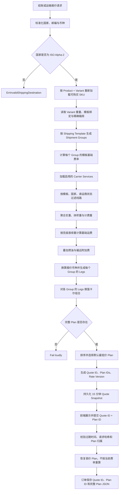

# 运输报价、线路计划与锁价架构

Last updated: 2026-09-11

## Status

Active architecture note. 本文描述当前结账运输报价的事实来源、执行顺序和修改约束。
旧的 `selected_carrier_service_id`、单线路整票报价以及归档目录中的运输拆分报告均不是当前契约。
代码与本文不一致时，以通过测试的当前代码为准，同时必须在同一次修改中更新本文。

## 1. 目标与边界

本架构负责从结账地址和商品明细生成可选择的运输计划，并把用户选择的计划锁定到订单：

- 校验目的国家格式和可服务范围；
- 从数据库重新解析可购买的 Product、SKU/Variant、重量、运费模板和箱规；
- 按运输模板形成 Shipment Group；
- 为每个 Group 计算模板费率及适用承运商线路；
- 聚合实重、体积重、计费重、燃油附加费和偏远附加费；
- 将多个 Group 的线路组合成完整 Quote Plan；
- 把报价保存为短期不可变快照；
- 在结账和下单时按 Quote ID + Plan ID 恢复锁价结果；
- 把最终计划完整保存到订单，供履约、审计和排障使用。

本架构不负责物流轨迹同步、发货状态机、税费、优惠券、积分或支付渠道处理。这些模块可以消费报价结果，不能重新实现运费计算。

## 2. 核心术语

| 名称 | 含义 | 关键约束 |
| --- | --- | --- |
| Shipping Template | 商品或 Variant 绑定的运费模板 | 决定 weight、quantity、price 等计价类型及地区规则 |
| Shipping Rule | 模板内的地区和数值区间费率 | `min_value/max_value` 只负责选中区间，不定义首续重阶梯 |
| Carrier Service | 承运商的一条具体线路 | 定义服务国家、首重克数、续重克数、体积重模式和附加费 |
| Packaging Rule | Product/Variant 的箱规 | Variant 规则优先于 Product 默认规则 |
| Shipment Group | 使用同一 Shipping Template 的商品集合 | 一个 Group 最终对应 Quote Plan 中的一条 Leg |
| Quote Leg | 一个 Group 的一次可执行运输选择 | 可以是承运商线路，也可以是明确的模板费率 Leg |
| Quote Plan | 覆盖全部 Shipment Group 的完整方案 | 用户只能选择完整 Plan，不能只选择其中一条 Carrier Service |
| Shipping Quote | 当前请求下全部 Plan、默认 Plan、商品分摊和展示价格 | 新报价生成 Quote ID、Rate Version 和过期时间 |
| Quote Snapshot | 服务端持久化的短期锁价快照 | 有效期内恢复原始 Plan，不读取当前费率重新计算 |

关系如下：

```text
Shipping Quote
├── Plan A
│   ├── Group 1 -> Leg A1
│   └── Group 2 -> Leg A2
├── Plan B
│   ├── Group 1 -> Leg B1
│   └── Group 2 -> Leg A2
└── Selected Plan
```

## 3. 端到端流程



### 3.1 请求入口

当前入口包括：

- `POST /api/v1/checkout/quote`：登录结账报价，同时计算商品、运费、税费和优惠；
- `POST /api/v1/shipping/quote`：公开运输报价入口；
- `POST /api/admin/shipping/quote`：后台运费计算器。

结账和下单时，客户端选择字段是：

```json
{
  "shipping_quote_id": "quote-uuid",
  "selected_quote_plan_id": "plan-uuid"
}
```

禁止重新引入 `selected_carrier_service_id`。一个购物车可能被拆成多个 Shipment Group，完整 Plan 中可以有多条 Carrier Service，单个线路 ID 无法表达整单选择。

### 3.2 目的地校验

国家使用 ISO 3166-1 Alpha-2 大写代码。国家格式和国家是否被费率支持是两类错误：

- 格式不是两个 ASCII 字母：`ErrInvalidShippingDestination`；
- 格式正确，但没有匹配规则且模板没有正数默认运费：`ErrCountryNotSupported`。

地区匹配支持：

- 单一国家代码；
- JSON 或分隔符国家列表；
- `EU`/`EU27` 和 `EEA`；
- `*`、`ALL`、`GLOBAL`、`WORLDWIDE`；
- 空地区，表示全局适用。

不能把未知地区宏当作全局，也不能在国家无规则时返回零运费。

### 3.3 商品、Variant 与箱规

报价不信任客户端传入的价格、重量和模板。`QuoteCart` 根据 Product ID 和 Variant ID 调用 `FindPurchasableVariant`，重新得到：

- 实际可购买 Variant；
- Variant 当前有效价格和币种；
- Variant 重量；
- Variant 优先、Product 兜底的 Shipping Template；
- Product + Variant 对应的 Packaging Rule。

箱规选择顺序固定为：

1. Variant 专属箱规；
2. Product 默认箱规；
3. 无箱规。

缺少 Variant 重量或 Shipping Template 必须中止报价。无箱规不等于商品重量为零；实重仍参与计算。体积重线路如何处理缺失箱规见下一节。

### 3.4 Shipment Group 与重量聚合

使用同一 Shipping Template 的商品进入同一 Group。Group 保存商品索引、商品金额、数量和总实重。

单项计费实重：

```text
item_charge_weight_grams = variant_weight_grams + packaging_weight_grams
group_actual_weight_grams = sum(item_charge_weight_grams * quantity)
```

配件或某个商品缺少体积尺寸时，不能让整个 Group 的实重消失：

- `actual_weight`：使用 Group 总实重；
- `volumetric_weight`：任一商品缺少完整尺寸时，该承运商 Leg 不可用；
- `greater_of_actual_and_volumetric`：有尺寸的商品使用体积重，缺尺寸的商品保留实重，再和完整 Group 实重取较大值。

体积重使用厘米和承运商 `volumetric_divisor`，结果向上取整为克。

### 3.5 克级首续重计费

首重和续重的唯一事实来源是 Carrier Service：

- `first_weight_grams`；
- `additional_weight_grams`；
- `min_charge_weight_grams`。

`ShippingRule.min_value/max_value` 只选择费率区间，不能替代上述字段。

计费重先按线路阶梯向上取整：

```text
base_weight = max(charge_weight_grams, min_charge_weight_grams)

if base_weight <= first_weight_grams:
    billable_weight = first_weight_grams
else:
    units = ceil((base_weight - first_weight_grams) / additional_weight_grams)
    billable_weight = first_weight_grams + units * additional_weight_grams
```

续重单位使用纯整数克运算：

```text
if value_grams <= first_weight_grams:
    additional_units = 0
else:
    additional_units =
        (value_grams - first_weight_grams + additional_weight_grams - 1)
        / additional_weight_grams

fee = rule.fee + additional_units * rule.additional
```

示例：

| 实重 | 首重 | 续重 | 续重单位 |
| ---: | ---: | ---: | ---: |
| 800g | 500g | 500g | 1 |
| 1000g | 500g | 500g | 1 |
| 1010g | 500g | 500g | 2 |
| 110g | 100g | 100g | 1 |
| 11g | 10g | 10g | 1 |

只要重量规则的 `additional > 0`，首重和续重必须都是正数。后台创建/更新 Carrier Service 时会拒绝损坏配置；运行时再次校验，避免绕过服务层的数据造成静默低收。

禁止恢复基于 `math.Ceil(value - rule.MinValue) - 1` 的 1kg 硬编码公式，也禁止用浮点公斤直接计算 10g/100g/500g 阶梯。

### 3.6 地区规则、默认费率与免费运输

模板先按国家和计价值选择 Shipping Rule。计价值由模板类型决定：

- `weight`：Group 计费重量，单位 kg，仅用于规则区间匹配；
- `quantity/items`：Group 商品数量；
- `price/amount`：Group 商品金额。

规则匹配条件为 `value >= min_value`，且 `max_value == 0` 或 `value <= max_value`。

没有规则时：

- 模板有正数 `default_fee`：使用明确的默认费率；
- 没有国家规则且默认费率不为正：`ErrCountryNotSupported`；
- 国家存在但数值区间不匹配且默认费率不为正：`ErrShippingRateUnavailable`。

显式命中的零费率规则属于合法免费运输，不能和“未找到规则”混为一谈。模板免邮门槛在模板源币种中判断。

### 3.7 Carrier Leg 生成

Carrier Service 必须同时满足以下条件才会成为候选 Leg：

- Carrier Service 已启用；
- 关联 Carrier 已启用；
- 关联 Shipping Template 已启用；
- Service 的 Template ID 与当前 Group 相同；
- 目的国家命中 Service 的国家范围；
- 币种、重量阶梯和体积重配置有效。

单条 Leg 的最终费用：

```text
leg_shipping_fee = base_fee + fuel_surcharge + remote_surcharge
fuel_surcharge = base_fee * fuel_surcharge_percent / 100
```

偏远附加费只在邮编命中配置规则时应用。邮编规则支持精确值、尾部 `*` 前缀、闭区间和 JSON 对象形式。

一个 Group 没有适用 Carrier Service 时，可以生成一条 `billing_mode = template` 的明确模板费率 Leg。该 Leg 的 Carrier ID 和 Carrier Service ID 保持为零，不能伪造为某个承运商线路。

### 3.8 多模板 Quote Plan

每个 Shipment Group 都会得到一个或多个候选 Leg。完整 Plan 是每个 Group 各选一条 Leg 的笛卡尔组合。

例如 Group A 有 `A1/A2`，Group B 有 `B1/B2`，系统生成：

```text
A1 + B1
A1 + B2
A2 + B1
A2 + B2
```

组合数上限为 128。超过上限返回 `ErrShippingRateConfigurationInvalid`，不能静默截断，否则用户可能看不到最低价或唯一可履约方案。

Plan 运费是所有 Leg 运费之和。预计时效使用最慢 Leg 的最大值。Plan 按总运费、最大时效和稳定线路键排序，第一条是新报价默认 Plan。

每条 Leg 的运费按模板类型分摊回商品：重量模板按计费重量，数量模板按数量，金额模板按商品金额；最后一项吸收 MinorUnits 舍入差额，保证商品分摊之和等于 Plan 运费。

### 3.9 多币种与 MinorUnits

运费模板、规则和 Carrier Service 都有自己的源币种。实际订单运费统一换算到商品订单币种：

- 价格型规则和免邮门槛先换算到模板源币种再判断；
- 模板基础费和线路附加费换算到订单报价币种；
- 汇率缺失返回 `ErrShippingRateUnavailable`，不能把源金额当成目标金额；
- 所有金额按币种 MinorUnits 舍入，不假设所有币种都是两位小数。

展示币种价格来自已存储的 Display Price Snapshot。多 Leg Plan 只有在所有正运费 Leg 都有该展示币种快照时才提供合计展示价；不允许用部分 Leg 的展示价冒充整单价格。

### 3.10 报价快照与锁价

新报价生成：

- UUID Quote ID；
- 每个 Plan 的 UUID；
- Plan 内容哈希 `rate_version`；
- UTC `expires_at`，当前有效期 15 分钟；
- 完整 Quote JSON。

请求哈希覆盖：

- 国家；
- 标准化邮编；
- 订单币种和展示币种；
- Product ID、Variant ID、Template ID；
- 数量、单价和重量。

恢复报价时按顺序校验：

1. Quote Snapshot 存在；
2. 当前时间严格早于 `expires_at`；
3. 当前请求哈希与快照一致；
4. Quote JSON 可解析；
5. Quote ID 和 Rate Version 与数据库元数据一致；
6. Selected Plan ID 属于该 Quote。

有效快照恢复的是原始锁价 Plan。即使管理员在报价后修改模板、规则、汇率或 Carrier Service，快照有效期内也不能根据当前配置重算。商品、数量、价格、重量、模板、国家、邮编或币种变化则必须重新报价。

前端在地址、邮编、商品或币种变化时清空 Quote ID 和 Plan ID。同一个 Quote 内切换 Plan 时必须同时提交原 Quote ID 和目标 Plan ID。

### 3.11 下单持久化

公开下单请求强制要求 `shipping_quote_id` 和 `selected_quote_plan_id`。订单保存：

- `shipping_quote_id`；
- `shipping_quote_plan_id`；
- `shipping_plan_snapshot`，即完整 Selected Plan JSON；
- 最终 `shipping_fee` 和订单币种。

只有 Plan 恰好包含一条真实 Carrier Leg 时，订单顶层 `carrier_id` 和 `carrier_service_id` 才会赋值。多 Leg Plan 的顶层承运商字段必须为空，完整履约事实从 `shipping_plan_snapshot` 读取。

订单不能只保存一个可变外键后在履约时重新读取当前线路配置，否则历史运费、路线名称和附加费无法审计。

## 4. 错误语义

| 错误 | 含义 | Public API 语义 |
| --- | --- | --- |
| `ErrInvalidShippingDestination` | 国家格式无效 | 400 |
| `ErrCountryNotSupported` | 国家无规则且无默认费率 | 422 `country_not_supported` |
| `ErrShippingRateUnavailable` | 区间、汇率或可用费率缺失 | 422 `shipping_rate_unavailable` |
| `ErrShippingRateConfigurationInvalid` | 首续重、币种、组合数或快照结构损坏 | 500，配置问题不得伪装成用户错误 |
| `ErrShippingQuoteExpired` | Quote 不存在或已过期 | 409 `shipping_quote_stale` |
| `ErrShippingQuoteStale` | 地址、币种或商品事实已改变 | 409 `shipping_quote_stale` |
| `ErrShippingQuotePlanUnavailable` | Plan 不属于 Quote 或选择参数不完整 | 422 `shipping_quote_plan_unavailable` |

处理原则是 fail loudly。禁止在错误情况下返回零运费、任意默认线路或旧客户端传入的总额。

## 5. 文件所有权

| 文件 | 唯一职责 |
| --- | --- |
| `go-backend/internal/domain/shipping/rating/destination.go` | 国家标准化与地区匹配 |
| `go-backend/internal/domain/shipping/rating/weight.go` | 纯整数克阶梯、计费重和体积重公式 |
| `go-backend/internal/domain/shipping/rating/money.go` | MinorUnits 舍入 |
| `go-backend/internal/domain/shipping/quote_snapshot.go` | Quote Snapshot 持久化模型 |
| `go-backend/internal/service/shipping_quote_types.go` | Quote、Plan、Leg 及输入 DTO |
| `go-backend/internal/service/shipping_quote_service.go` | 报价应用服务和 Group 构建 |
| `go-backend/internal/service/shipping_quote_routes.go` | Carrier Service 过滤、Leg 生成和完整 Plan 组合 |
| `go-backend/internal/service/shipping_quote_pricing.go` | 模板、规则、重量与源币种计价 |
| `go-backend/internal/service/shipping_quote_display_prices.go` | 展示价格快照聚合 |
| `go-backend/internal/service/shipping_quote_postal_code.go` | 邮编标准化和偏远地区匹配 |
| `go-backend/internal/service/shipping_quote_planner.go` | Plan 汇总、排序、选择和商品费用分摊 |
| `go-backend/internal/service/shipping_quote_snapshot.go` | 请求哈希、Rate Version、快照创建和恢复 |
| `go-backend/internal/repository/shipping_quote_repository.go` | Quote Snapshot 数据访问 |
| `go-backend/internal/service/checkout_service.go` | 用当前商品事实调用运输报价，并汇入结账总额 |
| `go-backend/internal/service/order_create_service.go` | 校验锁价结果并写入订单运输快照 |
| `go-backend/migrations/267_shipping_quote_plans.*.sql` | 快照表和订单 Quote/Plan/JSON 字段 |

`shipping_admin.go` 只保留模板 CRUD 与后台录入币种准备，不能再承载公开报价编排。物流追踪代码也不能依赖或复制上述计费函数。

## 6. 数据库契约

`shipping_quote_snapshots`：

```text
id             varchar(36) primary key
request_hash   char(64) not null
rate_version   char(64) not null
quote_data     jsonb not null
expires_at     timestamptz not null
created_at     timestamptz not null
```

`orders` 新增：

```text
shipping_quote_id       varchar(36)
shipping_quote_plan_id  varchar(36)
shipping_plan_snapshot  jsonb not null default '{}'
```

订单不对短期 Snapshot 建外键，因为过期快照可以在未来被清理，而订单中的 Plan JSON 是长期审计事实。当前代码阻止过期快照继续使用，并由 `ShippingQuoteCleanupScheduler` 按批次物理删除已过期 Snapshot；清理器只能删除短期快照，不能修改订单快照。清理任务由 `worker.shipping_quote_cleanup_enabled` 控制，间隔和批量上限分别由 `shipping_quote_cleanup_interval_seconds`、`shipping_quote_cleanup_batch_limit` 配置。

## 7. 修改守则

任何运输报价修改都必须遵守以下约束：

1. 新增影响报价身份的输入时，同步加入 `shippingQuoteRequestHash`。
2. 新增影响 Plan 结果的字段时，确保字段进入持久化 Quote JSON 和 `rate_version`。
3. 重量阶梯只能在 `domain/shipping/rating` 中实现，并使用整数克。
4. `min_value/max_value` 只能选费率区间，不能重定义 Carrier Service 首续重。
5. 所有 Group 必须被完整 Plan 覆盖，不能只返回购物车中最便宜的一条局部线路。
6. 不得把多 Leg Plan 写成单一订单 Carrier Service。
7. 有效快照必须恢复锁价内容，不能因为当前配置变化而重算。
8. 国家、汇率或配置错误必须显式返回 typed error，不能退化为零运费。
9. 金额必须按订单币种 MinorUnits 舍入，不能固定两位小数。
10. 修改 API 字段时必须同时更新 Checkout、Order、Admin Calculator 和 Storefront composable。
11. 修改迁移时必须同步维护 `267_shipping_quote_plans_contract_test.go`。
12. 修改本文描述的行为时，代码、测试和本文必须在同一次变更中更新。

## 8. 排障顺序

报价错误时按以下顺序排查，避免从前端价格显示反向猜测：

1. 确认请求国家、邮编、币种、Quote ID 和 Plan ID。
2. 确认 Product/Variant 当前可购买，Variant 有正数克重和有效 Shipping Template。
3. 确认 Variant 专属箱规与 Product 默认箱规的优先级结果。
4. 确认商品按预期 Template ID 分组，Group 实重包含所有商品和包装重量。
5. 确认模板规则命中国家和数值区间，或存在明确正数默认费率。
6. 确认 Carrier、Carrier Service、Template 均启用且国家范围匹配。
7. 检查 `first_weight_grams`、`additional_weight_grams`、`min_charge_weight_grams` 和体积重除数。
8. 分别记录 actual、volumetric、charge 和 billable weight，不要只看最终费用。
9. 检查模板/规则/线路源币种及汇率缓存，不允许跨币种静默回退。
10. 检查每个 Group 的候选 Legs 和笛卡尔组合数。
11. 若是锁价恢复，查询 Snapshot 的请求哈希、过期时间、Quote JSON 和 Plan 归属。
12. 若订单金额异常，检查订单的 Quote ID、Plan ID 和 `shipping_plan_snapshot`，不要用当前线路配置还原历史运费。

常用数据库检查：

```sql
SELECT id, request_hash, rate_version, expires_at, created_at
FROM shipping_quote_snapshots
WHERE id = '<quote-id>';

SELECT id, order_number, shipping_quote_id, shipping_quote_plan_id,
       shipping_fee, currency, shipping_plan_snapshot
FROM orders
WHERE order_number = '<order-number>';
```

## 9. 回归测试

关键测试覆盖：

- 500g、100g、10g 首续重和整数向上取整；
- 缺失线路重量阶梯时拒绝保存和报价；
- ISO 国家格式、EU/EEA 和无支持国家 fail loudly；
- Variant 箱规优先级、实重与体积重聚合；
- 多模板多线路生成完整笛卡尔 Plan；
- Plan 选择必须属于 Quote；
- 后台改价后有效 Quote 仍恢复原锁价；
- 商品变化和过期 Quote 被拒绝；
- 多币种换算、Display Price Snapshot 和 MinorUnits；
- 订单保存 Quote ID、Plan ID 和完整 Plan JSON；
- 迁移包含快照表及订单字段，并按正确顺序回滚。

修改后至少执行：

```powershell
cd go-backend
go test ./...

cd web/admin
npm run typecheck

cd ../../../nuxt-i18n
npx vue-tsc --noEmit
```

## 10. 架构不变量速查

```text
用户选择 = Quote Plan，不是 Carrier Service
一个 Shipment Group = 一个 Shipping Template = Plan 中一条 Leg
一个 Quote Plan = 覆盖全部 Groups 的完整线路组合
首续重来源 = Carrier Service 的克字段
规则 Min/Max = 费率区间，不是重量阶梯
有效 Quote Snapshot = 锁价事实，不按当前配置重算
多 Leg 订单 = 保存完整 Plan JSON，顶层 Carrier 字段为空
错误配置或无支持国家 = 显式失败，绝不返回静默零运费
```
