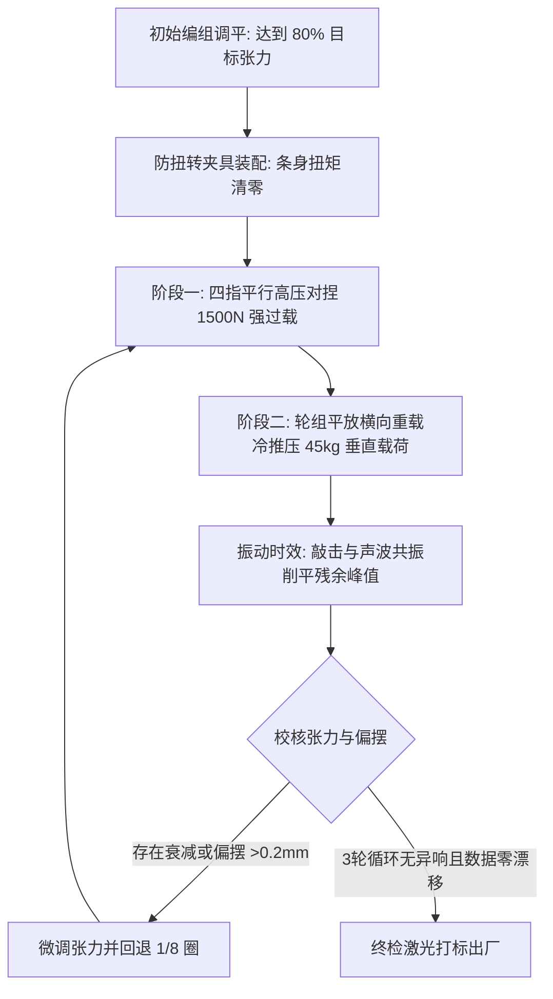

# 🔬 轮组应力释放与不锈钢微观位错力学工程设计白皮书

> **文档版本**: `v1.0-Release`  
> **适用领域**: 轮组制造工艺、材料力学仿真、高精度辐条张力稳定化规范  
> **核心原则**: 严禁将轮组偏摆简单归结为“辐条拉长”，必须从**金属微观位错塞积、接触面微塑性咬合、135% 预应变饱和与动应力振动时效**等材料学底层建立工程控制标准。

---

## 目录
1. [认知纠偏：轮组衰减的材料学真相](#一-认知纠偏轮组衰减的材料学真相)
2. [微观机理：冷拔奥氏体不锈钢的晶体缺陷](#二-微观机理冷拔奥氏体不锈钢的晶体缺陷)
3. [四大应力释放源与数学物理模型](#三-四大应力释放源与数学物理模型)
4. [三大材料学物理稳定化手段](#四-三大材料学物理稳定化手段)
5. [SAPIM 官方材料力学参数与疲劳寿命对账](#五-sapim-官方材料力学参数与疲劳寿命对账)
6. [135% 预载过应变的材料学临界窗口](#六-135-预载过应变的材料学临界窗口)
7. [工业级轮组车间应力释放 SOP 规范](#七-工业级轮组车间应力释放-sop-规范)

---

## 一、 认知纠偏：轮组衰减的材料学真相

在传统轮组组装中，普遍存在一个严重的经验主义误区：**“新轮组骑几十公里后偏摆，是因为不锈钢辐条被车手体重拉长了。”**

### 材料力学校核
奥氏体不锈钢（如 AISI 302 / 304 / Sandvik T302）冷拔加工后的抗拉屈服强度 $\sigma_{0.2}$ 通常在 **$1000 \sim 1400\text{ MPa}$**。  
以一根截面积 $A \approx 1.6\text{ mm}^2$ 的 SAPIM CX-Ray 扁辐条为例：
- 轮组额定工作张力 $T_{work} = 1200\text{ N}$；
- 辐条工作拉应力：
  $$\sigma_{work} = \frac{T_{work}}{A} = \frac{1200\text{ N}}{1.6\text{ mm}^2} = 750\text{ MPa}$$
- 应力水平仅为材料屈服强度的 **$53\% \sim 60\%$**，完全处于**纯胡克定律线性弹性区间（Hookean Elastic Region）**。

在骑行交变载荷（$800\text{ N} \sim 1400\text{ N}$）下，金属本体**绝不可能发生宏观塑性屈服拉伸**。

真实导致轮组张力骤降、动平衡失调的物理本质是：**晶体内部可动位错滑移引发的“室温微观蠕变”**与**装配接触面微观粗糙峰的冷挤压咬合**。

---

## 二、 微观机理：冷拔奥氏体不锈钢的晶体缺陷

高端辐条制造经过高达 $70\% \sim 85\%$ 的大压下量冷拔拉丝和二次冷锻打扁，微观晶体结构呈现以下非平衡态特征：

```
┌─────────────────────────────────────────────────────────────┐
│             冷拔不锈钢辐条微观晶体状态                      │
├─────────────────────────────────────────────────────────────┤
│ 1. 极高位错密度：ρ ≈ 10¹¹ ~ 10¹² cm⁻²                       │
│ 2. 大量未钉扎的自由可动位错 (Mobile Dislocations)           │
│ 3. 晶格严重畸变，储存了极高的内应变能 (Stored Strain Energy)│
│ 4. 奥氏体(γ相)部分转变为硬脆的形变诱发马氏体(α'相)         │
└─────────────────────────────────────────────────────────────┘
```

### 室温微观蠕变（Room-Temperature Micro-Creep）
在恒定拉应力作用下，即使外加应力远低于宏观屈服极限 $\sigma_{0.2}$，材料内部局部处于应力集中的自由位错（Frank-Read 源）仍会在热激活与微观剪应力作用下克服障碍向前滑移。  
对于长度 $L = 260\text{ mm}$ 的辐条：
$$\Delta L_{creep} = \epsilon_{creep} \cdot L \approx 0.0002 \times 260\text{ mm} = 0.052\text{ mm}$$
虽然只有 **$52\ \mu\text{m}$** 的不可逆微塑性伸长，但在轮圈的高刚度约束下，根据刚度系数 $k = \frac{EA}{L}$，会导致张力直接跌落 **$150\text{ N} \sim 250\text{ N}$**！

---

## 三、 四大应力释放源与数学物理模型

新编轮组内部潜伏的残余应力可解构为 4 个物理分量：

### 1. 辐条弹性扭转剪切应力（Torsional Windup）——【占比 ~70%】
拧紧条帽时，螺纹干摩擦系数 $\mu \approx 0.25 \sim 0.35$，条帽对条身施加扭矩 $M_t$。  
辐条产生扭转角 $\theta_t = \frac{M_t L}{G I_p}$。在未释放状态下，条身宛如一根被拧紧的扭簧。  
骑行振动使静摩擦转为动摩擦，条身发生反弹自旋复位，导致螺纹回退，张力瞬间骤降。

### 2. 几何接触面的微观粗糙峰塑性咬合（Contact Bedding）
- 条帽球面与车圈孔座之间的点接触面；
- 弯头半球与花鼓法兰沉头孔之间的咬合面。  
金属微观粗糙峰接触应力超过屈服极限，产生冷塑性压溃，形成 $0.03 \sim 0.08\text{ mm}$ 轴向间隙。

### 3. 弯头成型残余应力松弛（J-Bend Residual Stress）
弯头冷弯 $90^\circ$ 时内弯受压、外弯受拉。在拉伸力矩偏置下，弯头发生弯矩自适应矫正（Bending Relaxation）。

### 4. 加工硬化相变应变场均化（Phase Transformation Strain）
形变诱发马氏体与奥氏体相界处的应力集中在交变外力下重新排布。

---

## 四、 三大材料学物理稳定化手段

```
┌─────────────────────────────────────────────────────────────┐
│                 材料学三大晶体稳定化物理手段                │
├─────────────────────────────────────────────────────────────┤
│ 1. 机械预载过应变 (Pre-Straining) ➔ 位错塞积卡死 (饱和硬化) │
│ 2. 振动时效均化 (Vibratory Relief) ➔ 削平局部残余应变峰值   │
│ 3. 低温应变时效 (Strain Aging) ➔ 柯氏气团强力钉扎位错       │
└─────────────────────────────────────────────────────────────┘
```

### 1. 机械预载过应变法（Pre-Straining / Dislocation Pinning）
- **物理机理**：向辐条施加高于工作应力 $25\% \sim 35\%$ 的静态拉力（达到 $135\% T_{work}$）；
- **位错演变**：自由位错在超临界剪应力驱动下迅速滑移并相互交截，形成不可逆的 **Lomer-Cottrell 塞积锁（位错胞壁）**；
- **微观弹性极限跃升**：材料的微观屈服极限 $\sigma_{0.0001}$ 被人为拉高到过载应力线。此后在 $\le T_{work}$ 的骑行载荷下，微观塑性蠕变率降为 **绝对零**！

### 2. 振动时效均化技术（Vibratory Stress Relief, VSR）
- **物理机理**：在静态拉伸状态下叠加高频微幅脉冲振动（$50 \sim 200\text{ Hz}$）；
- **动应力叠加**：
  $$\sigma_{max} = \sigma_{static} + \sigma_{dynamic} + \sigma_{residual}$$
  瞬间超载促使残余应力最高峰处的晶格发生局部微屈服流动，将内部残余畸变能释放 $80\%$ 以上，实现应力场全局平滑均化。

### 3. 低温应变时效处理（Low-Temperature Strain Aging）
- **处理窗口**：$250^\circ\text{C} \sim 350^\circ\text{C}$，保温 30~60 min；
- **柯氏气团（Cottrell Atmosphere）**：碳、氮间隙原子快速向位错线周围扩散聚集，将位错牢牢“锚定”，彻底消灭松弛倾向并提升抗疲劳极限 $20\% \sim 30\%$。

---

## 五、 SAPIM 官方材料力学参数与疲劳寿命对账

比利时 SAPIM 官方技术白皮书公布的核心材料学实测数据：

| 辐条型号 | 几何截面规格 (mm) | 抗拉强度极限 $\sigma_b\ (\text{N/mm}^2)$ | 单根绝对断裂力 (N) | 官方疲劳测试循环寿命 | 材料微观特性 |
| :--- | :--- | :--- | :--- | :--- | :--- |
| 👑 **CX-Ray** | 0.9 × 2.2 (扁椭圆) | **1600** (高抗拉) | 2600 ~ 2800 N (270 kgf) | **3,500,000 次 (350万)** | 多道次高压冷锻，超强抗疲劳 |
| 🌟 **Race** | 2.0 - 1.8 - 2.0 (双抽) | 1350 (中高抗拉) | 2900 ~ 3100 N (305 kgf) | 890,000 次 (89万) | 经典双抽变径，韧性均衡 |
| ⚙️ **Leader** | 2.0 (等径圆条) | 1080 (基础抗拉) | 3300 ~ 3500 N (345 kgf) | **400,000 次 (仅40万)** | 粗条刚度过高，交变应力幅过大 |

### 逆直觉材料学现象解析：为什么 CX-Ray 细扁条疲劳寿命是粗等径条的近 9 倍？
根据交变应变幅公式：
$$\Delta\sigma = E \cdot \Delta\epsilon = E \cdot \frac{\Delta L_{rim}}{L}$$
在车圈受路面冲击产生固定位移 $\Delta L_{rim}$ 时：
- 粗条（Leader 2.0mm）横截面刚度大，吸收全部应变能，产生巨大的交变应力幅 $\Delta\sigma$，晶格迅速萌生微裂纹；
- CX-Ray 扁条截面仅 $1.6\text{ mm}^2$，且中间段具备极宽的微弹性变形容纳能力，大幅衰减了传递至弯头与螺纹根部的应力集中，因而疲劳寿命呈指数级跃升！

---

## 六、 135% 预载过应变的材料学临界窗口

```
[ 0 N ] ─────────────────────────────────────────────────────────────
  │
  │  🟢【日常骑行工作区间】：1000N ~ 1250N (纯弹性 Hookean 响应)
  │
[ 1200 N ] ── (设计工作张力基准 100%)
  │
  │  🟡【黄金应力释放与位错钉扎区间】：1500N ~ 1700N (125% ~ 135% 过载)
  │     • 越过微观屈服门槛 (Micro-Yield)，钉死全部自由位错
  │     • 彻底耗尽金属室温蠕变潜力
  │     • 仅占 SAPIM CX-Ray 极限抗拉(2600N)的 62%，绝对安全
  │
[ 1800 N ] ── (碳纤维车圈辐条孔座拉脱临界安全线)
  │
  │  🔴【不可逆破坏区】：> 2000N 车圈孔座受拉分层破坏；> 2600N 辐条拉断
```

**工程结论**：
以 $1200\text{ N}$ 为基准的 **$135\%$ 过载（$\approx 1620\text{ N} / 165\text{ kgf}$）**，恰好处于“能彻底钉死位错”、“完全咬合接触面”、且“与碳圈破损极限保持 $20\%$ 以上安全裕度”的**绝对力学黄金窗口**。

---

## 七、 工业级轮组车间应力释放 SOP 规范

为确保每一组出厂轮组达到“终身免调圈、衰减率 $<1\%$”的军工级标准，必须严格执行以下 4 步工序：



1. **装配防扭（Zero-Windup）**：圆辐条必须执行“过拧 $1/4$ 圈、回退 $1/8$ 圈”；扁辐条全程使用防自转夹具卡死；
2. **两轮四指平行对捏（Parallel Kneading）**：对捏相邻交叉辐条对，施加瞬间 $1500\text{ N}$ 强拉力；
3. **轮组横向冷推压（Lateral Cold Bedding）**：平放于软质台面，双手施加约 $45\text{ kg}$ 身体垂直重量对称下压，听到金属咬合“噼啪”声后翻面重复；
4. **精调与重复循环**：重复上述过程 3 次，直至施加侧向重载时**无任何声响、偏摆变化量 $\le 0.05\text{ mm}$、张力衰减率 $\le 0.8\%$**，方可出厂。