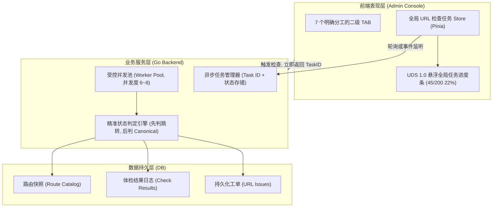

# 后台 URL 管理域架构定位、缺陷治理与性能重构指南

> **文档定位**：本规范是后台 **URL 管理域 (`/urls/*`)** 的权威架构指南与问题修复蓝图。明确该领域的核心职责方向，全面梳理当前在**计算逻辑**、**视图呈现**以及**性能交互（盲测失联/切 TAB 丢失）**上的深层缺陷，并提供标准化的技术重构落地方案。

---

## 目录
1. [URL 管理域的核心方向与系统定位](#1-url-管理域的核心方向与系统定位)
2. [当前必须解决的深层问题清单](#2-当前必须解决的深层问题清单)
   - [第一类：业务计算与判定算法缺陷](#第一类业务计算与判定算法缺陷)
   - [第二类：视图呈现与统计口径错乱](#第二类视图呈现与统计口径错乱)
   - [第三类：极端性能慢与“盲测失联”体验缺陷](#第三类极端性能慢与盲测失联体验缺陷)
3. [目标架构与最终技术形态](#3-目标架构与最终技术形态)
   - [后端：受控并发池与异步任务模型](#后端受控并发池与异步任务模型)
   - [前端：全局任务 Store 与 UDS 1.0 工业级进度反馈](#前端全局任务-store-与-uds-10-工业级进度反馈)
   - [指标口径：动态观测与工单生命周期解耦](#指标口径动态观测与工单生命周期解耦)
4. [各 TAB 模块标准化重构落地细节](#4-各-tab-模块标准化重构落地细节)
   - [概览 (Overview.vue)](#概览-overviewvue)
   - [路由台账 (RouteCatalog.vue)](#路由台账-routecatalogvue)
   - [搜索管理 (SearchManagement.vue)](#搜索管理-searchmanagementvue)
   - [问题队列 (Issues.vue)](#问题队列-issuesvue)
   - [重定向规则 (RedirectRules.vue)](#重定向规则-redirectrulesvue)
   - [Canonical 与冲突 (Canonical Mode)](#canonical-与冲突-canonical-mode)
   - [同步与检查 (Operations.vue)](#同步与检查-operationsvue)
5. [开发实施顺序与验收检查表](#5-开发实施顺序与验收检查表)

---

## 1. URL 管理域的核心方向与系统定位

### 1.1 它是什么
URL 管理域是跨境独立站的**前台可访问路径中枢资产台账**、**SEO 准入守门员**与**运行可用性体检系统**：
- **统一路由资产清单**：自动从 Nuxt 3 路由清单、商品系统、Blog 内容系统中提取前台对外暴露的所有 URL；
- **全站可用性自动化巡检**：定期或手动对前台路由进行连通性拨测，抓取 HTTP 状态码、响应耗时、最终重定向地址及 HTML Canonical 标签；
- **SEO 搜索引擎准入控制**：精确维护哪些路由符合 `sitemap.xml` 准入标准，哪些页面允许被站内搜索与 Google 索引；
- **退役路径精准重定向**：对变更、下架或历史 URL 进行 301/308 规则收敛，杜绝死链（404）和流量流失；
- **URL 缺陷工单化处置**：将检测到的 404、重定向链、路径冲突、Canonical 异常转化为可认领、可处理、可抑制、可验证的工单闭环。

### 1.2 它不是什么
- **严禁侵入内容编辑**：它不是文章编辑器、不是商品详情编辑器，不负责修改商品标题或博客正文；
- **严禁替代域名与 DNS**：它只管理站点内部的路径级（Path-Level）路由和页面重定向，不处理 CDN、DNS 解析或边缘 Host 绑定；
- **严禁静默兜底**：任何检测到的路径冲突、404、服务端异常必须严格遵循系统 *Fail Loudly* 原则，大声报错、立案跟踪，严禁静默吞没。

---

## 2. 当前必须解决的深层问题清单

系统经过前期多轮迭代，积累了三类互相关联的严重缺陷，直接造成用户感觉“数据混乱、不知道算错还是显示错、测试卡死不敢切 TAB”：

### 第一类：业务计算与判定算法缺陷

#### 1. 搜索管理“单页局部数据冒充全站指标”（绝世算法 BUG）
- **现象**：全库某语言有 1,200 条 URL，卡片显示【URL 总量：1200】、【已配置：20】、【未配置：30】，剩下的 1,150 条凭空消失；翻到第二页，数字又突变成【已配置：8】、【未配置：42】。
- **根因**：[SearchManagement.vue:L414-L429](file:///c:/Users/P16V/Desktop/Github/tanzanite-theme/go-backend/web/admin/src/views/url-management/SearchManagement.vue#L414-L429) 中，组件明明拉取了该语言下全量的 `profiles.value`，但在计算卡片指标时，却愚蠢地遍历了当前分页表格的 `items.value`（固定 50 条）！导致已配置 + 未配置恒等于 50。
- **性质**：**纯前端计算逻辑严重写错**。

#### 2. HTTP Client 跟随跳转导致将“重定向”误报为“Canonical 不一致”
- **现象**：某老产品页面被 301 重定向到了首页，系统却在体检报告中将其列为“Canonical 不一致”，导致开发人员误以为模板中的 SEO 标签写错。
- **根因**：[storefront_route_catalog_checker.go:L142-L196](file:///c:/Users/P16V/Desktop/Github/tanzanite-theme/go-backend/internal/service/storefront_route_catalog_checker.go#L142-L196) 中，Go 的 `http.Client` 默认自动跟随 301 重定向到最终页面（首页），并读取了首页的 `<link rel="canonical" href="/">`。检查器将首页的 Canonical `/` 与原产品的 Canonical `/products/item` 对比，发现不一致，遂直接判定为 `canonical_mismatch`！
- **性质**：**后端判定算法状态机缺陷（误诊）**。标准主路由只要发生非预期跳转（`redirectCount > 0`），必须首先判定为 `redirect`，绝不能在跟随跳转后误诊为 Canonical 错误。

#### 3. Sitemap 合格数 SQL 统计与导出代码逻辑脱节（统计虚高）
- **现象**：后台概览卡片显示的 Sitemap 条目数恒大于或不同于实际导出的 `sitemap.xml` 真实行数。
- **根因**：[storefront_route_catalog_stats_repository.go:L73-L78](file:///c:/Users/P16V/Desktop/Github/tanzanite-theme/go-backend/internal/repository/storefront_route_catalog_stats_repository.go#L73-L78) 的 SQL 仅简单统计 `entry_status = 'active' AND is_alias = FALSE AND is_indexable = TRUE`；而实际生成导出的代码中额外严格排除了 `/shop/` 历史路径，并要求 `CanonicalPath == Path`。
- **性质**：**后端统计口径与业务规则不一致**。

---

### 第二类：视图呈现与统计口径错乱

#### 1. 概览页 Sitemap 映射卡片标签与字段完全倒置
- **现象**：用户在概览页看到的“可索引”比“总映射”还要少，与实际认知完全颠倒。
- **根因**：[Overview.vue:L58-L66](file:///c:/Users/P16V/Desktop/Github/tanzanite-theme/go-backend/web/admin/src/views/url-management/Overview.vue#L58-L66) 中，标签名为【可索引】的卡片绑定了 `entries`（Sitemap 映射条目数）；标签名为【总映射】的卡片绑定了 `indexable`（可索引数）。
- **性质**：**纯前端模板字段绑定倒挂**。

#### 2. Canonical 与冲突 TAB 复用失调，大卡片无关且无专用指标
- **现象**：进入“Canonical 与冲突”页面，表格里按筛选只展示 2 条异常项，顶部整排大卡片却展示全站 1200 条全局数据，且整排卡片里连一个关于 Canonical 的指标都没有；选择“台账状态: 兼容”还会导致结果突变为 0 条。
- **根因**：`/urls/canonical` 强行复用 `RouteCatalog.vue`，却没有为 `mode: 'canonical'` 定制统计卡片和筛选选项。
- **性质**：**组件复用未做差异化适配**。

#### 3. 概览、台账、问题队列“待处理”数字各说各话、无法对账
- **现象**：概览页显示待处理 1 条，台账页显示需要处理 5 条，问题队列显示共 3 项，数字彼此对不上。
- **根因**：
  - 概览页取的是持久化工单表 `storefront_url_issues` 中未关闭的记录；
  - 台账页取的是路由快照表 `storefront_route_catalog_entries` 中最近一次物理检查为异常的实时数量；
  - 当操作员在问题队列中“抑制”了某条工单，工单数减少了，但物理路由依然异常，台账中的“需要处理”不减；当路由修复成功后，如果未人工“验证”工单，工单依然挂起。
- **性质**：**底层双轨数据模型（动态观测 vs 持久工单）缺乏联动与名词混淆**。

#### 4. 同步与检查 TAB 缺乏语言上下文，死锁中文
- **现象**：用户在“同步与检查”看到的数据永远是中文（`zh_cn`），英文等外语完全隐身；点击“检查路由”也仅体检中文的前 200 条。
- **根因**：[Operations.vue](file:///c:/Users/P16V/Desktop/Github/tanzanite-theme/go-backend/web/admin/src/views/url-management/Operations.vue) 缺少语言选择 Tabs，默认死锁在 composable 的初始值 `zh_cn`。
- **性质**：**前端交互功能残缺**。

---

### 第三类：极端性能慢与“盲测失联”体验缺陷

#### 1. 200 条 URL 完全单线程串行单步执行（极度耗时）
- **现象**：点击一次批量检查，界面需要等待 1 到 2 分钟，风扇狂转，甚至偶发 Nginx 504 Gateway Timeout。
- **根因**：[storefront_route_catalog_checker.go:L83-L99](file:///c:/Users/P16V/Desktop/Github/tanzanite-theme/go-backend/internal/service/storefront_route_catalog_checker.go#L83-L99) 为纯单线程 `for` 循环。200 次串行 HTTP 往返 + 200 次全量 DOM 解析 + 400 次数据库独立事务（含 `SELECT FOR UPDATE` 排他锁）。内部单条超时上限设为了荒唐的 30 秒，任何单条慢请求都会将整个系统拖死。

#### 2. 通信协议硬挂起，零进度反馈（像死机一样）
- **现象**：点击后只有一个小菊花在转，不知道检查到了第几条，不知道还要等多久。
- **根因**：采用原始的同步 HTTP POST 长连接，浏览器在底层死等，期间没有任何 SSE、WebSocket 或分块进度传输。

#### 3. 响应式变量存放在局部 Composable 中，一切 TAB 状态彻底蒸发
- **现象**：**用户根本不敢切 TAB 查看其他内容！** 只要一点其他 TAB，当前页面的小菊花就消失了；切回来后数据也没更新，用户以为中断了，再次点击又发起第二波 200 条请求，造成后端死锁。
- **根因**：[useStorefrontRouteCatalog.ts:L78](file:///c:/Users/P16V/Desktop/Github/tanzanite-theme/go-backend/web/admin/src/composables/url-management/useStorefrontRouteCatalog.ts#L78) 的 `checking` 是局部组件闭包变量。用户切 TAB 触发 Vue Router 卸载组件，状态随组件销毁而蒸发；重新切回时组件重新挂载，`checking` 复位为 `false`。

#### 4. 用户切 TAB 或刷新触发 Context 取消，正常页面被污染为“检查失败”
- **现象**：批量测试中断后，大量正常的页面突然在后台变成了红色的“检查失败”，产生大量误报警。
- **根因**：后端 Context 绑定了客户端 HTTP 连接。一旦连接断开，后续循环的 `http.Do` 抛出 `context canceled`，检查器竟然直接将其作为检查结果存入数据库，将健康页面标记为 `error` 并创建了虚假工单。

---

## 3. 目标架构与最终技术形态

为了彻底告别上述混乱，URL 管理域必须达成以下目标形态：



### 后端：受控并发池与异步任务模型
1. **内部超时从 30s 收敛至 5s**：本地容器/内网回环网络 5 秒未响应即视为不通，严禁超长时间挂起；
2. **受控并发执行**：采用 Channel 限制并发度为 6~8 个 Worker，200 条 URL 的耗时从 90 秒直接压缩至 **8~12 秒**；
3. **断开防护**：后端检查循环脱离客户端短生命周期 Context，使用独立的 Background Context 执行，避免因用户刷新把健康路由刷成 Error。

### 前端：全局任务 Store 与 UDS 1.0 工业级进度反馈
1. **状态提升至全局 Store**：无论用户处于概览、台账还是切出 URL 管理域，正在执行的任务在全局持久保持；
2. **切 TAB 零感知**：用户点击“检查”后，可随意切换至“问题队列”认领工单，或切换至“搜索管理”配置关键词，顶栏或右下角以 UDS 1.0 标准悬浮条提示进度；
3. **完成全站通知**：任务结束时触发全局 `toast.success`，并智能触发当前活动页面的数据刷新。

### 指标口径：动态观测与工单生命周期解耦
统一全站名词，杜绝混淆：
- **【待优化路由 (Defective Routes)】**：专指台账中最近一次物理检查出现 404/跳转/Canonical 不一致的条目（物理状态）；
- **【待处理工单 (Active Issues)】**：专指工单系统中状态为 `open / acknowledged / resolved` 的待跟进任务项（管理流程状态）；
- 两者在界面卡片上使用不同命名与色调，概览页同时展示这两组指标，不再用含糊的“待处理”三个字一笔带过。

---

## 4. 各 TAB 模块标准化重构落地细节

### 概览 (`Overview.vue`)
- **字段对齐**：
  - 卡片 1【可索引】：显示 `sitemapOverview.indexable ?? stats.indexable`；
  - 卡片 2【Sitemap 映射】：显示 `sitemapOverview.entries ?? stats.sitemap_eligible`；
- **指标清晰化**：
  - 将大卡片明确划分为【路由健康度】（总量、正常、待优化路由、404）与【工单状态】（待处理工单、未认领）。

### 路由台账 (`RouteCatalog.vue`)
- **语言切换明确**：维持语言 Tabs，并在右上角按钮明确标注“检查当前语言（上限 200 条）”；
- **脱离单组件状态**：接入全局 Store，启动体检后按钮进入 Loading，切出再切回时保持 Loading，直至全局任务结束。

### 搜索管理 (`SearchManagement.vue`)
- **计算逻辑彻底纠偏**：
  必须基于已加载的 `profiles.value`（全量 profiles）进行计算：
  ```ts
  const allProfiles = profiles.value
  const configuredCount = allProfiles.length
  const enabledCount = allProfiles.filter(p => p.enabled).length
  const keywordCount = allProfiles.reduce((sum, p) => sum + (p.keywords?.length || 0), 0)
  const missingCount = Math.max(0, stats.value.total - configuredCount)
  ```
  彻底终结翻页导致全站统计跳变、1000 多条 URL 凭空蒸发的荒谬 Bug。

### 问题队列 (`Issues.vue`)
- **引入顶部 Summary 卡片**：
  调用后端的 `/api/admin/urls/issues/summary` 接口，渲染：【待处理工单】、【未认领】、【处理中】、【待验证】、【严重等级】卡片；
- **操作反馈联动**：操作“解决”或“抑制”后，自动刷新顶部 Summary 与当前列表。

### 重定向规则 (`RedirectRules.vue`)
- 保持独立清晰的 301/308 规则管理；
- 在从问题队列带参数跳转创建时，做路径合法性与环路预检。

### Canonical 与冲突 (`RouteCatalog.vue` - Canonical 模式)
- **卡片定制**：当 `props.mode === 'canonical'` 时，顶部大卡片定制展示：
  - 【Canonical 异常数】：`stats.value.canonical_mismatch`
  - 【路径重复数】：`stats.value.duplicate`
  - 【已检查数】：`stats.value.checked`
  - 【待检查数】：`stats.value.unchecked`
- **筛选框禁用互斥项**：在 Canonical 模式下，禁用与此模式冲突的“台账状态”过滤，避免查出 0 条空白数据。

### 同步与检查 (`Operations.vue`)
- **增加语言切换**：补充语言切换 Tabs 或明确选择器，消除死锁中文的问题；
- **展示执行进度条**：接入全局任务 Store，实时显示检查进度百分比。

---

## 5. 开发实施顺序与验收检查表

开发者可依照以下次序分步落地：

| 阶段 | 任务项 | 涉及文件 | 验收标准 |
| :--- | :--- | :--- | :--- |
| **阶段 1：修灭前端显性错漏** | 修正 SearchManagement 统计错误 | `SearchManagement.vue` | 翻页时顶栏统计不再跳变，已配置 + 未配置 = 总量 |
| | 修正 Overview 的 Sitemap 字段倒置 | `Overview.vue` | “可索引”显示 indexable，“Sitemap 映射”显示 entries |
| | 定制 Canonical 模式专用卡片与筛选 | `RouteCatalog.vue` | Canonical 页面卡片展示 mismatch 与 duplicate，不再展示不相干的 1200 全站指标 |
| **阶段 2：纠正后端判定算法与口径** | 纠偏 `checkEntry` 重定向与 Canonical 判定顺序 | `storefront_route_catalog_checker.go` | 发生 301 跳转的页面被正确标记为 `redirect`，不再误诊为 `canonical_mismatch` |
| | 对齐 Sitemap 统计 SQL 与生成过滤条件 | `storefront_route_catalog_stats_repository.go` | 概览/台账中的 sitemap_eligible 与生成的 sitemap.xml 真实行数一致 |
| **阶段 3：攻坚性能慢与切 TAB 丢失** | 后端引入 Worker Pool（并发度 6~8）并收敛超时至 5s | `storefront_route_catalog_checker.go` | 200 条 URL 体检耗时由 90 秒压降至 10 秒左右 |
| | 前端抽离全局 URL 任务 Store | `web/admin/src/stores/urlOperation.ts`（新建） | 点击检查后切换至其他 TAB 查看，状态不丢失，检查结束后全局 Toast 提示 |
| | Operations 增加多语言选择与进度反馈 | `Operations.vue` | 可自主选择体检英文或多语言路由，界面显示直观进度条 |
