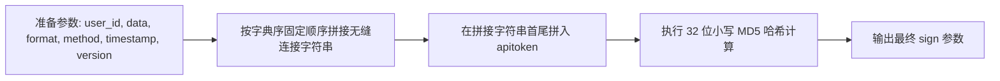
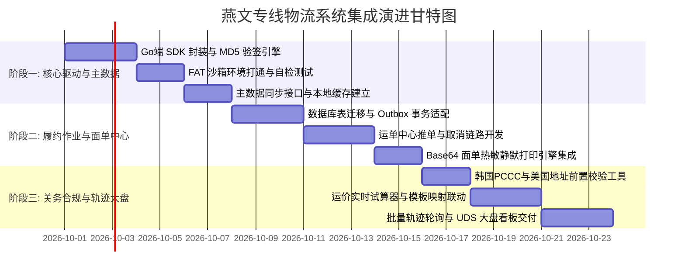

# 燕文专线轻小件物流中台系统集成架构设计规范 (TAB 1 实施专著)

> **文档标识**: `DOC-DESIGN-YANWEN-LOGISTICS-HUB`  
> **所属领域**: 核心供应链与轻小件物流中台 (Fulfillment & Logistics Domain)  
> **体系归属**: 属于 [《跨境电商多承运商三层短链路架构规范》](./cross-border-logistics-three-tier-architecture.md) 之 **第三层：独立物流对接域 TAB 1 承运商实施专著**  
> **协同专著**:
> - [多承运商三层短链路总领架构 (顶层中枢)](./cross-border-logistics-three-tier-architecture.md)
> - [4PX 大件专线与海外仓实施专著 (TAB 2)](./4px-logistics-hub-integration-architecture.md)
> - [系统既有运费报价与锁价架构 (第二层核心)](./shipping-quote-plan-architecture.md)
> **设计对齐**: 《ERP UDS 视觉系统规范 (v1.0)》、系统零容忍隐式兜底原则 (Fail Loudly)

---

## 1. 业务全景与三层短链路定位

### 1.1 业务背景与轻小件定位
燕文物流（Yanwen Express）作为中国领先的跨境出口电商综合物流服务商，在欧美及全球主流电商市场拥有极具竞争力的专线挂号、专线追踪、特快专线及海外本地派送资源。

在[《跨境电商多承运商三层短链路架构》](./cross-border-logistics-three-tier-architecture.md)总体规划中，燕文被定位为**“轻小件（重量 $\le 2\text{kg}$、长宽高之和 $\le 90\text{cm}$）的专属承运商”**，承载自行车辐条、条帽、工具包、修补耗材等小件的高效直发。

### 1.2 与系统主运费域的解耦关系 (消除架构冲突)
* **海量渠道独立沉淀**：燕文官方拥有 100+ 种原生细分渠道（如专线追踪特货、专线挂号普货等），全部收敛在燕文 TAB 内部管理与拉取，**严禁直接污染第一层商品配置与第二层运费主模板**。
* **按需挂载提供通道**：燕文 TAB 仅向系统第二层（物流运费域 `CarrierService`）输出已启用的标准化通道代码（如 `YANWEN:1001`）。主运费域按国家和重量规则按需勾选挂载。
* **故障隔离**：若燕文网络抖动或接口升级，其影响完全被锁死在燕文 TAB 与底层适配器内，系统主运费域可秒级切换至备用渠道，商品端与结账端零感知。

---

## 2. 燕文开放平台 API 通讯与安全协议深度解析

### 2.1 通信架构与环境规范
燕文开放平台采用基于 JSON 报文的 HTTP POST 协议通信，字符编码强制为 `UTF-8`。

| 环境 | HTTP API 根地址 | 账号凭证规范 |
| :--- | :--- | :--- |
| **测试沙箱 (FAT)** | `https://open-fat.yw56.com.cn/api/order` | 客户号 `user_id: 100000`<br>制单秘钥 `apitoken: [REDACTED]` |
| **正式生产 (PRD)** | `https://open.yw56.com.cn/api/order` | 商务签约分配的唯一客户商户号及正式 `apitoken` |
| **独立轨迹端点** | `http://api.track.yw56.com.cn/api/tracking` | Header 携带 `Authorization: 商户号/制单账号`，GET 模式，单次最多 30 个单号 |

### 2.2 公共请求参数规范
所有业务接口统一向 API 端点以 POST 方式提交，URL 后缀拼接公共 Query 参数，Body 携带紧凑压缩后的业务 JSON 字符串：

| 参数名 | 传递位置 | 类型 | 必填 | 说明 |
| :--- | :--- | :--- | :---: | :--- |
| `user_id` | URL Query | String | 是 | 燕文客户号 (商户号) |
| `method` | URL Query | String | 是 | 具体 API 方法名称 (如 `express.order.create`) |
| `format` | URL Query | String | 是 | 固定值 `json` |
| `timestamp`| URL Query | Long | 是 | 毫秒级时间戳，服务器端做 5 分钟窗口防重放校验 |
| `version` | URL Query | String | 是 | 接口版本号，固定值 `V1.0` |
| `sign` | URL Query | String | 是 | 动态计算生成的 32 位小写 MD5 签名摘要 |
| `data` | Request Body | String (JSON) | 是 | 具体的请求业务报文，**必须为无多余换行与空格的紧凑压缩格式** |

### 2.3 动态防伪签名算法 (Sign 计算规则)
签名生成必须严格遵循以下三步流水线：



1. **第一步（字典序排列拼接）**：
   按固定顺序连接公共参数与压缩后的请求体：
   $$\text{RawString} = \text{user\_id} + \text{data} + \text{format} + \text{method} + \text{timestamp} + \text{version}$$
2. **第二步（首尾加盐注入）**：
   将制单账号的 `apitoken` 分别拼接到第一步字符串的最左侧与最右侧：
   $$\text{SignPayload} = \text{apitoken} + \text{RawString} + \text{apitoken}$$
3. **第三步（32 位小写 MD5）**：
   对 `SignPayload` 计算 MD5 摘要并转为小写字符串：
   $$\text{sign} = \text{md5\_hex}(\text{SignPayload})\text{.toLowerCase()}$$

### 2.4 零容忍隐式兜底 (Fail Loudly) 响应处理规范
燕文统一返回如下结构的 JSON 报文：
```json
{
  "success": true,
  "code": "0",
  "message": "操作成功",
  "data": { ... }
}
```
* **阻断规则**：
  1. 当 `success == false` 或 `code != "0"` 时，后端 SDK **必须立即抛出强类型错误**（如 `YanwenApiException`），包含远程 `code` 和完整 `message`。
  2. 严禁使用诸如 `return []` 或 `return null` 的隐式兜底模式覆盖接口错误。
  3. 前端接收到错误后，必须以 `toast.error` 或表单内红色阻断性高亮明确提示操作人员，并保留错误发生现场以便运维追溯。

---

## 3. 系统集成拓扑与 Go 后端架构

### 3.1 分层架构与核心领域模型
后端代码组织收敛在 `go-backend` 模块中，维持清晰的分层职责：

```text
go-backend/
|-- internal/
|   |-- domain/shipping/
|   |   `-- yanwen_entities.go         # 燕文运单、渠道、交货仓、轨迹等核心实体
|   |-- pkg/yanwen/
|   |   |-- client.go                  # 燕文底层 HTTP Client, 签名计算, 环境切换
|   |   |-- signer.go                  # MD5 字典序签名器
|   |   `-- types.go                   # 燕文 OpenAPI 原生请求与响应契约结构体
|   |-- repository/
|   |   `-- yanwen_repository.go       # 运单持久化、面单缓存、主数据本地缓存仓库
|   |-- service/
|   |   |-- yanwen_service.go          # 核心业务服务：发货推单、打单、试算、校验编排
|   |   `-- yanwen_tracking_worker.go  # 在途单号批量轨迹轮询与事件同步后台作业
|   `-- api/
|       `-- admin_yanwen_handlers.go   # 管理后台 Admin RESTful API 路由与参数处理器
```

### 3.2 事务发件箱 (Transactional Outbox) 异步解耦
为保障在高并发大促场景下发货操作的强一致性，系统采用 Outbox 模式集成燕文接口：
1. **订单发货事务内**：系统本地将订单状态更新为发货中，同时在数据库同一事务内插入一条 `yanwen_shipment_outbox` 待处理事件。
2. **后台 Worker 异步派发**：Outbox Worker 拾取待发送记录，调用燕文 Client 的 `express.order.create`。
3. **状态幂等回执**：若调用成功，则回填生成的 `waybillNumber`，更新包裹状态为已建单，并自动触发面单拉取任务；若失败，依据错误码决定自动重试或转为人工介入队列（标记为 `CRITICAL`）。

### 3.3 全局三大设计原则的严格遵从
1. **数据拉取与权限彻底解耦原则**：
   燕文通达国家列表（`common.country.getlist`）、交货仓列表（`common.warehouse.getlist`）、已开通产品（`common.product.getlist`）以及试算结果属于基础物流数据。后端提供定时同步与常态化拉取保证。**前端严禁注入任何基于操作者角色的阻断逻辑干扰底层数据同步**。
2. **角色权限矩阵统一管控入口**：
   燕文物流中台的各页面入口受角色权限矩阵唯一管理（如 `logistics:yanwen:view`、`logistics:yanwen:ship` 等）。用户能否访问某个 TAB 仅取决于矩阵勾选项，禁止通过其他任何硬编码逻辑干扰。
3. **系统登录零干扰原则**：
   登录链路仅校验 Token 与 User ID，严禁将燕文主数据初始化、Token 检查或网络探测挂载到登录生命周期中。

---

## 4. 燕文专线后台域 (Yanwen Logistics Hub) 多 TAB 工业级设计

> **严格对齐《ERP UDS 视觉系统规范 (v1.0)》**：工业感无边框大圆角、`border-dashed` 虚线边框、大胶囊按钮、绝对严禁静默吞错。

### 模块整体 Tab 结构体系 (Yanwen Domain Console)
```
Yanwen Logistics Hub (燕文专线独立物流域控制台)
├── TAB 1: 运营大盘与链路健康 (Overview & Health)
├── TAB 2: 专线运单与面单中心 (Waybill Fulfillment & Labels)
├── TAB 3: 原生渠道池与发布集合管理 (Channels & Published Collection) <-- ★ 核心对外短链路集合
├── TAB 4: 实时运价与路由选优 (Rate Calculator & Routing)
├── TAB 5: 全链路轨迹与时效看板 (Milestones & In-Transit Tracking)
├── TAB 6: 关务合规与前置校验 (Customs Compliance & Pre-Validation)
└── TAB 7: 接口凭据与主数据同步 (Channel Master Data & Config)
```

> **端到端短数据链路核心契约**：TAB 3 负责从燕文官方接口实时拉取 100+ 种原生渠道（普货、特货、特快），在此进行清洗并勾选启用，组装成标准的 **【燕文小包标准化服务集合 (Yanwen Service Collection)】**。外部第二层主运费模板（`ShippingTemplate`）仅读取此集合完成线路挂载，实现配置隔离与极速排障。

---

### TAB 1: 运营大盘与链路健康 (Overview & Health)

用于物流主管与仓管总监俯瞰全站燕文小包出口吞吐效率、API 接口服务可用性及异常清关阻断情况。

#### 1. 布局结构原型
```text
┌────────────────────────────────────────────────────────────────────────────────────────┐
│ [模块页眉]  rounded-[32px]  border-dashed  bg-muted/5                                   │
│   YANWEN LOGISTICS OPERATIONS & API GATEWAY HEALTH                                     │
│   燕文跨境专线全链路监控大盘                                                           │
│   实时监控出口小包交运吞吐、面单生成时效、在途清关阻断率及 API 接口健康度              │
└────────────────────────────────────────────────────────────────────────────────────────┘

┌─────────────────┬─────────────────┬─────────────────┬─────────────────┬────────────────┐
│ 今日创建运单    │ 待打印面单      │ 揽收在途包裹    │ 清关异常预警    │ 本月预估运费   │
│ 142 单          │ 18 单           │ 685 件          │ 3 件            │ ¥38,420.50     │
│ 较昨日 +8.4%    │ [ALERT 提示]    │ 平均时效 6.8 天 │ [CRITICAL 告警] │ 涉及 1,290 单  │
└─────────────────┴─────────────────┴─────────────────┴─────────────────┴────────────────┘

┌──[双列工业图表容器] ───────────────────────────────────────────────────────────────────┐
│ ┌──[左列: 专线国家流向 Top 5] ───────────────┐ ┌──[右列: API 网关连通性自检] ─────────┐ │
│ │ 1. 美国 (US) 燕文专线挂号 58%              │ │ 当前环境: 正式生产环境 (PRD)        │ │
│ │ 2. 英国 (GB) 燕文特快专线 18%              │ │ 网关状态: [HEALTHY: 200 OK]          │ │
│ │ 3. 德国 (DE) 燕文专线追踪 12%              │ │ 平均响应延迟: 184ms                  │ │
│ │ 4. 韩国 (KR) 燕文专线挂号 8%               │ │ Token 校验窗口: 剩余 284 天          │ │
│ │ 5. 加拿大 (CA) 4%                          │ │ 今日接口调用总量: 2,490 次           │ │
│ └────────────────────────────────────────────┘ └──────────────────────────────────────┘ │
└────────────────────────────────────────────────────────────────────────────────────────┘
```

#### 2. UDS 视觉规范参数
*   **页眉样式**：`rounded-[32px] border-dashed border-border/60 bg-muted/5 p-6 backdrop-blur-sm`。
*   **一级标题**：`text-lg font-black tracking-tighter italic uppercase`。
*   **辅助描述**：`text-[9px] font-black uppercase tracking-widest opacity-60`。
*   **5 联数据概览卡**：
    *   卡片容器：`rounded-[24px] border-dashed border-border/60 bg-card p-4 relative overflow-hidden`。
    *   顶部渐变装饰：`absolute inset-0 bg-gradient-to-br from-primary/5 via-transparent pointer-events-none`。
    *   卡片标签：`text-[10px] font-black uppercase tracking-widest text-muted-foreground/60`。
    *   数值表现：`text-2xl font-black font-mono tracking-tight`。

---

### TAB 2: 专线运单与面单中心 (Waybill Fulfillment & Labels)

打包发货组的核心操作台。支持商城待发货订单推单至燕文、获取运单号、批量打印 10x10 热敏电子面单以及拦截取消运单。

#### 1. 对应燕文核心 API 映射
*   `express.order.create`：创建运单并获取燕文运单号 `waybillNumber`。
*   `express.order.label.get`：调取 PDF 电子面单（Base64 流）。
*   `express.order.cancel`：在仓库交接前拦截取消运单。
*   `express.order.get` / `express.order.batch.get`：详情与重量复核。

#### 2. 交互与布局原型
```text
┌──[操作与筛选工具栏]  rounded-[24px]  border-dashed ────────────────────────────────────┐
│ [搜索: 商城单号 / 燕文单号 / 尾程单号 / 买家姓名]  [渠道过滤: 全部 / 专线挂号 / 特快]   │
│ [交货仓: 深圳仓 / 广州仓 / 义乌仓]  [状态: 待推单 / 已建单 / 已打面单 / 揽收 / 运输中]   │
│                                                [一键批量推单]  [批量打面单 (PDF)]      │
└────────────────────────────────────────────────────────────────────────────────────────┘

┌──[专线运单全透明台账 Table] ───────────────────────────────────────────────────────────┐
│ 订单编号 / 下单时间 │ 燕文单号 / 尾程单号 │ 渠道 / 交货仓 │ 目的国 / 买家  │ 申报品名/重量 │ 状态     │ 操作列         │
├─────────────────────┼─────────────────────┼──────────────┼────────────────┼───────────────┼──────────┼────────────────┤
│ TZ-20260920-8801    │ YE891362701CN       │ 燕文专线挂号 │ 美国 (US)      │ 碳纤维轮组配件 │ [HEALTHY]│ [预览/补打面单]│
│ 2026-09-20 14:32    │ 9274890200192837    │ 深圳平湖仓   │ David Miller   │ 1,450g / $120 │ 已打面单 │ [查看详情/轨迹]│
├─────────────────────┼─────────────────────┼──────────────┼────────────────┼───────────────┼──────────┼────────────────┤
│ TZ-20260921-9014    │ (尚未推单)          │ 燕文特快专线 │ 韩国 (KR)      │ 铝合金花鼓部件 │ [ALERT]  │ [一键交运推单] │
│ 2026-09-21 09:15    │ --                  │ 义乌交货仓   │ Kim Sung-min   │ 820g / $65    │ 通关码通过[取消运单]   │
├─────────────────────┼─────────────────────┼──────────────┼────────────────┼───────────────┼──────────┼────────────────┤
│ TZ-20260921-9120    │ YE891380021CN       │ 燕文经济小包 │ 德国 (DE)      │ 自行车辐条包   │ [CRITICAL│ [查看拦截原因] │
│ 2026-09-21 11:40    │ --                  │ 广州花都仓   │ Hans Weber     │ 310g / $25    │ 地址被拦截[编辑后重发] │
└────────────────────────────────────────────────────────────────────────────────────────┘
```

#### 3. 电子面单静默打印引擎机制
1. 调用 `express.order.label.get`，请求参数中传递 `waybillNumber`，`printRemark: 1`（支持附带打印拣货单）。
2. 接口返回包含 PDF 格式的 `base64String`。
3. 前端将 Base64 转为 Blob URL，通过隐藏的 `<iframe>` 触发浏览器的原生打印机驱动或连接本地 Lodop/PrintServer，直接输出至 100mm × 100mm 热敏标签纸，无需操作人员手动下载 PDF 后二次打开。
4. 打印完成后乐观更新状态为“已打面单”，并记录操作日志与时间戳。

---

### TAB 3: 精选开通渠道白名单 (Curated Channels & Service Collection)

> **★ 燕文独立域对外唯一公开数据出口 (Single Outbound Port)**  
> **核心边界隔离契约**：系统其他外部模块（如主运费域、商品域、订单调度）**绝对禁止读取或调用除本 TAB 之外的燕文任何内部数据**。燕文大盘、运单打单、轨迹跟踪、关务校验等 TAB 纯粹属于燕文域内私有闭环通信。主运费模板（`ShippingTemplate`）严格且仅读取本 TAB 发布的精选渠道集合。

#### 1. 业务模式：人工比价选优录入与日常维护
*   **拒绝全量 100+ 渠道灌入**：燕文底层拥有 100+ 种小包细分产品，若全量拉入系统，主运费模板将陷入选项瘫痪。
*   **人工算费选优（当前阶段）**：运营根据燕文最新官方报价单或测算工具，针对重点出海国（美、英、德、韩等）**人工精算挑选出 3-5 条最具性价比的小包优势渠道**（如专线挂号、特快专线、带电特货），算好后进入本 TAB 手动添加。
*   **随时增删与启停**：
    *   **添加渠道**：录入燕文官方产品代码（如 `1001`），设定我们系统的业务别名（如“燕文-欧美配件专线”）。
    *   **停用/启用**：渠道临时涨价、航空口岸排期长或暂停收寄时，一键点击 `[停用]`，主运费模板立即对该渠道不可选。
    *   **删除/移除**：不再合作的渠道直接点击 `[删除/移除]`，彻底清空，杜绝残留冗余。
*   **平滑演进通道（未来升级，防一刀切死）**：
    *   后期若上线“自动渠道估算与智能比价推荐引擎”，升级动作**纯属于燕文域内政**（由 TAB 4 运价试算接口计算后向本 TAB 提供“系统推荐优质渠道”，运营可一键采纳审核）。
    *   本 TAB 对外输出的 `YanwenCuratedCollection` 数据结构与契约永远保持稳定，外部主运费模板无需任何代码改造。

#### 2. UDS 1.0 工业级交互原型
```text
┌──[模块页眉]  rounded-[32px]  border-dashed  bg-muted/5 ────────────────────────────────┐
│   YANWEN CURATED CHANNELS ROSTER (燕文精选开通渠道白名单)                              │
│   人工算费选优后录入的精选白名单小包渠道，供商城主运费模板只读调用，杜绝无效渠道干扰  │
└────────────────────────────────────────────────────────────────────────────────────────┘

┌──[操作与筛选工具栏]  rounded-[24px]  border-dashed ────────────────────────────────────┐
│ [搜索渠道别名/官方代码]  [状态过滤: 全部 / 已启用 / 已停用]      [+ 手动添加精选渠道]  │
└────────────────────────────────────────────────────────────────────────────────────────┘

┌──[已添加的精选渠道清单 Table] ─────────────────────────────────────────────────────────┐
│ 业务别名 (自定义)        │ 官方代码 │ 适用类型 │ 测算参考时效 │ 状态       │ 操作列     │
├──────────────────────────┼──────────┼──────────┼──────────────┼────────────┼────────────┤
│ 燕文-欧美配件普货专线    │ 1001     │ 轻小件   │ 7-10 工作日  │ [HEALTHY]  │ [编辑]     │
│ (人工测算: ≤2kg 运费最佳)│ YW Exp   │ 普货配件 │ 均单运费 ¥38 │ [已启用]   │ [停用]     │
│                          │          │          │              │ (只读暴露) │ [删除/移除]│
├──────────────────────────┼──────────┼──────────┼──────────────┼────────────┼────────────┤
│ 燕文-韩国特快专线 (带电) │ 1008     │ 特货小包 │ 3-5 工作日   │ [ALERT]    │ [编辑]     │
│ (人工测算: 需录入通关码) │ YW KR    │ 内置电池 │ 均单运费 ¥52 │ [临时停用] │ [启用]     │
│                          │          │          │              │ (运费模板隐)│ [删除/移除]│
└──────────────────────────┴──────────┴──────────┴──────────────┴────────────┴────────────┘
```

#### 3. `[+ 手动添加精选渠道]` 弹窗表单规范
*   **官方产品代码**：输入或下拉选择燕文官方 Product Code（如 `1001` 燕文专线追踪、`1008` 燕文特快专线）。
*   **业务别名 (Display Name)**：运营自定义可读标识（如“燕文-北美配件特快专线”）。
*   **适用包裹限制**：最大毛重（默认 2000g）、体积重系数（如 8000）、允许货品属性（普货/特货）。
*   **测算说明与备注**：记录人工测算时的对比依据，方便后续交接与复核。

---

### TAB 4: 实时运价与路由选优 (Rate Calculator & Routing)

用于运营在制定商品定价、核算订单毛利，或客服处理买家超重补邮费时，实时调用燕文计费引擎测算各渠道官方折后报价与预计时效。本 TAB 纯属域内试算工具，未来可作为向 TAB 3 供给自动估算建议的底层算法依托。

#### 1. 对应燕文核心 API 映射
*   `calc.list`：官方多产品运价与时效试算接口。
*   `calc.overseas.warehouse.getlist`：海外派交货地查询。

#### 2. 双栏式交互设计
*   **左侧：工业测算参数面板 (`w-1/3`, rounded-[24px])**：
    *   **出发交货仓**：下拉联动燕文交货仓列表（接口获取 `cityId`）。
    *   **目的国家/地区**：联动燕文通达国列表（支持中英文二字码搜索）。
    *   **货品属性**：普货（代码 1）、特货/带电（代码 2）、敏感货（代码 3）、特品（代码 4）。
    *   **包裹三维与重量**：实重（g）、长（cm）、宽（cm）、高（cm）。
    *   **目的国邮编**：用于自动核算偏远附加费。
    *   **主操作按钮**：`[立即执行运价测算]`（大胶囊按钮 `rounded-full h-11`）。
*   **右侧：渠道对比矩阵卡片流 (`w-2/3`)**：
    *   横向并列展示匹配渠道（如：燕文专线追踪、燕文专线挂号、燕文特快专线、中邮挂号）。
    *   卡片明确对比：
        *   **计费重量**：对比实重与体积重（$\text{体积重} = L \times W \times H / 6000$ 或 $8000$）。
        *   **预估总运费 (RMB)**：拆解基础运费、挂号费、燃油附加费。
        *   **预计时效**：如 `6-10 工作日`。

---

### TAB 5: 全链路轨迹与时效看板 (Milestones & In-Transit Tracking)

将燕文从小包收寄、航空离港、目的国海关放行、尾程转运换单到末端派送的每个物理节点全程透明化，并与系统既有 17TRACK 框架深度对齐。本 TAB 仅在燕文域内处理轨迹抓取，严禁外部模块旁路依赖。

#### 1. 对应燕文核心 API 映射
*   `http://api.track.yw56.com.cn/api/tracking?nums=单号列表`（GET 请求，支持 30 个单号批量轮询）。

#### 2. 5 阶段状态码映射表
燕文返回的原生轨迹状态码由系统统一归一化为标准领域事件：

| 阶段分类 | 燕文节点状态码 | 业务含义 | 系统状态映射 | UI 徽章表现 |
| :--- | :--- | :--- | :--- | :--- |
| **集货交仓** | `OR10 / PU10` | 燕文揽收 / 操作中心分拣入库 | `COLLECTED` | `text-blue-500 bg-blue-500/10` |
| **干线干飞** | `LH20` | 航班起飞离港 (提取 `FlightNumber`) | `IN_TRANSIT_AIR` | `text-indigo-500 bg-indigo-500/10` |
| **目的国清关** | `CC30` | 目的国口岸海关申报 / 查验放行 | `CUSTOMS_CLEARED` | `text-amber-500 bg-amber-500/10` |
| **尾程转派** | `LM40` | 交接本地承运商 (提取 `exchange_number`) | `LAST_MILE_HANDOVER` | `text-purple-500 bg-purple-500/10` |
| **末端妥投** | `DL70` | 包裹已成功投递签收 | `DELIVERED` | `text-emerald-500 bg-emerald-500/10` (HEALTHY) |
| **异常阻断** | `AD80 / RT90` | 地址错误派送失败 / 海关扣件退件 | `EXCEPTION_ALERT` | `text-rose-500 bg-rose-500/10` (CRITICAL) |

#### 3. 智能停滞告警（Fail Loudly 原则）
*   **清关停滞预警 (ALERT)**：若包裹处于 `CC30`（清关中）超过 48 小时无后续进展，自动标记为琥珀色警告，提示运营联系报关行。
*   **在途超时失联 (CRITICAL)**：若航班起飞（`LH20`）后超过 7 个工作日未被目的国扫描，触发红色闪烁告警（`animate-pulse`），并自动向客服工作台生成售后异常工单。

---

### TAB 6: 关务合规与前置校验 (Customs Compliance & Pre-Validation)

直击跨境出口中最容易引发目的国退件、巨额运费损失的顽疾（如韩国通关码失效、美国地址格式歧义、欧盟 IOSS 漏报）。

#### 1. 对应燕文核心 API 映射
*   `customs.code.korea.validate`：韩国个人海关通关码（PCCC）实名校验。
*   `address.validate.us`：美国地址标准化校验。
*   `common.pickup.point.getlist`：自提网点规范查询。

#### 2. 前置防御三道防线
1. **第一道防线：韩国 PCCC 强校验**：
   *   韩国海关强制要求跨境直邮包裹必须提供买家个人的 PCCC 码（格式为以 `P` 开头的 13 位编码）以及完全匹配的韩文/英文姓名。
   *   推单前自动调用燕文校验接口：若返回姓名与税号不匹配，系统在前端发货面板直接标红阻断，杜绝包裹运达仁川机场后被海关退运。
2. **第二道防线：美国 USPS 地址规范纠错**：
   *   输入收件地址、城市、州及 5 位或 9 位 ZIP Code。
   *   调用燕文地址校验接口，自动比对美国邮政数据库。若发现邮编与所在城市不一致，提示标准化修正建议，避免末端死信退回。
3. **第三道防线：关务申报品名与 IOSS 映射库**：
   *   集中维护商城商品与海关报关标准品名的对应表（包含中文品名、英文品名、申报 HS Code、默认报关申报价值比率）。
   *   针对发往欧盟各国的包裹，强制注入商户的 IOSS 税号；发往英国的包裹强制注入 UK VAT 税号，并在创建运单报文的 `items` 中自动规范生成。

---

### TAB 7: 渠道主数据与网关配置 (Channel Master Data & Config)

面向系统管理员的配置中心与账单核对中枢，保证系统数据与燕文官方高度同频。

#### 1. 对应燕文核心 API 映射
*   `common.country.getlist`：通达国家列表。
*   `common.warehouse.getlist`：交货仓列表。
*   `common.product.getlist`：已开通产品列表。
*   `bill.unsettled.detail.get` / `bill.settled.detail.get`：未出与已出账单明细。

#### 2. 核心功能规范
1. **API 身份凭据与连通性自检**：
   *   安全录入 `user_id`（客户商户号）与 `apitoken`（制单账号秘钥），支持 FAT 测试环境与 PRD 生产环境一键切换。
   *   配备 **`[执行网关连通性自检 (Ping)]`** 按钮：轻量调用 `common.country.getlist`，自动验证签名计算模块与网络可达性。
2. **主数据一键拉取同步（无感缓存）**：
   *   同步通达国家列表：拉取 200+ 国家代码及中英文名称，写入本地字典。
   *   同步交货仓列表：拉取全国最新仓库代码（如深圳平湖仓、义乌仓），用于创建运单时选择最近揽收点。
   *   同步开通产品：自动识别商户协议下启用的燕文产品代码，未开通产品自动置灰。
3. **财务对账与账单稽核**：
   *   调取 `bill.settled.detail.get` 对接燕文官方扣费账单。
   *   比对系统理论运费与燕文账单实际扣费金额：若重量误差超过 10% 或扣费差额超过 ¥10，自动以红色醒目标记，协助财务快速发起运费申诉。

---

## 5. 路由规划与角色权限矩阵规范

### 5.1 路由层级与懒加载设计 (`router/index.ts`)
```typescript
// 燕文专线跨境物流中台
{
  path: 'logistics/yanwen',
  redirect: domainRedirect('YanwenOverview', {
    overview: 'YanwenOverview',
    waybills: 'YanwenWaybills',
    collection: 'YanwenCollection',
    calculator: 'YanwenCalculator',
    tracking: 'YanwenTracking',
    customs: 'YanwenCustoms',
    config: 'YanwenConfig',
  }),
  meta: { permission: 'logistics:yanwen:view' }
},
{
  path: 'logistics/yanwen/overview',
  name: 'YanwenOverview',
  component: () => import('@/views/logistics/YanwenLogisticsHub.vue'),
  meta: { title: '燕文大盘', permission: 'logistics:yanwen:view' }
},
{
  path: 'logistics/yanwen/waybills',
  name: 'YanwenWaybills',
  component: () => import('@/views/logistics/YanwenLogisticsHub.vue'),
  meta: { title: '专线运单', permission: 'logistics:yanwen:view' }
},
{
  path: 'logistics/yanwen/collection',
  name: 'YanwenCollection',
  component: () => import('@/views/logistics/YanwenLogisticsHub.vue'),
  meta: { title: '精选渠道', permission: 'logistics:yanwen:view' }
},
{
  path: 'logistics/yanwen/calculator',
  name: 'YanwenCalculator',
  component: () => import('@/views/logistics/YanwenLogisticsHub.vue'),
  meta: { title: '运价试算', permission: 'logistics:yanwen:view' }
},
{
  path: 'logistics/yanwen/tracking',
  name: 'YanwenTracking',
  component: () => import('@/views/logistics/YanwenLogisticsHub.vue'),
  meta: { title: '轨迹监控', permission: 'logistics:yanwen:view' }
},
{
  path: 'logistics/yanwen/customs',
  name: 'YanwenCustoms',
  component: () => import('@/views/logistics/YanwenLogisticsHub.vue'),
  meta: { title: '关务合规', permission: 'logistics:yanwen:view' }
},
{
  path: 'logistics/yanwen/config',
  name: 'YanwenConfig',
  component: () => import('@/views/logistics/YanwenLogisticsHub.vue'),
  meta: { title: '网关配置', permission: 'logistics:yanwen:manage' }
}
```

### 5.2 角色权限矩阵单一授权规则
按照平台准则，入口权限由后台角色权限矩阵单一勾选决定，杜绝多处硬编码或隐式阻塞：
*   `logistics:yanwen:view`：允许查看燕文物流中台各 TAB 界面及在途数据。
*   `logistics:yanwen:ship`：允许执行订单推单交运、重新拉取面单与打印操作。
*   `logistics:yanwen:cancel`：允许执行燕文运单拦截与取消操作。
*   `logistics:yanwen:manage`：允许修改 API 商户号/秘钥、切换运行环境及执行财务对账导出。

---

## 6. 实施路线演进与里程碑计划

当后续获批进入代码落地实施阶段时，建议分三个阶段平稳交付：



### 6.1 阶段一：核心 SDK 与主数据引擎
*   编写 `internal/pkg/yanwen`，实现毫秒级时间戳防重放、动态 MD5 签名生成器以及环境切换配置。
*   在沙箱环境验证 `common.country.getlist`、`common.warehouse.getlist` 与 `common.product.getlist`，建立基础数据字典。

### 6.2 阶段二：运单履约与面单打印闭环
*   数据库执行数据库迁移，创建 `yanwen_waybills` 与 `yanwen_label_records`。
*   实现 `express.order.create` 推单入库与 Transactional Outbox 事务保障。
*   前端交付 TAB 2，实现热敏面单（100mm × 100mm）一键调起与状态乐观流转。

### 6.3 阶段三：关务前置校验、精选渠道输出与轨迹大盘
*   前端交付 TAB 3（精选开通渠道白名单）、TAB 4（运价试算）与 TAB 6（关务合规拦截器），接入韩国 PCCC 与美国地址核验，向主运费域输出稳定服务集合。
*   启用后台 Worker 对接 `http://api.track.yw56.com.cn/api/tracking`，实现包裹轨迹 5 阶段状态自动推进与异常停滞报警。
*   完成对齐 UDS 1.0 的 TAB 1 运营监控大盘，达成整套燕文专线物流调度中台的全面交付。
