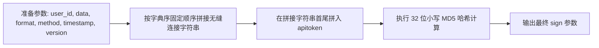
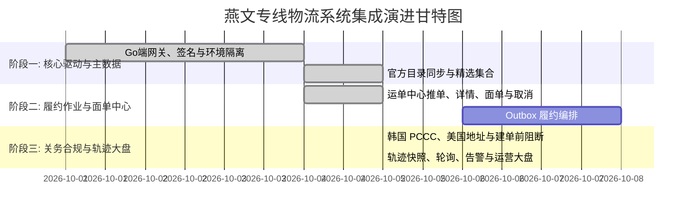

# 燕文专线轻小件物流中台系统集成架构设计规范 (TAB 1 实施专著)

> **文档标识**: `DOC-DESIGN-YANWEN-LOGISTICS-HUB`  
> **所属领域**: 核心供应链与轻小件物流中台 (Fulfillment & Logistics Domain)  
> **体系归属**: 属于 [《跨境电商多承运商三层短链路架构规范》](../cross-border-logistics-three-tier-architecture.md) 之 **第三层：独立物流对接域 TAB 1 承运商实施专著**  
> **协同专著**:
> - [多承运商三层短链路总领架构 (顶层中枢)](../cross-border-logistics-three-tier-architecture.md)
> - [4PX 服务目录与网关实施专著](../4px/4px-logistics-hub-integration-architecture.md)
> - [系统既有运费报价与锁价架构 (第二层核心)](../shipping-quote-plan-architecture.md)
> **设计对齐**: 《ERP UDS 视觉系统规范 (v1.0)》、系统零容忍隐式兜底原则 (Fail Loudly)

---

## 1. 业务全景与三层短链路定位

### 1.1 业务背景与轻小件定位
燕文物流（Yanwen Express）作为中国领先的跨境出口电商综合物流服务商，在欧美及全球主流电商市场拥有专线挂号、专线追踪、特快专线及目的国本地派送资源。

在[《跨境电商多承运商三层短链路架构》](../cross-border-logistics-three-tier-architecture.md)总体规划中，燕文被定位为**“轻小件（重量 $\le 2\text{kg}$、长宽高之和 $\le 90\text{cm}$）的专属承运商”**，承载自行车辐条、条帽、工具包、修补耗材等小件的高效直发。

### 1.2 与系统主运费域的解耦关系 (消除架构冲突)
* **海量渠道独立沉淀**：燕文官方拥有 100+ 种原生细分渠道（如专线追踪特货、专线挂号普货等），全部收敛在燕文 TAB 内部管理与拉取，**严禁直接污染第一层商品配置与第二层运费主模板**。
* **按需挂载提供通道**：燕文 TAB 仅向系统第二层（物流运费域 `CarrierService`）输出已启用的精选集合记录；线路保存稳定的 `yanwen_published_channel_id`，同时投影标准化通道代码（如 `YANWEN:<productCode>`）。主运费域按国家和重量规则按需勾选挂载。
* **故障隔离**：若燕文网络抖动或接口升级，其影响完全被锁死在燕文 TAB 与底层适配器内，系统主运费域可秒级切换至备用渠道，商品端与结账端零感知。

---

## 2. 燕文开放平台 API 通讯与安全协议深度解析

### 2.1 通信架构与环境规范
燕文开放平台采用基于 JSON 报文的 HTTP POST 协议通信，字符编码强制为 `UTF-8`。

| 环境 | HTTP API 根地址 | 账号凭证规范 |
| :--- | :--- | :--- |
| **测试沙箱 (FAT)** | `https://open-fat.yw56.com.cn/api/order` | 客户号和制单秘钥由燕文单独分配，请通过受控密钥存储配置 |
| **正式生产 (PRD)** | `https://open.yw56.com.cn/api/order` | 商务签约分配的唯一客户商户号及正式 `apitoken` |
| **独立轨迹端点** | `http://api.track.yw56.com.cn/api/tracking` | 官方仅提供 HTTP GET；Header 携带 `Authorization: 商户号/制单账号`，单次最多 30 个单号，无测试环境；必须由后端代理调用 |

### 2.2 公共请求参数规范
所有业务接口统一向 API 端点以 POST 方式提交，URL 后缀拼接公共 Query 参数，Body 携带紧凑压缩后的业务 JSON 字符串：

| 参数名 | 传递位置 | 类型 | 必填 | 说明 |
| :--- | :--- | :--- | :---: | :--- |
| `user_id` | URL Query | String | 是 | 燕文客户号 (商户号) |
| `method` | URL Query | String | 是 | 具体 API 方法名称 (如 `express.order.create`) |
| `format` | URL Query | String | 是 | 固定值 `json` |
| `timestamp`| URL Query | Long | 是 | 毫秒级时间戳，服务器端做 5 分钟窗口防重放校验 |
| `version` | URL Query | String | 是 | 接口版本号，固定值 `V1.0` |
| `sign` | URL Query | String | 是 | 动态计算生成的 32 位小写 MD5 签名摘要 |
| `data` | Request Body | String (JSON) | 是 | 具体的请求业务报文，**必须为无多余换行与空格的紧凑压缩格式** |

### 2.3 动态防伪签名算法 (Sign 计算规则)
签名生成必须严格遵循以下三步流水线：



1. **第一步（字典序排列拼接）**：
   按固定顺序连接公共参数与压缩后的请求体：
   $$\text{RawString} = \text{user\_id} + \text{data} + \text{format} + \text{method} + \text{timestamp} + \text{version}$$
2. **第二步（首尾加盐注入）**：
   将制单账号的 `apitoken` 分别拼接到第一步字符串的最左侧与最右侧：
   $$\text{SignPayload} = \text{apitoken} + \text{RawString} + \text{apitoken}$$
3. **第三步（32 位小写 MD5）**：
   对 `SignPayload` 计算 MD5 摘要并转为小写字符串：
   $$\text{sign} = \text{md5\_hex}(\text{SignPayload})\text{.toLowerCase()}$$

### 2.4 零容忍隐式兜底 (Fail Loudly) 响应处理规范
燕文统一返回如下结构的 JSON 报文：
```json
{
  "success": true,
  "code": "0",
  "message": "操作成功",
  "data": { ... }
}
```
* **阻断规则**：
  1. 当 `success == false` 或 `code` 不符合该方法的成功码契约时，后端 SDK **必须立即抛出强类型错误**（如 `YanwenApiException`），包含远程 `code` 和完整 `message`。
  2. 严禁使用诸如 `return []` 或 `return null` 的隐式兜底模式覆盖接口错误。
  3. 前端接收到错误后，必须以 `toast.error` 或表单内红色阻断性高亮明确提示操作人员，并保留错误发生现场以便运维追溯。

> **接口级例外**：独立轨迹接口返回数字 `code: 0`，不能把 `code === "0"` 作为所有燕文接口的全局成功条件。适配器必须按方法定义校验 `success`、`code` 类型和数据结构，未知组合一律阻断并记录原始响应。

---

## 3. 系统集成拓扑与 Go 后端架构

### 3.1 分层架构与核心领域模型
后端代码组织收敛在 `go-backend` 模块中，维持清晰的分层职责：

```text
go-backend/
|-- internal/
|   |-- domain/shipping/
|   |   |-- yanwen_*.go                # 燕文自己的配置、目录、渠道、运单和轨迹实体
|   |-- repository/
|   |   |-- yanwen_*_repository.go     # 燕文配置、目录、集合、运单和轨迹专属仓库
|   |   |-- shipping_repository.go      # 通用物流数据，不承载燕文精选集合 CRUD
|   |-- service/
|   |   |-- yanwen_api_service_legacy_compatibility_facade_test.go # 旧测试兼容门面（仅测试编译）
|   |   |-- yanwen_gateway_configuration_service.go # 凭据、端点和网关自检
|   |   |-- yanwen_gateway_configuration_contracts.go # 配置请求与自检结果 DTO
|   |   |-- yanwen_catalog_service.go  # 官方产品、国家、仓库目录同步
|   |   |-- yanwen_official_catalog_contracts.go # 目录同步结果 DTO
|   |   |-- yanwen_waybill_operations_service.go # 运单操作服务与共享依赖
|   |   |-- yanwen_waybill_query_and_official_sync_operations.go # 台账查询与官方详情同步
|   |   |-- yanwen_waybill_creation_operations.go # 单票/批量建单与关务前置
|   |   |-- yanwen_waybill_label_download_operations.go # 单票/批量面单下载
|   |   |-- yanwen_waybill_cancellation_operations.go # 单票/批量取消
|   |   |-- yanwen_waybill_operations_contracts.go # 运单操作请求与结果 DTO
|   |   |-- yanwen_waybill_request_builder.go # 燕文建单报文组装与字段校验
|   |   |-- yanwen_api_service_legacy_forwarders_test.go # 旧测试兼容转发（仅测试编译）
|   |   |-- yanwen_published_collection_service.go # 精选集合边界
|   |   `-- yanwen_tracking_*.go       # 燕文专属轨迹与轮询
|   `-- api/
|       `-- admin/
|           |-- yanwen_collection_handler.go # 精选集合 REST 边界
|           |-- yanwen_overview_handler.go    # 运营概览 REST 入口
|           |-- yanwen_api_config_handler.go  # 网关配置与自检 REST 入口
|           |-- yanwen_catalog_handler.go     # 官方目录 REST 入口
|           `-- yanwen_waybill_handler.go     # 建单、面单、同步和取消 REST 入口
```

### 3.2 事务发件箱 (Transactional Outbox) 异步解耦（后续阶段）
这是后续自动履约编排的目标方案，当前 Waybills TAB 仍使用服务端同步人工推单；在明确触发来源和订单状态边界前，不自动把订单或支付事件接入燕文建单：
1. **显式燕文履约意图事务内**：后续实现只能由明确的燕文履约意图触发，在同一事务内保存燕文自己的待处理事件；不得从支付成功或通用订单状态直接推断需要哪一个燕文渠道和交货仓。
2. **燕文专属 Worker 异步派发**：Worker 拾取燕文待处理记录，调用燕文 Client 的 `express.order.create`，不读取 4PX、通用物流服务或客服数据。
3. **状态幂等回执**：若调用成功，则回填生成的 `waybillNumber`，更新燕文运单台账；若失败，依据官方错误和不确定结果进入燕文专属重试或人工介入状态，不伪造官方状态或金额。

### 3.3 全局三大设计原则的严格遵从
1. **数据拉取与权限彻底解耦原则**：
   燕文通达国家列表（`common.country.getlist`）、交货仓列表（`common.warehouse.getlist`）和已开通产品（`express.channel.getlist`）属于基础物流数据。后端提供定时同步与常态化拉取保证。**前端严禁注入任何基于操作者角色的阻断逻辑干扰底层数据同步**。
2. **角色权限矩阵统一管控入口**：
   燕文物流中台的各页面入口受角色权限矩阵唯一管理（如 `logistics:yanwen:view`、`logistics:yanwen:ship` 等）。用户能否访问某个 TAB 仅取决于矩阵勾选项，禁止通过其他任何硬编码逻辑干扰。
3. **系统登录零干扰原则**：
   登录链路仅校验 Token 与 User ID，严禁将燕文主数据初始化、Token 检查或网络探测挂载到登录生命周期中。

---

## 4. 燕文专线后台域 (Yanwen Logistics Hub) 多 TAB 工业级设计

> **严格对齐《ERP UDS 视觉系统规范 (v1.0)》**：工业感无边框大圆角、`border-dashed` 虚线边框、大胶囊按钮、绝对严禁静默吞错。

### 模块整体 Tab 结构体系 (Yanwen Domain Console)
```
Yanwen Logistics Hub (燕文专线独立物流域控制台)
├── TAB 1: 运营大盘与链路健康 (Overview & Health)
├── TAB 2: 专线运单与面单中心 (Waybill Fulfillment & Labels)
├── TAB 3: 原生渠道池与发布集合管理 (Channels & Published Collection) <-- ★ 核心对外短链路集合
├── TAB 4: 全链路轨迹与时效看板 (Milestones & In-Transit Tracking)
├── TAB 5: 关务合规与前置校验 (Customs Compliance & Pre-Validation)
└── TAB 6: 接口凭据与主数据同步 (Channel Master Data & Config)
```

> **端到端短数据链路核心契约**：TAB 3 负责从燕文官方接口实时拉取 100+ 种原生渠道（普货、特货、特快），在此进行清洗并勾选启用，组装成标准的 **【燕文小包标准化服务集合 (Yanwen Service Collection)】**。外部第二层主运费模板（`ShippingTemplate`）仅读取此集合完成线路挂载，实现配置隔离与极速排障。

---

### TAB 1: 运营大盘与链路健康 (Overview & Health)

用于物流主管查看当前燕文环境的真实运单台账、官方轨迹快照和网关配置状态。该 TAB 是只读汇总，不在后台隐式发起 Ping，也不把缺失的账单、延迟或调用量推算成运营指标。

#### 1. 布局结构原型
```text
┌────────────────────────────────────────────────────────────────────────────────────────┐
│ [模块页眉]  rounded-[32px]  border-dashed  bg-muted/5                                   │
│   YANWEN LOGISTICS OPERATIONS & API GATEWAY HEALTH                                     │
│   燕文跨境专线运营汇总                                                               │
│   只展示已持久化的燕文运单、官方轨迹快照和网关配置事实                              │
└────────────────────────────────────────────────────────────────────────────────────────┘

┌─────────────────┬─────────────────┬─────────────────┬─────────────────┬────────────────┐
│ 今日创建运单    │ 官方待打印面单  │ 有效在途快照    │ 清关异常快照    │ 本月预估运费   │
│ 当前环境真实值  │ 官方 isPrint=0  │ 未终止的快照    │ S303/IC50/     │ —              │
│                 │                 │                │ IC51/IC70      │ 无官方账单字段 │
└─────────────────┴─────────────────┴─────────────────┴─────────────────┴────────────────┘

┌──[双列工业图表容器] ───────────────────────────────────────────────────────────────────┐
│ ┌──[左列: 专线国家流向 Top 5] ───────────────┐ ┌──[右列: 燕文网关配置状态] ───────────┐ │
│ │ 当前环境真实运单按目的国聚合              │ │ 当前环境: PRD / FAT 可切换           │ │
│ │ 渠道名称显示为该国家的高频燕文渠道        │ │ 凭据是否完整、服务是否启用            │ │
│ │ 无真实运单时显示空状态                    │ │ 端点来自服务端固定环境配置            │ │
│ │ 不展示示例国家、比例或虚构订单            │ │ 不在大盘重复调用 Ping                  │ │
│ └────────────────────────────────────────────┘ └──────────────────────────────────────┘ │
└────────────────────────────────────────────────────────────────────────────────────────┘
```

#### 1. 数据边界与接口契约
* 后台 `GET /api/admin/logistics/yanwen/overview?environment=production|fat` 只读当前环境的 `shipping_yanwen_waybills`、`shipping_yanwen_tracking_snapshots` 和燕文 API 配置状态，并受 `logistics:yanwen:view` 权限保护。
* “今日创建运单”按当前环境本地成功建单台账的创建时间统计；“官方待打印面单”只统计已经同步官方详情且 `isPrint=0` 的运单。
* “有效在途快照”只统计燕文专属快照中尚未进入终止轮询状态、且官方轨迹状态尚未终止的记录；“清关异常快照”只识别 `S303`、`IC50`、`IC51`、`IC70`。
* 国家流向只从燕文本地真实运单按目的国聚合，返回数量最多的前 5 个国家及其高频渠道名称。FAT 和生产环境分别读取，默认打开生产环境。
* 本 TAB 不读取通用 `ShippingService`、`tracking_events`、订单证据、通用关务表或 4PX 数据；不调用轨迹接口、不重复执行网关 Ping。
* 燕文建单台账没有官方账单金额字段，因此“本月预估运费”固定显示 `—`，直到存在可核验的官方账单数据链路。

#### 2. UDS 视觉规范参数
*   **页眉样式**：`rounded-[32px] border-dashed border-border/60 bg-muted/5 p-6 backdrop-blur-sm`。
*   **一级标题**：`text-lg font-black tracking-tighter italic uppercase`。
*   **辅助描述**：`text-[9px] font-black uppercase tracking-widest opacity-60`。
*   **5 联数据概览卡**：
    *   卡片容器：`rounded-[24px] border-dashed border-border/60 bg-card p-4 relative overflow-hidden`。
    *   顶部渐变装饰：`absolute inset-0 bg-gradient-to-br from-primary/5 via-transparent pointer-events-none`。
    *   卡片标签：`text-[10px] font-black uppercase tracking-widest text-muted-foreground/60`。
    *   数值表现：`text-2xl font-black font-mono tracking-tight`。

---

### TAB 2: 专线运单与面单中心 (Waybill Fulfillment & Labels)

打包发货组的核心操作台。当前已接入真实单票与批量推单、官方详情同步、单票与批量 PDF 面单下载、单票取消和批量取消；Transactional Outbox 仍保留为后续异步编排能力。

#### 1. 对应燕文核心 API 映射
*   `express.order.create`：创建运单并获取燕文运单号 `waybillNumber`。
*   `express.order.label.get`：调取 PDF 电子面单（Base64 流）。
*   `express.order.cancel`：在仓库交接前拦截取消运单。
*   `express.order.get` / `express.order.getlist`：单票详情与批量查询；`getlist` 一次最多查询 50 个运单号或订单号。

#### 2. 交互与布局原型
```text
┌──[操作与筛选工具栏]  rounded-[24px]  border-dashed ────────────────────────────────────┐
│ [搜索: 商城单号 / 燕文单号 / 尾程单号 / 买家姓名]  [渠道过滤: 全部 / 专线挂号 / 特快]   │
│ [交货仓: 官方接口返回的 code/name]  [状态: 待推单 / 已建单 / 已打面单 / 揽收 / 运输中]   │
│                         [批量同步官方状态]  [批量推单] [批量打面单]                       │
└────────────────────────────────────────────────────────────────────────────────────────┘

┌──[专线运单全透明台账 Table] ───────────────────────────────────────────────────────────┐
│ 订单编号 / 下单时间 │ 燕文单号 / 尾程单号 │ 渠道 / 交货仓 │ 目的国 / 买家  │ 申报品名/重量 │ 状态     │ 操作列         │
├─────────────────────┼─────────────────────┼──────────────┼────────────────┼───────────────┼──────────┼────────────────┤
│ TZ-20260920-8801    │ YE891362701CN       │ 燕文专线挂号 │ 美国 (US)      │ 碳纤维轮组配件 │ [HEALTHY]│ [预览/补打面单]│
│ <createdAt>          │ <exchange_number>   │ <warehouse>   │ <consignee>    │ <parcelInfo>   │ <status>  │ [查看详情/轨迹]│
├─────────────────────┼─────────────────────┼──────────────┼────────────────┼───────────────┼──────────┼────────────────┤
│ TZ-20260921-9014    │ (尚未推单)          │ 燕文特快专线 │ 韩国 (KR)      │ 铝合金花鼓部件 │ [ALERT]  │ [一键交运推单] │
│ <createdAt>          │ --                  │ <warehouse>   │ <consignee>    │ <parcelInfo>   │ 待推单    │ [取消运单]   │
├─────────────────────┼─────────────────────┼──────────────┼────────────────┼───────────────┼──────────┼────────────────┤
│ TZ-20260921-9120    │ YE891380021CN       │ 燕文经济小包 │ 德国 (DE)      │ 自行车辐条包   │ [CRITICAL│ [查看拦截原因] │
│ <createdAt>          │ --                  │ <warehouse>   │ <consignee>    │ <parcelInfo>   │ 异常      │ [查看拦截原因] │
└────────────────────────────────────────────────────────────────────────────────────────┘
```

#### 3. 单票电子面单下载机制
1. 调用 `express.order.label.get`，请求参数中传递 `waybillNumber`；当前单票下载不传可选的 `printRemark`，不额外请求拣货单。
2. 接口返回包含 PDF 格式的 `base64String`。
3. 前端将 Base64 解码为 PDF Blob 并触发浏览器下载；当前实现不直连打印机、不使用隐藏 iframe，也不接入 Lodop/PrintServer。
4. 当前单票和批量下载只返回燕文官方 PDF，不把浏览器下载动作推断成已打印；打印状态仍以 `express.order.get` 返回的 `isPrint` 为准。批量 ZIP 只包含官方 PDF 和逐票 manifest，不写入虚构的打印状态。

---

### TAB 3: 精选开通渠道白名单 (Curated Channels & Service Collection)

> **★ 燕文独立域对外唯一公开数据出口 (Single Outbound Port)**  
> **核心边界隔离契约**：系统其他外部模块（如主运费域、商品域、订单调度）**绝对禁止读取或调用除本 TAB 之外的燕文任何内部数据**。燕文大盘、运单打单、轨迹跟踪、关务校验等 TAB 纯粹属于燕文域内私有闭环通信。主运费模板（`ShippingTemplate`）严格且仅读取本 TAB 发布的精选渠道集合。

#### 1. 业务模式：官方目录确认与精选集合维护
*   **拒绝全量渠道灌入**：燕文产品列表由 `express.channel.getlist` 按商户权限返回；不把未经人工复核的全量产品直接灌入主运费模板。
*   **官网确认后录入**：运营在燕文官网完成价格、时效和可寄范围确认后，在本 TAB 选择已同步的官方产品，补充系统业务别名、配送地区、货品限制和人工复核备注。燕文域不计算运费或时效。
*   **随时增删与启停**：
    *   **添加渠道**：录入 `express.channel.getlist` 返回的官方产品 ID，设定我们系统的业务别名。
    *   **停用/启用**：渠道临时涨价、航空口岸排期长或暂停收寄时，一键点击 `[停用]`，主运费模板立即对该渠道不可选。
    *   **删除/移除**：不再合作的渠道直接点击 `[删除/移除]`，彻底清空，杜绝残留冗余。
*   **集合边界稳定**：官方产品身份和人工确认结果只写入燕文精选集合；本 TAB 对外输出的 `YanwenCuratedCollection` 数据结构与契约保持稳定，外部主运费模板只保存集合记录 ID，无需按代码重新匹配。

#### 2. UDS 1.0 工业级交互原型
```text
┌──[模块页眉]  rounded-[32px]  border-dashed  bg-muted/5 ────────────────────────────────┐
│   YANWEN CURATED CHANNELS ROSTER (燕文精选开通渠道白名单)                              │
│   官网确认后录入的精选白名单小包渠道，供商城主运费模板只读调用，杜绝无效渠道干扰  │
└────────────────────────────────────────────────────────────────────────────────────────┘

┌──[操作与筛选工具栏]  rounded-[24px]  border-dashed ────────────────────────────────────┐
│ [搜索渠道别名/官方代码]  [状态过滤: 全部 / 已启用 / 已停用]      [+ 手动添加精选渠道]  │
└────────────────────────────────────────────────────────────────────────────────────────┘

┌──[已添加的精选渠道清单 Table] ─────────────────────────────────────────────────────────┐
│ 业务别名 / 官方代码 │ 配送地区 │ 适用类型 │ 建单规则 │ 官方依据与复核备注 │ 状态 │ 操作 │
├────────────────────┼──────────┼──────────┼──────────┼────────────────────┼──────┼──────┤
│ 燕文-人工复核渠道   │ US / CA  │ 货品属性 │ 按渠道配置 │ 官网说明与复核记录 │ 停用 │ 编辑 │
│ YW Exp              │          │          │          │                    │      │ 启用 │
├────────────────────┼──────────┼──────────┼──────────┼────────────────────┼──────┼──────┤
│ 燕文-另一条渠道     │ GB / DE  │ 货品属性 │ 按渠道配置 │ 官网说明与复核记录 │ 启用 │ 编辑 │
│ YW                   │          │          │          │                    │      │ 停用 │
└────────────────────┴──────────┴──────────┴──────────┴────────────────────┴──────┴──────┘
```

#### 3. `[+ 手动添加精选渠道]` 弹窗表单规范
*   **官方产品 ID**：只能输入或选择当前商户通过 `express.channel.getlist` 获得的产品 ID，不在前端硬编码示例产品。
*   **业务别名 (Display Name)**：运营自定义可读标识（如“燕文-北美配件特快专线”）。
*   **适用包裹限制**：最大毛重（默认 2000g）、体积重系数（如 8000）、允许货品属性（普货/特货）。
*   **官方依据与复核备注**：记录官网产品说明、目的国和人工复核依据，方便后续交接与复核。

---

### TAB 4: 全链路轨迹与时效看板 (Milestones & In-Transit Tracking)

将燕文从小包收寄、航空离港、目的国海关放行、尾程转运换单到末端派送的每个物理节点全程透明化，并与系统既有 17TRACK 框架深度对齐。本 TAB 仅在燕文域内处理轨迹抓取，严禁外部模块旁路依赖。

#### 1. 对应燕文核心 API 映射
*   `http://api.track.yw56.com.cn/api/tracking?nums=单号列表`（GET 请求，Header 为 `Authorization: 商户号或制单账号`，支持燕文单号/尾程单号，单次最多 30 个；官网注明无测试环境）。

#### 2. 5 阶段状态码映射表
燕文返回的原生轨迹状态码由燕文域归一化为本地只读阶段，官方状态码、官方消息和节点 JSON 仍是事实来源；该归一化结果不写入通用追踪事件或订单状态：

| 阶段分类 | 燕文节点状态码 | 业务含义 | 系统状态映射 | UI 徽章表现 |
| :--- | :--- | :--- | :--- | :--- |
| **集货交仓** | `OR10 / PU10` | 燕文揽收 / 操作中心分拣入库 | `COLLECTED` | `text-blue-500 bg-blue-500/10` |
| **干线干飞** | `LH20` | 航班起飞离港 (提取 `FlightNumber`) | `IN_TRANSIT_AIR` | `text-indigo-500 bg-indigo-500/10` |
| **目的国清关** | `S303 / IC50 / IC60` | 进口清关中 / 开始清关 / 清关完成 | `CUSTOMS_*` | `text-amber-500 bg-amber-500/10` |
| **尾程派送** | `LM10 / LM20 / LM25` | 到达目的国 / 到达末端网点 / 出库派送 | `LAST_MILE_*` | `text-purple-500 bg-purple-500/10` |
| **末端妥投** | `LM40` | 妥投成功、签收成功或完成提货 | `DELIVERED` | `text-emerald-500 bg-emerald-500/10` (HEALTHY) |
| **异常阻断** | `PU30 / EC30 / IC51 / IC70 / LM50 / LM90` | 揽收失败、报关/清关失败、派送失败或退回 | `EXCEPTION_ALERT` | `text-rose-500 bg-rose-500/10` (CRITICAL) |

#### 3. 智能停滞告警（Fail Loudly 原则）
*   **清关停滞预警 (ALERT)**：若包裹处于 `S303` 或 `IC50`（清关中）超过 48 小时无后续进展，自动标记为琥珀色警告；这是系统内部运营规则，不是燕文官方 SLA。
*   **在途超时失联 (CRITICAL)**：若航班起飞（`LH20`）后超过 7 个工作日未出现官方明确的目的国或尾程节点，触发红色告警；告警只返回燕文运营读模型，暂不自动生成客服工单。

---

### TAB 5: 关务合规与前置校验 (Customs Compliance & Pre-Validation)

直击跨境出口中最容易引发目的国退件、巨额运费损失的顽疾（如韩国通关码失效、美国地址格式歧义、欧盟 IOSS 漏报）。

#### 1. 对应燕文核心 API 映射
*   `common.verify.kr.pccc`：韩国个人海关通关码（PCCC）校验；按[燕文官方文档](https://opendocs.yw56.com.cn/webfile/7128648400425193472/)发送 `receiverInfo.name`、`receiverInfo.phone`、`receiverInfo.taxNumber` 和 5 位数字 `receiverInfo.zipCode`。
*   `common.verify.us.address`：美国地址标准化校验；按[燕文官方文档](https://opendocs.yw56.com.cn/webfile/7128647069278932992/)发送 `receiverInfo.address`、`receiverInfo.zipCode`、`receiverInfo.city` 和 `receiverInfo.state`，返回标准化地址、城市、州、`zipCode4` 和 `zipCode5`。

#### 2. 前置防御三道防线
1. **第一道防线：韩国 PCCC 强校验**：
   *   关务 TAB 可人工调用燕文官方接口；真实推单前服务端还会针对即将发送的同一份 `receiverInfo` 重新调用接口。只有响应 `success=true` 且 `code=0` 才允许真实建单，接口错误或业务拒绝均直接阻断。
   *   本地只检查必填字段和 5 位数字邮编，不推测 PCCC 格式，也不把本地格式结果当作实名结论。
2. **第二道防线：美国地址标准化校验**：
   *   输入收件地址、城市、州和邮编，不在本地猜测邮编格式。
   *   调用燕文地址校验接口；只有 `success=true`、`code=0` 且 `data.receiverInfo` 的标准化字段完整时才显示官方通过，并展示燕文返回的标准化地址。真实推单前服务端会对同一份地址再次校验，失败时不发送 `express.order.create`。
3. **第三道防线：燕文建单关务字段映射**：
   *   商品申报品名和申报价值沿用订单商品事实；本阶段不另建通用关务库，也不从其他物流域读取字段。
   *   创建燕文运单时，操作人员可填写燕文官方 `express.order.create` 支持的税号字段：收件人税号映射到 `receiverInfo.taxNumber`（最多 50 字符），IOSS 映射到 `parcelInfo.ioss`（最多 50 字符），EORI 映射到 `importCustomsInfo.eori`（最多 64 字符）。未配置渠道规则时这些字段保持可选。
   *   燕文没有独立的 IOSS/EORI 校验方法；本地仅按官方最大长度约束输入，不显示官方通过结果。精选渠道可分别配置收件人税号、IOSS、EORI 是否必填，服务端按所选渠道规则阻断缺失字段，不推断国家规则。

---

### TAB 6: 渠道主数据与网关配置 (Channel Master Data & Config)

面向系统管理员的凭据与主数据配置中心，保证发货所需的国家、交货仓和商户产品与燕文官方同频。

#### 1. 对应燕文核心 API 映射
*   `common.country.getlist`：通达国家列表。
*   `common.warehouse.getlist`：交货仓列表。
*   `express.channel.getlist`：当前商户已开通产品列表。

#### 2. 核心功能规范
1. **API 身份凭据与连通性自检**：
   *   安全录入 `user_id`（客户商户号）与 `apitoken`（制单账号秘钥），支持 FAT 测试环境与 PRD 生产环境一键切换。
   *   配备 **`[执行网关连通性自检 (Ping)]`** 按钮：轻量调用 `common.country.getlist`，自动验证签名计算模块与网络可达性。
2. **主数据一键拉取同步（无感缓存）**：
    *   同步通达国家列表：写入官方返回的国家 ID、二字码和中英文名称。
    *   同步交货仓列表：写入官方返回的仓库 `code`、`name` 和 `area`，用于创建运单时选择交货仓。
    *   同步已开通产品：写入商户协议下返回的产品 `id`、中文名和英文名，未开通产品不得被手工伪造。

---

## 5. 路由规划与角色权限矩阵规范

### 5.1 路由层级与懒加载设计 (`router/index.ts`)
```typescript
// 燕文专线跨境物流中台
{
  path: 'logistics/yanwen',
  redirect: domainRedirect('YanwenOverview', {
    overview: 'YanwenOverview',
    waybills: 'YanwenWaybills',
    collection: 'YanwenCollection',
    tracking: 'YanwenTracking',
    customs: 'YanwenCustoms',
    config: 'YanwenConfig',
  }),
  meta: { permission: 'logistics:yanwen:view' }
},
{
  path: 'logistics/yanwen/overview',
  name: 'YanwenOverview',
  component: () => import('@/views/logistics/YanwenLogisticsHub.vue'),
  meta: { title: '燕文大盘', permission: 'logistics:yanwen:view' }
},
{
  path: 'logistics/yanwen/waybills',
  name: 'YanwenWaybills',
  component: () => import('@/views/logistics/YanwenLogisticsHub.vue'),
  meta: { title: '专线运单', permission: 'logistics:yanwen:view' }
},
{
  path: 'logistics/yanwen/collection',
  name: 'YanwenCollection',
  component: () => import('@/views/logistics/YanwenLogisticsHub.vue'),
  meta: { title: '精选渠道', permission: 'logistics:yanwen:view' }
},
{
  path: 'logistics/yanwen/tracking',
  name: 'YanwenTracking',
  component: () => import('@/views/logistics/YanwenLogisticsHub.vue'),
  meta: { title: '轨迹监控', permission: 'logistics:yanwen:view' }
},
{
  path: 'logistics/yanwen/customs',
  name: 'YanwenCustoms',
  component: () => import('@/views/logistics/YanwenLogisticsHub.vue'),
  meta: { title: '关务合规', permission: 'logistics:yanwen:view' }
},
{
  path: 'logistics/yanwen/config',
  name: 'YanwenConfig',
  component: () => import('@/views/logistics/YanwenLogisticsHub.vue'),
  meta: { title: '网关配置', permission: 'logistics:yanwen:manage' }
}
```

### 5.2 角色权限矩阵单一授权规则
按照平台准则，入口权限由后台角色权限矩阵单一勾选决定，杜绝多处硬编码或隐式阻塞：
*   `logistics:yanwen:view`：允许查看燕文物流中台各 TAB 界面及在途数据。
*   `logistics:yanwen:ship`：允许执行订单推单交运、重新拉取面单与打印操作。
*   `logistics:yanwen:cancel`：允许执行燕文运单拦截与取消操作。
*   `logistics:yanwen:manage`：允许修改 API 商户号/秘钥、切换运行环境及同步发货主数据。

---

## 6. 实施路线演进与里程碑计划

当前代码已完成以下三个阶段；后续只针对明确的剩余能力单独立项，不再把已完成能力标记为待开发：



### 6.1 阶段一：核心 SDK 与主数据引擎
*   `internal/service/yanwen_gateway_client.go` 及其目录/订单方法文件实现毫秒级时间戳、防重放签名、环境端点校验和官方响应结构校验。
*   `common.country.getlist`、`common.warehouse.getlist` 与 `express.channel.getlist` 已分别同步到燕文自己的 FAT/生产目录表；精选渠道保存前会校验当前环境的官方产品代码。

### 6.2 阶段二：运单履约与面单打印闭环
*   数据库已创建 `shipping_yanwen_waybills`；单票与批量 `express.order.create`、官方详情、真实 PDF 面单和取消链路均已接入，Transactional Outbox 仍是后续异步履约能力。
*   Waybills TAB 的状态与接口动作已抽到 `useYanwenWaybillOperations.ts`，页面组件只负责展示和绑定。

### 6.3 阶段三：关务前置校验、精选渠道输出与轨迹大盘
*   TAB 3（精选开通渠道白名单）通过 `YanwenPublishedCollectionService` 向主运费域输出最小引用；物流管理不读取燕文关务规则、包裹限制或内部备注。物流管理保留运费模板和通用承运商配置，不再提供燕文试算器或独立配送区域编辑入口。
*   后台 Worker 已对接 `http://api.track.yw56.com.cn/api/tracking`，实现包裹轨迹批量轮询和燕文专属快照持久化；停滞告警由燕文专属读模型计算，客服工单仍按独立阶段处理。
*   TAB 1 已完成真实运营汇总接口和前端展示；只汇总燕文自己的持久化事实，不把官网人工运价核验、隐藏 Ping 或缺失账单金额塞进大盘。

## 7. 当前实施状态（2026-10-05）

### 7.1 已完成：独立域、菜单与多 TAB 路由

燕文已建立独立后台物流域，不再与 4PX 或通用“物流管理”混用。左侧菜单组名称为 **燕文物流域**，路由前缀为 `/logistics/yanwen/*`，共 6 个 TAB：

1. 运营大盘
2. 专线运单
3. 服务集合
4. 轨迹监控
5. 关务合规
6. 网关配置

后端角色权限已同步 `logistics:yanwen:view`、`logistics:yanwen:ship`、`logistics:yanwen:cancel` 与 `logistics:yanwen:manage`，菜单和路由均经过权限过滤。

TAB 元数据已集中在 `go-backend/web/admin/src/lib/logisticsDomainRegistry.ts`，左侧菜单和路由从注册表生成，避免路径、路由名、标题和权限分别维护；注册表契约测试位于 `logisticsDomainRegistry.test.ts`。燕文 Hub 只负责按当前路由选择燕文 TAB 组件，页面内容和数据请求全部留在燕文组件与燕文后台接口内。

### 7.2 已完成：后台 TAB 交互界面

6 个 TAB 已完成后台界面、TAB 切换和权限控制，包含燕文运营汇总、运单筛选与批量官方详情同步入口、精选渠道白名单手动维护、燕文正式轨迹接口的人工实时查询、五阶段状态推进和官方节点展示、清关停滞/在途超时规则说明、韩国 PCCC 和美国地址官方校验入口、燕文建单税号字段映射说明，以及 FAT/PRD 网关配置、真实 Ping、通达国家目录、交货仓目录和已开通产品目录同步。当前业务 TAB 内容已拆为独立 Vue 组件。各页面未获得真实 API 返回时保持空状态；运营大盘的指标只来自燕文运单台账、燕文轨迹快照和燕文配置状态，不显示伪造运单、仓库、产品、金额、轨迹或接口延迟。

### 7.3 历史规划快照与当前真实剩余项

本节原本记录的是燕文域刚建立时的“尚未接入”规划。随着 7.7–7.39 的逐项落地，网关配置、FAT/PRD 凭据加密存储、官方目录同步、精选渠道、真实建单与运单台账、官方详情、面单、取消、关务校验、轨迹快照、批量轮询、停滞告警和运营汇总已经完成。本节保留为历史审计依据，不再把这些已完成能力标记为当前缺口。

当前仍有以下真实边界：

* 燕文开放平台没有独立的 IOSS/EORI 官方有效性校验接口；现有服务只执行报文长度、精选渠道必填规则和建单前的官方响应校验，不能把本地格式检查当作号码有效。
* 客服工单联动尚未纳入燕文域；轨迹阶段和停滞告警只形成燕文专属读模型，不自动创建或更新工单。
* Transactional Outbox 异步派发、失败重试和可恢复履约编排尚未实现；当前真实建单仍由明确的后台操作同步触发。

因此，当前版本可表述为：**燕文独立域的后台控制台、权限边界、官方网关、目录、精选集合、同步履约、关务前置校验、专属轨迹读模型和运营汇总均已接入；独立 IOSS/EORI 有效性校验（受官方接口能力限制）、客服工单联动和 Transactional Outbox 履约编排属于后续范围。**

### 7.4 前端 TAB 拆分完成（2026-09-26）

燕文 后台 TAB 已按业务边界拆为独立 Vue 组件，Hub 页面只保留路由识别、域头和动态组件映射：

```text
go-backend/web/admin/src/components/admin/logistics/yanwen/
├── OverviewTab.vue
 ├── WaybillsTab.vue
 ├── CollectionTab.vue
├── TrackingTab.vue
 ├── CustomsTab.vue
 ├── ConfigTab.vue
```

TAB 元数据、左侧菜单和路由统一来自 `src/lib/logisticsDomainRegistry.ts`；页面内不再渲染第二套 TAB 导航，唯一的全局 TAB 条由 `MainLayout.vue` / `AdminTabBar.vue` 承担。各 TAB 的状态与业务模板位于对应组件，`YanwenLogisticsHub.vue` 仅作为域壳层。

### 7.5 浏览器验证与路由修复（2026-09-26）

使用本地管理员账号通过真实浏览器逐一访问 `/logistics/yanwen/` 下的 6 条 TAB 路由。与 4PX 共用的动态路由生成器已修复为保留完整的 `logistics/yanwen/*` 相对路径，避免子路由被错误截成根级 `overview` 而出现空白页。修复后 6 条路由均正常渲染，页面只有 1 个燕文域内 TAB 条，当前 TAB 标识与 URL 一致。

回归结果：`npm --prefix go-backend/web/admin run typecheck`、`npm --prefix go-backend/web/admin run test -- src/lib/logisticsDomainRegistry.test.ts`（2 tests passed）和 `git diff --check` 均通过。配置 TAB 通过后端读取和保存 FAT/PRD 配置，主数据区域只显示真实同步结果，不伪造仓库、产品或同步数量。

### 7.6 官网与开放平台核查完成（2026-09-27）

本次核查使用燕文官网 [yw56.com.cn](https://www.yw56.com.cn/) 与[开放平台 API 文档](https://opendocs.yw56.com.cn/webfile/6993833547773513728/)，并逐项打开以下官方页面：

* 发货主数据：`common.country.getlist`、`common.warehouse.getlist`、`express.channel.getlist`。
* 履约作业：`express.order.create`、`express.order.label.get`、`express.order.cancel`、`express.order.get`、`express.order.getlist`。
* 发货前校验：`common.verify.kr.pccc`、`common.verify.us.address`。
* 轨迹：[`物流轨迹查询`](https://opendocs.yw56.com.cn/webfile/7128663508291424256/)。

核查结论：

1. 当前 6 个 TAB 覆盖“配置主数据、选渠道、创建运单、面单、取消、批查、轨迹和发货前校验”所需的后台入口，作为发货控制台的功能边界是足够的；人工运价核验在燕文官网完成，网关和履约接口均由后端按各自官方契约代理。
2. 轨迹接口是独立 HTTP GET，必须通过后端带 `Authorization` 调用，最多 30 个单号且没有测试环境；浏览器端不直接请求，也不把轨迹接口伪装成统一 POST API。
3. 官网返回的交货仓和已开通产品是商户相关动态数据，页面不再内置具体仓库或示例产品 ID。
4. 官网导航中的非发货能力不纳入燕文域；当前实现没有对应 TAB、路由、接口或菜单。

### 7.7 网关配置闭环完成（2026-10-04）

网关配置 TAB 已从占位草稿改为真实接口闭环：

* `GET /api/admin/logistics/yanwen/api/config` 按 FAT/PRD 返回端点和凭据是否已配置，不返回凭据明文。
* `PUT /api/admin/logistics/yanwen/api/config` 使用 `YANWEN_API_MASTER_KEY` 通过后端 `secretbox` 加密保存 `user_id` 与 `apitoken`，空字段保持原凭据不变。
* `POST /api/admin/logistics/yanwen/api/ping` 调用 `common.country.getlist`，按官方签名规则发起真实请求；HTTP、网关错误码、签名错误和非 JSON 响应均直接失败。
* FAT 固定使用 `https://open-fat.yw56.com.cn/api/order`，PRD 固定使用 `https://open.yw56.com.cn/api/order`，服务端拒绝跨环境端点。

国家、交货仓和已开通产品均通过官方目录同步后持久化到按环境隔离的缓存表，没有提供模拟同步按钮或数量。精选集合只能从官方产品目录选择产品 ID。运营大盘不再重复执行伪造 Ping，网关连通性只在配置 TAB 管理。

### 7.8 已开通产品目录同步完成（2026-10-04）

网关配置 TAB 新增 `express.channel.getlist` 同步动作：

* `POST /api/admin/logistics/yanwen/api/sync-products` 使用当前环境凭据调用燕文官方接口，按 `id`、`nameCh`、`nameEn` 解析并返回扫描、新增、更新统计。
* `GET /api/admin/logistics/yanwen/api/products` 仅返回当前环境已经同步的官方产品目录，不返回未经官方确认的产品。
* 产品目录存储在 `shipping_yanwen_product_catalog_entries`，以 `environment + product_id` 唯一约束隔离 FAT 与 PRD。
* 燕文服务集合新增渠道时改用官方产品目录下拉选择；目录为空时不允许手工填写产品代码。

### 7.9 通达国家目录同步完成（2026-10-04）

网关配置 TAB 新增 `common.country.getlist` 国家同步动作：

* `POST /api/admin/logistics/yanwen/api/sync-countries` 使用当前环境凭据调用燕文官方接口，按 `id`、`code`、`nameCh`、`nameEn` 解析并返回扫描、新增、更新统计。
* `GET /api/admin/logistics/yanwen/api/countries` 仅返回当前环境已经同步的官方国家目录；国家 ID、国家代码和中英文名称均来自官方响应。
* 国家目录存储在 `shipping_yanwen_country_catalog_entries`，以 `environment + country_id` 唯一约束隔离 FAT 与 PRD；同步时清理本次官方响应中已下线的旧国家。
* 国家响应缺少 ID、代码、名称，或出现重复 ID/代码时同步直接失败，不写入不完整或推测数据。

### 7.10 交货仓目录同步完成（2026-10-04）

网关配置 TAB 新增 `common.warehouse.getlist` 交货仓同步动作：

* `POST /api/admin/logistics/yanwen/api/sync-warehouses` 使用当前环境凭据调用燕文官方接口，发送空请求体查询全部交货仓，按 `code`、`name`、`area` 解析并返回扫描、新增、更新统计。
* `GET /api/admin/logistics/yanwen/api/warehouses` 仅返回当前环境已经同步的官方交货仓目录，供后续创建运单时选择。
* 交货仓目录存储在 `shipping_yanwen_warehouse_catalog_entries`，以 `environment + warehouse_code` 唯一约束隔离 FAT 与 PRD；同步时清理本次官方响应中已下线的旧交货仓。
* 交货仓响应缺少代码或名称，或出现重复代码时同步直接失败，不写入不完整或推测数据。

### 7.11 单票真实建单与运单台账完成（2026-10-04）

Waybills TAB 已接入第一阶段真实履约链路，仅实现 `express.order.create`，不提前模拟面单、取消、轨迹或尾程单号：

* `POST /api/admin/logistics/yanwen/waybills` 只接受真实订单 ID、已启用且与请求环境一致的精选服务集合渠道、当前环境官方交货仓代码和明确的 `has_battery`；服务端再次校验产品、国家和交货仓均存在于当前环境的官方同步目录。
* 创建请求从订单快照读取收件人地址、订单币种、已确认正申报价值、数量、重量、SKU、HS Code 和付款日期；缺少申报值、重量、商品名、收件地址或带电标记时直接失败，不生成本地成功记录。
* 远端成功响应必须包含 `waybillNumber`，服务端才写入 `shipping_yanwen_waybills`，同时保存实际请求和响应快照。`environment + order_id + product_code` 做幂等约束，重复提交已成功运单不会再次调用燕文。
* `GET /api/admin/logistics/yanwen/waybills` 和 Waybills TAB 只读取本地真实持久化记录；本地履约状态仍只有官方建单成功的 `created`，官方状态由 `express.order.get` 单独同步，取消请求不会直接伪造本地“已取消”状态。

### 7.12 单票官方详情同步完成（2026-10-04）

Waybills TAB 在真实建单之后接入单票 `express.order.get` 查询；批量面单、批量取消和轨迹能力也已沿用同一燕文域边界接入：

* `POST /api/admin/logistics/yanwen/waybills/:id/sync` 使用该运单创建时的 FAT/PRD 凭据和官方端点，请求体只发送本地持久化的 `waybillNumber`。
* 服务端严格要求官方响应包含运单号、订单号、状态和打印标记；`status` 只接受燕文文档定义的 0、1、2、3、4、5、6、7、8、9、10、11、12、13、15，`isPrint` 只接受 0/1。缺字段、未知状态、远端运单号或订单号与本地不一致时直接失败，不回写本地记录。
* 成功同步会回写 `referenceNumber`（转单号）、`yanwenOrderNumber`、`officialStatus`、`isPrinted` 和 `lastOfficialSyncedAt`，并保存本次官方原始响应；未同步的历史运单显示“未同步官方状态”，不会把默认状态伪装成官方结论。
* Waybills TAB 每票提供“同步官方状态”按钮，沿用 `logistics:yanwen:ship` 权限；单票取消沿用独立的 `logistics:yanwen:cancel` 权限；批量面单已通过同一燕文官方接口接入 ZIP 下载。

### 7.13 单票真实 PDF 面单下载完成（2026-10-04）

Waybills TAB 在单票官方详情同步之后接入 `express.order.label.get`，只处理单票真实面单：

* `POST /api/admin/logistics/yanwen/waybills/:id/label` 使用本地持久化运单号和对应 FAT/PRD 凭据调用燕文官方接口，请求体只发送 `waybillNumber`，不从浏览器直连燕文网关。
* 服务端严格校验官方响应中的运单号、`isSuccess` 和 `base64String`，并确认 Base64 解码后确实以 PDF 文件头开头；失败响应、运单号不匹配、缺少 Base64、Base64 非法或内容不是 PDF 时直接失败，不生成空文件或占位面单。
* 成功时只把官方 PDF Base64 返回给有 `logistics:yanwen:ship` 权限的后台操作员，前端按官方文件名下载；本步骤不把 `isPrint` 推测为已打印，打印状态仍以 `express.order.get` 的官方 `isPrint` 回写为准。
* 单票“下载面单”已开放；批量“打面单”会逐票调用同一官方接口并下载 ZIP，压缩包内包含成功 PDF 与逐票结果 manifest。

### 7.14 单票真实取消与官方状态核验完成（2026-10-04）

Waybills TAB 已接入单票 `express.order.cancel`，取消请求与状态确认保持两个官方事实：

* `POST /api/admin/logistics/yanwen/waybills/:id/cancel` 使用该运单创建时的 FAT/PRD 凭据和官方端点，请求体发送本地持久化的 `waybillNumber`，并按需发送操作备注 `note`；接口只允许拥有 `logistics:yanwen:cancel` 权限的操作员调用。
* 网关严格校验本地运单号非空、官方成功响应 `success=true` 且 `code=0`，允许官方文档定义的 `data: null`，并保留原始取消响应；非成功响应、无效 JSON 或返回其他运单号时直接失败。
* 取消成功后服务端立即复用 `express.order.get` 查询真实状态。只有官方返回状态 `5` 时才向页面提示“官方状态已同步为已取消”；如果官方已接受取消但状态尚未变为 `5`，页面明确提示“官方状态尚未同步为已取消”，不会直接改写本地状态或推断取消成功。
* 单票取消完成后刷新真实运单台账；批量取消逐票提交并逐票回查，结果按条返回成功、官方状态同步情况或远端错误，不把取消响应当作面单已打印、轨迹已完成或其他履约状态。

### 7.15 批量真实官方详情同步完成（2026-10-04）

Waybills TAB 已接入燕文 `express.order.getlist`，用于对当前环境选中的真实运单批量刷新官方状态：

* `POST /api/admin/logistics/yanwen/waybills/batch-sync` 使用本地运单 ID 读取持久化运单号和环境，沿用 `logistics:yanwen:ship` 权限；一次最多选择 50 条，跨 FAT/PRD 混选直接拒绝，避免用错误凭据查询。
* 网关请求体只发送官方 `listNumber` 数组，数组元素为本地持久化的 `waybillNumber`；官方响应逐条严格校验运单号、订单号、状态和 `isPrint`，状态集合与单票 `express.order.get` 相同。
* 官方响应必须覆盖全部请求运单，且每条订单号与本地订单号一致；缺失、重复、未知运单号或订单号不匹配时整批不写入本地官方字段。
* 校验通过后在一个数据库事务中回写 `referenceNumber`、`yanwenOrderNumber`、`officialStatus`、`isPrinted`、`lastOfficialSyncedAt` 和官方原始响应；本地履约状态仍保持 `created`，不会由批量查询推断取消、揽收或轨迹结论。
* Waybills TAB 新增“批量同步官方状态”和“批量打面单”按钮；批量面单使用 `logistics:yanwen:ship` 权限并逐票记录失败，批量取消使用独立取消权限并逐票返回结果，轨迹轮询由燕文域独立调度器负责。

### 7.16 精选渠道环境隔离完成（2026-10-04）

燕文精选渠道补齐了来源环境，渠道引用与官方产品目录一致按 FAT/生产拆分：

* `shipping_yanwen_published_channels` 新增 `environment`，旧渠道在迁移时回填为 `production`；唯一键调整为 `environment + product_code`，允许同一官方产品 ID 在 FAT 与生产环境分别审批。
* `GET /api/admin/logistics/yanwen/channels?environment=...` 按环境返回后台精选渠道；精选集合页面同时按该环境加载官方产品目录，创建渠道时保存所选环境，渠道环境创建后不可变更。
* 运费模板保存校验、新报价投影和公开线路只读取生产环境渠道。FAT 精选渠道不会被主物流模板引用。
* `shipping_carrier_services.yanwen_published_channel_id` 是主物流模板到燕文精选集合的稳定关联；模板保存按 ID 校验来源、生产环境和启用状态，并从集合回填产品代码、名称和地区。集合删除、停用或历史线路未完成回填时，主物流报价和前台线路关闭，不会按相同产品代码改绑其他记录。
* 燕文真实建单要求精选渠道环境与请求环境一致，并继续校验对应环境的官方产品目录和交货仓；Waybills TAB 只列出当前运单环境已启用的精选渠道。
* 运单幂等键调整为 `environment + order_id + product_code`，避免同一订单和产品的 FAT 运单被生产建单误复用。

### 7.17 已接入：燕文官方轨迹人工查询与专属快照持久化（2026-10-05）

轨迹 TAB 已接入燕文开放平台的独立正式轨迹接口。该接口与签名订单网关不同，不使用 FAT/PRD 切换，也没有测试环境：

* 后台 `GET /api/admin/logistics/yanwen/tracking?nums=单号列表` 通过 `logistics:yanwen:view` 权限代理官方 `GET http://api.track.yw56.com.cn/api/tracking?nums=...`；浏览器不直连燕文。
* `Authorization` 从加密保存的正式环境 `user_id` 解密读取，不接收浏览器传入凭据、不回退到 FAT，也不通过燕文订单 API 的 `apitoken` 签名。
* 单次最多 30 个燕文单号或尾程单号；后端校验官方数字 `code: 0`、`result`、请求单号、燕文单号、当前状态、状态层级和 checkpoints。未知状态码保留原文，时间戳与 `time_zone` 分开传递，航班号等 `extraProperties` 原样保留。
* 查询成功后，结果按 `production + tracking_number` 幂等写入 `shipping_yanwen_tracking_snapshots`，保存最新官方状态、状态层级、尾程信息、节点 JSON 和原始响应；该表不被通用 `tracking_events`、前台订单证据或其他物流域读取。
* 页面展示的节点全部来自燕文真实响应；本地阶段名称只用于显示分组，不覆盖官方状态码和 message。请求错误明确显示，成功空结果显示为空状态，不生成虚构节点。
* 当前已完成实时查询、快照持久化、后台批量轮询、五阶段状态归一化和停滞告警；客服工单仍未接入。

### 7.18 已接入：燕文生产环境批量轨迹轮询（2026-10-05）

批量轮询由独立的燕文服务和调度器负责，不复用通用物流轮询：

* 生产环境真实建单成功后，系统在 `shipping_yanwen_tracking_snapshots` 登记一个仅用于调度的待查询目标；历史生产运单由迁移补齐。待查询目标没有官方状态或节点，不会被页面当作轨迹结果展示。
* 每轮从燕文专属快照表领取到期目标，使用独立租约 token 和租约截止时间；进程异常退出后租约到期，目标才可被下一轮领取。每批最多 30 个单号，默认配置为 20 个。
* 调度器只调用正式轨迹端点，并只更新 `shipping_yanwen_tracking_snapshots`。成功响应写入官方状态、节点和原始响应；失败记录 `last_polling_error`、失败次数和下一次重试时间，不清空上一次真实快照。
* `LM40`（妥投）和 `LM90`（退回）停止后续轮询，其他状态继续按 `next_sync_at` 轮询。暂不把节点映射成通用事件，也不触发前台订单状态、订单证据或客服工单。
* 配置项为 `worker.yanwen_tracking_polling_enabled`、`worker.yanwen_tracking_polling_interval_seconds` 和 `worker.yanwen_tracking_polling_batch_limit`；生产环境默认关闭，启用前必须确认正式 `user_id` 已配置。

### 7.19 已接入：韩国 PCCC 官方关务校验（2026-10-05）

本阶段只接入燕文自己的韩国个人通关码校验，不连接通用关务分类、订单证据、通用物流事件或其他物流域：

* 后台 `POST /api/admin/logistics/yanwen/customs/korea/pccc` 使用 `logistics:yanwen:ship` 权限，通过现有 FAT/PRD 签名网关调用 `common.verify.kr.pccc`；浏览器不接触 `user_id` 或 `apitoken`。
* 请求体按官方文档固定为 `receiverInfo.name`、`receiverInfo.phone`、`receiverInfo.taxNumber` 和 `receiverInfo.zipCode`，服务端仅做必填字段及 5 位数字邮编检查，不猜测 PCCC 编码格式。
* 只有燕文响应 `success=true` 且 `code=0` 才返回 `official_passed=true`；HTTP 错误、签名错误、网关错误码、无效 JSON 和官方拒绝均不会显示通过结论。
* 结果只在当前请求返回给关务 TAB，不落通用表、不写订单状态、不生成追踪事件；IOSS/EORI 不属于本校验接口，按真实建单报文单独映射。

### 7.20 已接入：美国地址官方标准化校验（2026-10-05）

本阶段只接入燕文自己的美国地址校验，不连接通用地址库、订单地址或其他物流域：

* 后台 `POST /api/admin/logistics/yanwen/customs/united-states/address` 使用 `logistics:yanwen:ship` 权限，通过现有 FAT/PRD 签名网关调用 `common.verify.us.address`；浏览器不接触 `user_id` 或 `apitoken`。
* 请求体按官方文档固定为 `receiverInfo.address`、`receiverInfo.zipCode`、`receiverInfo.city` 和 `receiverInfo.state`；服务端只检查必填字段，不猜测邮编长度或州码格式。
* 只有燕文响应 `success=true`、`code=0`，并且 `data.receiverInfo` 同时包含 `address`、`city`、`state`、`zipCode4`、`zipCode5` 时才返回 `official_passed=true`；标准化字段不完整、网关错误或官方拒绝均不会显示通过结论。
* 标准化结果只在当前请求返回给关务 TAB，不落通用地址表、不改订单收件地址、不生成追踪事件；IOSS/EORI 按真实建单报文单独映射，不连接美国地址校验链路。

### 7.21 已接入：燕文真实建单 IOSS/EORI 报文映射（2026-10-05）

已按[燕文创建运单官方文档](https://opendocs.yw56.com.cn/webfile/6993833835662151680/)核对字段并接入真实 `express.order.create` 请求：

* “创建真实运单”表单只在燕文域内接收三个值：收件人税号、IOSS 和 EORI；是否必填由当前所选燕文精选渠道配置，不从通用订单税号、通用关务分类或其他承运商域读取。
* 后端将收件人税号写入 `receiverInfo.taxNumber`，将 IOSS 写入 `parcelInfo.ioss`，将 EORI 写入 `importCustomsInfo.eori`；EORI 为空时不发送空的 `importCustomsInfo` 对象。
* 服务端只执行官方报文长度约束（分别为 50、50、64 个字符）和去除首尾空白，不猜测号码格式，不把本地校验结果当作官方通过。官方建单响应与已保存的燕文请求快照是这三个字段的唯一链路证据。
* 燕文开放平台当前没有独立的 IOSS/EORI 校验方法，因此关务 TAB 只展示“建单报文映射已接入”状态；它不会伪造税号校验成功，也不会把值写入通用税号表。

### 7.22 已接入：燕文精选渠道关务字段必填规则（2026-10-05）

精选渠道现在可以分别维护三个建单字段的必填标记：`require_receiver_tax_number`、`require_ioss` 和 `require_eori`。这些标记是燕文域内的渠道运营配置，不能推导为国家法律规则，也不能表示税号已经通过官方有效性校验：

* 精选渠道 TAB 的新增和编辑表单可配置收件人税号、IOSS、EORI 是否必填；列表展示当前渠道规则，默认均为不强制。
* 创建真实运单 TAB 选中渠道后展示对应提示，并在浏览器提交前给出缺失字段提示；前端状态不具备授权能力。
* `YanwenWaybillOperationsService.CreateYanwenWaybill` 在调用 `express.order.create` 前重新读取所选渠道并在服务端阻断缺失字段；只要未配置对应规则，字段继续保持可选。
* 数据库迁移 `397_add_yanwen_channel_customs_declaration_requirements` 为三个字段增加 `BOOLEAN NOT NULL DEFAULT FALSE`。规则只保存在 `shipping_yanwen_published_channels`，不写通用关务表、不读取 4PX 或其他物流域。
* IOSS/EORI 的官方有效性校验仍未接入；服务端只执行字段长度和渠道必填约束，官方建单响应与请求快照仍是唯一结果证据。

### 7.23 已接入：真实建单前官方关务阻断（2026-10-05）

韩国 PCCC 和美国地址的官方通过结果已绑定到燕文真实建单服务，前端关务 TAB 的临时显示状态不具备授权建单的能力：

* `YanwenWaybillOperationsService.CreateYanwenWaybill` 在发送 `express.order.create` 前，使用即将发送的同一份 `receiverInfo` 报文重新调用燕文官方接口。韩国目的地调用 `common.verify.kr.pccc`，美国目的地调用 `common.verify.us.address`；其他目的地不额外猜测或接入关务接口。
* 韩国订单必须在实际建单报文中提供 `receiverInfo.taxNumber`（PCCC），并满足官方要求的收件人姓名、电话和 5 位邮编；缺少或官方拒绝时，服务端在调用 `express.order.create` 前直接失败。
* 美国订单以实际建单报文中的街道、城市、州和邮编调用地址校验；官方网关错误、地址拒绝、响应字段不完整或网络失败均直接阻断真实建单。标准化地址只作为官方校验事实，不写回通用订单地址。
* 校验结果不持久化为通用关务记录、不写订单状态、轨迹或其他承运商域，也不接受浏览器提交的 `official_passed` 布尔值。只有本次服务端刚刚完成的官方校验通过后，才允许发送同一请求体的 `express.order.create`。

### 7.24 已接入：燕文五阶段状态归一化（2026-10-05）

轨迹查询结果现在同时返回燕文域本地的五阶段读模型字段：

* `tracking_stage` 和 `tracking_stage_rank` 分别表示 `COLLECTED`、`IN_TRANSIT_AIR`、`CUSTOMS`、`LAST_MILE`、`DELIVERED` 五个主阶段及其顺序；正常状态按官方 `tracking_status` 计算，异常状态只有在官方节点中已有明确主阶段时才推进，不覆盖官方状态码。
* `PU30`、`EC30`、`IC51`、`IC70`、`LM50`、`LM90` 返回 `tracking_has_exception=true`；只有这些异常结果的官方节点已经出现明确主阶段时，阶段条才使用节点事实推进，否则保持 `UNKNOWN`，不根据异常码猜测阶段。
* 未知官方状态返回 `UNKNOWN` 和 `tracking_stage_rank=0`，原始状态码、官方消息和节点照常展示，不根据数字层级猜测阶段。
* 阶段字段只服务于燕文轨迹 TAB 的本地读模型，不写 `tracking_events`、订单状态、客服工单或其他承运商域；燕文专属快照继续保存官方原始状态和节点事实。

### 7.25 已接入：燕文轨迹停滞告警读模型（2026-10-05）

停滞告警由独立 `YanwenTrackingAlertService` 计算，只读取生产环境且 `has_official_result=true` 的 `shipping_yanwen_tracking_snapshots`，不读取通用物流、订单、客服或 4PX 数据：

* 后台 `GET /api/admin/logistics/yanwen/tracking/alerts` 使用 `logistics:yanwen:view` 权限，返回当前仍符合规则的燕文告警；告警只作为运营读模型，不改运单状态、不写通用追踪事件、不自动创建客服工单。
* 清关停滞规则：当前官方状态和最新官方节点均为 `S303` 或 `IC50`，并且该节点按官方 `time_stamp` 与 `time_zone` 解析后超过 48 小时没有后续节点，返回 `ALERT`。
* 在途超时规则：当前官方状态和最新官方节点为 `LH20`，起飞节点之后超过 7 个工作日仍没有明确的目的国或尾程节点，返回 `CRITICAL`。工作日按周一至周五计算，当前没有接入节假日表。
* 目的国节点只接受官方 `is_last_mile_checkpoint=true` 或明确的燕文尾程状态 `LM10`、`LM20`、`LM25`、`LM40`；不根据地点文本、国家代码或本地推测生成节点。无法可靠解析官方时间或时区时不生成告警。
* 告警结果保留原始状态码、节点时间及时区、快照同步时间和本地规则类型；轨迹 TAB 展示加载、错误、空结果和告警列表。客服工单联动另行立项。

### 7.26 已接入：燕文官方目录定时同步（2026-10-05）

燕文目录同步现在可以由独立调度器周期运行，范围只包含燕文自己的官方目录和燕文网关：

* 新增 `worker.yanwen_catalog_sync_enabled` 和 `worker.yanwen_catalog_sync_interval_seconds`，默认关闭、默认周期 24 小时；启用后服务启动立即执行一次，随后按周期执行。
* 每轮分别对生产和 FAT 调用燕文现有 `express.channel.getlist`、`common.country.getlist`、`common.warehouse.getlist`，并写入各自 environment 隔离的燕文产品、国家和交货仓目录表。
* 调度器使用独立 Redis 租约 `scheduler:yanwen-catalog-sync`，多实例只允许一个实例执行；某个环境或目录失败时记录错误并继续其他目录，不清空上一次成功目录。
* 调度器不读取通用物流服务、通用国家表、通用仓库表、4PX 数据或其他承运商接口；物流管理仍只读取生产环境已启用精选渠道。
* 网关配置 TAB 的手动同步入口继续可用，手动同步与定时同步共用同一套燕文 API service 和目录 repository。

### 7.27 已接入：燕文运单批量取消（2026-10-05）

Waybills TAB 现在支持在同一 FAT 或生产环境内批量提交燕文取消请求：

* `POST /api/admin/logistics/yanwen/waybills/batch-cancel` 使用 `logistics:yanwen:cancel` 权限，最多接收 50 个本地燕文运单 ID；请求会先校验 ID 不重复、运单存在且不能混用 FAT/生产环境。
* 服务端逐票调用 `express.order.cancel`，每票随后复用 `express.order.get` 回查官方状态；返回项明确记录取消请求是否被接受、官方状态是否已同步和具体错误，单票失败不会伪造成整批成功。
* 批量取消只读取和更新燕文运单台账及燕文官方接口结果，不改通用订单状态、`tracking_events`、客服工单、4PX 或其他物流域数据。
* 批量推单使用独立的批量接口，单票和批量面单下载均沿用 `express.order.label.get`。

### 7.28 已接入：燕文运单批量面单下载（2026-10-05）

Waybills TAB 现在支持将当前环境选中的燕文运单面单打包下载：

* `POST /api/admin/logistics/yanwen/waybills/batch-labels` 使用 `logistics:yanwen:ship` 权限，最多接收 50 个本地燕文运单 ID；服务端先校验 ID 不重复、运单存在且不能混用 FAT/生产环境。
* 服务端逐票调用燕文 `express.order.label.get`，只把官方确认的 PDF 写入 ZIP；网关返回错误、运单号不匹配、Base64 非法或内容不是 PDF 的票据不会写入假文件。
* ZIP 同时包含 `yanwen-label-manifest.json`，逐票记录本地运单 ID、运单号、文件名、是否成功和官方错误；因此部分失败不会被隐藏，也不会被当作全部成功。
* 批量面单只读取燕文运单台账和燕文官方接口，不写订单、通用追踪、客服工单、4PX 或其他物流域。

### 7.29 已接入：燕文运单批量推单（2026-10-05）

Waybills TAB 现在支持在一个环境内按公共渠道和交货仓提交 1 至 50 个订单的真实建单请求：

* `POST /api/admin/logistics/yanwen/waybills/batch` 使用 `logistics:yanwen:ship` 权限，请求体只包含 `requests` 数组；每一项携带订单 ID、渠道 ID、交货仓、带电标记和燕文自己的收件人税号/IOSS/EORI 字段。
* 服务端先完成批次级结构校验：数量必须在 1 至 50 之间、所有请求必须是同一 FAT 或生产环境、`order_id + channel_id` 不能重复，且订单、渠道、交货仓、带电标记和字段长度不能缺失或超出官方限制。校验失败时不会调用燕文官方接口。
* 通过批次校验后逐票复用 `YanwenWaybillOperationsService.CreateYanwenWaybill`，继续执行精选渠道启用和环境校验、官方目录校验、订单支付状态校验、韩国/美国关务前置校验、`express.order.create` 和本地成功结果持久化。单票官方失败会记录在对应结果项并继续处理其他票。
* 已存在的 `environment + order_id + product_code` 运单直接复用本地成功记录，不重复调用官方建单；失败项不会填充虚构的本地运单 ID 或运单号。响应返回 `request_index`、成功/失败计数以及逐票错误。
* 批量推单只读取燕文精选渠道、燕文目录、订单建单所需的订单快照和燕文运单台账；生产建单成功后沿用单票链路登记燕文专属轨迹轮询目标。除此之外不接入 4PX、通用物流目录、通用追踪事件、订单证据、客服工单或 Outbox。

### 7.30 已完成：精选集合数据链与文件职责回溯（2026-10-05）

本次回溯确认燕文域只连接燕文官网、燕文配置、燕文目录、燕文建单、燕文面单、燕文轨迹和燕文关务；没有发现读取 4PX、写入 `tracking_events`、客服工单、订单证据或通用关务表的链路。

* 精选集合保存前校验当前 FAT/生产官方产品目录；目录同步删除产品后，引用该产品的精选渠道自动停用，避免失效线路进入报价和前台投影。
* `YanwenPublishedChannelRepository` 与 `YanwenPublishedCollectionService` 独立承担精选集合 CRUD 和官方产品关系；通用 `ShippingService` 只通过 `YanwenPublishedCollectionService` 消费生产环境集合的最小引用，`shipping_repository.go` 不再承载燕文精选集合实现。
* `/api/admin/logistics/yanwen/collection` 只返回 `id`、`product_code`、`display_name`、`countries`、`enabled`；运费模板读取集合允许 `shipping:view` 或 `logistics:yanwen:view`，燕文域自己的管理接口仍受燕文权限保护。
* 燕文配置、目录、运单、凭据、网关目录方法、网关订单方法和后台 Handler 已按职责拆分；后台 Handler 类型分别对应概览、配置、目录、运单和集合，前端运单业务动作位于 `useYanwenWaybillOperations.ts`，精选集合页不再导入已删除试算器的图标。
* `YanwenWaybillOperationsService` 只读取通用订单的支付与收件信息快照来组装燕文官方建单请求；不接收或调用通用 `ShippingRepository`，不写通用运费、追踪、订单证据或关务记录。配置、目录、轨迹和概览分别由各自燕文专用服务持有对应仓库。物流模板保存与报价只依赖 `YanwenPublishedCollectionService` 输出的最小引用，不直接读取燕文仓库实体。

仍明确保留在后续范围内的只有 IOSS/EORI 独立有效性校验（燕文当前没有独立接口）、客服工单联动和 Transactional Outbox 履约编排。

### 7.31 已完成：文件职责、冗余与内部边界复核（2026-10-05）

本轮逐文件复核后，燕文代码只保留在 `internal` 后端和管理端页面中；没有新增前台 `api/v1`、店铺端组件或公开路由。所有燕文 HTTP 路由都挂在 `/api/admin/logistics/yanwen` 下，并经过后台登录、权限和 CSRF 链路。

| 文件边界 | 唯一职责 | 明确不承担的职责 |
| --- | --- | --- |
| `internal/service/yanwen_api_service_legacy_compatibility_facade_test.go`、`yanwen_api_service_legacy_forwarders_test.go` | 仅供旧包内测试使用的兼容门面与转发 | 不进入生产编译，不进入运行时服务容器，不作为新 Handler/Worker 的宽依赖 |
| `internal/service/yanwen_gateway_configuration_service.go` | 燕文凭据、端点和显式网关自检 | 不读取订单、运费、轨迹或其他承运商数据 |
| `yanwen_catalog_service.go`、`yanwen_published_collection_service.go` | 官方产品/国家/仓库目录与精选集合 | 不维护 4PX 目录，不向物流管理写模板规则 |
| `yanwen_waybill_operations_service.go`、`yanwen_waybill_query_and_official_sync_operations.go`、`yanwen_waybill_creation_operations.go`、`yanwen_waybill_label_download_operations.go`、`yanwen_waybill_cancellation_operations.go`、`yanwen_waybill_request_builder.go` | 燕文运单操作服务的共享依赖、台账查询/官方详情同步、建单/关务前置、面单、取消和请求组装；每个文件只承载一个用例边界 | 不改变通用订单状态，不写客服工单 |
| `yanwen_tracking_service.go`、`yanwen_tracking_polling_service.go`、`yanwen_tracking_alert_service.go` | 燕文官方轨迹、燕文快照轮询和只读告警 | 不读取或写入 `tracking_events` |
| `yanwen_gateway_client.go`、`yanwen_gateway_catalog_methods.go`、`yanwen_gateway_order_methods.go`、`yanwen_tracking_gateway_client.go` | 燕文签名、官方目录/订单/轨迹协议适配 | 不复用 4PX 网关或通用承运商客户端 |
| `repository/yanwen_*` | 各自燕文表的读写和环境隔离 | 不把精选集合 CRUD 放回 `shipping_repository.go`；主运费域不直接持有这些仓库 |
| `api/admin/yanwen_*_handler.go` | 配置、目录、概览、集合、运单、轨迹和关务的 REST 边界 | 不暴露公开店铺接口 |

精选集合页面只保留官网依据、地区、货品限制和人工复核备注；运费试算器、配送区域独立配置以及“待测算”字段已删除。集合读取向物流管理只输出最小身份 DTO；物流管理保存的模板地区对 4PX/燕文属于只读投影。

韩国 PCCC 和美国地址的独立校验接口与真实建单前校验都会调用同一燕文官方方法，但两者不是重复授权：前者给操作员预览，后者在发送同一建单报文前重新校验，浏览器结果不能授权建单。IOSS/EORI 仍只按燕文建单报文字段处理，未伪造独立官方验证链路。

### 7.32 已完成：燕文应用服务按职责拆分（2026-10-05）

燕文后台的依赖注入已经从“大门面注入所有能力”改为按用例注入专用服务：

| 专用服务 | 只负责 | 当前调用方 |
| --- | --- | --- |
| `YanwenGatewayConfigurationService` | 加密凭据、环境端点、保存配置、显式 Ping、轨迹授权解析 | API 配置 Handler、燕文关务校验服务 |
| `YanwenOfficialCatalogService` | 燕文产品/国家/仓库官方目录读取与同步，以及产品下架后的燕文精选渠道停用 | 目录 Handler、目录同步 Scheduler |
| `YanwenWaybillOperationsService` | 燕文运单台账、真实建单、官方详情同步、面单和取消 | 运单 Handler；订单依赖收口为只读 `YanwenOrderFactReader` |
| `YanwenTrackingOperationsService` | 正式轨迹查询和燕文快照写入 | 轨迹 Handler、生产轨迹轮询 |
| `YanwenOperationsOverviewService` | 只读运营大盘投影 | 概览 Handler |

`YanwenAPIService` 只在 `*_test.go` 中作为旧测试构造的兼容门面，方法转发到上述专用服务；它不会进入生产编译，生产依赖构造直接创建一个燕文网关客户端和各个专用服务，`Services` 不持有大门面。新 Handler、Scheduler 和 Worker 不依赖它。这样既保留已有测试构造方式，也让每个运行时入口的仓库集合、网关能力和数据链可以单独审计。运单服务内部仍通过只读 `YanwenOrderFactReader` 读取订单的支付与收件信息快照，这是生成燕文官方建单报文所必需的唯一通用业务读取；它不写通用订单、运费、轨迹、关务、客服或证据数据。

运单服务仍保持一个燕文域内的 `YanwenWaybillOperationsService` 用例入口，避免 Handler 和兼容测试门面重新拼接多套依赖；实现文件已按台账/官方同步、建单、面单和取消拆开。文件拆分只改善审计和维护边界，不新增跨域服务，也不改变现有路由、权限或数据表职责。

本次拆分没有新增前台 API，也没有把燕文服务暴露给 4PX 或其他承运商。所有 HTTP 入口仍位于后台 `/api/admin/logistics/yanwen`，目录、轨迹和调度链路继续只读写燕文自己的表与燕文官网接口。

### 7.33 已完成：物流管理移除配送区域写入口（2026-10-05）

物流管理不再把配送区域作为独立配置对象：

* 后台 `/api/admin/shipping/zones` 的列表、详情、创建、更新和删除路由已移除，`ShippingHandler`、运费管理服务和仓储层不再提供配送区域写操作；因此后台不存在绕过运费模板和承运商精选渠道的编辑旁路。
* 管理端 `/api/admin/shipping/quote` 及其前端调用也已移除；燕文和 4PX 的价格计算回到各自官网，公开结算仍使用独立的 `/api/v1/shipping/quote` 链路。
* 物流管理运费模板继续从 4PX/燕文精选服务集合读取渠道身份与地区投影，地区调整回到对应承运商域的精选渠道配置。
* 物流管理的线路服务编辑器仍只维护计费、时效、启停和追踪映射；4PX/燕文线路代码、线路名称和配送地区均锁定为服务集合只读投影，切换身份必须重新选择对应精选服务。
* 既有前台 `/api/v1/shipping/zones` 只读接口暂时保留用于旧客户端兼容，仍只返回已启用历史数据；它不再被后台页面或运费模板链路使用，也没有对应的后台编辑入口。后续前台完全迁移到运费模板地区投影后，可单独下线该兼容接口和历史表。

### 7.34 已完成：最终运行时边界复核（2026-10-05）

最终复核将旧 `YanwenAPIService` 兼容门面移入仅测试编译的 `*_test.go` 文件；生产代码不再包含宽门面，只有窄服务进入依赖容器。燕文运行时文件只读写燕文自己的配置、目录、精选集合、运单和轨迹快照，并通过只读订单事实完成官方建单报文组装；没有 4PX、通用轨迹事件、客服工单、订单证据或通用关务的数据连接。后台试算器专用 TypeScript DTO 也已清理，公开前台报价链路继续独立保留。

### 7.35 已完成：运单实现文件边界收口（2026-10-05）

在不改变 `YanwenWaybillOperationsService`、路由、权限和数据表的前提下，运单实现已按单一用例边界物理拆分：

* `yanwen_waybill_operations_service.go` 只保留服务依赖、构造函数和共享凭据解析。
* `yanwen_waybill_query_and_official_sync_operations.go` 只处理台账查询和燕文官方详情同步。
* `yanwen_waybill_creation_operations.go` 只处理单票/批量建单、环境目录校验和建单前燕文关务校验。
* `yanwen_waybill_label_download_operations.go` 只处理单票/批量官方面单与 PDF 压缩包。
* `yanwen_waybill_cancellation_operations.go` 只处理单票/批量官方取消及状态回读。

这次是文件级职责收口，不是把燕文拆成可以互相乱调用的新域；所有实现仍在 `internal/service`，其他承运商和前台没有新增依赖。

### 7.36 已完成：订单事实与权限契约最终复核（2026-10-05）

本轮最终复核补齐了两条容易被忽略的边界：

* `YanwenWaybillOperationsService` 不再通过 `FindByID` 接收完整 `order.Order`。订单仓库新增 `FindYanwenOrderFactsByID`，只投影订单编号、支付/履约状态、币种、收件地址、付款日期和报关商品字段到 `shipping.YanwenOrderFacts`；燕文建单服务只依赖 `YanwenOrderFactReader` 的这个窄接口，不能读取通用订单聚合中的备注、账单地址、支付快照或其他业务关系。
* 新增后台路由权限契约测试，逐一覆盖精选集合、配置、目录、运单、轨迹、告警和关务入口：只读接口必须允许 `logistics:yanwen:view`，精选集合管理/目录同步/网关变更必须经过 `logistics:yanwen:manage`，建单/官方同步/面单和韩国、美国官方校验必须经过 `logistics:yanwen:ship`，取消接口必须经过 `logistics:yanwen:cancel`。前端路由注册表、按钮禁用逻辑和 `yanwenLogisticsAdminApi.ts` 的燕文返回类型与这些接口保持一致。

因此，燕文运行时唯一的通用业务读取是订单仓库生成的只读订单事实投影；没有把订单仓库、通用物流仓库或权限判断反向暴露给燕文内部文件，也没有新增前台接口或其他承运商依赖。

### 7.37 已完成：管理端 API 与集合 DTO 文件职责收口（2026-10-05）

最后一轮文件职责审计已完成：

* 管理端 `src/api/yanwenLogisticsAdminApi.ts` 独立承载燕文配置、目录、集合管理、运单、轨迹和关务接口及其返回类型；`src/api/fpxLogisticsAdminApi.ts` 独立承载 4PX 管理接口；`src/api/shippingServiceCollectionReferenceApi.ts` 只承载物流管理读取两个生产服务集合的最小投影；通用 `src/api/shipping.ts` 只保留模板、承运商、追踪和包装能力，三个调用方不再通过通用 `shippingApi` 门面访问其他域。
* `yanwen_collection_request_dto.go` 只负责燕文精选渠道请求的 JSON 绑定、默认值和字段规范化；`yanwen_collection_reference_dto.go` 只负责向物流管理暴露最小只读引用（ID、产品代码、名称、地区和启用状态）；`yanwen_collection_handler.go` 只负责 HTTP 路由参数、权限之后的服务调用和响应封装。
* 集合完整渠道接口仍只服务燕文管理页面；物流管理读取 `/api/admin/logistics/yanwen/collection` 时仍得到最小 DTO。没有新增前台 API、4PX 依赖、通用追踪/关务/客服或订单写链路。
* `src/api/logisticsApiBoundary.test.ts` 固化前端边界：通用物流 API 不包含承运商域操作，集合引用 API 只有两个只读集合查询，4PX 与燕文完整管理 API 互不暴露对方方法。

### 7.38 已完成：生产请求构造彻底隔离完整订单聚合（2026-10-05）

请求构造的运行时入口现在只有 `buildYanwenCreateOrderRequestFromFacts`，生产燕文服务包不再导入 `order.Order`。旧单元测试需要的完整订单转换包装已移到 `yanwen_waybill_request_builder_order_compatibility_test.go`，只在测试编译时存在；运行时仍只能通过 `YanwenOrderFactReader` 获取窄订单事实。

### 7.39 已完成：燕文集合管理响应与跨域引用彻底分离（2026-10-05）

最后一轮回溯发现集合 Handler 的管理列表、创建和更新响应仍直接序列化 `shipping.YanwenPublishedChannel` 实体。现已补充 `yanwen_published_channel_management_response_dto.go`：

* 燕文管理页面继续获得自身所需的环境、产品限制、关务必填规则、备注和时间字段，但 HTTP 契约不再绑定 GORM 实体，也不会输出 `deleted_at` 等持久化字段。
* 物流管理使用的 `yanwen_collection_reference_dto.go` 仍是独立的最小引用，只包含 ID、产品代码、名称、地区和启用状态；它不会因为管理页面字段增加而扩张。
* `YanwenPublishedCollectionService.ListYanwenPublishedChannels` 现在在服务边界统一规范环境，空值默认生产环境，非法环境直接失败，不能通过内部调用意外读取 FAT 与生产混合数据。
* 管理端 `ShippingDialogsPanel.vue`、`CarrierServiceEditorDialog.vue` 和资源组合式函数统一复用 `shippingServiceCollectionReferenceApi` 的引用类型，移除了重复的可选地区字段和 `any[]` 集合类型。
* 通用 `ShippingService` 现在只持有 `YanwenPublishedCollectionReferenceReader` 窄接口，只能读取生产集合引用及其停用校验投影；燕文集合管理 CRUD、目录、凭据和运单能力在类型层面不可被通用物流服务调用。

复核结果仍保持：燕文 HTTP 入口全部在 `/api/admin/logistics/yanwen`；`api/v1`、店铺端和公开路由没有燕文接口；运行时燕文服务只连接燕文配置、目录、集合、运单、轨迹快照、官方接口以及建单所需的只读订单事实。报价和前台线路通过已发布集合投影读取最新地区，不回写燕文域。
