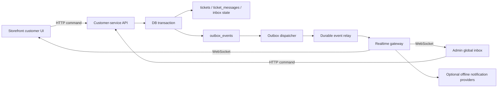

# Customer-Service Reliable Realtime Architecture

Last audited: 2026-08-16

This document defines the durable data and realtime delivery design for Public
Chat and the backoffice customer-service workspace. It supplements
`nuxt-i18n/docs/notes/CHAT-SYSTEM-ANALYSIS.md`; that document remains the
authority for storefront/admin ownership, customer access, and message
presentation contracts.

## 1. Decisions

1. Storefront customer chat and the backoffice customer-service workspace are
   separate products and bundles. They share persisted conversation facts and
   event contracts, never a staff UI component or a browser state store.
2. `tickets` with `category = customer_service` and `ticket_messages` remain
   the only durable conversation and message source of truth.
3. HTTP command and history APIs remain authoritative. Realtime only informs
   clients that they should reconcile persisted facts.
4. WebSocket is the formal browser realtime transport for customer service.
   It provides one persistent, bidirectional connection for realtime event
   delivery, heartbeat, reconnect cursor, and transient controls such as
   typing. HTTP remains the authoritative command and history interface.
5. WebSocket is the only browser realtime transport. There is no SSE endpoint,
   EventSource fallback, or HTTP typing fallback for customer service.
6. Durable customer-service events are written transactionally to the existing
   `outbox_events` table. A database commit must not leave a persisted message
   or conversation mutation without its corresponding durable event.
7. Typing and presence are transient. They are deliberately not written to the
   Outbox and may be dropped, expired, or superseded.

## 2. Current State and Gaps

The active browser clients use the product-scoped WebSocket routes. These are
the only customer-service realtime endpoints and must not share a browser state
store or authorization rule:

- storefront: `GET /api/v1/customer-service/ws?conversation_id=...`;
- backoffice: `GET /api/admin/customer-service/ws?scope=inbox|conversation`.

The original public `/ws` ping/pong foundation is replaced by the storefront
endpoint contract above. It is not a generic broadcast socket.

Before this design, the API wrote a message and then published directly to an
in-process `CustomerServiceEventHub`. That is sufficient for a single healthy
process as an acceleration layer, but it has four limits:

- a process restart between the database write and memory publish loses the
  notification;
- a bounded subscriber channel can drop a slow subscriber;
- separate API instances have separate in-memory subscriber maps;
- an earlier stream implementation did not provide the retained cursor and
  replay contract now required by WebSocket.

The persisted messages are not lost in those cases, but the administrator may
not be notified until another HTTP refresh happens. The following architecture
makes that recovery intentional rather than accidental.

## 3. Target Data Chain



The in-process event hub remains the local realtime gateway. The durable
Outbox bridge is the recovery source. Redis Streams now replaces only the
transport between the Outbox dispatcher and per-instance gateways; it does
not change client ownership or message facts.

### 3.1 Command-to-browser data chain

```text
Authorized HTTP command
  -> TicketService transaction
     -> tickets / ticket_messages / customer_service_inbox_states
     -> outbox_events(customer_service.realtime), in the same transaction
  -> immediate local CustomerServiceEventHub publish for normal latency
  -> active local WebSocket clients receive an invalidation

Outbox dispatcher
  -> CustomerServiceRealtimeOutboxHandler
  -> Redis Stream relay (when enabled)
  -> every API instance reads the Stream into its local EventHub
  -> WebSocket replay/live delivery with product, owner, and staff filters
  -> client deduplicates event_id, advances cursor, and refetches HTTP facts
```

The immediate publish is an acceleration path, not a second write path. The
same durable event identity and payload are used for the immediate event and
the later Outbox/Stream event. A client may observe both while its cursor
advances, but it must refresh persisted facts only once per `event_id`.

### 3.2 File responsibilities

The following ownership boundaries are intentional. New customer-service
realtime work should extend the responsible layer rather than adding another
parallel event format or browser store.

| Boundary | Long-term owner | Responsibility |
| --- | --- | --- |
| Durable commands and ownership | `internal/service/ticket_customer_service.go` | Transactional conversation/message/read/assignment/status mutations, customer or staff authorization, and matching Outbox insertion. |
| Event contract | `internal/service/customer_service_realtime_event.go` | Event types, audience boundary, deterministic event IDs, canonical constructors, semantic validation, and connection-local dedupe. `NewCustomerServiceMessageCreatedEvent` is the only producer for a message-created invalidation. |
| Local fan-out | `internal/service/customer_service_event_hub.go` | Per-process inbox/conversation subscriptions, bounded non-blocking delivery, recent-event suppression, and replay-provider delegation. It does not own event schema or Redis behavior. |
| Outbox bridge | `internal/service/customer_service_realtime_outbox.go` | Serialize the display-safe event envelope transactionally and reconstruct it for dispatcher delivery. It must not construct HTTP display DTOs. |
| Cross-instance relay | `internal/service/customer_service_realtime_relay.go` | Redis Stream idempotent append, per-instance `XREAD`, retained replay, and Stream cursor handling. It does not define business event validity. |
| Generic WebSocket transport | `internal/api/realtime/customer_service_websocket.go` | Upgrade, origin policy hook, heartbeat, outbound backpressure, framing, cursor delivery, and the restricted control parser. It has no public/admin authorization logic. |
| Storefront WebSocket adapter | `internal/api/v1/ticket/customer_service_websocket.go` and `internal/api/v1/ticket/customer_service_realtime.go` | Verify customer ownership before upgrade, restrict one conversation and the `public`/`both` audience, publish transient customer typing, and prepare scoped replay. |
| Backoffice WebSocket adapter | `internal/api/admin/customer_service_websocket_handler.go`, `internal/api/admin/customer_service_realtime.go`, and `internal/api/admin/customer_service_access.go` | Verify inbox/conversation scope, staff assignment, canonical role access, backoffice typing behavior, and prepare scoped replay. |
| Backoffice browser state | `web/admin/src/components/admin/customer-service/CustomerServiceFloatingInbox.vue` and `web/admin/src/composables/customerService/` | Global launcher badge/toast, modal workbench state, and HTTP reconciliation for staff. It must not be reused by storefront chat. |
| Storefront browser state | `nuxt-i18n/app/composables/chat/useCustomerServiceChatSync.ts` | Customer-owned conversation socket, transient agent typing, and HTTP history reconciliation. It must not import backoffice UI/state. |

## 4. Reliability Model

### 4.1 Durable facts

The following are durable business facts and must be persisted before an event
is emitted:

- `conversation.created`;
- `conversation.message.created`;
- `conversation.assigned`;
- `conversation.status.changed`;
- `conversation.messages.read`;
- `conversation.context.updated` when it represents a captured customer fact.

Each implemented durable mutation writes an idempotent typed Outbox event in
the same database transaction. The current producer scope is:

- `conversation.message.created` for customer, agent, welcome, and keyword
  reply messages;
- `conversation.messages.read` for an admin/support user's read cursor when it
  advances to a customer message;
- `conversation.assigned` for an explicit backoffice transfer that changes the
  assigned user and resets that user's inbox cursor.
- `conversation.status.changed` for the legacy same-owner transfer command
  when it advances a conversation from `open`, `closed`, or another non-active
  status to `in_progress` without creating a message or changing assignment.

Captured customer-context updates remain explicitly deferred until their
commands have matching transactional mutation identities. Status-only commands
outside the implemented same-owner transfer path remain deferred until their
write path also creates a durable mutation identity.
The event key is deterministic for the mutation, for example:

```text
customer_service.message.created:{message_id}
customer_service.messages.read:{ticket_id}:{reader_user_id}:{assignment_version}:{last_read_message_id}
customer_service.conversation.assigned:{ticket_id}:{assigned_to_user_id}:{assignment_version}
customer_service.conversation.status.changed:{ticket_id}:{status_version}
```

The same deterministic value is used as the realtime `event_id`. A retry can
therefore be recognized without relying on timing or message text.

`assignment_version` is scoped to the recipient's inbox-state row, so the
recipient id is required in assignment and read-event keys. It allows a
conversation to return to the same agent later without reusing a prior
assignment or read-receipt identity.

### 4.2 Transient facts

`conversation.typing`, agent online state, and draft state are transient UI
signals. They are scoped and authorized exactly like message reads, but are not
stored in `ticket_messages` or the Outbox. Every typing payload carries an
expiry and clients clear it locally even if a final `is_typing = false` signal
is lost.

### 4.3 Reconciliation is mandatory

No client may treat a WebSocket payload as its source of truth.
On initial open, realtime reconnect, browser `online`, and browser visibility
return, clients reconcile from their scoped HTTP reads:

- the admin global launcher refreshes its unread conversation count;
- the open admin workbench refreshes its visible conversation list and selected
  conversation facts;
- the storefront refreshes the customer-owned message history.

This is also the fallback for a dropped transient subscription event and a
deployment restart. A future cursor/replay endpoint reduces reconciliation
work; it does not remove the need for a final authoritative HTTP fallback.

## 5. Event Contract

The event body is shared by storefront and backoffice, while the WebSocket
transport wraps it with delivery metadata. The Outbox payload stores only
display-safe, minimum invalidation data; clients fetch the canonical HTTP
resource after delivery.

```json
{
  "type": "conversation.message.created",
  "event_id": "customer_service.message.created:481",
  "audience": "both",
  "ticket_id": 123,
  "conversation_id": "public-conversation-id",
  "occurred_at": "2026-08-16T10:00:00Z",
  "actor": {
    "kind": "customer",
    "user_id": null,
    "anonymous": true
  },
  "payload": {
    "message_id": 481
  }
}
```

The WebSocket event frame is:

```json
{
  "type": "event",
  "cursor": "1750000000000-0",
  "event": {
    "type": "conversation.message.created",
    "event_id": "customer_service.message.created:481",
    "audience": "both",
    "ticket_id": 123,
    "conversation_id": "public-conversation-id",
    "occurred_at": "2026-08-16T10:00:00Z",
    "actor": {
      "kind": "customer",
      "anonymous": true
    },
    "payload": {
      "message_id": 481
    }
  }
}
```

When an event advances the durable cursor but is filtered for the connected
product, the socket sends only:

```json
{
  "type": "cursor",
  "cursor": "1750000000000-1"
}
```

The server sends `{"type":"ready"}` after upgrade. The only valid client
application controls are `{"type":"ping"}` and
`{"type":"typing","is_typing":true}`. The server derives the target
conversation, actor, audience, and display name from the authorized socket;
clients may not include `ticket_id`, `conversation_id`, `audience`, or a
display name in a control frame. `ping` receives `{"type":"pong"}`.

Rules:

- `event_id` is stable for one durable mutation.
- `audience` is an explicit browser-product delivery boundary: `both` for
  shared persisted-message invalidations, `public` for customer-facing signals,
  and `backoffice` for staff-workspace signals. A missing audience on legacy
  durable messages is interpreted as `both`; unknown values are rejected.
- `ticket_id` is an internal scoped identifier; `conversation_id` is the
  customer-safe public identifier.
- event payloads must not contain raw visitor hashes, raw IP addresses,
  user-agent values, access tokens, or unfiltered customer context.
- rich message display payloads may be included for latency later, but every
  consumer must still tolerate a minimal invalidation payload.
- per-process realtime fan-out suppresses a recently delivered `event_id` so
  the immediate local publish and later Outbox recovery do not create duplicate
  user notifications.

### 5.1 Canonical message-created invalidation

`conversation.message.created` uses exactly one display-safe payload shape in
all paths:

```json
{"message_id": 481}
```

The HTTP command response and HTTP history endpoints may contain the full
message DTO, including rendering fields such as attachments and metadata. That
DTO must not be copied into the realtime event. This keeps local delivery,
Outbox recovery, Redis replay, and cross-instance delivery equivalent and
limits the data exposed by a stale or replayed event.

## 6. Subscription, Authorization, and Delivery

### Storefront

The customer opens a WebSocket only for one owned public conversation. The
server validates the authenticated account or signed visitor cookie before the
HTTP upgrade. Possession of a conversation id is never authorization. The
public socket receives only `both` and `public` events. It never receives
backoffice read receipts, routing/assignment changes, or customer-context
invalidations.

### Backoffice

The global launcher owns an inbox WebSocket while closed, so the unread badge
and notification toast update without navigating to a page. The open workbench
owns a single inbox socket and reloads the selected conversation as needed.
Admin/manager users can see all conversations; support users are restricted to
their assigned conversations on both HTTP reads and event delivery. The
backoffice socket receives only `both` and `backoffice` events; customer typing
and captured-context invalidations are therefore available to staff without
leaking those internal signals to the public chat.

### Offline notification

WebSocket works only while a browser page remains connected. A future
notification service may consume the same durable Outbox event to deliver Web
Push, email, or an enterprise notification. It must record recipient delivery
attempts independently and must not alter message persistence.

## 7. Multi-Instance Evolution

The current in-process hub is not a cluster bus. The implementation sequence
is deliberately incremental:

### Phase 1: Transactional event foundation

- Add a typed `customer_service.realtime` Outbox event.
- Write `conversation.message.created` events in the same transaction as
  customer, agent, and automatic-reply message persistence.
- Register an Outbox handler that re-emits the stored event through the local
  hub as a recovery path.
- Keep immediate local Hub publish for low latency for active WebSocket clients,
  using the same stable `event_id` so the local Hub suppresses duplicates.
- Reconcile client state when WebSocket reconnects.

### Phase 2: Recipient inbox state and durable reads

- Add `customer_service_inbox_states` keyed by recipient user and
  conversation. The current assignment model is user-to-conversation, so
  queue-level state is deferred until queues become a first-class routing
  target rather than inferred from an agent group.
- Store `last_read_message_id`, `unread_count`, `assignment_version`, and
  `last_read_at`. The read cursor is authoritative; `unread_count` is a
  materialized operational value that is reconciled from customer messages.
- Create/update an assigned support agent's state transactionally when a
  customer message arrives or a conversation is transferred. Admin/manager
  state is created lazily when that user reads a conversation, avoiding a row
  for every administrator and every historical conversation.
- During the one-time migration, legacy global `is_read` values are not
  translated into a staff cursor because they cannot identify who read a
  message. Existing customer messages for an assigned support agent are
  conservatively initialized as unread; each administrator/manager starts
  from the same dynamic unread view until they explicitly mark the
  conversation read.
- Backoffice unread filters and badge counts are scoped to the current user.
  `ticket_messages.is_read` remains a legacy row field and is not the source
  of truth for the customer-service workbench.
- An advanced read cursor writes a compact `conversation.messages.read` Outbox
  event in the same transaction. Reopening an already-read conversation is a
  no-op and creates no duplicate event.
- A backoffice transfer that changes owner resets the new owner's cursor and
  writes a compact `conversation.assigned` Outbox event in the same
  transaction. Reassigning to the current owner may retain its legacy status
  transition, but does not fabricate an assignment event. When that command
  actually changes status, it increments `tickets.status_version` and writes a
  backoffice-only `conversation.status.changed` Outbox event in the same
  transaction. Repeating the command after the conversation is already active
  is a no-op and reuses no event identity.

### Phase 3: Cross-instance relay and replay

Implemented for durable `conversation.message.created`, backoffice
`conversation.messages.read`, backoffice `conversation.assigned`, and the
backoffice same-owner-transfer `conversation.status.changed` events:

- `CUSTOMER_SERVICE_REALTIME_ENABLED=true` enables the Redis Stream relay.
  The production configuration and production environment template enable it
  together with `WORKER_OUTBOX_DISPATCH_ENABLED=true`. Local development may
  leave both disabled when it does not have a shared Redis deployment.
- Outbox dispatch appends one compact event to
  `customer_service:{realtime}:v1` and atomically records
  `event_id -> redis_stream_id` for 24 hours. If the worker crashes after
  `XADD` and before marking the Outbox row processed, retry returns the same
  Stream ID instead of appending another business event.
- Every API instance uses ordinary `XREAD` from its own cursor and fans the
  event out through its local `CustomerServiceEventHub`. Do not use a Redis
  consumer group here: a consumer group would distribute an event to one API
  instance, while every instance with an active realtime connection needs to
  observe it.
- Stream IDs are returned in the WebSocket envelope's `cursor` field and are
  passed as the explicit `last_event_id` query parameter when the browser
  reconnects. The deterministic business `event_id` remains the idempotency
  key and must not be replaced by the Stream ID.
- Each WebSocket connection subscribes before replaying at most
  `CUSTOMER_SERVICE_REALTIME_REPLAY_LIMIT` durable events. Replay and live
  delivery run through the same public conversation/admin assignment/audience
  filters, and a connection-local `event_id` set removes overlap duplicates.
- When a shared Stream event is filtered for a connected product, the socket
  emits only a `cursor` frame with the Stream ID. This advances the reconnect
  cursor without exposing the filtered event body, so a client does not
  repeatedly replay events belonging to the other product.
- Retention is bounded by `CUSTOMER_SERVICE_REALTIME_STREAM_MAX_LEN`. A stale,
  truncated, malformed, or otherwise unusable cursor simply produces no
  replay. The browser immediately reconciles through scoped HTTP reads, so it
  cannot be used as an authorization mechanism or a source of message truth.
- Redis Cluster deployments must retain a common hash tag in the configured
  stream name, such as `customer_service:{realtime}:v1`; the companion dedupe
  keys need that same slot for the atomic Lua operation.

The following are intentionally still local, best-effort Hub events until
their write commands have transactional Outbox producers: status changes
outside the same-owner transfer command, context invalidations, typing, and
presence. Do not write these request-end events directly to the Redis Stream,
because doing so would falsely label them durable and replayable. Storefront
customer-context capture is specifically local-only: its visitor-profile update
is not yet in the same transaction as a customer-service Outbox write.

### Phase 4: WebSocket cutover (active)

WebSocket is the formal customer-service connection layer. It has separate
public/backoffice endpoints, scoped subscriptions, exact-origin policy,
backpressure limits, protocol ping/pong, reconnect cursor behavior, and the
same authorization policy as HTTP. It does not turn WebSocket frames into a
second source of durable message truth: message/history commands remain HTTP
until a future request/reply protocol has matching idempotency and delivery
acknowledgement semantics.

The client-to-server WebSocket frame contract is intentionally narrow:

```json
{"type":"typing","is_typing":true}
```

The server derives the conversation and actor from the authenticated socket;
the client never chooses another conversation or audience through a frame.
`ping` is the only other accepted application control frame and receives a
`pong` frame. Durable message, transfer, read, and status mutations continue
to use their existing HTTP commands and transactionally generated Outbox
events.

## 8. Operational Requirements

- Production must enable the Outbox dispatcher and alert on pending, failed,
  and dead-letter customer-service realtime events.
- The Outbox worker interval is a recovery latency budget. Keep immediate local
  publish for normal chat latency; use an interval appropriate to recovery and
  relay requirements after capacity testing.
- Reverse proxies must pass WebSocket upgrades, preserve authenticated cookies,
  and allow connections longer than the heartbeat interval.
- Log only event metadata such as type, event id, ticket id, dispatch result,
  and lag. Do not log message bodies or private context in normal operational
  logs.
- A manual reconciliation command/runbook must exist before multi-instance
  rollout: pending Outbox events may be retried safely because their keys and
  deliveries are idempotent.

### 8.1 Production contract and fault drill

The checked-in production configuration and VPS environment template enable
the durable Relay. Configuration validation rejects an enabled Relay without
the Outbox dispatcher. A deployment must preserve the following contract:

1. Keep `CUSTOMER_SERVICE_REALTIME_ENABLED=true` and
   `WORKER_OUTBOX_DISPATCH_ENABLED=true` on every API replica. All replicas
   must use the same healthy Redis deployment. `worker.enabled` is unrelated
   Asynq machinery and is not required for the SQL Outbox scheduler.
2. Keep the configured Stream name on one Redis Cluster hash slot, for example
   `customer_service:{realtime}:v1`, and capacity-test retention, replay
   limit, connection count, and dispatcher lag.
3. Configure every reverse proxy/load balancer to pass WebSocket upgrades,
   preserve authentication cookies, honour the heartbeat lifetime, and forward
   the external scheme used by same-origin validation.
4. Alert on the following private `/metrics` series. Logs must contain metadata
   only, never message bodies or private customer context:

   ```promql
   commerce_platform_customer_service_realtime_outbox_events{status=~"pending|failed|dead_letter"}
   increase(commerce_platform_customer_service_realtime_relay_reads_total{result="redis_failed"}[5m])
   increase(commerce_platform_customer_service_realtime_websocket_connection_attempts_total{result="capacity_rejected"}[5m])
   increase(commerce_platform_customer_service_realtime_websocket_outbound_overflows_total[5m])
   ```

   Alert immediately for a non-zero `dead_letter`, page when `failed` persists
   for five minutes, and investigate a growing `pending` gauge before it
   reaches the Stream recovery budget. Connection and Relay error counters are
   rate alerts, not message-content telemetry.
5. Exercise the release fault drill: write on API instance A, receive on an
   admin browser connected to B, restart A or B, reconnect with a cursor, then
   verify the browser performs its authorized HTTP reconciliation. Repeat for
   a storefront-owned conversation to verify audience and ownership filters.

The required migration `166_customer_service_realtime_outbox_status_index`
keeps the short-interval Outbox status aggregation restricted to this event
type. Enabling only a WebSocket route is not equivalent to enabling the
durable Relay.

## 9. Acceptance Criteria

Phase 1 is complete when:

1. A successful customer, agent, or automatic-reply message transaction creates
   one typed Outbox event with a deterministic event key and message id.
2. A failed Outbox insertion rolls back the message transaction.
3. Normal local WebSocket delivery remains immediate and does not produce a
   duplicate refresh or toast when the Outbox recovery handler later runs.
4. Processing the same Outbox event repeatedly is safe for the local realtime
   hub and for clients that reconcile from HTTP.
5. Existing public/admin message, ownership, and permissions tests continue to
   pass.
6. Realtime reconnect causes the affected client to reconcile its HTTP facts.

The next implemented operation scope is complete when:

1. A read-cursor advance writes one compact, deterministic
   `conversation.messages.read` Outbox event in the same transaction.
2. A failed read-event insertion rolls back the cursor change.
3. An explicit transfer writes one compact, versioned
   `conversation.assigned` Outbox event in the same transaction as assignment
   and inbox-state reset.
4. A failed assignment-event insertion rolls back the ticket assignment,
   status transition, and new-assignee inbox state.
5. Immediate local Hub notification and later Redis Stream delivery use the
   same event id, so browser reconciliation is not duplicated.
6. A same-owner transfer that changes only status increments `status_version`
   and writes one backoffice-only `conversation.status.changed` Outbox event;
   a failed insert rolls back both the status and version.

## 10. Explicit Non-Goals for Phase 1

- Do not move message commands into WebSocket frames.
- Do not merge storefront and admin chat UI.
- Do not create a second chat/message table.
- Do not make `ticket_messages.is_read` pretend to be a per-agent receipt
  system.
- Do not introduce Redis Streams/NATS or a replay cursor before the typed
  Outbox producer and local recovery behavior are tested.
