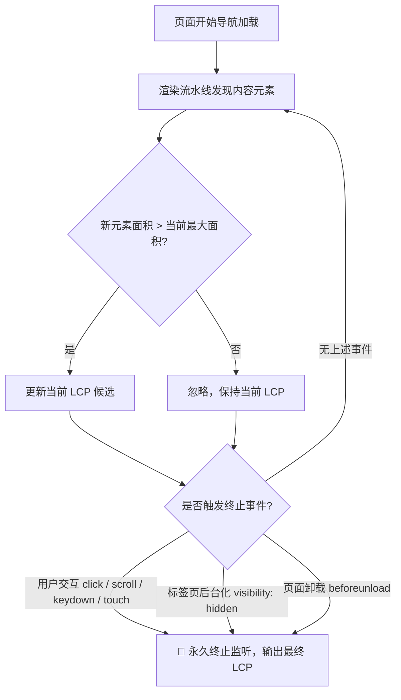

# 前端核心性能指标：LCP（最大内容绘制）底层机理与优化实战指南

> 本文档系统性拆解 Google Core Web Vitals 核心指标 **LCP (Largest Contentful Paint，最大内容绘制)** 的底层物理机制、W3C 规范计算规则、常见误区修正以及在 Nuxt 4 / Vue 3 项目中的工业级优化实战。

---

## 目录
1. [第一层面：LCP 的核心定义与元素候选集](#1-第一层面lcp-的核心定义与元素候选集)
2. [第二层面：“最大元素”的计算规则与规范修正](#2-第二层面最大元素的计算规则与规范修正)
3. [第三层面：排除规则与计算终止边界](#3-第三层面排除规则与计算终止边界)
4. [第四层面：浏览器底层持续监听与事件机制](#4-第四层面浏览器底层持续监听与事件机制)
5. [第五层面：Nuxt/Vue 实战陷阱与深度调优攻略](#5-第五层面nuxtvue-实战陷阱与深度调优攻略)
   * [5.3 当前项目：首页 Critical CSS 管线](#53-当前项目首页-critical-css-管线)
6. [LCP 四阶段耗时拆解与优化速查表](#6-lcp-四阶段耗时拆解与优化速查表)

---

## 1. 第一层面：LCP 的核心定义与元素候选集

### 1.1 什么是 LCP？
**LCP (Largest Contentful Paint)** 衡量的是**页面视口（Viewport）内最大可见内容元素渲染完成的时间点**。它反映了用户感知到页面“主要内容已经呈现”的速度。

根据 Google Core Web Vitals 评级标准：
* 🟢 **Good（良好）**：$\le 2.5 \text{s}$
* 🟡 **Needs Improvement（需要改进）**：$2.5 \text{s} \sim 4.0 \text{s}$
* 🔴 **Poor（较差）**：$> 4.0 \text{s}$

### 1.2 LCP 的候选元素类型
浏览器并不是对所有 DOM 节点都进行评估，只有以下 5 类内容元素会进入 LCP 候选池：
1. `` 元素；
2. `<svg>` 内部嵌套的 `<image>` 元素；
3. `<video>` 元素：
   * 包含 `poster` 属性时以封面图加载完成时间为准；
   * 未设置 `poster` 时，以视频第一帧（First Frame）绘制时间为准（Chromium 85+ 扩展支持）；
4. 通过 CSS `url()` 函数加载背景图片的元素（如 `background-image: url(...)`）；
5. 包含直接文本节点（Text Node）或行内文本子元素的**块级元素（Block-level Elements）**（如 `<h1>`~`<h6>`、`<p>`、`<div>`、`<ul>`、`<section>` 等）。

---

## 2. 第二层面：“最大元素”的计算规则与规范修正

### 2.1 面积计算的核心几何法则
浏览器计算元素大小时，度量的是其在**首屏视口（Viewport）内的可见外接矩形面积（Bounding Box Area）**：
$$\text{Area} = \text{Visible Width} \times \text{Visible Height}$$

* **视口裁剪**：被 `overflow: hidden` 裁剪掉的区域不计入面积；
* **屏幕外排除**：超出视口边界（屏幕下方或左右滚动区）的部分不计入面积；
* **边框与间距**：CSS `margin`、`padding` 以及 `border` 本身不作为内容面积，仅度量内容本体绘制区域。

---

### 2.2 ⚠️ 关键规范修正：图片/背景图的“双向限制”机制

> [!CAUTION]
> **常见认知误区**：很多人认为把一张小图标通过 CSS `background-size: cover` 拉伸铺满全屏，它的 LCP 面积就会变成整个全屏。**这是错误的！**

根据 W3C Paint Timing 及 Chromium 规范，为了防止开发者利用小图拉伸“作弊”骗取 LCP，浏览器对图片（含 `` 与背景图）的计算规则为：

$$\text{Reported Size} = \min(\text{实际渲染尺寸 (Rendered Size)}, \text{图片原始自然尺寸 (Intrinsic Size)})$$

* **案例 A（小图拉伸）**：
  一张原始宽高为 $100 \times 100\text{px}$ 的小图，被 CSS 强制拉伸放大至 $1920 \times 1080\text{px}$：
  $$\text{Reported Area} = \min(1920 \times 1080, 100 \times 100) = 10,000 \text{px}^2$$
  浏览器仅将其认定为 $10,000\text{px}^2$，绝不会被算作全屏！
* **案例 B（大图缩小）**：
  一张原始宽高为 $4000 \times 3000\text{px}$ 的高清图，在页面中以 $400 \times 300\text{px}$ 展示：
  $$\text{Reported Area} = \min(400 \times 300, 4000 \times 3000) = 120,000 \text{px}^2$$
  浏览器以其实际占用的视口渲染尺寸 $120,000\text{px}^2$ 计入。

---

### 2.3 为什么大文本块经常“夺走” LCP？
文本元素的尺寸是其内部所有文本节点所构成的**最小外接矩形**。
* 一篇排版良好的标题与正文段落（如 200 字、字号 18px、行高 1.6 的 `<p>` 标签），其外接矩形面积通常在 $800 \times 300 = 240,000\text{px}^2$ 以上；
* 一张常见的商品中等缩略图（如 $300 \times 300 = 90,000\text{px}^2$）；
* **结论**：在没有全屏超大高清 Banner 的页面中，**主标题或首屏段落文字往往才是真正的 LCP 元素**。

---

## 3. 第三层面：排除规则与计算终止边界

### 3.1 哪些元素严格不计入 LCP？
1. **不可见元素**：
   * 设置了 `display: none` 或 `visibility: hidden` 的元素；
   * 计算样式为 `opacity: 0` 的元素（防止预加载动画透明占位被误判为内容绘制）。
2. **非内容/纯装饰性元素**：
   * 空的 `<div>` / `<span>`（无文字、无图片背景）；
   * 仅有纯色背景（如 `background-color: #f00`）或 CSS 渐变（`linear-gradient`）的容器；
3. **独立图形上下文与矢量图**：
   * `<canvas>` 与 WebGL 动态绘制内容；
   * `<svg>` 中的矢量几何路径（`<path>`, `<rect>` 等非文字非嵌入图片元素）。

---

### 3.2 LCP 什么时候停止记录？（终止条件）



* **用户发生物理交互**：
  只要用户在页面发生 `click`、`scroll`（滚动）、`keydown`（按键）或 `touchstart`（触摸），浏览器判定用户已开始消费页面，**立刻永久停止记录新的 LCP 候选**。后续再异步渲染出多大的图都不再更新 LCP。
* **页面切换至后台**：
  当页面发生 `visibilitychange`（用户切 Tab 或最小化窗口至 `document.visibilityState === 'hidden'`）时，当前最大的候选即被固化为最终 LCP。

---

## 4. 第四层面：浏览器底层持续监听与事件机制

### 4.1 PerformanceObserver 监听模型
在 JavaScript 中，可以通过 Performance API 观测浏览器的 LCP 派发过程：

```typescript
const observer = new PerformanceObserver((entryList) => {
  const entries = entryList.getEntries();
  const lastEntry = entries[entries.length - 1];
  console.log('[LCP Candidate 更新]', {
    element: lastEntry.element,
    renderTime: lastEntry.renderTime || lastEntry.loadTime,
    size: lastEntry.size,
    url: lastEntry.url,
    id: lastEntry.id,
  });
});

observer.observe({ type: 'largest-contentful-paint', buffered: true });
```

### 4.2 单调递增性（Monotonic Growth）
* 浏览器的 LCP 监听器采用**贪心更新策略**：只有当新渲染出的元素面积 $\text{Area}_{\text{new}} > \text{Area}_{\text{current\_max}}$ 时，才会生成一条新的 Entry。
* 因此在整个加载生命周期中，候选元素的**面积是严格单调递增的**。

---

## 5. 第五层面：Nuxt/Vue 实战陷阱与深度调优攻略

### 5.1 字体加载陷阱（FOUT / FOIT 导致的 LCP 剧烈漂移）
* **陷阱现象**：
  若页面首屏最大元素为文字，在 Web Font（如自定义字体 `Outfit`）未下载完成前，浏览器使用 Fallback 本地系统字体渲染；当 Web Font 下载完成后发生重绘（FOUT，Flash of Unstyled Text）。
* **影响机理**：
  若 Fallback 字体与最终字体字形度量（Font Metrics）差异大，字体替换会导致文字换行变化、行高伸缩，导致**文本矩形面积改变**。如果面积变小，可能导致原本面积排第二的图片在后期“意外”成为 LCP 元素，导致 LCP 时间点大幅后延。
* **Nuxt 解决方案**：
  1. 使用 `@nuxtjs/fontaine` 或 CSS `size-adjust`、`ascent-override` 对 fallback 字体进行**零布局偏移微调**；
  2. 关键字体启用 `<link rel="preload" as="font" type="font/woff2" crossorigin>` 预加载。

---

### 5.2 SPA 异步请求链（Critical Request Chain）过长
* **SPA 痛点**：
  传统 SPA 必须经历：`HTML -> Download App.js -> Execute JS -> API Fetch -> Set Data -> Render DOM -> Download Image`，LCP 往往在 3~5 秒之后。
* **Nuxt 4 / SSR 优化方案**：
  1. **SSR 服务端直出**：在服务端直接渲染包含主要文本与图片占位的完整 HTML，将 LCP 提前至首屏 HTML 解析阶段；
  2. **在 `<head>` 中 Preload LCP 关键图片**：
     ```html
     <!-- 在 nuxt.config.ts 或页面 useHead 中注入 -->
     <link
       rel="preload"
       as="image"
       href="/images/hero-banner.webp"
       fetchpriority="high"
     />
     ```
  3. **千万不要给首屏 LCP 图片加懒加载**：
     首屏可视区域内的关键图片如果设置了 `loading="lazy"`，浏览器会推迟其请求直至布局完成，严重拖慢 LCP！必须设置 `loading="eager"` 并赋予 `fetchpriority="high"`。

### 5.3 当前项目：首页 Critical CSS 管线

本项目采用“Nuxt SFC 样式内联 + 首页 entry critical CSS 抽取”的组合策略，而不是把完整全局 CSS 直接塞进 HTML。

1. `nuxt.config.ts` 中 `features.inlineStyles` 显式限制为 Vue SFC 样式，避免 Nuxt SSR 内联策略未来变化时把全局入口 CSS 一并放大进首屏 HTML。
2. `scripts/storefront/generate-critical-css.ts` 在 `nuxt build` 后启动生产 SSR 服务，抓取 `/` 首页 HTML，根据首屏 DOM 的 class/id/tag inventory 从 `.output/public/_nuxt/entry.*.css` 中抽取首页需要的规则。
3. 抽取结果写入 `.output/server/critical-css/home-entry.css`，并默认受 `CRITICAL_CSS_MAX_GZIP_BYTES=16384` 的 gzip 体积预算约束。
4. `server/plugins/15-critical-css.server.ts` 在 Nitro `render:response` 阶段只改写首页 HTML：把阻塞型 `entry.*.css` 替换为内联 critical CSS、`preload as=style`、`noscript` fallback，以及一个异步完整 CSS loader。
5. `scripts/storefront/check-critical-css.ts` 校验首页不再阻塞加载 `entry.*.css`，确保弹窗、抽屉、搜索、购物车、复杂商品模块等二级 CSS 不会作为首页阻塞样式出现。

维护准则：不要直接开启无边界的全局 CSS 内联；新增首屏类名或结构后运行 `npm run build`，让 `generate:critical-css` 和 `check:critical-css` 一起验证预算与覆盖范围。

---

## 6. LCP 四阶段耗时拆解与优化速查表

根据 Chrome 官方性能模型，LCP 时间由 4 个子阶段组成：

$$\text{LCP} = \text{TTFB} + \text{Resource Load Delay} + \text{Resource Load Duration} + \text{Element Render Delay}$$

| 子阶段 | 定义说明 | 理想占比 | 核心优化手段 |
| :--- | :--- | :--- | :--- |
| **1. TTFB (首字节到达)** | 从发起请求到浏览器收到首包 HTML 的时间 | $< 40\%$ | CDN 边缘节点缓存、Nuxt 页面 HTML 缓存、Go 后端接口 Redis 缓存 |
| **2. 资源加载延迟 (Load Delay)** | TTFB 到浏览器开始请求 LCP 资源之间的间隔 | $< 10\%$ | 消除关键请求链、使用 `<link rel="preload">`、避免在深层 CSS 中隐藏背景图 |
| **3. 资源加载耗时 (Load Duration)** | LCP 资源（图片/字体）本身的网络传输耗时 | $< 40\%$ | 使用现代格式（WebP/AVIF）、IPX 响应式尺寸适配、启用 HTTP/2 或 HTTP/3 压缩 |
| **4. 元素渲染延迟 (Render Delay)** | 资源下载完成到最终 Paint 到屏幕上的延迟 | $< 10\%$ | 避免主线程长任务（Long Tasks）、减少首屏阻塞性 JS/CSS、避免高开销 Client-side Hydration |

---

### 💡 总结一句话准则
> **优化 LCP 的本质就是：让首屏最大的那一块内容（无论是大文本还是焦点图），以最短的请求链、最高的网络优先级（`fetchpriority="high"`）和最紧凑的资源体积，在用户发生任何交互前以最快速度 Paint 上屏。**
