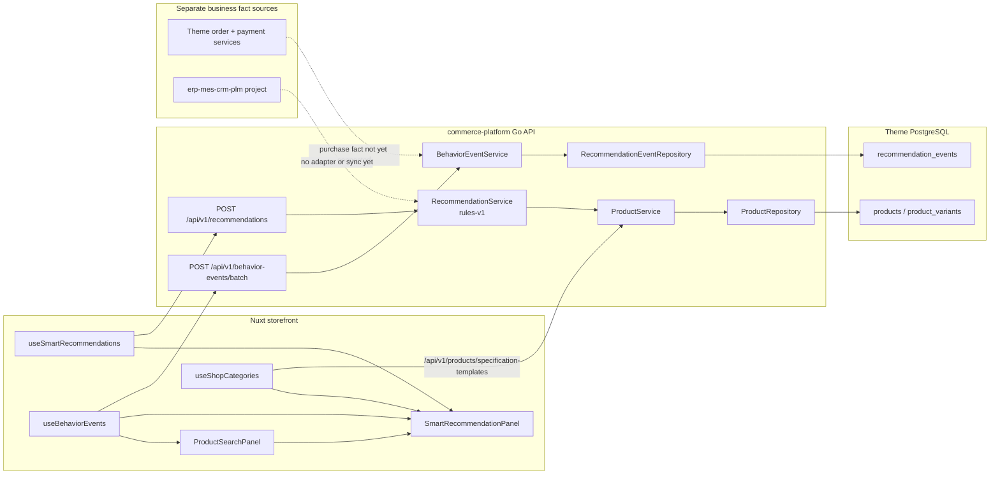

# Storefront 技术场景推荐系统设计

- 状态：Phase 0 / Phase 1 基线已实现，Phase 2 前置条件梳理中
- 适用范围：Storefront 独立站、Go 后端、Nuxt 3 前端、ERP 商品与库存数据
- 文档目的：统一用户行为采集、技术画像、推荐算法、库存联动和前端展示边界

## 1. 设计结论

Storefront 的推荐系统不能照搬服装、零食等普通电商的性别、年龄和泛兴趣推荐逻辑。碳纤维轮组和高端单车装备的核心决策因素是：

- 骑行场景
- 技术规格兼容性
- 配件互补关系
- 预算和客单价区间
- 当前库存与交付状态
- 用户处于选型、组装、升级还是维护阶段

推荐系统与用户画像有关，但二者不是同一个模块：

```text
前端行为事件
  -> 行为明细
  -> 技术兴趣特征
  -> 候选商品生成
  -> 兼容性与库存过滤
  -> 推荐排序
  -> Nuxt 推荐组件
```

用户画像是推荐系统的输入之一。推荐系统负责回答“这一次应该展示什么”，不负责保存所有客服和销售资料。

## 1.1 当前运行时架构

下面是当前代码真实存在的运行链路。它描述的是现在已经可以运行的基线，不把未来的画像、ERP 或模型能力提前画成已完成。



当前各节点的真实职责：

| 节点 | 当前职责 | 当前不承担的职责 |
| --- | --- | --- |
| `ProductSearchPanel` | 组织搜索输入、筛选、推荐点击和曝光事件 | 不计算推荐分数 |
| `SmartRecommendationPanel` | 复用产品 / 类目卡片布局，按可视区域记录产品曝光 | 不生成候选、不判断库存 |
| `useSmartRecommendations` | 调用推荐接口，处理超时和目录降级 | 不做画像聚合、不做兼容判断 |
| `useShopCategories` | 读取 `/products/specification-templates`，提供类目导航 | 不返回个性化类目推荐 |
| `RecommendationService` | 从公开商品目录生成 `rules-v1` 基线结果 | 不读取行为事件、用户画像、ERP、毛利或运输成本 |
| `BehaviorEventService` | 校验、幂等接收行为事实并追加写入 | 不在请求路径中聚合画像 |
| `ProductService` / `ProductRepository` | 提供主题商品目录和目录 variant 可售过滤 | 不代表 ERP 的库存事实 |
| 订单 / 支付服务 | 保存主题站订单、支付和退款相关事实 | 当前没有向推荐事件管道派生 `purchase` |
| `erp-mes-crm-plm` | 独立 ERP / MES / CRM / PLM 系统 | 当前没有与推荐服务建立库存适配器 |

### 1.2 当前基线的边界

当前 `RecommendationRequest` 保留了 `anonymous_id`、`session_id`、商品 / 类目上下文、查询词和路由字段，但 `rules-v1` 不消费这些字段进行排序。它们是后续个性化能力的稳定契约，不是当前已经存在的个性化行为。

当前推荐结果的商品候选路径是：

```text
active product
  -> 至少一个 active variant
  -> 至少一个 active variant stock > 0
  -> featured / view_count / created_at 规则排序
  -> 排除当前商品和明确排除 ID
  -> 返回 rule_fallback
```

当前搜索抽屉的类目路径是另一条链路：

```text
/api/v1/products/specification-templates
  -> ProductService
  -> ProductRepository
  -> 类目导航
```

类目导航和个性化商品推荐目前有意保持两个数据域。后续如果要推荐类目，应新增明确的类目推荐契约，不应把 `/products/specification-templates` 的返回结果偷偷解释成算法结果。

当前行为事件也只完成“事实采集”：

```text
Nuxt queue
  -> /api/v1/behavior-events/batch
  -> schema / identity / time / metadata validation
  -> event_id idempotency
  -> recommendation_events append-only table
```

事件表目前没有画像特征表、聚合任务、推荐缓存或转化归因任务。因此，不能从当前数据库里的事件数量直接得出“用户偏好”或“推荐带来成交”的结论。

### 1.3 下一阶段的结构约束

在 Phase 2 开始前，推荐服务可以继续保持当前的简单依赖；一旦接入个性化排序，不应继续把所有逻辑堆进 `RecommendationService`。新增能力应按以下边界进入：

```text
CatalogCandidateSource     商品目录候选
CompatibilitySource        规格兼容矩阵
InventoryAvailabilitySource ERP / 可售状态
FeatureSource               聚合后的技术兴趣特征
RelationSource              互补 / 替代 / 共购关系
RankingPolicy               版本化排序规则
ExperimentAssignment        稳定实验分桶
RecommendationAssembler     过滤、排序、理由和响应组装
```

推荐请求的固定顺序应保持为：

```text
读取上下文
  -> 候选生成
  -> 规格硬过滤
  -> 库存与交付状态过滤
  -> 排序策略
  -> 探索配额 / 实验分桶
  -> 解释理由
  -> 响应
```

任何一项前置事实尚未接入时，该项能力应停留在文档或离线实验，不得在前端临时补一套近似逻辑。

## 2. 目标与非目标

### 2.1 目标

1. 为搜索抽屉、首页、商品详情页和购物车提供统一的推荐结果接口。
2. 优先推荐技术上适配、库存可售、场景相关的商品。
3. 同时支持替代品、互补品和探索商品。
4. 对匿名用户、登录用户和新用户都能返回有效结果。
5. 在不阻塞 Nuxt 首屏渲染的前提下完成推荐读取。
6. 让后台能够解释推荐原因和查看核心指标。

### 2.2 非目标

1. 不在 Nuxt 前端实现核心推荐算法。
2. 不把客服访客画像直接作为推荐模型表。
3. 不把客户端传来的价格、库存和兼容性字段当作可信事实源。
4. 第一阶段不直接引入复杂机器学习模型。
5. 不采集信用卡号、支付凭证等敏感支付数据。

## 3. 模块边界

### 3.1 前端展示层

当前已抽取为独立组件：

- 文件：`app/components/SmartRecommendationPanel.vue`
- 职责：展示产品卡片、类目卡片、加载状态和点击行为
- 不负责：行为打分、候选商品生成、库存判断、用户画像计算

搜索抽屉通过 props 传入产品和类目，通过事件通知外层：

- `product-click`
- `category-click`
- `view-all`

后续首页、商品页或购物车只需要复用该组件，不需要复制推荐卡片布局。

### 3.2 Nuxt 数据层

当前实现：

```text
app/composables/useSmartRecommendations.ts
```

职责：

- 读取当前页面上下文
- 读取匿名会话和登录状态
- 调用推荐接口
- 处理加载、超时、空结果和降级
- 将推荐曝光与点击回传事件服务

推荐排序不放在该 composable 中。前端最多做展示数量限制和基础去重。

### 3.3 Go 推荐服务

建议按职责拆分：

```text
BehaviorEventService
RecommendationFeatureService
RecommendationCandidateService
RecommendationRankingService
RecommendationInventoryService
RecommendationCacheService
```

推荐接口只返回已经过滤和排序后的结果，前端不需要知道具体算法版本。

### 3.4 ERP 与库存

ERP 是库存、规格状态和交付状态的事实源。推荐系统可以使用缓存快照提升速度，但下单时必须再次使用实时库存校验。

### 3.5 前置条件与职责边界

在开始个性化画像、毛利排序和跨设备关联之前，下面这些事实源和职责必须先固定。没有这些前置条件时，推荐系统只能运行规则兜底，不能把推测结果当成业务事实。

| 前置条件 | 事实源 / 负责模块 | 推荐系统可以做什么 | 推荐系统不能做什么 |
| --- | --- | --- | --- |
| 商品、variant、类目和 URL | 商品目录与 Go 商品服务 | 读取可展示的商品信息 | 在前端自行拼接商品事实 |
| 规格兼容矩阵 | 产品技术配置 / 后台配置 | 读取兼容关系并过滤候选 | 根据标题相似度臆测兼容 |
| 库存和交付状态 | ERP，短期可使用目录库存快照 | 过滤缺货候选、读取状态 | 把客户端库存当事实，或绕过下单校验 |
| 行为事件 | `BehaviorEventService` | 聚合已接收的事件 | 在 Nuxt 里计算画像和排序 |
| 登录身份与匿名身份 | 认证、账户和用户同意流程 | 使用已授权的 `user_id` 或首方匿名 ID | 用 IP、设备指纹或客服标签永久缝合用户 |
| 订单完成事实 | 订单服务 / 支付后端 | 使用已确认订单做长期反馈 | 由前端 `purchase` 事件宣布成交 |
| 推荐候选、排序和理由 | Go 推荐服务 | 返回版本化、可解释的结果 | 把毛利、库存压力或隐私信息暴露给前端 |
| 展示位置和交互 | Nuxt 推荐组件 | 请求、展示、记录曝光和点击 | 修改推荐分数或覆盖服务端过滤 |

当前最需要补齐的前置数据不是“更复杂的模型”，而是：

1. 商品规格字段与技术类目的稳定 ID。
2. ERP 库存状态和目录 variant 的映射。
3. `purchase`、退款和取消订单的服务端事实接口。
4. 推荐关系（兼容、互补、替代）的维护入口和负责人。
5. 推荐实验的稳定分桶、控制组和增量毛利统计口径。

在这些条件完成前，画像服务、商业排序和跨设备概率缝合都应保持关闭或仅在离线实验环境运行。

## 4. 技术型用户画像

### 4.1 显性技术画像

这些字段来自用户主动选择、搜索、计算器和购买行为：

| 维度 | 示例 |
| --- | --- |
| 骑行场景 | Road、Gravel、MTB、TT、Climbing |
| 制动类型 | Disc、Rim |
| 塔基规格 | HG、XDR、N3W |
| 外胎系统 | Tubeless、Clincher |
| 轮径 | 700C、650B、29er |
| 框高偏好 | 38mm、50mm、60mm |
| 花鼓偏好 | DT 240、350、陶瓷花鼓 |
| 辐条偏好 | Sapim CX-Ray、标准圆辐条 |
| 预算区间 | 入门、性能、高端、定制 |
| 购买阶段 | 了解、比较、准备购买、组装、维护 |

### 4.2 隐性行为画像

这些字段由行为事件聚合产生：

- 最近 7 天和最近 30 天浏览过的类目
- 具体产品和规格的浏览次数
- 商品页有效停留时长
- 产品规格区块和技术 FAQ 的展开行为
- 辐条计算器使用次数及输入规格
- 搜索词和筛选条件
- 加购、心愿单、开始结算和购买
- 对不同价格区间的点击和加购倾向
- 互补配件的浏览顺序

画像不保存“用户喜欢某个商品”这一句不可解释的结论，而是保存可重新计算的特征，例如：

```text
interest.gravel = 0.82
interest.rim_depth_38 = 0.71
compatibility.freehub.xdr = 0.95
price_band.high = 0.64
stage = comparison
```

## 5. 行为事件字典

建议建立统一事件入口：

```http
POST /api/v1/behavior-events/batch
```

事件公共字段：

| 字段 | 说明 |
| --- | --- |
| `event_id` | 客户端生成的幂等 ID |
| `event_type` | 事件类型 |
| `occurred_at` | 客户端发生时间 |
| `anonymous_id` | 首方匿名访客 ID |
| `session_id` | 当前会话 ID |
| `user_id` | 登录用户 ID，可为空 |
| `locale` | 当前语言 |
| `path` | 当前页面路径 |
| `referrer` | 来源页面或来源组件 |
| `product_id` | 商品 ID，可为空 |
| `category_id` | 类目 ID，可为空 |
| `metadata` | 经过白名单过滤的扩展字段 |

核心事件：

| 事件 | 触发条件 | 主要用途 |
| --- | --- | --- |
| `page_view` | 页面进入并完成基础加载 | 场景和页面兴趣 |
| `product_view` | 商品详情数据加载并进入商品页 | 商品页到达事实 |
| `product_dwell` | 离开商品页或页面隐藏 | 有效停留时长 |
| `search_submit` | 提交产品或 FAQ 搜索 | 需求识别 |
| `filter_apply` | 应用技术筛选 | 显性规格偏好 |
| `calculator_use` | 使用辐条或相关计算器 | 技术用户强信号 |
| `recommendation_impression` | 推荐卡片进入可视区域 | 统计曝光 |
| `recommendation_click` | 点击推荐卡片 | 统计点击和推荐来源 |
| `category_navigation_click` | 点击公开商品类型导航 | 统计目录导航，不计入推荐点击 |
| `add_to_cart` | 成功加入购物车 | 强购买意向 |
| `wishlist_add` | 加入心愿单 | 中强购买意向 |
| `begin_checkout` | 进入结算 | 高购买意向 |
| `purchase` | 订单完成 | 转化和长期价值 |
| `quiz_completed` | 完成骑行场景测验 | 冷启动画像 |

### 5.1 页面停留的采集规则

不要每秒向后端发送停留事件。建议：

1. 商品详情数据加载后发送一次 `product_view`；有效兴趣由 `product_dwell` 的时长判断。
2. 页面离开、切换标签页或组件卸载时发送 `product_dwell`。
3. `product_dwell.duration_seconds` 限制最大值为 30 分钟，避免页面忘记关闭造成脏数据。
4. 超过 15 秒且页面仍然活跃时，可以使用低频 heartbeat。
5. 客户端事件只作为行为事实，服务端负责校验时间、频率和关联对象。

### 5.2 推荐曝光必须记录

只记录点击而不记录曝光，无法判断推荐是否有效。每一批推荐结果需要带：

- `recommendation_request_id`
- `recommendation_slot`
- `algorithm_version`
- `candidate_reason`

这样后台才能计算：

- 曝光到点击率
- 点击到加购率
- 推荐商品转化率
- 推荐带来的收入
- 某类库存缺失导致的点击损失

### 5.3 当前接入状态与事件语义

当前已经接入前端采集和后端批量接收的事件：

- `product_view`、`product_dwell`：商品页浏览和有效停留。
- `search_submit`、`filter_apply`：产品 / FAQ 搜索和技术筛选。
- `recommendation_impression`、`recommendation_click`：推荐展示和点击，带推荐请求 ID、槽位和算法版本。
- `category_navigation_click`：商品类型导航点击，保持与个性化推荐点击分离。
- `add_to_cart`：当前表示用户发起加购。购物车为了保持即时反馈会先更新本地状态，再异步同步后端，因此该事件不能单独作为“后端已确认加购”的事实。
- `wishlist_add`：仅在加入心愿单接口成功后发送。
- `begin_checkout`：当前购物车存在商品并进入结算时发送。
- `calculator_use`：计算器成功完成至少一个轮组计算后发送，同一组参数在当前页面会去重。

`purchase` 暂不由 Nuxt 发送。订单完成、支付成功、取消和退款应以后端订单事实为准，再由后端写入或派生推荐分析事件。推荐排序在使用 `add_to_cart` 前，应把它视为高意向行为信号，而不是成交事实。

## 6. 冷启动策略

### 6.1 完全新访客

默认使用规则兜底，不允许推荐区域空白：

1. 当前库存可售的全局高质量商品
2. 当前骑行季节或站点主推商品
3. 按 Road、Gravel、MTB 等场景分组的代表商品
4. 高质量互补配件组合

“爆款”必须通过真实销量、库存状态、退货率和转化率定义，不使用写死的商品名称。

### 6.2 极简骑行场景测验

可以在搜索抽屉或推荐区提供可关闭的轻量测验，不应强制拦截用户：

```text
What are you building for?
Road Aero / Gravel / Climbing / MTB
```

第一版只收集 2 到 3 个高价值问题：

- 骑行场景
- Disc 或 Rim
- 预算或框高偏好

测验结果直接生成初始技术画像，不需要等待用户登录。

### 6.3 登录用户和匿名用户合并

登录前的 `anonymous_id` 在用户登录后进行安全合并，不能直接覆盖已有用户历史。合并规则需要：

- 保留事件原始来源
- 防止同一事件重复计算
- 支持用户删除行为历史
- 不把客服会话身份自动视为购买身份

## 7. 推荐候选集

候选生成顺序建议如下：

1. 技术规格完全兼容的匹配商品
2. 最近浏览和搜索相关商品
3. 同类替代品
4. 互补品
5. 同场景热门商品
6. 新品和探索商品
7. 全局规则兜底

### 7.1 替代品

用于帮助用户比较：

- 相同或相近场景
- 相同制动和塔基规格
- 不同框高、重量或价格

替代品不应占满整个推荐区，因为它们通常只会争夺同一笔订单。

### 7.2 互补品

互补品是提升客单价的主要位置：

- 碳纤维轮组 -> 备用辐条、气嘴、维护配件
- 特定花鼓 -> 对应塔基、保养件和工具
- Tubeless 轮组 -> 真空胎相关配件
- 自编轮用户 -> 辐条、铜帽、花鼓和计算器工具

互补关系应来自商品规格、人工配置和真实共购数据，不能只根据商品标题相似度推断。

### 7.3 推荐区槽位

建议在搜索抽屉底部使用固定槽位，而不是无限堆卡片：

```text
50% 技术匹配
30% 互补配件
20% 探索或新品
```

如果用户正在查看一款具体商品，可以将展示标题改为：

- Complete your build
- Compatible components
- Explore another setup

## 8. 第一版规则排序

第一版先使用可解释、可调参的规则算法：

```text
总分 =
  技术兼容性 * 0.30
  + 最近意图 * 0.22
  + 有效停留 * 0.15
  + 加购/心愿单 * 0.15
  + 互补价值 * 0.10
  + 新鲜度 * 0.08
```

注意：

- `add_to_cart` 和 `purchase` 的信号强于普通浏览。
- 最近行为需要时间衰减。
- 当前商品、已购买商品和明显不兼容商品必须先过滤。
- 分数只用于同一槽位内部排序。
- 互补品不应和替代品使用完全相同的排序规则。

建议为每条结果保留解释原因：

```json
{
  "reason": "compatible_freehub",
  "reason_label": "Matches your selected freehub",
  "slot": "technical_match"
}
```

### 8.1 区分好奇点击与真实购买意图

普通点击不能直接等价为强需求。技术装备站尤其容易出现“误触、对比、好奇查看”被误判的问题。

建议使用“操作深度 + 时间衰减”计算意图分：

```text
intent_score =
  action_depth_weight
  * exp(-ln(2) * event_age / half_life)
```

第一版可以使用以下可配置权重：

| 行为 | 初始权重 | 说明 |
| --- | ---: | --- |
| 仅点击浏览 | 0.1 | 弱信号 |
| 展开 Technical Specs | 0.5 | 有明确技术比较意图 |
| 点击花鼓或棘轮对比 | 0.5 | 有规格研究意图 |
| 使用 Spoke Calculator | 2.0 | 强技术购买信号 |
| 加购或收藏 | 5.0 | 绝对强意图信号 |

非转化浏览行为建议使用 48 小时半衰期。半衰期必须放在版本化配置中，而不是散落在代码里的常量。

注意：

- `product_view` 只能说明“看过”，不能直接改变长期画像。
- 同一商品连续刷新不能无限累加权重。
- `add_to_cart`、`wishlist_add` 和 `purchase` 需要去重并保留事件顺序。
- 高意图事件仍然需要经过库存、规格和购买阶段校验。

### 8.2 毛利率、库存和运输成本

推荐系统不能只优化 CTR。商业排序应当优化增量毛利、库存周转和成交质量，但技术适配必须是硬门槛。

推荐顺序应为：

```text
技术兼容性硬过滤
  -> 库存与交付状态过滤
  -> 基础意图排序
  -> 商业价值微调
```

不建议直接使用未经限制的公式：

```text
匹配度 * 毛利率 * 库存系数 / 重量
```

因为这可能让一个高毛利但不适配的商品压过真正合适的商品。建议使用有上限的商业微调：

```text
business_score =
  fit_score
  * (1 + capped_margin_bonus)
  * (1 + capped_inventory_bonus)
  * logistics_factor
```

商业因子建议使用区间或等级，而不是把成本明细暴露给前端：

- `margin_band`
- `inventory_band`
- `shipping_band`
- `fulfillment_status`

毛利和库存倾斜必须有上限，例如只允许在通过技术适配后影响最终排序的 10% 到 20%。后台需要同时观察：

- 推荐点击率
- 推荐加购率
- 增量毛利
- 库存周转
- 运输成本
- 退货和售后率

目标不是让高毛利商品无条件获得曝光，而是在用户可接受的候选集中优化商业价值。

### 8.3 跨设备身份缝合

跨设备识别分为确定型和概率型，两者不能混用：

#### 确定型缝合

可以使用：

- 登录后的 `user_id`
- 用户主动验证的 Email
- 结算或询价流程中的已确认身份
- 用户明确同意的账户绑定

合并时需要保留原始 `anonymous_id`、事件来源和合并时间，避免重复计算。

#### 概率型缝合

不建议使用 IP、浏览器指纹或设备指纹在用户不知情的情况下建立长期推荐身份。它存在误合并、隐私和合规风险，也可能把家庭、公司或公共网络中的不同用户错误串联。

匿名阶段应优先使用：

- 首方 `anonymous_id`
- `session_id`
- 用户主动输入并同意关联的 Email
- 结算或询价生成的安全 token

IP 和设备信息可以作为安全日志或粗粒度流量分析字段，但不应作为推荐系统的永久身份主键。

### 8.4 防止推荐系统自我归因

推荐曝光后的成交不等于推荐带来的增量成交。必须支持稳定的实验分桶：

```text
用户或匿名访客
  -> 稳定 experiment_id
  -> control / treatment bucket
  -> 推荐曝光与订单归因
```

第一版可以采用：

- 90% 用户看到算法推荐
- 10% 用户看到热门、场景或人工配置的基线推荐

分桶必须基于稳定的用户或匿名 ID，不能每次请求重新随机。实验事件至少记录：

- `experiment_id`
- `bucket`
- `recommendation_request_id`
- `algorithm_version`
- `order_id`

主要比较指标应是：

- 增量转化率
- 增量加购率
- 增量毛利
- 每会话收入
- 互补品附加购买率

CTR 只能作为诊断指标，不能作为推荐系统唯一成功标准。

### 8.5 高并发、缓存和图计算

协同过滤、共购图和用户商品矩阵不能放在每次推荐请求中实时计算。推荐请求只读取已经预计算或增量更新的候选结果。

建议的缓存层次：

```text
L1: Go 进程内缓存，保存最热的场景和商品关系
L2: Redis，保存用户或匿名会话的短 TTL 推荐结果
L3: 异步 Worker，更新关系图、特征和批量候选集
```

实现注意：

- 使用有上限的 Worker Pool，禁止每个请求无限创建 goroutine。
- 使用 `singleflight` 或等价机制防止缓存击穿。
- TTL 增加随机抖动，避免同一时刻集中失效。
- 共浏览、共购和兼容矩阵采用离线或增量更新。
- Bloom Filter 或位图只能作为快速排除工具，不能替代 ERP 和订单事实表。
- Bloom Filter 存在误判，最终候选仍需进行精确校验。

BigCache、Redis 和位图是否都需要，要根据真实 QPS、候选规模和 p95 延迟测量决定，不在第一阶段过度建设。

### 8.6 可解释推荐与买家控制感

高阶装备买家通常希望自己做技术决策。推荐区不能表现得像黑盒广告，也不要反复使用“为您推荐”。

推荐理由应来自真实数据和规则，例如：

- `Based on your interest in DT 240 EXP hubs`
- `Optimized for 28mm Tubeless Road Setups`
- `Compatible with your selected XDR freehub`
- `Completes the build with matching maintenance parts`

前端响应中应保留机器可读的 `reason`，再由前端根据语言显示 `reason_label`。推荐理由不能暴露毛利、库存压力或用户隐私信息。

建议提供轻量控制：

- 不感兴趣
- 暂时隐藏此类目
- 清除推荐偏好
- 查看推荐依据

## 9. 80% 匹配与 20% 探索

探索不是随机乱推，而是有约束地扩大视野：

- 至少保留一个新品或不同场景商品槽位
- 探索商品必须满足基础库存和安全兼容性
- 已经连续多次曝光但没有点击的商品降权
- 新品获得有限曝光预算
- 对不同用户和不同页面使用不同探索比例

80/20 是第一版起点，不是永远固定的比例。后台需要通过 A/B 测试验证。

## 10. 库存与 ERP 联动

推荐流程中必须先做库存和状态过滤：

```text
候选生成
  -> 商品状态过滤
  -> ERP 库存快照过滤
  -> 规格兼容性过滤
  -> 排序
  -> 返回结果
```

建议区分：

- `in_stock`：正常推荐
- `low_stock`：可以推荐，但需要提示
- `preorder`：可以推荐，但必须显示预售状态
- `out_of_stock`：默认不推荐
- `inactive`：禁止推荐

缓存命中时，推荐读取可以把 10ms 作为目标，但这只是推荐服务读取目标，不是整个页面渲染的硬保证。结算和下单仍然需要实时库存校验。

## 11. 推荐接口建议

### 11.1 获取推荐

```http
POST /api/v1/recommendations
```

请求示例：

```json
{
  "surface": "shop_search_drawer",
  "locale": "en",
  "anonymous_id": "anon_xxx",
  "session_id": "session_xxx",
  "context": {
    "product_id": null,
    "category_id": null,
    "query": "",
    "route": "/"
  },
  "limit": 6,
  "exclude_product_ids": []
}
```

响应示例：

以下商品 URL 统一使用扁平的 `/products/:slug`；推荐接口不得输出
`/shop/:slug` 商品地址。

```json
{
  "request_id": "rec_req_xxx",
  "algorithm_version": "rules-v1",
  "expires_at": "2026-07-28T12:00:00Z",
  "items": [
    {
      "product_id": 123,
      "title": "Carbon Wheelset",
      "url": "/products/carbon-wheelset",
      "thumbnail": "/media/carbon-wheelset.webp",
      "price_label": "$1,299",
      "slot": "technical_match",
      "reason": "scene_and_spec_match"
    }
  ]
}
```

### 11.2 前端使用原则

Nuxt 只处理：

- 请求推荐结果
- 超时降级
- 组件展示
- 曝光和点击回传

Nuxt 不处理：

- 用户画像打分
- 商品兼容性判断
- ERP 库存判断
- 推荐排序

## 12. 数据表建议

### 12.1 `recommendation_events`

追加写入的行为事实表。不要直接覆盖历史。

核心字段：

```text
id
event_id
event_type
anonymous_id
session_id
user_id
product_id
category_id
path
locale
metadata_json
occurred_at
received_at
```

### 12.2 `recommendation_user_features`

保存可重新计算的用户技术兴趣特征：

```text
user_id / anonymous_id
feature_key
feature_value
confidence
source_window
updated_at
```

### 12.3 `recommendation_product_relations`

用于保存人工关系和统计关系：

```text
source_product_id
target_product_id
relation_type
compatibility_score
confidence
source
updated_at
```

`relation_type` 示例：

- `compatible`
- `complementary`
- `substitute`
- `co_viewed`
- `co_cart`

### 12.4 与访客画像隔离

现有访客画像主要面向客服上下文和销售查看。推荐系统可以读取经过授权的必要字段，但不能把客服标签、会话内容和商品兴趣混成同一套推荐特征。

## 13. 缓存与预计算

建议采用分层缓存：

1. 全局热门和场景默认推荐：定时预计算
2. 商品关系和兼容矩阵：内存或 Redis 缓存
3. 登录用户画像特征：事件触发更新或短周期批量更新
4. 匿名用户实时推荐：轻量规则计算加短 TTL 缓存
5. ERP 库存：使用短 TTL 快照，结算时实时确认
6. 复杂共购图和用户商品矩阵：低峰期异步增量更新

推荐接口必须具备降级顺序：

```text
个性化推荐
  -> 场景推荐
  -> 热门商品
  -> 手工配置商品
  -> 空结果
```

只有所有候选都不可售时才允许空结果。

## 14. 后台与可解释性

后台不需要一开始就展示复杂模型图，但至少需要：

- 用户当前技术兴趣标签
- 最近行为时间线
- 推荐请求和算法版本
- 每个商品的推荐原因
- 库存过滤原因
- 推荐曝光、点击、加购和成交
- 推荐接口延迟和空结果率

销售看到的“客户偏好”与算法使用的原始事件需要分开显示，避免把推测当成事实。

## 15. 关键指标

### 15.1 推荐质量

- 推荐曝光率
- 推荐点击率
- 推荐商品加购率
- 推荐商品成交率
- 推荐收入占比
- 互补品附加购买率
- 推荐空结果率
- 不兼容商品点击率

### 15.2 系统质量

- 推荐接口 p50、p95 延迟
- 缓存命中率
- ERP 库存误差率
- 事件接收失败率
- 事件重复率
- 客户端首屏阻塞次数

“客单价提升 15% 到 20%”应作为实验假设，通过这些指标验证，不能在算法上线前视为承诺。

## 16. 分阶段落地路线

### Phase 0：契约与数据基础

- 固定事件字典
- 已完成 `POST /api/v1/behavior-events/batch` 批量接收接口
- 已完成前端首方 `anonymous_id`、`session_id` 和事件幂等 ID 生成
- 已完成事件时间窗口、批量大小、metadata 类型和字段长度校验
- 已完成可选登录用户 ID 透传
- 已完成商品页、搜索抽屉、推荐区和部分高意图操作的第一批事件接入
- 固定推荐请求和响应结构
- 完成匿名 ID、会话 ID 和登录合并规则
- 商品规格和库存状态映射仍需由商品 / ERP 负责人确认

### Phase 1：规则推荐

- 接入商品浏览、搜索、筛选、加购意图、收藏、开始结算和计算器事件
- 实现热门、场景、最近浏览和手工配置推荐
- 实现目录层的基础可售过滤
- 接入 `SmartRecommendationPanel`
- 记录推荐曝光和点击

当前已先完成 Phase 1 的最小闭环：

- `POST /api/v1/recommendations` 已提供 `rules-v1` 基线结果
- 候选只来自 `active` 商品，并要求至少一个活动 variant 有库存
- 排序使用精选、浏览量和创建时间，暂不使用用户画像、毛利、运输成本或客户端库存
- 当前库存过滤读取商品目录 variant 状态，不等于 ERP 实时库存联动
- 支持排除当前商品和已知商品 ID
- Nuxt 搜索抽屉优先读取推荐接口，接口不可用时回退到公开商品目录
- 推荐请求 ID和算法版本会随曝光、点击事件回传

这不是个性化排序的完成标志。当前请求中的匿名 ID、session ID 和页面上下文先作为契约保留，尚未用于实时画像打分。

### Phase 2：技术兼容与互补关系

- 建立商品规格兼容矩阵
- 增加替代品和互补品关系
- 补齐 Technical Specs 和技术 FAQ 行为
- 增加推荐原因解释

### Phase 3：用户技术画像

- 聚合登录和匿名用户特征
- 增加可关闭的骑行场景测验
- 增加用户级短 TTL 推荐缓存
- 增加后台画像和推荐诊断

### Phase 4：实验与模型

- 80/20 探索策略 A/B 测试
- 规则权重自动调参
- 共购、共浏览关系更新
- 数据量足够后再评估协同过滤或模型排序

## 17. 当前实现状态

已完成：

- 前端推荐区独立为 `SmartRecommendationPanel`
- 搜索抽屉通过 props 和事件接入
- 推荐 UI 与搜索输入、筛选状态解耦
- 推荐数据读取独立为 `useSmartRecommendations`
- 推荐基线使用公开商品目录接口，不再依赖客服商品接口
- Go 后端行为事件表、repository、service 和批量 API
- 行为事件支持匿名 ID、session ID 和可选登录用户 ID
- 行为事件支持客户端幂等、批量限制、时间窗口和 metadata 校验
- 商品页已接入 `product_view`、`product_dwell`
- 搜索抽屉已接入 `search_submit`、`filter_apply`
- 推荐区已接入 `recommendation_impression`、`recommendation_click`
- 购物车已接入 `add_to_cart`、`begin_checkout`；其中 `add_to_cart` 是乐观的用户意图事件
- 收藏已接入成功后的 `wishlist_add`
- 辐条计算器已接入成功计算后的 `calculator_use`，并对相同参数去重
- Go 后端已提供 `POST /api/v1/recommendations` 规则兜底接口
- 推荐候选已接入基础可售过滤和排除 ID
- Nuxt 推荐 composable 已优先读取 Go 推荐接口，并保留公开目录降级
- 推荐请求 ID、算法版本和 `recommendation_source` 已进入推荐曝光、点击 metadata
- 类目导航使用独立的 `category_navigation_click` 事件，不再混入推荐点击统计
- 开发环境示例商品和示例类目只用于展示，不写入行为事实
- service 和 handler 层已有行为事件测试
- recommendation service 和 handler 层已有规则推荐测试
- Nuxt 构建通过

尚未实现：

- 技术画像聚合
- 基于行为事件的个性化推荐接口
- 商品规格兼容性硬过滤
- ERP 库存过滤服务
- 推荐缓存
- 推荐曝光和转化统计
- 跨设备确定型身份合并
- 实验分桶和增量归因
- ERP 毛利、库存周转和运输成本字段

### 17.1 前置条件审计

| 前置条件 | 当前状态 | 是否阻塞算法 |
| --- | --- | --- |
| 推荐卡片展示组件 | 已完成，独立组件 | 否 |
| 推荐数据读取层 | 已完成，独立 composable | 否 |
| 公开商品目录数据源 | 已有 `/products` 基础接口 | 否，适合基线推荐 |
| 类目与商品规格模板 | 已有公开接口 | 否，需补充规格映射 |
| 浏览历史 | 本地浏览历史仍是独立业务能力；推荐行为事件已开始记录 | 是，不能单独代替推荐特征聚合 |
| 页面停留和操作深度 | 页面停留、计算器和加购意图已接入；Technical Specs 等深度事件仍需逐项接入 | 是，阻塞完整意图评分 |
| 加购、收藏、开始结算、购买行为事件 | 加购、收藏和开始结算已接入；`purchase` 仍需以后端订单事实为准 | 是，阻塞购买意图排序 |
| 匿名 ID 与 session ID | 已统一为首方 localStorage/sessionStorage 契约 | 否，跨设备合并仍受限 |
| 跨设备合并 | 尚未定义确定型身份和同意流程 | 是，阻塞跨设备画像 |
| ERP 库存状态 | 当前推荐已使用商品活动 variant 库存；ERP 事实源和实时校验尚未接入 | 部分阻塞，当前只能做站内基础可售过滤 |
| 毛利、周转和运输成本 | 尚未作为推荐授权字段提供 | 是，阻塞商业排序 |
| A/B 分桶 | 尚无稳定实验分流 | 是，阻塞增量归因 |
| 客服访客画像 | 已存在，但属于客服上下文域 | 否，必须保持隔离 |

### 17.2 当前可以开始和不能开始的部分

现在可以开始：

1. 商品规格兼容矩阵的数据映射。
2. 规则推荐的候选生成和库存过滤。
3. 加购、收藏、开始结算和计算器等深度事件的前端接入；`purchase` 由后端订单事实提供。
4. 行为事件消费和技术兴趣特征聚合。
5. 推荐请求、曝光、点击与订单归因的关联字段。

现在不应开始：

1. 复杂协同过滤或用户商品矩阵。
2. 依赖毛利率的最终排序。
3. 跨设备概率身份缝合。
4. 没有 control bucket 的“推荐转化率”结论。
5. 直接读取客服访客画像进行商品推荐。

当前搜索抽屉仍使用热门商品和类目作为数据来源，这是第一阶段的展示兜底，不代表最终的个性化算法。

## 18. 需要先确认的产品决策

在开始后端开发前，需要锁定：

1. 第一批支持的骑行场景和技术规格字段。
2. 哪些配件关系由人工维护，哪些由真实共购数据生成。
3. 预售商品是否允许进入推荐。
4. 匿名行为保留时长和用户删除机制。
5. 推荐结果是否允许展示价格。
6. 搜索抽屉底部推荐展示几个产品和几个类目。
7. 首页、商品页和搜索抽屉是否使用不同的推荐槽位。
8. 推荐接口的首版性能目标和降级策略。
9. 毛利、库存和运输成本因子的最大影响上限。
10. 跨设备关联采用哪些确定型身份和用户同意流程。
11. A/B 测试的 control bucket 内容和实验周期。
12. “不感兴趣”和清除推荐偏好的数据处理规则。
